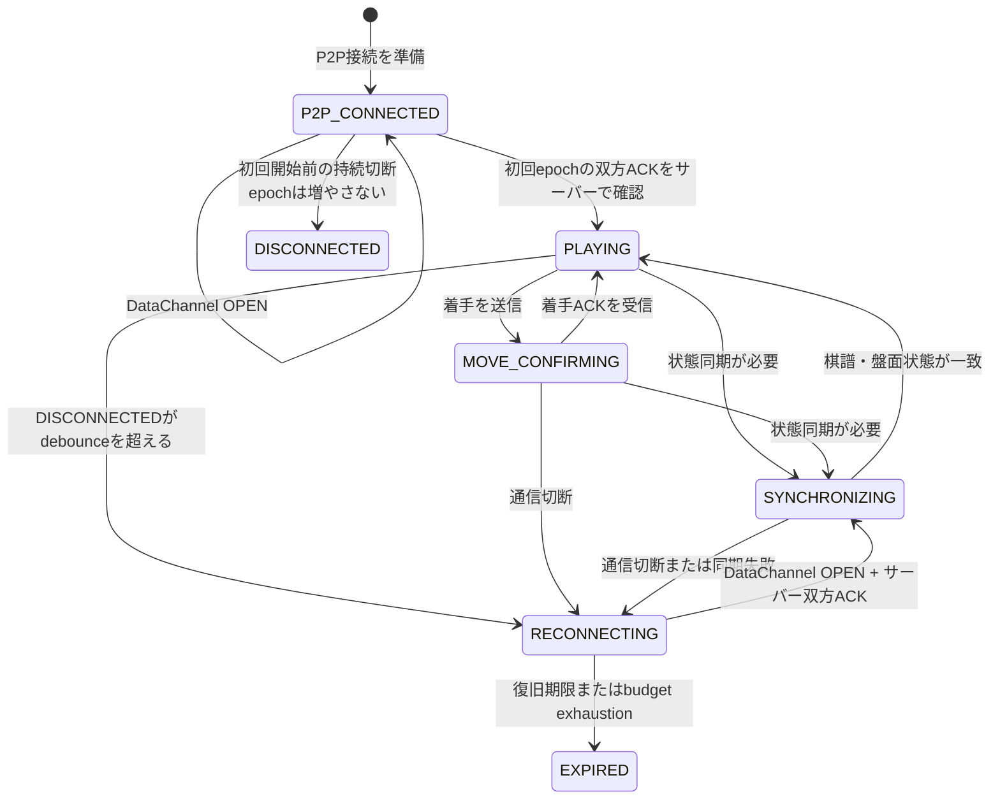
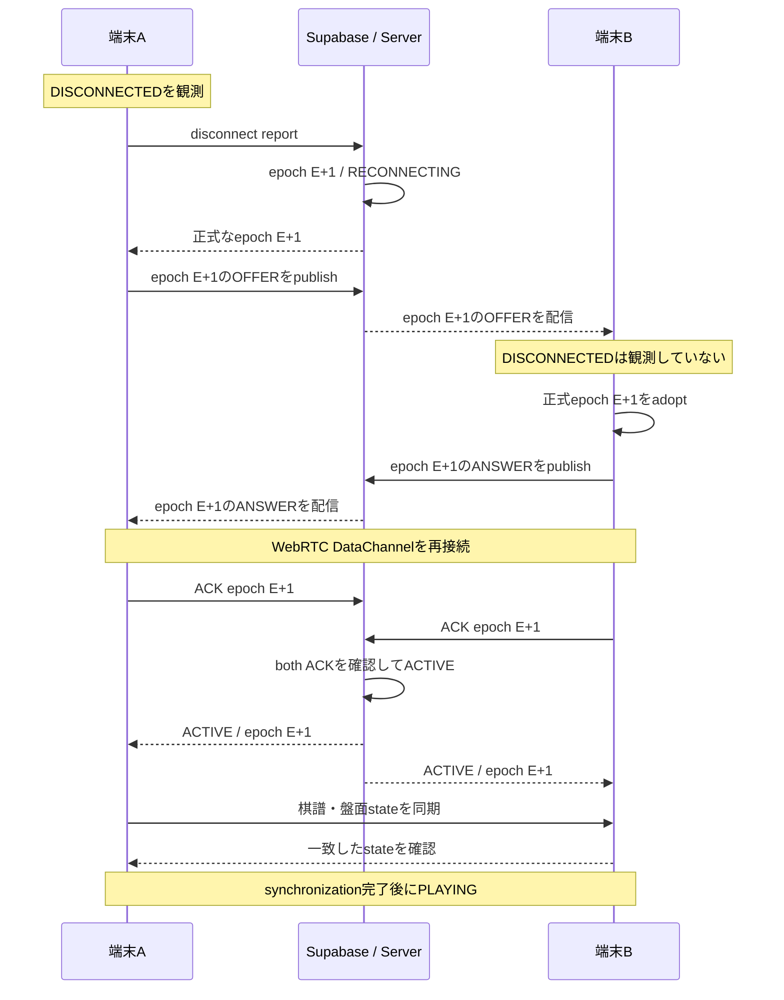
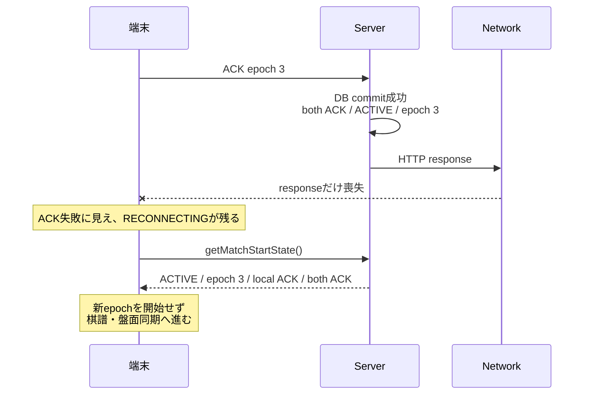
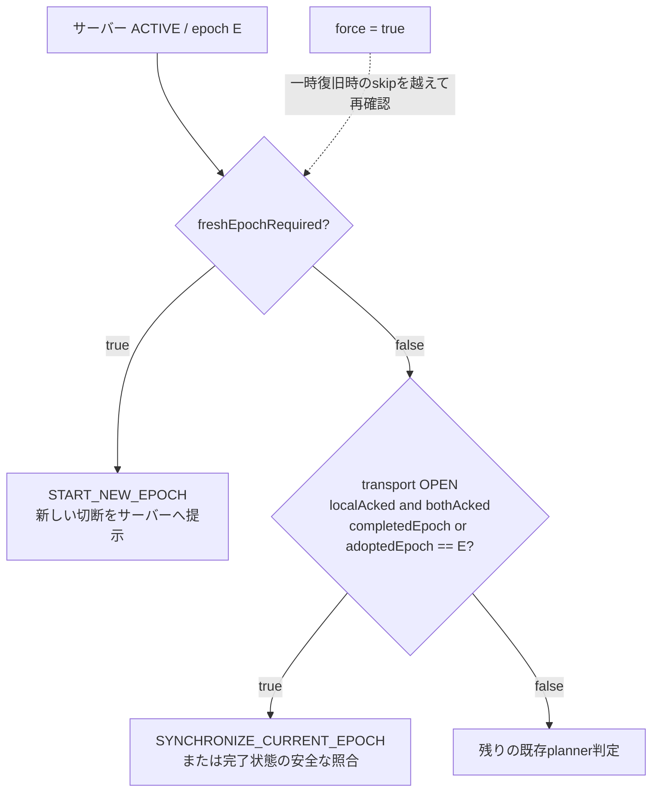
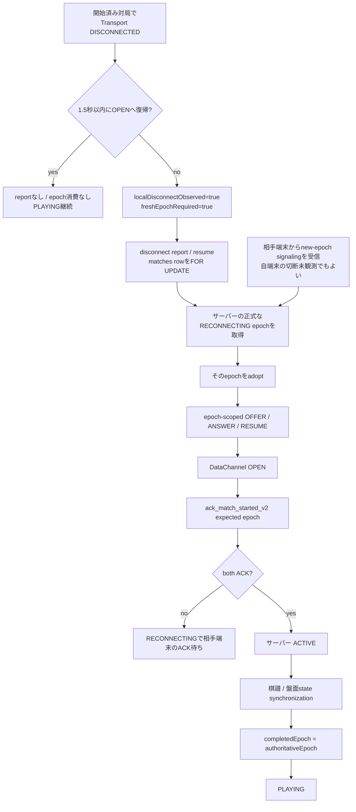

# オンライン対局 再接続設計

初めてオンライン対局の設計を読む場合は、先に[通常接続設計](通常接続設計.md)を読む。そちらがP2Pとサーバーの責任分界、通常のepoch 0 signaling、DataChannel、開始 ACK、`ACTIVE` / `PLAYING`までを説明し、この資料は開始済み対局の切断後を引き継ぐ。通常接続を理解している場合は、この資料から読んでもよい。

## まずこれだけ分かれば読める

再接続で最も大切なのは、**「端末同士の通信がつながったこと」と「対局を安全に再開できること」は別**だという点である。

通信路が復旧しただけでは、相手端末も同じ再接続を認識しているか、サーバーが復旧を確認しているか、両端末の棋譜や盤面が一致しているかは分からない。そのため、このアプリは次の順序で対局を再開する。

```text
端末同士の通信が復旧
  -> 双方が同じ再接続番号を認識
  -> サーバーで双方の確認が取れる
  -> 棋譜と盤面状態を同期
  -> 初めて対局を再開
```

この「再接続番号」を **epoch**、「端末からサーバーへの確認通知」を **ACK** と呼ぶ。DataChannelが`OPEN`になっただけでは`PLAYING`へ戻さず、サーバー確認と同期を終えてから戻す、というのが現在設計の骨格である。

## この資料で使う用語

専門用語は削らず、まず平易な意味を示してから正式名を使う。本文でも重要な用語の初出には短い日本語説明を添える。

| 用語 | この資料での意味 |
|---|---|
| **接続世代（epoch）** | 同じ対局内で、どの接続世代を扱っているかを識別する番号。epoch 0は初回接続、epoch 1は1回目、epoch 2は2回目、epoch 3は3回目の再接続である。再接続の文脈ではepoch 1..3が再接続回数にも対応し、現在のsystemでは0..3だけを使う。 |
| **現在の接続世代（current epoch）** | その時点でサーバーが正式に扱っている現在のepoch。古い端末内状態ではなく、サーバーDBの`negotiation_epoch`が基準になる。 |
| **正式状態（正式な）** | 「サーバーが持つ正式な状態」という意味。端末側の推測、表示、コールバックより、サーバー DB上の状態を優先する。 |
| **ACK** | 受領確認（acknowledgement）。この資料では主に、「このepochのDataChannelが使えることを端末が確認した」というサーバーへの通知を指す。 |
| **開始 ACK** | 初回接続または再接続のDataChannelを利用できると、端末が対象epoch付きでサーバーへ送るACK。着手ごとの相手端末 ACKとは別である。 |
| **双方（双方の）** | 双方の ACKは「両端末のACKが揃っている」状態である。 |
| **正式epochの受入れ（取り込む）** | **サーバーが示した再接続epochを、自分の端末も現在参加する再接続として受け入れること。** 例えばサーバーがepoch 2で再接続中なら、端末Bは自分で切断を検知していなくても、epoch 2が正式な再接続だと受け入れて処理に参加する。これを取り込むと呼ぶ。 |
| **受動側端末（passive peer）** | 自分では切断を検知していないが、相手端末が始めた再接続へ参加する端末。本資料では初出後、「相手端末」または受動側端末と書く。 |
| **完了済みの接続世代（completed epoch）** | 双方のACKだけでなく、棋譜と盤面状態の同期まで完了した再接続epoch。コードでは主に`completedEpoch`で表す。 |
| **新しい切断（新たな切断）** | 以前の再試行や古いコールバックではなく、新たに発生した本当の通信切断。コードでは、この切断に次epochが必要かを`freshEpochRequired`で表す。 |
| **古いリクエスト（stale request）** | 送信時点では正しかったが、到着時には古くなっているリクエスト。例えばepoch 2向けACKが、サーバーがepoch 3になった後に届く場合である。 |
| **状態照合（reconcile / reconciliation）** | 端末が持つ状態とサーバーの正式状態を照合し、正しい状態へ合わせ直すこと。 |
| **冪等（idempotent）** | 同じ処理が重複して実行されても、結果が壊れたり二重処理になったりしない性質。 |
| **上限付き** | 再試行、待機、検索を無制限に続けず、回数、時間、件数などの範囲を決めて行うこと。 |
| **通信路（transport）** | 実際にデータを運ぶ通信路。本資料では主にWebRTC DataChannelと、その接続状態を指す。 |
| **signaling** | 一般には、WebRTCのP2P通信路を作るためにOFFER / ANSWER等の接続情報を交換する処理。現在の実装はICE 候補を1件ずつ送信せず、ICE gathering後の候補をOFFER / ANSWERのSDPへまとめるnon-trickle ICEである。 |
| **OFFER / ANSWER** | OFFERは接続条件の提案、ANSWERはその応答。現在のロールではBLACKがOFFER、WHITEがANSWERを担当する。 |
| **SDP** | OFFER / ANSWERに含まれる接続条件の表現。現在の実装では収集済みICE 候補もここへ含まれる。 |
| **ICE / non-trickle ICE** | ICEは2台の端末間で通信可能な経路を探す仕組み。non-trickle ICEは候補を個別送信せず、候補収集後のSDPへまとめる方式である。 |
| **debounce** | 一瞬の通信揺れを本当の切断として扱わないため、少し待ってから切断と判定する処理。現在のクライアント パスでは1.5秒待つ。 |
| **transcript** | この対局で行われた着手の記録。このアプリではほぼ「棋譜」と考えてよい。 |
| **正規** | 同じ内容が必ず同じ表現になるよう正規化された、サーバーと端末が共通に解釈できる形式。`canonical transcript`は正規形式の棋譜を指す。 |
| **ply** | 片方のプレイヤーが1回着手する単位。オセロでは通常、1手進むごとにplyが1増える。 |
| **状態ハッシュ（state hash）** | 盤面などの状態から計算する照合用の値。同じ棋譜を再生した結果が同じ状態かを検査するために使う。 |
| **行 ロック / FOR UPDATE** | 同じ対局データを複数の処理が同時に変更しないよう、DB側で一方ずつ順番に処理させる仕組み。`FOR UPDATE`はこの行ロックを取得するSQL表現である。 |
| **不変条件（invariant）** | 処理順や通信状況が変わっても、必ず守らなければならない設計上の約束。 |
| **障害パターン（failure model）** | 「どんな壊れ方を想定して設計するか」という想定。例は片側だけの切断観測やHTTP応答だけの喪失である。 |
| **更新操作（mutation）** | サーバーやDBの状態を書き換える操作。状態を読むだけの処理と区別するときに使う。 |
| **参加者** | サーバー上でその対局へ正式に割り当てられた参加者。自分の端末のユーザーと相手端末のユーザーの2者を指す。 |
| **ロール / disc** | 盤上のBLACK / WHITE。signalingでもBLACKがOFFER、WHITEがRESUME / ANSWERを担当するロール境界になる。 |
| **世代** | どの世代の再接続処理かを区別する概念。本資料では原則としてepochと表現し、一般原則を述べる箇所だけ世代も使う。 |
| **進行可能性（進行性）** | 処理がいつまでも止まらず、成功または安全な終了へ進める性質。再接続できない場合に`EXPIRED`へ収束できることも含む。 |
| **fencing** | 古いリクエストが新しい状態を書き換えないよう、対象epochを照合して境界を設けること。期待するepochがその識別札になる。 |
| **対象接続世代（expected epoch）** | ACKや再開リクエストが「どのepochを対象にしているか」をサーバーへ伝える番号。古いリクエストを現在の接続世代（epoch）へ誤適用しないために使う。 |
| **判定器** | サーバー状態と端末状態を読み、「同期する」「現在epochでsignalingする」「新epochを始める」など次の行動を選ぶ判断関数。現在は`planReleaseRenegotiation()`を指す。 |
| **強制再試行（force retry）** | 通常の一時復旧なら処理を見送る条件を越えて、サーバーとの状態照合をもう一度試す再試行。完了済みepochを破棄して新epochを必ず作る命令ではない。 |
| **クライアント状態 / サーバー状態** | クライアント状態は1台のAndroid端末のセッション状態、サーバー状態は`matches.release_status`等の正式な永続状態。`PLAYING`はクライアント状態、`ACTIVE`はサーバー状態であり、同じ状態名ではない。 |

## 1. この資料について

この資料は、現在のRPCやクラスを網羅的に列挙する参照資料ではない。オンライン対戦の再接続が、なぜ単純な通信路の復旧（transport recovery）ではなく、サーバーが持つ正式状態（server authority）と再接続epochを明示した設計になったのかを残す設計記録である。

この資料の主対象は、epoch 0の双方開始ACKによってサーバーが`ACTIVE`になり、通常経路ではクライアントも`PLAYING`へ入った後の復旧である。ACK応答喪失やプロセス復旧ではクライアントがまだ`P2P_CONNECTED`に見えることもあるため、プロトコル上の境界はクライアント表示だけでなくサーバーの正式状態も基準にする。サーバーがまだ`MATCHED / epoch 0`の初回開始前は次epochを作らず、同じepoch 0の回数を制限した再試行、または`ABANDONED` / `MATCH_START_TIMEOUT`によるレート対象外の`EXPIRED`へ進む。その境界は[通常接続設計の第19章](通常接続設計.md#19-通常系から再接続へ)に記載する。

- 基準点: `release-hardening` at `6b914f5acfc0cc9f0182ec2ab78ae687d8e34d22`
- 主な実装: [`WebRtcMatchCoordinator.kt`](../../app/src/main/kotlin/com/example/othello/WebRtcMatchCoordinator.kt)、[`OnlineMatchController.kt`](../../feature/match/src/main/kotlin/com/example/othello/match/OnlineMatchController.kt)
- クライアント/サーバー 契約: [`OnlineMatchContracts.kt`](../../feature/match/src/main/kotlin/com/example/othello/match/OnlineMatchContracts.kt)、[`SupabaseContracts.kt`](../../data/supabase/src/main/kotlin/com/example/othello/data/supabase/SupabaseContracts.kt)
- サーバーの正式状態: [`202608250030_release_match_hardening.sql`](../../supabase/migrations/202608250030_release_match_hardening.sql)

説明の基準は上記基準点の実際のコードである。途中のコミットに存在した挙動は、想定する障害パターン（failure model）を説明するために扱い、現在仕様と混同しない。設計の変化は、コミット メッセージの順番ではなく、次のような「不足していた情報を何で補ったか」という流れとして読む。

| コミット | 閉じようとした障害パターン（failure model）と設計上の役割 |
|---|---|
| `d30af8d38c7a06a71ff84273eac20f4f41d8f87b` — `Harden reconnect and recovery abuse boundaries` | reconnectを無制限な端末再試行にせず、サーバー管理のepoch 0..3、ロール/epochで隔離したsignaling、回数と時間に上限のある復旧として定義した |
| `f19b5b294f69637157fe0c63f5d30afb6d5443e1` — `Harden legacy result and recovery boundaries` | 一時的な`DISCONNECTED`を除外するdebounceと、再交渉前のサーバー状態読取／判定器を導入した |
| `e76b605fb87e9a318dfda42eb60dd73fcb7e28f9` — `Close reconnect race and schedule legacy cleanup` | 古い`ACTIVE`を読んだ処理と切断報告の競合を、同じDB行を順番に更新してepochが1回だけ増える状態へ収束させた |
| `69cb78c8c0722c4620de5172876a385d4683e499` — `Make reconnect recovery negotiation epoch-aware` | 端末の`RECONNECTING`という粗い状態を分解し、受動側端末、ACK応答喪失、古いepochのリクエストを扱える、epochを認識する状態とexpected epoch付きRPCへ移行した |
| `6b914f5acfc0cc9f0182ec2ab78ae687d8e34d22` — `Prevent completed reconnect retries from spending epochs` | 完了済みepochの後から発火する強制再試行（force retry）と、本当に新しい切断を区別した |

## 2. 背景

CHANRIVAの対局中の着手、時計、棋譜（transcript）の同期は、端末同士を直接つなぐWebRTC DataChannelで進む。この実際にデータを運ぶものを通信路（transport）と呼ぶ。一方、Supabase PostgreSQLはmatchmaking、WebRTC接続情報の交換（signaling）の許可、対局ライフサイクル、開始 ACK、結果の正式性、レート、GameRecord、Research起点となる確定データを担当する。

この責務分担では、自分の端末のWebRTCが`OPEN`へ戻ったことと、サーバー上で対局の再開が確定したことは同じではない。片側だけが新しいDataChannelを見ていても、相手端末が同じepochへ参加したとは限らない。また、RPC応答が届かなかったことだけからDB トランザクションの成否は判断できない。

したがって再接続で守る対象は、画面上の「接続したように見える状態」だけではない。対局参加者である両端末が同じ再接続epochを共有し、そのepochのDataChannelを双方がACKし、棋譜を同期してから対局へ戻る必要がある。これを満たせない場合は、勝者を推測してレート対象結果を作らず、期限と回数に上限のある`EXPIRED`へ収束させる。

## 3. 初期モデル

初期のreconnectは、概念的には次のモデルだった。

```text
自分の端末で DISCONNECTED
  -> RECONNECTING
  -> renegotiation
  -> DataChannel OPEN
  -> PLAYING
```

これはMVPとして不合理な設計ではない。両端末がほぼ同時に切断を認識し、RPCが明確に成功し、コールバックが順番どおり届く通常ケースには十分だった。

しかし、P2Pでは両端末の観測が同じになるとは限らない。Androidコールバック、WebRTC状態、接続情報交換、HTTP応答、PostgreSQLトランザクションは別々に進む。単一の`RECONNECTING`だけでは、少なくとも次を区別できなかった。

- 自分の端末が通信切断を観測して新しいreconnectを要求しているのか
- 相手端末が始め、サーバーが正式状態として示したepochへ参加しているだけなのか
- ACKリクエストをまだ送っていないのか、送ったが応答だけ失ったのか
- サーバーではACKが片側だけなのか、双方完了して`ACTIVE`なのか
- 同じepochを現在交渉中なのか、すでに同期まで完了したのか
- 再試行が現在の障害に対するものか、以前予約された遅延ジョブなのか

現在の複雑さは、この不足していた情報を端末状態とサーバー 契約へ明示した結果である。

### 再接続周辺の状態遷移

次の図は、現在の`MatchStatus`のうちreconnectを理解するために必要な状態だけを抜き出したものである。処理手順ではなく、「何が起きると、どの状態へ移るか」を示す。



特に重要なのは、`RECONNECTING`から`PLAYING`への直接の矢印がないことである。DataChannelが`OPEN`になっても、サーバー上の双方ACKと棋譜／盤面同期を経由しなければ対局再開にはならない。

`P2P_CONNECTED`は実際の`MatchStatus`名だが、名前だけでDataChannel OPENやサーバー双方ACK済みを意味しない。サーバーがまだ`MATCHED`のまま初回接続に失敗した場合は、図の`DISCONNECTED`へ進む初回接続失敗であり、epochを増やす`resume_match_v2`は呼ばない。Controllerが`MatchStatus.RECONNECTING`へ直接遷移するのは、開始済み対局の`PLAYING` / `MOVE_CONFIRMING` / `SYNCHRONIZING`からの復旧である。ただしACK 応答喪失やプロセス 復旧ではクライアント状態が`P2P_CONNECTED`でもサーバーがすでに`ACTIVE` / `RECONNECTING`の場合があり、Coordinatorはそのサーバー状態を基準に再接続処理を選ぶ。

## 4. 障害1 — 片側だけが切断を観測する

WebRTCの切断観測は両端末で同時とは限らない。例えば端末Aだけが`DISCONNECTED`を観測し、1.5秒のdebounce後の切断報告によってサーバーが`RECONNECTING / epoch 1`へ進んでも、端末Bは旧DataChannel上で`PLAYING`のままということがある。

端末Bはepoch 1の`OFFER`または`RESUME`を受け取り、新しいPeerConnection/DataChannelを準備できる。しかし以前のモデルでは、「再接続へ参加する端末であること」が自端末の`DISCONNECTED`から導かれていた。端末Bは切断を観測していないためControllerがreconnect 復旧へ入らず、すでに対局開始済みであることを理由にDataChannel `OPEN`後の開始 ACK パスへ入れなかった。

その結果、通信路自体は復旧しても、現在epochについて両端末のACK（双方の ACK）が成立しない。サーバーは`RECONNECTING`から`ACTIVE`へ戻せず、期限後はレート対象 winnerを作らない`EXPIRED`へ進む。この障害から、「切断を申告したこと」と「サーバーが正式に開始したreconnect epochへ参加すること」を同じbooleanで表してはいけないことが分かった。

## 5. 設計上の転換 — 端末内の通信路状態とプロトコル状態を分離

`69cb78c8`では、Controllerの再接続状態を`ReconnectEpochProgress`として分解した。中心となる考え方は、**自分の端末が通信切断を観測したか**と、**サーバーが正式に管理する再接続epochへ参加しているか**を別の軸にすることである。コード上では、端末が観測した通信路（transport）の状態と、サーバーが持つ正式なプロトコル状態を分離した、と表現できる。

| フィールド | 現在の意味 | なぜ必要か |
|---|---|---|
| `authoritativeEpoch` | 自分の端末が受け入れた、最新のサーバー negotiation epoch | 端末コールバックの回数ではなく、どのサーバー上のepochが現在の基準かを保持するため |
| `adoptedEpoch` | 現在、自分の端末がsignalingとDataChannel ACKへ参加しているepoch。完了後は`null`になる | 受動側端末を含め、「このepochの参加者である」ことを自端末の切断観測とは独立に表すため |
| `completedEpoch` | 両端末のACK後、棋譜と盤面状態の同期まで完了したepoch | 完了済みepochを遅延再試行や重複signalingで再び開かないため |
| `signalingStarted` | adopted epochについてsignaling開始を記録した節目 | epochを知っただけの状態と、実際に再接続交渉を開始した状態を区別するため |
| `ackRequestSent` | 取り込んだepochについてACKリクエストを送信しようとしたこと | リクエスト送信とサーバーでのコミット確認を同一視しないため。これは成功の証明ではない |
| `serverLocalAcked` | adopted epochについて、サーバーが自分の端末のACKを確認した状態 | HTTP応答の有無ではなく、サーバー DB上の確認済み事実を表すため |
| `serverBothAcked` | adopted epochについて、サーバーが両端末のACKを確認した状態 | DataChannel `OPEN`だけで`ACTIVE`へ戻さず、双方確認を要求するため |
| `localDisconnectObserved` | 今回の取り込みの原因に、自分の端末での切断観測があったか | 切断を申告した端末と、申告せず参加する受動側端末を区別するため |
| `freshEpochRequired` | debounceを越えた新しい切断が、まだサーバーのepochを取り込むすることで処理されていないこと | 完了済みepochの再試行と、本当に次epochを必要とする新しい切断を区別するため |

`passiveParticipation`は`adoptedEpoch != null && !localDisconnectObserved`から導出される。つまり受動側であることは別のサーバー 状態ではない。「同じサーバー正式epochへ参加しているが、自分の端末では切断を観測していない」という端末側の関係を表す。

代表的な状態スナップショットは次のようになる。

| 状況 | サーバーの正式epoch | 取り込み済みepoch | 完了済みepoch | 端末内の切断 | 新規再接続が必要か |
|---|---:|---:|---:|---:|---:|
| epoch Eの同期完了後 | E | `null` | E | false | false |
| その後に新しい切断がdebounceを通過 | E | `null` | E | true | true |
| 受動側端末がepoch E+1 signalingを採用 | E+1 | E+1 | E | false | false |
| 切断を申告した端末がepoch E+1を採用 | E+1 | E+1 | E | true | false |

## 6. 受動側端末の再接続参加

自分では切断を検知していない相手端末（受動側端末）も、サーバーが正式に開始した再接続epochへ参加できなければならない。現在の`WebRtcMatchCoordinator.handle()`は、自分の役割（BLACK／WHITE）に合うepoch付きの`RESUME`、`OFFER`、`ANSWER`を受信すると、未完了の新epochかを`shouldAdoptReconnectEpochFromSignal()`で判定する。新しい正式epochであれば、受動側端末でも`adoptAuthoritativeReconnectEpoch()`を呼ぶ。

`adoptAuthoritativeReconnectEpoch()`は、その再接続番号を自端末でも現在参加するepochとして受け入れる（取り込む）。具体的には、そのepochを`authoritativeEpoch`と`adoptedEpoch`へ設定し、対局開始済みなら`PLAYING`／`MOVE_CONFIRMING`／`SYNCHRONIZING`から`RECONNECTING`へ遷移する。このパスは`beginReconnectGrace()`を通らないため、`freshEpochRequired`や端末内 切断 取得を新しく作らない。つまり受動側端末は再接続には参加するが、「自分が切断した」という証拠を作らない。

`onDataChannelOpen(epoch)`は、開始済み対局でもControllerが`RECONNECTING`で`adoptedEpoch == epoch`なら`handleTransportRecovered(epoch)`へ進む。ACKは単にtransportが開いたという通知ではなく、取り込む済みの具体的epochへ結び付く。

次の図は端末AがBLACK側として`OFFER`を作る例である。端末の役割が逆なら`RESUME`／`OFFER`／`ANSWER`の担当も入れ替わるが、epochの取り込むとACKの条件は同じである。



端末Bは切断を申告していないが、再接続には参加する。これにより、余分な切断 取得を作らずに、両端末が同じepochをACKできる。

## 7. 障害2 — RPC応答の喪失

分散システムでは、**リクエスト失敗（request failure）と処理失敗（operation failure）は同じではない**。通信上は失敗に見えても、サーバー側の処理はすでに成功していることがある。



ここで自分の端末が「失敗したように見えたから次のreconnectを開始する」と判断すると、サーバーでは成功済みのepoch 3に対してfresh resumeを要求することになる。epochの回数枠のサーバー 契約から見ると、それは4回目のreconnect要求であり、`RECONNECT_BUDGET_EXHAUSTED_UNRATED`による`EXPIRED`が正しい応答になってしまう。原因はサーバーではなく、端末が結果未確認のRPCを新しいプロトコル eventとして解釈したことにある。

`69cb78c8`は、端末の`RECONNECTING`だけを次epoch開始の根拠にしないようにした。ACKリクエストの応答を失ったときは、まずサーバー状態を読み、同じepochのACKがコミット済みかを確認する。

## 8. サーバーの正式状態に基づく照合

`OnlineMatchController.handleTransportRecovered()`は、取り込んだepochを指定して`ackMatchStarted()`を呼ぶ。例外になった場合、直ちに別epochを作るのではなく、`getMatchStartState()`でサーバーが持つ正式な対局行を再取得する。これが状態照合（reconciliation）である。

取得した`MatchStartAck`には`serverStatus`、`negotiationEpoch`、`localAcked`、`bothAcked`が含まれる。サーバーが同じepochについて`ACTIVE / localAcked / bothAcked`を返せば、端末はACK 応答を受け取れなかった事実よりサーバー コミットを優先し、`reconcileAuthoritativeStartState()`から棋譜と盤面状態の同期へ進む。

設計原則は「API呼出しが失敗したら同じ更新操作（mutation）を無条件に再送する」ではなく、「成否が曖昧なら、次の更新操作より先にサーバーの正式状態を読む」である。`ackRequestSent`は送信の事実、`serverLocalAcked`と`serverBothAcked`はサーバー確認済みの事実として分離されている。

同期ではリクエストID付きの`SyncMessage`を交換し、正規形式の棋譜（canonical transcript）、着手数（ply）、盤面の照合値である状態ハッシュ（state hash）を検証する。`applySyncSnapshot()`が両端末の状態一致を確認して初めて`completedEpoch = authoritativeEpoch`となり、Controllerは`PLAYING`へ戻る。したがってサーバーのACKと棋譜同期完了も別の節目である。

## 9. 対象接続世代（期待するepoch）の契約

現在のKotlin契約は、`OnlineMatchRepository.ackMatchStarted()`と`resumeMatch()`の両方でnon-nullな`expectedNegotiationEpoch: Int`を必須にしている。`SupabaseOnlineMatchRepository`はそれを`p_expected_epoch`として`ack_match_started_v2()`／`resume_match_v2()`へ渡す。

これは再試行がどのepochを対象にしていたかをサーバーが判定し、古いリクエストを現在状態へ混ぜないための識別札（fencing context）である。例えば「epoch 2用DataChannelのOPEN」で送ったACKがepoch 3へ遅れて届いても、epoch 3のACKとして扱ってはならない。

| RPC / リクエスト | 現在のサーバー動作 |
|---|---|
| `ack_match_started_v2`、サーバーの現在epochより先のexpected epoch | 進行中の対局の正式epochより先なら拒否する |
| `ack_match_started_v2`、古いexpected epoch | 現在状態を返すだけで、新しいepochへACK行を追加しない |
| `ack_match_started_v2`、現在のexpected epoch | 現在の接続世代（epoch）へ重複安全（idempotent）にACKし、双方分が揃った場合だけ`ACTIVE`へ戻す |
| `resume_match_v2`、サーバーの現在epochより先のexpected epoch | 拒否する |
| `resume_match_v2`、`ACTIVE`で古いexpected epoch | 現在状態を読むだけで返し、epochも回数枠も消費しない |
| `resume_match_v2` while `RECONNECTING` | 現在の正式epochへ参加し、epochは増やさない |
| `resume_match_v2`、`ACTIVE`で現在のexpected epoch | 新しい再接続としてepochを1増やす。epoch 3なら増やさずレート対象外の`EXPIRED`へ進む |

SQL関数の`p_expected_epoch`にはマイグレーション上`default null`が残っているが、現在のAndroidインターフェースとSupabaseアダプターは必ず整数を渡す。上表の古い／将来epochの排除（fencing）は、このAndroid経路が必ず渡す非`NULL`のexpected epochに対する契約である。

一般化すると、再試行可能な更新操作には「何をしたいか」だけでなく、「どのepochに対する操作だったか」を識別できるcontextが必要である。

## 10. 障害3 — 切断報告とresumeの競合（race condition）

自分の端末で切断を観測したControllerは、debounce後に`submit_match_result_v2(..., DISCONNECT, opponent)`を送り、サーバーを期限付きの復旧へ進める。同時にCoordinatorもサーバー状態を読み、必要なら`resume_match_v2()`を送る。

平易に言えば、同じ対局に対して2つの処理が同時に「次の再接続番号へ進めよう」とすると、1回の切断なのにepochを2回消費する恐れがある。そこでDBは、同じ対局の更新を1つずつ順番に処理する。

さらに、Coordinatorが`ACTIVE / same epoch`を読んだ直後に切断報告がコミットする到着順もある。`f19b5b2`時点では、DataChannelがOPENで、端末のControllerが`RECONNECTING`なら同期して終了する判断があり、読み取り後にサーバーだけが次epochへ進む可能性が残った。`e76b605`は、debounceを越えた端末内 reconnectでは古い`ACTIVE` 読み取りを完了証明とみなさず、`START_NEW_EPOCH`へ進むようにした。

正式なDB用語では、`resume_match_v2()`と`submit_match_result_v2()`が同じ`matches`行を行ロック（行 ロック）する。そのSQLが`FOR UPDATE`である。現在の更新式は、ロック取得後に見た状態が`ACTIVE`の要求だけを`+1`し、`RECONNECTING`を見た後着要求は`+0`で現在の接続世代（epoch）へ参加する。

```text
reportが先: ACTIVE E -> RECONNECTING E+1 -> resumeはE+1へ参加
resumeが先: ACTIVE E -> RECONNECTING E+1 -> reportはE+1へ参加
```

これにより、どちらのリクエストが先に到着しても、サーバー上ではepochが1回だけ増えた同じ状態へ収束する。端末判定器の`freshEpochRequired`は、この行-locked 遷移へ入るべき新しい切断が存在することを表す。

## 11. 障害4 — 復旧完了後に遅れて実行される強制再試行（force retry）

epoch-aware化後にも、最後にもう1つの障害が残った。問題はACK 応答喪失そのものではなく、その間に予約され、後から発火する強制再試行（force retry）だった。強制再試行（force retry）は、通常なら「一時的に戻ったので何もしない」と判断する条件を越えて、サーバーとの照合を再試行するジョブである。

```text
epoch 3 ACKがサーバーでcommit
  -> HTTP response loss
  -> 端末は一時的にRECONNECTING
  -> retryCurrentOperation()がforce=true jobを予約
  -> 別経路のserver state照合と棋譜同期が成功
  -> PLAYING / completedEpoch=3 / adoptedEpoch=null / freshEpochRequired=false
  -> 予約済みforce jobが遅れて発火
```

`69cb78c8`時点の判断関数（判定器）は`adoptedEpoch`と`freshEpochRequired`を見ていたが、`completedEpoch`を入力に持っていなかった。同期完了後は`adoptedEpoch`が`null`になるため、遅延ジョブからは「epoch 3を完了済み」という情報が見えない。`force=true`によって一時復旧時の省略を越え、`START_NEW_EPOCH`を選べた。

その結果、`resume_match_v2(expected_epoch=3)`はサーバーから見れば古いリクエスト（古い）ではなく、現在の接続世代（epoch）への新規リクエストである。サーバーは契約どおり回数枠 枯渇として`EXPIRED`にするが、端末の意図は古い再試行だった。この障害は、期待するepochだけでは「同じ現在の接続世代（epoch）の完了済み再試行」と「同じ現在の接続世代（epoch）から始まる新しい切断」を区別できないことを示した。

## 12. `completedEpoch`と`freshEpochRequired`

`6b914f5`では、`scheduleTransportRenegotiation()`が実行時点の`ReconnectEpochProgress`を取り直し、`completedReconnectEpoch`を`planReleaseRenegotiation()`へ渡すようにした。重要なのはフィールド追加そのものではなく、判定の優先順位である。

次の図は状態遷移図ではなく、新しいepochを作るべきかを判定器が判断するための判断フローである。



実際の判定器では終了済み状態、`RECONNECTING`／`MATCHED`の現在のepoch signalingを先に処理し、その後の`ACTIVE`で次の順序になる。

1. `freshReconnectEpochRequired == true`なら`START_NEW_EPOCH`。
2. 新たな切断ではなく、transportが`OPEN`、サーバーの端末内/both ACKがtrueで、サーバー上のepochが端末より先、取り込む済み、または完了済みのいずれかなら`SYNCHRONIZE_CURRENT_EPOCH`。
3. それ以外を一時復旧の省略や新epoch開始の既存判定へ渡す。

`SYNCHRONIZE_CURRENT_EPOCH`分岐は`requestReconnectEpochIfRequired()`より前にreturnするため、完了した接続世代（epoch）の遅延強制再試行（force retry）は`resume_match_v2()`を呼ばない。Controller側も、`PLAYING / OPEN / adoptedEpoch=null / completedEpoch==serverEpoch / fresh=false`というサーバーの`ACTIVE`状態を、重複実行しても状態を壊さない成功（idempotent success）として扱う。

ここで`force=true`は、「サーバー上で完了済みのepochを破棄して、必ず新epochを作る」という意味ではない。通常の一時復旧判定で止めず、サーバーとの状態照合を試すための補助通知であり、新しい切断と完了済みの証拠の意味を上書きしない。

## 13. 再接続回数上限

再接続回数上限は端末ごとの再試行カウンターではなく、対局全体で共有するサーバー状態である。epochは同じ対局の接続世代を識別し、epoch 0が初回接続、epoch 1..3が利用可能な再接続である。再接続の文脈では1..3が再接続回数に対応し、DB 制約、signaling、ACK、結果 確認材料にも0..3の境界が適用される。

完了済みepochへの古いリクエストやdelayed 強制再試行（force retry）は回数枠を使わない。一方、epoch 3の復旧が完了して`PLAYING`へ戻った後、本当に新しい`DISCONNECTED`がdebounceを越えれば、ControllerはcompletedEpoch 3を保持したまま`freshEpochRequired=true`にする。判定器ではfreshが完了済みより優先される。

```text
ACTIVE / epoch 3 / completedEpoch 3
  -> new DISCONNECTED
  -> debounce経過
  -> freshEpochRequired=true
  -> 現在のepoch 3に対する新しいresumeまたは切断報告
  -> RECONNECT_BUDGET_EXHAUSTED_UNRATED
  -> EXPIRED（epoch 4は作らない）
```

つまり「再試行時に状態を照合するようにした」ことは、「再接続回数枠（reconnect 回数枠）を無効にした」ことではない。曖昧な再送は消費させず、新しい障害だけをサーバー上の再接続回数枠へ提示する。

回数枠 枯渇は「対局を継続できない」という進行可能性の障害（進行性の障害）であり、勝者の証拠ではない。`match_results_v2`、`rating_history`、`game_records`、`user_game_records`やResearch起点を作らず、レート対象 forfeitにも変換しない。

## 14. 現在の再接続ライフサイクル

現在の正常復旧は、通信路、サーバー上の対局状態、端末上のプロトコル状態を次の順で同じ状態へ合わせる。

次の図はサーバー `ACTIVE`かつクライアント開始済みの対局から始まる。サーバーが`MATCHED / epoch 0`である初回開始前の切断は、このflowへ入らず[通常接続設計](通常接続設計.md)の初回接続失敗パスで扱う。



切断を観測した端末ではdebounce後に`freshEpochRequired`を立て、切断報告とresumeのどちらかがサーバー上のepochを開始する。受動側端末ではnew-epoch signalingそのものが取り込むのきっかけであり、切断報告は送らない。どちらも取り込み後は同じepoch付きsignaling、ACK、同期パスへ合流する。

プロセス終了（process death）からの復旧でも、サーバーから回収した有効な割り当ての`negotiationEpoch`とアプリ内の非公開チェックポイントを起点にする。端末内スナップショットだけを正式状態とせず、サーバーライフサイクルを再確認してからsignalingまたは状態照合（reconciliation）を選ぶ。

## 15. 現在の設計原則

1. **通信路の状態とプロトコル状態を分ける。** `OPEN`はDataChannelの状態であり、サーバー上の双方ACKや棋譜一致を意味しない。
2. **端末内の観測を正式状態とみなさない。** 自分の端末で見えた状態は正式状態とは限らない。一方の`DISCONNECTED`や`RECONNECTING`だけから、相手端末やサーバーのepochを推測しない。
3. **リクエスト失敗と処理失敗を分ける。** リクエスト失敗とサーバー処理失敗は同じではない。HTTP応答喪失後はDB コミット済みの可能性を考え、サーバーの正式状態を読む。
4. **再試行は冪等、または状態を認識する。** 再試行は重複安全、または現在状態を確認する必要がある。同じリクエストを安全に再送できない場合は、更新操作（mutation）の前に現在状態と対象epochを照合する。
5. **古いリクエストが対象とする接続世代を識別する。** ACKとresumeは現在のAndroid 契約で期待するepochを必ず送り、古いDataChannelや再試行を新しいepochへ適用しない。
6. **正式状態はサーバーが持つ。** ライフサイクル、現在の接続世代（epoch）、ACK集合、deadline、回数上限到達（回数枠 枯渇）はSupabaseが決める。
7. **再接続回数上限はサーバーが管理する。** 端末プロセスごとのカウンターではなく、ロックした対局行のepoch 0..3で制限する。
8. **完了済み復旧と新しい切断を分ける。** `completedEpoch`と`freshEpochRequired`を分け、前者の再試行を抑止しつつ後者を新しい復旧へ進める。
9. **競合時の到着順が違っても同じ状態へ収束させる。** 切断報告とresumeは、どちらが先でも同じ1 epochへ参加する。
10. **復旧失敗からレート対象結果や永続対局記録を作らない。** 対局を継続できない再接続失敗はレート対象外のexpiryとし、レート、GameRecord、Research入力へ変換しない。

## 16. サーバー側の不変条件

現在のSQLが保証する再接続関連の主要な設計上の約束（不変条件）は次のとおりである。

- `matches.negotiation_epoch`、プロトコル 2のACK、signal、結果 取得は0..3に制約される。
- `ack_match_started_v2()`と`resume_match_v2()`は、認証済みの対局参加者だけを受け入れ、対象`matches` 行を`FOR UPDATE`する。
- 非`NULL`のexpected epochがサーバーより先なら、進行中のリクエストを拒否する。
- 古い ACKはサーバーの新しいepochへACKを追加せず、現在状態だけを返す。
- 古い `ACTIVE` resumeは新しいepochを変更せず、回数枠を消費しない。
- `ACTIVE`の現在の接続世代（epoch）へのfresh resumeだけがepochを`+1`する。`RECONNECTING`へのresumeは`+0`で現在epochへ参加する。
- 切断報告も同じ行をロックし、`ACTIVE`でのみ`+1`、`RECONNECTING`では`+0`となる。
- `publish_match_signal_v2()`は参加者、ロール、プロトコルバージョン、現在の接続世代（epoch）、進行中状態を検証し、別epochの接続情報を混在させない。
- 現在の接続世代（epoch）の参加者2名のACKが揃った場合だけ、`MATCHED`／`RECONNECTING`から`ACTIVE`へ遷移する。
- epoch 3の現在の `ACTIVE`からfresh reconnectが必要なら、epoch 4を作らず`RECONNECT_BUDGET_EXHAUSTED_UNRATED`で`EXPIRED`にする。
- 終了済み対局をreconnectで再開しない。
- 再接続回数枠の枯渇や片側だけの切断申告では、レート対象結果、レート、GameRecord、Research起点を確定しない。

## 17. クライアント側の不変条件

現在のKotlin実装が維持する端末側の不変条件（invariant）は次のとおりである。

- 一時的な`DISCONNECTED`が1.5秒以内に`OPEN`へ戻れば、切断報告を送らずepochを消費しない。
- Coordinatorは再交渉前にサーバー状態を読み、自分の端末のtransport状態だけで次epochを決めない。
- 受動側端末は、サーバーが正式に開始したnew-epoch signalingからepochを取り込むできる。
- 受動側端末の取り込むは`beginReconnectGrace()`を通らず、切断 取得を生成しない。
- DataChannel `OPEN`時のACKは`adoptedEpoch`を期待するepochとして送る。
- ACK 応答喪失時は`getMatchStartState()`でサーバー上のACK状態を照合する。
- サーバーの端末内/both ACK確認後に棋譜同期へ進み、その完了後に`completedEpoch`を更新して`PLAYING`へ戻る。
- サーバー上で完了済みのepochは、`force=true`の遅延再試行でも新epochとして再消費しない。
- debounceを越えた新しい切断の`freshEpochRequired=true`は完了済み判定より優先される。
- 古い signalingはepochで除外し、許可されたロールと現在の接続世代（epoch）を満たすsignalだけをtransportへ適用する。

## 18. テスト戦略

reconnect テストは正常系だけの関数呼出し数ではなく、障害パターンごとに守るべき不変条件を固定している。

- **一時的な切断:** `oneSidedTransientDisconnectReturnsToOpenWithoutConsumingServerReconnect`と`transientOpenWithUnchangedActiveEpochDoesNotRenegotiate`が、debounce内復帰で報告/resume/epoch消費がないことを確認する。
- **受動側端末（passive peer）:** `passivePeerAdoptsAuthoritativeEpochAndAcksWithoutDisconnectClaim`が取得なしの取り込み、現在の接続世代（epoch）のACK、同期後`PLAYING`を確認する。`passivePeerNewEpochSignalUsesCoordinatorAdoptionGate`はCoordinator `handle()`が使用する実際のadoption 判定口を固定する。
- **報告/resumeの到着順:** 判定器 テストが報告先着時の現在のepoch signalingと、古い`ACTIVE` 読み取り時のfresh 開始を分ける。pgTAPは報告-first／resume-first双方でepochが1回だけ増え、双方ACK後に`ACTIVE`へ戻るテストデータを持つ。
- **ACK 応答喪失:** `committedEpochTwoAckWithLostResponseReconcilesFromServerWithoutResume`と`committedEpochThreeAckWithLostResponseDoesNotConsumeEpochFour`が、ACK コミット後の応答喪失をサーバーからの読み取りから回復し、resumeを呼ばないことを確認する。
- **遅延強制再試行（force retry）:** `delayedForcedRetryAfterCompletedEpochThreeSynchronizesWithoutResume`が、`completedEpoch=3 / fresh=false / force=true`で同期を選び、実際のCoordinatorから再開を要求するコールバックが0回であることを確認する。Controllerテストは完了済み`ACTIVE`の再照合が冪等に`PLAYING`を維持することも確認する。
- **本当のepoch 3 枯渇:** `genuineDisconnectAfterCompletedEpochThreeRequestsBudgetDecision`がfresh=trueの判定器優先順位を固定する。pgTAPは現在の接続世代（epoch） 3 resumeと切断報告の両パスがepoch 4を作らずunrated `EXPIRED`になることを確認する。
- **古いexpected epoch:** pgTAPは古いDataChannel ACKが新しいepochへACK行を作らないことと、古い`ACTIVE`へのresumeが完了済みの接続世代（epoch）3を変更しないことを確認する。サーバーの現在epochより先のexpected epochを拒否する分岐はSQL本体に実装されている。
- **永続データの非生成:** 回数枠の枯渇、片側切断、相互切断、片側だけの正常終了提出などについて、`match_results_v2`、`rating_history`、`game_records`が作られないことをpgTAPで確認する。

基準点の端末内 Supabase pgTAPは542件すべてPASSしている。Kotlin単体テスト、Gradle compile/lint/assemble、ワーカーテスト、SQL セキュリティ／境界 checkを含むGitHub Actions 実行 `32719923138`も対象コミットでsuccessした。

## 19. 最終監査結果

`6b914f5`に対する最後の限定監査結果は次のとおりだった。

```text
Critical: 0
High: 0
Medium blockers: 0
```

完了済みepochに対する遅延強制再試行（delayed force retry）は、実際の判定器入力、Coordinatorの分岐、Controllerの冪等な状態照合まで確認して`CLOSED`と判定された。本当のepoch 3枯渇、古い有効な競合、受動側端末の参加も維持され、オンライン対戦のリリースハードニングは実装修正段階を終了して2台実機スモークテストへ進むGO判定となった。

これは再接続にバグが存在しないことの証明ではない。単体テストは判定器、分岐の判定口、Controller、SQLトランザクションを層別に固定している一方、実際のAndroid WebRTC、実ネットワーク切替え、HTTP応答喪失、1.5秒遅延と複数コールバックの実スケジューラー順序を1つのテストデータですべて再現してはいない。これらは2台実機スモークテストで確認する、残っている統合上のリスクである。

## 20. この資料が対象としないもの

この資料は次のものではない。

- WebRTC一般の解説
- Supabase一般の解説
- オンライン対戦全体のAPI／状態 参照資料
- Research設計
- レート ポリシー仕様
- プロトコル 1 legacy compatibility仕様書

対象範囲は、プロトコル 2の再接続設計が現在のepoch-aware modelへ至った理由と、その障害復旧の不変条件（障害 復旧 不変条件）に限定する。
