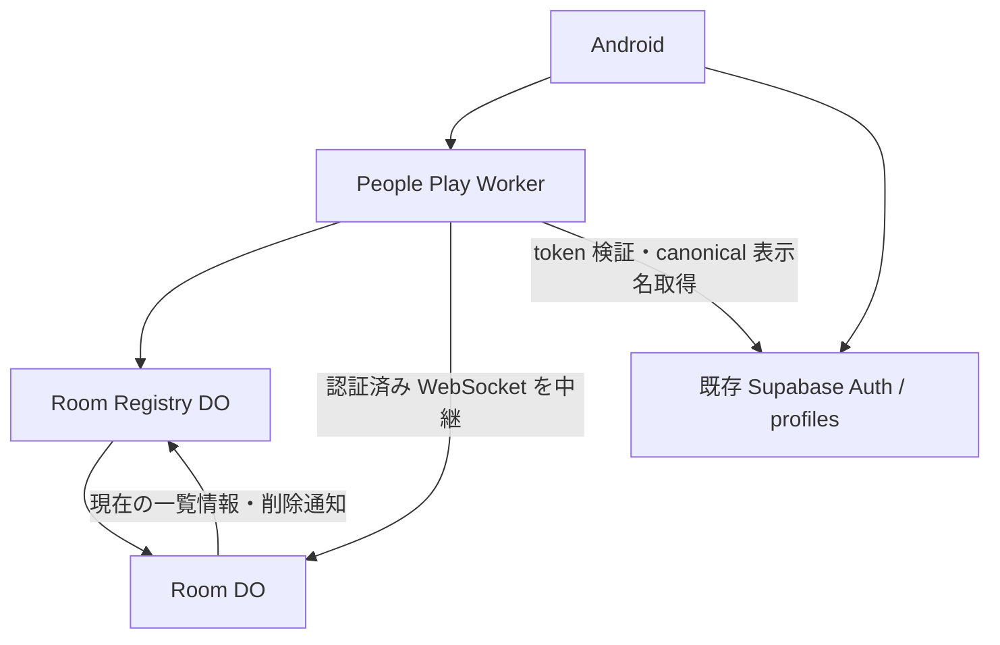
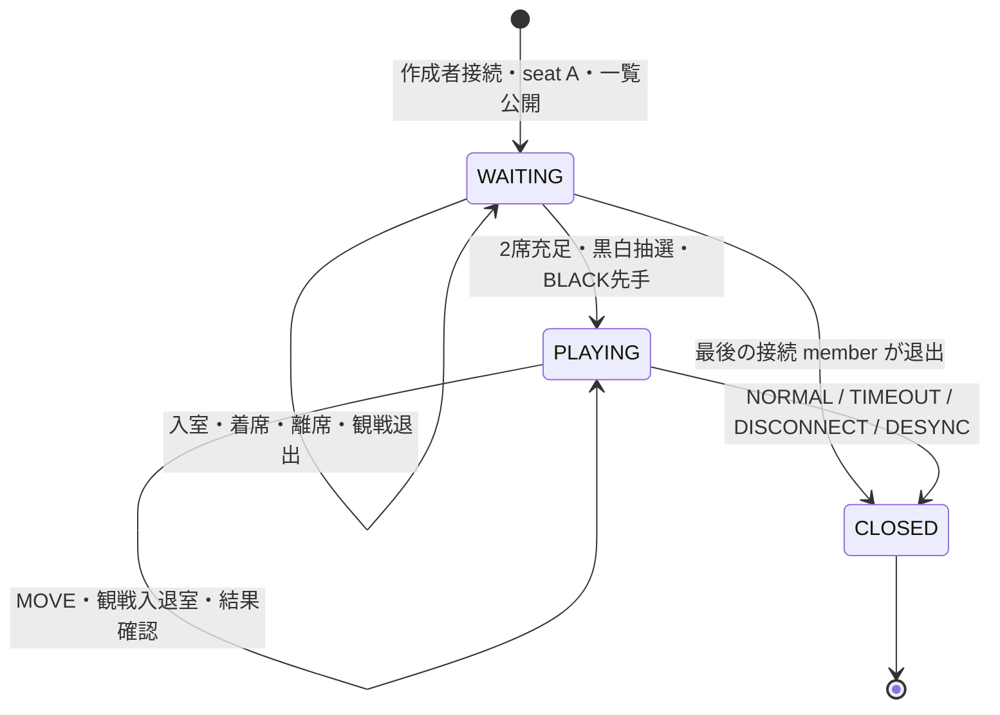

# 新ふたり対戦：Durable Object / WebSocket 軽量採用設計

**この文書が、新しい「ふたり対戦」の初期リリース向け採用設計であり、実装時の正本である。** 既存の [新ふたり対戦_DO_WebSocket設計.md](新ふたり対戦_DO_WebSocket設計.md) は、将来拡張・高信頼版・より厳密なサーバー authority の参考設計として残す。両文書が矛盾した場合は、本書の軽量採用設計を優先する。本書で明示的に削除した機能を、実装担当者の判断で復活させてはいけない。

作成日：2026-09-28（JST）。調査・作成基準は、今回 `git fetch origin main` で確認した最新 remote main `d391ebd930067d72c66d518cff4e03ea5d92b892`。開始時 branch は `main`、HEAD も同 SHA、working tree は clean。過去 SHA への reset は行っていない。

本作業はこの Markdown 1ファイルの新規作成のみ。以下の Phase、型、API、保存項目は後続実装の契約であり、実装済み・実環境で動作確認済みを意味しない。

## 1. 設計目的と優先順位

カジュアルなオンラインリバーシ対局＋観戦を、必要最小限の Cloudflare Durable Object（DO）と WebSocket で成立させる。競技対局用の厳密な不正防止基盤や、複雑な障害復旧機構は初期版の目的にしない。

優先順位は、(1) 実装が小さい、(2) 状態遷移が単純、(3) 不具合箇所を追いやすい、(4) 観戦を含む通常利用が成立する、(5) Cloudflare 無料枠で扱いやすい、(6) 必要になれば高信頼版へ拡張できる、の順とする。無料枠内の実運用を保証したという意味ではなく、負荷確認は Phase 6 で行う。

## 2. 現行コードを確認した結果

パスはリポジトリルート相対。ソース確認と実行確認を区別する。今回、アプリ・Worker・DB の実行検証は行わない。

| 対象 | ソースで確認できたこと | 軽量版への扱い |
|---|---|---|
| `app/src/main/kotlin/com/example/othello/PeoplePlayLobbyScreen.kt` | `PeoplePlayLobbyRoom` は20/15/10/5/3分、対局中フラグ、着席者アイコン、観戦人数を持つサンプル。roomId と通信処理は未接続 | 基本デザインを維持し、HTTP 一覧の mapper と roomId 導線を後続で接続 |
| 同 `PeoplePlayRoomScreen.kt` | `PeoplePlayRoomUiState` は固定表示用。`watcherAvatarRes.take(3)` と `additionalWatcherCount` の `+n` 表示がある | **観戦 preview は最大3 avatar** に固定。人数全体から残数を計算 |
| `app/src/main/res/values-ja/strings.xml` | 指定された5種類の部屋名が存在する | 第8章の対応を維持 |
| `core/game/src/main/kotlin/com/example/othello/game/Board.kt` | 合法手、反転、初期盤面、盤面比較、hash がある | Android のルール正本として再利用 |
| 同 `GameState.kt`, `TurnResolver.kt`, `CanonicalMoves.kt` | `play`、`pass`、`resolveForcedPasses`、終局判定、棋譜表現がある。core の ply はパスでも増える | 第9章で wire ply と区別。Android 内でそのまま使う |
| `core/auth/.../Auth.kt` | `UserSession(userId)`、`AuthGateway`。token 提供 port はない | 既存 SDK client から入口認証用 token を得る薄い port が後続で必要 |
| `data/supabase/.../SupabaseContracts.kt` | 単一 Supabase client、`SupabasePlayProfileRepository`、本人 `user_id` の `play_profiles.display_name_id`、`play_display_names` を利用 | 通常認証と canonical 表示名を再利用 |
| `feature/profile/.../Profile.kt` | `PlayDisplayName.id` は **Long**。プロフィールは Auth UUID に紐づく | avatar 入力は名称 ID ではなく、検証済み本人 UUID |
| `feature/records/.../GameRecord.kt` | `LocalGameRecord` / JSON codec / `LocalGameRecordStore` がある。`MatchResult` に NO_CONTEST がなく、部屋 ID・相手名・時間設定の専用項目もない | 保存基盤は再利用し、local 専用モデルの拡張が必要（第21章） |
| app の `LocalGameRecordFileStore.kt`, `LocalGameRecordPersistence.kt`, `OthelloApplication.kt` | app-private JSONL、localId による置換、原子的ファイル更新、画面より長寿命の保存 coordinator / process owner がある | 新しい独立保存基盤を作らず再利用。process death 後の保存保証は別途確認 |
| `cloudflare-admin/wrangler.toml`, `package.json` | 管理 Worker、compatibility_date `2026-08-09`、Wrangler `4.120.0`、保守 cron。DO binding は記載なし | 後続で公開対局用 Worker を分離。既存設定から account の DO 利用可否を推定しない |
| `feature/match`, `core/network`, `transport/webrtc` | 旧 P2P の ACK、同期、時計、結果提出を持つ別経路 | 旧 controller / transport を新 Room protocol の基底にしない |

既存テストとして `LocalGameRecordTest.kt`、`LocalGameRecordFileStoreTest.kt`、`LocalGameRecordPersistenceTest.kt`、Room/Lobby の screenshot test 等が存在する。これらの存在は、新 protocol への適合や本番動作を証明しない。

## 3. 採用アーキテクチャと authority

一覧・作成・接続先解決は Android → Worker → Room Registry DO → Room DO。確立後の WebSocket は Room DO が終端し、各着手を Registry 経由で中継しない。Supabase は既存の本人認証・表示名に用いる。

| コンポーネント | authority と担当 |
|---|---|
| Android | `core/game` による合法手・反転・強制パス・通常終局、相手 snapshot 検証、自分の時計、local 結果表示・保存 |
| Worker | Supabase token 検証、検証済み UUID と canonical 表示名の解決、HTTP/WS 入口の入力制限・基本防御 |
| Room Registry DO | Room ID 発行・作成の入口、一覧、WAITING / PLAYING projection、閉鎖 Room の一覧削除。UUID の参加先を管理する責務は持たない |
| Room DO | socket に結び付いた member、2席、黒白割当、player/spectator 認可、現在 ply・手番・最新 snapshot の受理順序、終局申告の集約、切断敗北、Room 閉鎖 |
| Supabase | 通常の認証、既存 `play_profiles` / `play_display_names` の canonical 表示名 |

**Room DO はオセロルールの正本にしない。** 保存済み currentTurn は client が送った nextTurn を受理した値であり、サーバーが合法性を証明した値ではない。通常結果も両 player の一致を採用する。TIMEOUT と DISCONNECT の勝者だけは、自己申告者・切断 socket の player と反対色から決められる。

後続の配置は、新しい公開対局用 Worker と、Android の軽量 Room 用 repository / state holder / transport adapter を基本とする。初期版のために多数の Gradle module や抽象 authority を先行追加しない。

## 4. 高信頼版との差分と削除対象

この表の高信頼版欄は既存参考文書の説明であり、軽量版の実装要件ではない。

| 項目 | 既存高信頼版 | 軽量採用版 | 判定 |
|---|---|---|---|
| single-login | LoginSessionAuthority、first-login-wins、app session lease、session epoch、login fencing、admission gate | 独自制御なし。同一 Supabase account の複数端末ログインを禁止しない | 削除 |
| one-account-one-room | ActiveRoomRegistry、UUID 予約、reserve / confirm / release saga、membershipEpoch | 複数 Room 参加を許容。既存 Room を自動退出させない | 削除 |
| server rules | server-side legal move、反転、forced pass、通常終局、stateHash 判定 | Android `core/game` と peer validation | 削除 |
| KMP JS | KMP → JavaScript rules 共有、JS IR engine / spike | JVM の既存 core を Android で使う | 削除 |
| server clock | clock deadline、clock alarm、timeout adjudication、復旧・切断中計算 | 端末自己時計と TIMEOUT_SELF | 削除 |
| reconnect | resume、SYNC、connection generation、reconnect snapshot / fencing | socket 切断後の対局復帰なし | 削除 |
| absence | absenceStartedAt、60秒待機 | server の切断判断後にゲーム上の猶予なし | 削除 |
| claim | disconnect forfeit claim / claim right、双方権利、永続化、CLAIM_DISCONNECT_FORFEIT、countdown、離脱負け確定メニュー | 切断 player の即敗北 | 削除 |
| FINISHED | FINISHED 10秒、alarm、期間中入室、WAITING 復帰 | 結果送信後 CLOSED | 削除 |
| Room reuse | 次 gameId、同 Room 再利用 | 1 Room = 1試合、roomId のみ | 削除 |
| result persistence | 将来 ResultSink / Supabase 保存の拡張点 | Supabase result persistence なし。各端末の local 戦績 | 簡略化 |
| event history | server / move event history、永続 receipt、event sourcing | 最新 full snapshot と現在の制御状態のみ | 削除 |
| delta / replay | delta stream、serverSeq replay、replay log / request | 毎着手 full snapshot | 削除 |
| ACK | COMMAND_RESULT と永続 receipt による確認 | sender にも同じ broadcast。RECEIVED / COMMITTED 等の multi-stage ACK は追加しない。終局候補時だけ結果確認 | 簡略化 |
| realtime room list | projection 更新と厳密な現状態照合。軽量版で realtime 配信を追加しない | Room 一覧 WS / Supabase Realtime なし。HTTP 10秒 polling | 簡略化 |
| spectator | membership / presence と詳細な復旧情報 | 接続中人数と最大3 avatar、途中入室で現在盤面を見る | 採用・簡略化 |
| Hibernation | 復旧・多数の期限管理と併用する候補 | WebSocket を保持する省リソース機構として採用 | 採用 |
| avatar | 起動 session 内の6択 | UUID から固定算出、選択 UI・DB項目なし | 簡略化 |
| 黒白 | 先着左席が BLACK | A/B が埋まった時に50:50で抽選 | 簡略化 |

rating、random matchmaking、free chat、観戦者の詳細プロフィール画面・入退室履歴も初期版に含めない。削除機能を高信頼版から補完して実装しない。

## 5. Room ID と membership

識別子は **roomId のみで1試合を表す**。サーバーが安全な乱数で発行し、閉鎖済み ID は再使用しない。新規接続で未知の roomId を渡されても Room を初期化しない。初期化は内部の作成入口だけで許可する。

Room の構成は seat A、seat B、spectators。WebSocket open の認証・入室成功で member を作り、close でその member を取り除く。認証 UUID は本人識別、`memberId` は **その Room のその socket に固定した参加識別子**。memberId はサーバー発行で、client が他人の ID を指定して操作できない。

同じ UUID の別端末を自動的に同じ player socket として扱わない。別接続は新 member とし、現在接続を置き換えず、元席も継承しない。人数は接続中 member 数。初期版は UUID による複数参加・複数席の排他も追加せず、1 socket は高々1席という部屋内整合性だけを守る。同一 UUID の複数接続でも sender の席は socket/memberId から判定する。このため同じ avatar が複数並ぶ場合がある。

Room DO 内の現在 membership と接続 attachment で認可する。グローバルな account lock、ログイン用の新しい session ID、世代番号は不要。

## 6. Room 作成・一覧・HTTP 契約

初期実装の Registry は1つの論理一覧を管理する DO とする。sharding は負荷結果なしに追加しない。作成時の時間設定は第8章の5値のみ。

| 入口 | 契約 |
|---|---|
| `GET /v1/people-play/rooms` | JWT 必須。現在の一覧 projection を返す HTTP API |
| `GET /v1/people-play/rooms/new/socket?timeControl=TEN_MINUTES`（WS upgrade） | JWT/profile 検証後、Registry が roomId を発行。作成と作成者接続を同じフローで完了 |
| `GET /v1/people-play/rooms/{roomId}/socket`（WS upgrade） | JWT/profile と Room 存在を確認し、新規 member として入室 |

作成は WS upgrade を伴う入口に一本化し、通常 HTTP GET だけでは作らない。作成者 socket の受入れと seat A、WAITING、初期 snapshot の保存後、Registry へ公開し、最初の ROOM_SNAPSHOT を返す。作成者に追加の TAKE_SEAT は要求しない。未接続の0人 Room を一覧へ公開しない。

内部呼出しは Worker → Registry で ID 発行を完了させ、続いて Room 初期化、Room → Registry 公開とする。Registry が Room 応答を待ちながら Room からの呼出しをロックで塞ぐ構成にはしない。公開失敗・upgrade 失敗では作成を成功表示せず、作成中 socket を閉じて Room を CLOSED にする。応答喪失時の自動作成再送は行わず、一覧を再取得する。複雑な作成予約 protocol は設けない。

一覧要素は `roomId`、`timeControl`、`phase: WAITING | PLAYING`、seat/player の表示名・avatar 等、`spectatorCount` を持つ。WAITING は入室後に空席へ着席可能、PLAYING は観戦参加可能。PLAYING を一覧から除外しない。終了後は削除する。

Android はロビーが表示中かつアプリ foreground の間だけ **10秒ごと** に取得する。初回表示、Room 作成成功直後、Room からロビーへ戻った直後、JOIN 失敗後は待たず即取得する。Room 作成後の即時取得は1回の cache 更新であり、Room 画面で周期 polling を続ける意味ではない。ロビー非表示・background で周期 job を停止し、戻ったら即取得する。同時に複数の polling job を作らない。

通常の一覧表示は最大10秒程度の古さを許容する。Room の state 変更は現在 projection を Registry に通知し、観戦人数も更新する。通知は過去イベント列を保存せず、現在値を再取得して上書きする。GET 一覧時には既知 ID の現在 metadata を上限付きで照合し、CLOSED を削除、取得不能な行を一時的に除外する。この処理は投機的に初期 Room を作らない。

Registry への遅い更新は Room の最新 metadata を取得して適用し、同一 ID の適用を Registry 内で直列化する。削除済み行への通常更新は挿入にしない。新規挿入は作成フローだけなので、遅延した PLAYING 更新で閉鎖済み一覧を復活させない。通信障害時に10秒以内の収束まで保証するものではなく、既知 ID の照合負荷と失敗 cleanup は Phase 6 で確認する。

JOIN の最終判定は必ず Room が現在 state で行う。未知 ID / CLOSED は `ROOM_NOT_FOUND` / `ROOM_CLOSED` で失敗し、Android は即座に一覧を取得する。

## 7. WAITING・着席・観戦・黒白

通常入室者は spectator。WAITING で空席があれば `TAKE_SEAT` により自由に着席できる。部屋主承認・owner 権限はない。`TAKE_SEAT` は空いている A、次いで B を選ぶ。着席済み member の重複要求はエラーとし、別席も占有させない。

WAITING の `LEAVE_SEAT` は席だけを空け、本人は spectator に戻る。退出・戻る・切断は socket close とし、席を即空席にする。A が空で B だけ残る状態も許可し、自動的な席移動で色を示唆しない。作成者退出後も他 member がいれば Room を維持し、spectator だけでも存続する。最後の member が退出し0接続なら CLOSED。

2席が埋まった瞬間、Room DO が `crypto.getRandomValues` の乱数1 bit により **50:50** で A/B と BLACK/WHITE の対応を決める。席確定と割当、PLAYING 開始を同じ storage 更新境界で一度だけ行う。乱数は候補を一度生成して commit し、確定済み state の再読込では引き直さない。作成者や先着者を BLACK に固定しない。BLACK が先手。

WAITING の seat A/B は色未定。UI に BLACK/WHITE として固定表示しない。PLAYING では既存の左 BLACK / 右 WHITE を保ち、抽選結果に合わせて player 情報を配置する。両席が埋まったまま WAITING を公開しない。PLAYING での着席・離席は不可。通常入室はすべて spectator。

観戦 snapshot は `spectatorCount` と `spectatorAvatarPreview`（最大3件の avatarId 配列）のみを公開する。preview 順は現在 member のサーバー発行 memberId の辞書順に固定し、入退室履歴を必要としない。`preview.size = min(3, spectatorCount)`、`additionalWatcherCount = spectatorCount - preview.size` とする。人数上限が3人という意味ではない。既存の横並びと `+n` を維持し、詳細名簿は配信・表示しない。

spectator は途中入室時に最新 full snapshot、その後も各着手の full snapshot と GAME_OVER を受け取る。MOVE、DESYNC、RESULT_REPORT、TIMEOUT_SELF は送信不可。切断は人数・preview を更新するだけで勝敗に影響しない。戻る場合は通常の新規入室として扱う。

## 8. profile・avatar・TimeControl

表示名は既存 Supabase canonical：本人 UUID → `play_profiles.display_name_id` → `play_display_names.display_name` から得る。Worker は検証済み UUID を使って解決し、body の表示名を canonical として採用しない。名前重複を認証 identity に使わない。初回入室時の表示名を当該接続・試合の表示 snapshot とし、対局中に名前選択へ誘導しない。

avatar 入力の UUID はこの `play_profiles.user_id` に対応する **Supabase Auth UUID**。名称 catalog の Long ID や表示文字列ではない。UUID のハイフンを除去し、先頭8桁を16進の符号なし UInt32 として読み、`value % 6` を使う。大文字小文字は値に影響しない。signed Int への変換、言語固有 hashCode、ランダム選択は使用しない。

| 剰余 | avatarId | 表示 | 現行 drawable |
|---|---|---|---|
| 0 | ADULT_MAN | 成人男性 | `play_lobby_icon_adult_man` |
| 1 | ADULT_WOMAN | 成人女性 | `play_lobby_icon_adult_woman` |
| 2 | BOY | 男児 | `play_lobby_icon_boy` |
| 3 | GIRL | 女児 | `play_lobby_icon_girl` |
| 4 | MAGIC_WAND | 魔法の杖 | `play_lobby_icon_staff` |
| 5 | MAGIC_BOOK | 魔法の本 | `play_lobby_icon_book` |

例えば先頭8桁が `00000000` なら ADULT_MAN、`00000005` なら MAGIC_BOOK、`ffffffff` なら GIRL（4294967295 % 6 = 3）。この mapping は Android と Worker で同一 fixture を使用する。avatar 選択 UI、アプリ session の選択状態、Supabase の avatar 永続項目は作らない。DO の表示 cache に派生値を含めても、本人 profile の編集項目や独立した正本にしない。

| timeControl | 各 player の初期時間 | Room 名 |
|---|---|---|
| TWENTY_MINUTES | 1,200,000 ms | ゆとりの20分部屋 |
| FIFTEEN_MINUTES | 900,000 ms | のんびり15分部屋 |
| TEN_MINUTES | 600,000 ms | しっかり10分部屋 |
| FIVE_MINUTES | 300,000 ms | ふわっと5分部屋 |
| THREE_MINUTES | 180,000 ms | いそがし3分部屋 |

作成時に設定し、その Room 中は変更しない。Room 名は時間設定から既存リソースへ mapping する。同じ時間・名前の複数 Room は roomId で区別する。持ち時間は各 player が自分の端末で管理する（第17章）。

## 9. 状態モデルと full snapshot

公開 Room phase は `WAITING / PLAYING / CLOSED`。Room が存続中に保存するゲーム盤面は最新1件だけとし、履歴を蓄積しない。

| 状態項目 | 内容 |
|---|---|
| roomId / phase / timeControl | Room の識別・現在 phase・5値の時間設定 |
| seats | A/B それぞれ memberId または null |
| players | PLAYING で確定した BLACK/WHITE の memberId、内部の検証済み userId、表示名。WAITING は null |
| currentPly | **着石数**。初期0、受理した MOVE_SNAPSHOT 1件につき1増加 |
| currentTurn | 最新 snapshot の nextTurn。開始時 BLACK、終局候補時 null |
| latestSnapshot | ply、直近の move、64 cell の board、nextTurn、terminalCandidate |
| spectators | 接続中 count と最大3 avatar preview。公開する個人名簿はない |
| resultCheck | 現在 ply の結果確認中だけ、ply と BLACK/WHITE 各1件の判定。過去結果履歴を持たない |

`core/game` の `GameState.ply` は着石とパスの両方を数えるので、wire の currentPly に代入しない。Android は core state と wire ply を別変数で保持する。棋譜へパスを記録する場合も端末の `CanonicalMoves` に閉じる。

wire の board は row-major（index = row * 8 + column）の64整数配列で、`0=EMPTY, 1=BLACK, 2=WHITE` に固定する。enum ordinal に暗黙依存せず明示 mapper を置く。move は `{row, column}`、それぞれ0〜7の整数。初期 snapshot だけ move=null。通常は nextTurn が BLACK/WHITE、terminalCandidate=true のときは nextTurn=null。terminalCandidate は **勝敗を含まない boolean**。

初期 board は白 (3,3)/(4,4)、黒 (3,4)/(4,3)、他 EMPTY。サーバーはこの固定定数を開始時に置けるが、そこからルールを計算する engine は持たない。Android 側で `Board.initial()` と一致する fixture を確認する。

ROOM_SNAPSHOT は roomId、phase、timeControl、公開 seats/player 表示（memberId・表示名・avatarId）、currentPly、board、move、nextTurn、terminalCandidate、resultCheckPly（非確認中 null）、spectatorCount、spectatorAvatarPreview を含む **完全な現在状態**。UUID の全員分一覧や token は含めない。player/memberId は認可証明ではなく、受信側の表示参照である。

初回の本人識別だけは upgrade 応答の `X-People-Play-Member-Id` header で Android transport に返し、ROOM_SNAPSHOT の seat/player と照合する。これを送信者側 body で返させても認可に使わない。Android WebSocket ライブラリで応答 header を取得できることは Phase 0/3 の接続確認に含める。

## 10. MOVE と sender への受理確認

client → server 名は **MOVE_SNAPSHOT** に固定する。共通 envelope は `protocolVersion: 1`、`type`、`roomId`。着手 payload は `ply, move, board, nextTurn, terminalCandidate`。過去盤面・hash・棋譜列を送らない。

player は確定済み local core state で合法手を確認し、`GameState.play` → `TurnResolver.resolveForcedPasses` の順で反転、強制パス、次手番、終局候補を計算する。計算結果を pending 1件として保持し、wire ply を1増やして送る。受理前 state を破棄しない。

Room DO は次を確認する。

1. socket が現 member で、Room が PLAYING、結果確認中ではない。
2. sender が player で、保存済み currentTurn に対応する memberId と一致する。
3. ply が安全な非負整数かつ `currentPly + 1`。
4. payload の version/type/schema、board の64 cell と値、move 座標、nextTurn と terminalCandidate の形式整合、byte size 上限が正常。

Room は空きマスか、挟める石があるか、反転が正しいか、次手番・終局がルール上正しいかを確認しない。形式上正しい snapshot を現在値として原子的に保存し、その後 **sender 本人を含む全 player + spectator に同一 ROOM_SNAPSHOT を broadcast** する。

sender は対応する ply と内容の broadcast を受けた時に受理済みへ移す。自分の盤面に同じ着手を二度適用しない。pending が解消するまで次の MOVE を送らない。duplicate / stale ply は ERROR で拒否し、元着手を再適用しない。自動着手再送や receipt 検索は行わない。

同じ ply の観戦人数・席情報更新ではルール計算を再実行しない。通常の WS メッセージ順を保ち、DO は1件の state 更新・保存・送信開始の間に別のゲーム mutation を割り込ませない。外部 Registry 更新待ちをこの境界へ入れず、送信順を外部 RPC の完了順に依存させない。

## 11. 強制パスと peer validation

専用 PASS message は作らない。強制パスは Android の core で自動処理し、MOVE_SNAPSHOT の nextTurn に反映する。相手に合法手がなく同じ player が続けて打つ場合、nextTurn は sender と同じ色になる。サーバーは交互手番を強制しない。

相手 player は **受信前の local core state + 受信 move** から同じ手順を再計算し、full board、nextTurn、terminal state を比較する。合法手でないため計算できない場合も不一致とする。一致したときだけ local state を更新する。sender は自身の pending と同じ比較を行う。preview 更新等の同一 ply を二重に検証・棋譜追加しない。

不一致なら `DESYNC` を送信する。Room は現在 player の申告であることと対象 ply の形式を確認し、勝者を推測せず、第14章の NO_CONTEST で閉じる。検証結果を毎手 ACK として送り返す仕組みは作らない。

forced pass の連続手では、相手からの不一致申告より次の snapshot が先着する可能性がある。したがって DESYNC の `observedPly` は当該接続で観測可能な `1..currentPly` を許可し、最新 ply と同じことだけを要求しない。サーバーで過去盤面を保存・再計算する必要はない。悪意ある player の虚偽 DESYNC による無効試合化は初期版の強い不正耐性の対象外とする。

spectator は途中入室時の board をそのまま表示し、最初からの棋譜や過去 state を要求しない。player の検証責務を spectator に代行させない。

## 12. 通常終局の最小合意 protocol

結果確認は終局候補時だけ使用する。毎 turn の進行条件にはしない。RESULT_REPORT の payload は `ply, result`。result は `BLACK_WIN | WHITE_WIN | DRAW | NOT_FINISHED` の4値。

1. terminalCandidate=true の受理 snapshot を受けた player は独立に core で結果を計算する。着手した player も broadcast 受理後に自分の RESULT_REPORT を送る。
2. 最初に届いた、現在 ply に対する終局結果（BLACK_WIN / WHITE_WIN / DRAW）を Room が player ごとの1枠に保存し、同 ply の **RESULT_CHECK** を相手 player に送る。確認中も phase は PLAYING のまま、MOVE は拒否する。既に相手報告が届いていればその2件で比較する。
3. 相手は snapshot を適用・検証した local core state から判定し、上記4値のいずれかを RESULT_REPORT で返す。結果を推測したり、server の候補に合わせたりしない。
4. 両 player が同じ終局結果なら NORMAL で確定。異なる結果、または片方の NOT_FINISHED なら DESYNC / NO_CONTEST。

terminalCandidate=true の受理後は次の MOVE を止める。最初の報告が NOT_FINISHED なら、その candidate と矛盾しているため DESYNC / NO_CONTEST とする。candidate=false でも player が現在 ply の終局結果を先に申告した場合は結果確認を開始し、相手は NOT_FINISHED を返せる。これにより「片方だけが終局と思っている」状態を待ち続けない。

結果確認中は現 ply と報告2枠だけを storage に保持し、休眠後も同じ確認を処理できる。同一 player・同一 ply・同一報告の重複は無効果、異なる報告への変更は DESYNC / NO_CONTEST。旧 ply / 未来 ply は ERROR。両方 NOT_FINISHED だけで確認を新規開始しない。

RESULT_CHECK に無応答でも、それだけで NORMAL の勝者を選ばない。接続切断を観測した場合は DISCONNECT、TIMEOUT_SELF を先に受理した場合は TIMEOUT が成立する。接続を保った不正 client が結果報告を拒み続けることは初期版では解消しない。独自の結果確認タイムアウトから勝敗を作らず、技術監視の対象にする。

## 13. 結果モデル

| finishReason | outcome | winner | 成立根拠 |
|---|---|---|---|
| NORMAL | BLACK_WIN / WHITE_WIN / DRAW | BLACK / WHITE / null | 両 player の同じ ply の結果が一致 |
| TIMEOUT | BLACK_WIN / WHITE_WIN | 自己時間切れ申告者の相手色 | 認可済み TIMEOUT_SELF |
| DISCONNECT | BLACK_WIN / WHITE_WIN | 切断を観測した player の相手色 | Room がその player socket の切断を観測 |
| DESYNC | NO_CONTEST | null | player の不一致申告、または結果確認の不一致 |

NO_CONTEST は DRAW ではない。BLACK_LOSS / WHITE_LOSS / DRAW に変換せず、通常勝敗・引分の集計から除外する。Room が stone count を数えたり、多数決・名前・時刻差で勝者を推測したりしない。

GAME_OVER は `roomId, ply, finishReason, outcome, winner, decidedAt, finalSnapshot` を持つ。decidedAt は終了処理のサーバー時刻であり、持ち時間の判定には使わない。finalSnapshot は保存済み最新 board であり、DISCONNECT/TIMEOUT を64対0等の盤面に書き換えない。

## 14. DESYNC 処理

DESYNC の payload は `observedPly` と固定 enum の `reason`（`SNAPSHOT_MISMATCH | RESULT_MISMATCH`）だけ。任意の winner、相手への敗北指示、診断ログ全文を受け取らない。

有効な player の申告を Room が受理したら、`finishReason=DESYNC, outcome=NO_CONTEST, winner=null` の GAME_OVER を配信して CLOSED にする。client bug、stale state、改造 client、実装差の原因特定はサーバーが行わない。局面修復や別の盤面を正しいものとして選ぶ処理は設けない。

## 15. WebSocket protocol 一覧

ゲーム message はすべて JSON text、`protocolVersion=1`、共通 roomId を必須にする。第22章の固定 heartbeat text だけを transport 層で別扱いにする。type ごとに schema を閉じ、未知 type、余分な identity/winner 操作指定、binary、構文不正を拒否する。送信者は payload ではなく、Room が受け入れた socket context から特定する。

| client → server | 送信できる人・phase | type 固有 payload / 最低限の server 検証 | invalid 時 |
|---|---|---|---|
| TAKE_SEAT | WAITING の spectator | payload なし。member 有効・未着席・空席あり。A優先、次B。2席目なら抽選・開始も同一更新 | ERROR、席を変更しない |
| LEAVE_SEAT | WAITING の着席者 | payload なし。sender の現席を socket から取得 | ERROR、席を変更しない |
| MOVE_SNAPSHOT | PLAYING の現在手番 player | ply、move、board、nextTurn、terminalCandidate。第10章の形式・順序・権限、結果確認中でないこと | ERROR、盤面・ply を変更しない |
| DESYNC | PLAYING の player | observedPly、reason。観測 ply は1以上 currentPly 以下、reason は許可 enum | spectator / 不正値は ERROR。有効な不一致申告は NO_CONTEST |
| RESULT_REPORT | PLAYING の player | ply は現在値。result は4値。NOT_FINISHED は終局候補/確認に対する応答として受理 | 旧/未来 ply・権限・形式は ERROR。正しい形式の判定不一致は NO_CONTEST |
| TIMEOUT_SELF | PLAYING の player | payload なし。sender 本人の席・色を解決。相手や残り時間の指定は不可 | ERROR。有効なら本人負け。時計の再計算はしない |

TIMEOUT_SELF は自己申告なので、ネットワーク到着時にその player の手番であることを追加条件にしない。自端末で0到達した直後に手番表示が変わる競合でも、本人の負けという意味は同じ。spectator はどちらの色の時間切れも申告できない。

| server → client | 受信者・phase | 必須内容・送信前検証 | Android が invalid を受けた場合 |
|---|---|---|---|
| ROOM_SNAPSHOT | 入室済み全 member、WAITING / PLAYING | 第9章の全状態。初回入室・席/人数変更・開始・MOVE 受理で配信。最新保存 state から作る | 未知 version / roomId / 形式不正は入力停止・エラー。player の局面不一致は DESYNC、壊れた protocol は接続終了 |
| RESULT_CHECK | 未報告の相手 player、PLAYING | roomId、ply。現在の結果確認対象と一致し、対象が player | 現在局面から4値を返す。局面検証不能なら DESYNC。spectator では応答しない |
| GAME_OVER | その時点の接続中 player / spectator、終了時のみ | 第13章。終了 guard を取得した1結果のみ。直後に Room を閉鎖 | schema と winner/outcome 関係を検査。不正な勝敗を保存しない。正常結果は一度だけ保存・表示 |
| ERROR | 該当 socket、入室後の WAITING / PLAYING。CLOSED は閉鎖拒否時のみ | `code, rejectedType, currentPly` と必要時 `rejectedPly`。secret や生 payload を返さない | pending を解除または入力停止し、対応する既存 state を表示。自動着手再送しない |

主な error code は `BAD_MESSAGE, UNSUPPORTED_VERSION, NOT_MEMBER, NOT_PLAYER, NOT_YOUR_TURN, WRONG_PHASE, ALREADY_SEATED, NO_EMPTY_SEAT, NOT_SEATED, BAD_PLY, RESULT_PENDING, ROOM_NOT_FOUND, ROOM_CLOSED, PAYLOAD_TOO_LARGE, RATE_LIMITED`。入口の認証・プロフィール失敗は upgrade 前に `AUTH_REQUIRED / PROFILE_REQUIRED` と HTTP 401/403、未知/閉鎖は404/410等の失敗応答とする。

通常の権限・順序エラーは当該 command だけを拒否する。巨大 frame、連続 malformed input、濫用など接続を閉じる場合、PLAYING の player なら第18章の切断規則も適用する。ERROR 自体を新しい勝敗理由にはしない。

WebSocket open / close が入退室 lifecycle。専用 JOIN/退出 message を追加せず、server は upgrade から得た identity と Room の現在 phase で入室する。ゲーム command の成功は ROOM_SNAPSHOT または GAME_OVER で分かる。result confirmation は終局専用であり、多段 ACK にしない。

## 16. State machine と競合処理

PLAYING 中の resultCheck は小さい現在 state の一部であり、独立した phase を増やさない。CLOSED は入室不可・再利用不可。WAITING への戻りはない。

Room DO では着席、MOVE、結果報告、DESYNC、TIMEOUT_SELF、socket close を同じ state 更新境界で処理する。外部 fetch を挟まずに guard と更新をまとめ、保存成功後に broadcast する。通常 mutation ごとの巨大な非同期 lock を作らない。保存失敗なら未確定 snapshot を送らない。[Cloudflare storage](https://developers.cloudflare.com/durable-objects/api/sqlite-storage-api/)

2席目着席と切断が競合すれば、切断処理が先なら WAITING の空席、開始が先なら PLAYING の切断敗北。複数の終了原因は **最初に有効な終了更新を成立させた1件** を採用し、その後は CLOSED guard で変更しない。双方切断でも最初に Room が観測・処理した側が負け。実世界でどちらが先に電波を失ったかの推測・同時刻裁定は行わない。

この直列化は1 Room 内だけであり、別 Room への同時参加を禁止するものではない。

## 17. 端末の時間管理と TIMEOUT_SELF

各 player は、自分の残り時間を自端末の単調時計で管理する。PLAYING 開始 snapshot の受信から BLACK の時計を開始し、その後は local core が示す自分の手番だけ進める。表示 tick の回数を時間の正本にしない。

自分の着手を合法と計算して送信するときに、それまでの自分の消費時間を計上する。相手手番へ移る候補なら自分の時計を止め、強制パスで自分手番が続く候補なら継続する。sender echo を受けるまで次着手入力を止める。MOVE が拒否された場合は受理前の手番へ戻し、保留中も本来自分手番だった経過を計上して時間を増やさない。相手の受理 snapshot を適用して自分手番になったときに、自分の計測を始める。

通常結果確認中は両者の local clock を停止する。終局判定が一致しなければ無効試合となり、時計を復元して対局を継続しない。正常な端末で自分の時間が0になったら MOVE を止め、TIMEOUT_SELF を1回送る。Room は自己時間切れの申告として本人負けを確定する。相手への時間切れ申告 command は存在しない。

サーバーは timeControl の初期値だけを保持し、残り時間・時計 deadline を authority として保存しない。毎秒の clock broadcast をしない。相手や spectator に端末時計を表示する場合も local の参考表示にとどめ、相手敗北の根拠には使わない。snapshot から途中入室者の正確な消費時間は復元できず、精密な相手時計同期は初期 protocol の要件にしない。

通信遅延による両端末間の計時差、改造 client の時計停止、自己申告の不履行はカジュアル対局の制約として受け入れる。server による補正や不正裁定を追加しない。

background でも socket が生存し自分手番が継続するなら、単調時計の経過を停止扱いにしない。画面回転は state holder を維持し、UI の再生成だけで socket を閉じない。OS による socket 喪失を server が観測すれば切断敗北。process death で失われた対局へ戻す仕組みは持たない。実機 background と時計処理の検証は Phase 5/6 に含める。

## 18. player / spectator の切断

**PLAYING 中、server が player 接続を切断済みと判断した後は、ゲーム上の猶予を一切置かず、その player の DISCONNECT LOSS を確定する。** 通信断・アプリ終了・退出・戻る・WebSocket close は同じ扱い。

PLAYING の退出/画面 Back は transport に WebSocket close を要求する。明示 leave の合意や server 応答待ちの専用 protocol は作らない。Android は入力を止めて local 画面遷移できる。新しい socket を元 player の席へ付け替える処理はない。

WAITING の切断は本人席と member を即除去し、0人なら閉鎖。spectator の切断は count と preview を即更新するだけ。切断済み player の UUID が新しく入室しても元 player 復帰にはしない。Room がまだ PLAYING と観測される一時的な期間の新規接続も通常 spectator として扱う。

実際の電波喪失から server の close/error/liveness 判断までには遅延があり得る。「即敗北」は検知が瞬時という保証ではない。heartbeat 周期・無応答判定期間・OS の検知特性は第29章の技術運用値で、ゲームの猶予には転用しない。

server が結果送信後に閉じた socket は、CLOSED guard により新たな敗北を起こさない。Android も有効な GAME_OVER 受信後の close で結果を DISCONNECT に上書きしない。有効結果を受信していない player は自端末の切断検知時に自己 DISCONNECT LOSS を local 保存できる。

同時通信障害や最終 message の喪失では、各端末に保存される結果が一致しない場合がある。server 結果の後日取得・配送保証を持たない初期版の制約として記録する。spectator はこの自己敗北保存の対象ではない。

## 19. 対局終了と Room 閉鎖

終了は NORMAL / TIMEOUT / DISCONNECT / DESYNC の4経路のみ。WAITING の0人閉鎖は対局成立前なので GAME_OVER・戦績を作らない。

利用者から見える終了順序は、最終結果 broadcast → Android local 結果表示・player local 保存 → Room 終了・一覧削除・socket 終了。Android の保存完了を server が ACK で待つことはしない。

内部では二重結果防止のため、終了条件成立時に CLOSED guard を storage へ確定してから、最終 GAME_OVER を各 socket の送信 queue に入れ、Registry 削除を依頼し、WebSocket を終了する。これは結果画面を server phase として保持するという意味ではない。GAME_OVER より先に close を送らず、CLOSED への書込みと競合する次の MOVE を受け付けない。

Registry 不通でも Room は新規 JOIN を拒否し、現在接続を終了する。次回の一覧照合で閉鎖行を除去する。閉鎖済み Room は最小の CLOSED marker だけを残して新規操作を拒否し、盤面や結果の履歴保管場所にしない。保持量・物理削除の安全な方法は運用確認とする。未知/削除済み ID への通常 JOIN が作成処理にならないことを守る。

永続 CLOSED の書込み後・配信前に runtime が停止した場合、結果の再配送は保証しない。次入口では閉鎖処理を完了するが、過去結果を再配信するサービスは持たない。端末に届いた結果画面の表示時間・閉じる操作・その後のロビー遷移は Android local state で管理する。

## 20. DO storage の最小構成

Room と Room Registry は SQLite-backed DO を採用方針とし、具体的な binding / class 構成と利用可能性を Phase 0 で確認する。既存 admin Worker の設定変更はこの文書作成に含めない。

| 保存先 | 保存する現在状態 | 保存しないもの |
|---|---|---|
| Room storage | schemaVersion、roomId、phase、timeControl、A/B、BLACK/WHITE の member/本人 UUID/表示名、currentPly/currentTurn、latest full snapshot | 過去 turn、move event 履歴、毎 command の receipt |
| Room storage の小さい制御項目 | 現 ply の resultCheck 最大2報告、現在の spectator count/preview cache、閉鎖 marker | 完了済み対局結果の検索用履歴 |
| Room Registry storage | 一覧に必要な Room の現在 projection | 全 Room の盤面、UUID→参加先対応 |
| WebSocket attachment | memberId、検証済み userId、表示名、role/seat の小さい hint、avatar 用 context、必要な接続監視情報 | access token、refresh token、password、secret |

latest snapshot は着手ごとに置換する。現在の結果確認2枠や閉鎖 guard は処理継続のための現在状態であり、履歴基盤へ拡張しない。avatar は UUID から導出できるため独立した永続 profile にしない。preview cache は有効 socket から再構成し、退出後の spectator 名簿を storage に残さない。

状態更新は同一 Room 内で atomic に保存し、commit が成立してから公開する。DO のメモリ cache は失われる前提。保存済み PLAYING を constructor の既定値で WAITING に戻したり、初期盤面で上書きしたりしない。schema 不明・state 読込失敗時は新しい対局を作ったことにせず、利用不能として扱う。

## 21. local 戦績と既存保存機構の再利用

戦績・棋譜を Supabase へ送らない。player ごとの端末に保存し、spectator は保存対象外。既存 `LocalGameRecordStore`、`JsonFileLocalGameRecordStore`、保存 coordinator と process owner を再利用する。端末棋譜の列は server の履歴削除方針と矛盾しない。

**現状の型をそのまま使うだけでは要件を満たさない。** `MatchResult` は3値だけ、`FinishReason` も DESYNC を持たず、`LocalGameRecord` は結果と理由の同時設定、棋譜 replay 可能性を要求する。`ONLINE_SAVED` は sourceMatchId 必須であり、新 Room を旧 Supabase match とみなして使わない。

後続では同じ local 保存モデル・codec に軽量 Room 用の optional metadata と local 種別を追加する方針とする。既存旧対局用 enum/API を無理に拡張して Supabase の結果契約を変えず、local 専用 outcome/reason を表現する。memo 文字列に構造化結果を詰め込まず、別 JSONL/DB の重複保存基盤も作らない。

| local metadata | 内容 |
|---|---|
| roomId | この試合の ID |
| playedAt | GAME_OVER の decidedAt。自己切断の場合は端末の検知時刻 |
| opponentDisplayName | 開始時 canonical 表示名の snapshot |
| playerColor | BLACK / WHITE |
| timeControl | 第8章の5値 |
| result | BLACK_WIN / WHITE_WIN / DRAW / NO_CONTEST。自分の WIN/LOSS は色から派生 |
| finishReason | NORMAL / TIMEOUT / DISCONNECT / DESYNC |
| resultSource | SERVER_MESSAGE / LOCAL_DISCONNECT。配送喪失による端末間差を区別する診断情報 |

localId は当該端末の同じ参加を一度だけ保存するよう `people-play:{roomId}:{memberId}` とする。これは試合 ID を増やすものではなく、同 UUID の複数 socket でも保存の所有者を混同しないための local key。保存対象を選ぶ player role は終了前 state から固定する。

端末は初期局面から検証・受理した着手と core の自動パスだけを棋譜へ追加する。DESYNC 時は不一致 snapshot を棋譜へ混ぜず、検証済み prefix を保存し、不完全な棋譜であることを local metadata に表せるようにする。棋譜が0手でも結果 metadata を保存可能とする。

有効 GAME_OVER を先に受信した場合はその内容を採用し、その後の close は無視する。GAME_OVER 未受信で自端末の player socket が切れた場合は、自己色の敗北・DISCONNECT・LOCAL_DISCONNECT を作り保存できる。結果選択を一度行ってから immutable record として coordinator へ enqueue し、同じ localId に異なる record を二重投入しない。現 coordinator は内容衝突を拒否するため、この前処理が必要。

現 JSON codec は `ignoreUnknownKeys=false` である。Phase 5 で既存ファイルの読み取り互換、optional field の default、書式 version、過去データ・破損行処理を試験し、旧形式を壊さず拡張する。process owner は画面破棄には耐えるが、OS が process を終了した後の書込みは保証しない。process death 時に callback が実行されないケースを、今回の文書で保存済みと扱わない。

## 22. Hibernation と接続監視

WebSocket Hibernation API を採用する。目的は socket を維持したまま idle な Room DO のメモリ常駐を避けること。製品の対局復帰機能ではない。サーバー側 socket は `ctx.acceptWebSocket` で受け入れ、`webSocketMessage / webSocketClose / webSocketError` で処理する。[公式 WebSocket 資料](https://developers.cloudflare.com/durable-objects/best-practices/websockets/)

constructor 再実行時は、Room storage の現在 state を読み、`ctx.getWebSockets()` と `deserializeAttachment()` から現在 socket の member/UUID を再構成する。座席・色・player role の正本は Room storage とし、attachment の role hint が古ければ storage に合わせる。seat 変更時にも attachment を更新する。spectator 表示は残っている接続から再集計する。[State API](https://developers.cloudflare.com/durable-objects/api/state/)

初期読込を `blockConcurrencyWhile` の短い初期化区間に置き、未初期化 state で message を処理しない。Hibernation の前後で memberId・席・色・最新 board・結果確認 state を変えず、socket が保たれていれば新規入室として数えない。閉鎖途中 state は再開せず cleanup する。

attachment は小さい接続 context だけ。token 等を保存しない。健康な socket に付随する情報と、socket 消失後も必要な Room state の永続性を混同しない。`getWebSockets()` が close 処理途中の socket を返す場合もあるため、readyState とアプリ側の退出済み判定で人数を絞り、close/error の重複で二度減算しない。保存済み player に対応する socket が復元時に失われていた場合は、その時点の切断観測として第18章を適用し、player の新接続を待たない。

接続監視の最小技術案は、ゲーム JSON とは別の固定 heartbeat text に対する runtime auto-response と最終応答時刻の参照、接続監視用 alarm による無応答確認。`setWebSocketAutoResponse` / `getWebSocketAutoResponseTimestamp` の挙動を Phase 0 で検証する。固定 text の例は要求 `__people_play_ping_v1__`、応答 `__people_play_pong_v1__`。初回 heartbeat 前の監視基準として socket 受入時刻を小さい接続 context に保持する。これらには局面・権利・token を載せない。間隔・失効期間は未測定なので秒数を本書で決めない。

client 側の ping 成功だけでは server 側が client の死活を確実に判断できるとは扱わず、server が観測できる最終応答時刻と期限を試験する。監視 alarm は接続を生存/切断と判断する技術処理だけを担当する。切断と判断した後の phase 別処理は第18章で固定。常時 setInterval、毎秒盤面送信、端末のゲーム持ち時間を進める server task は作らない。

alarm で起動するコストと休眠による削減効果を負荷確認する。API が仕様として存在することと、現在の Cloudflare account/runtime で試験済みであることは別。今回 account の実確認は行っていない。

## 23. Supabase Auth と表示名取得の入口

Worker はすべての HTTP/WS 入口で Supabase access token を検証し、検証済み UUID を取得する。Android の Authorization header を使用し、URL query に token を置かない。Worker 内部から Room へ渡す identity は外部からの同名 header/body を除去した上で生成する。Room DO は内部 binding 経由でのみ到達できる構成とする。

| 方式 | 採用できる条件 | 今回の確認状況 |
|---|---|---|
| JWKS local verification | 対象 project の非対称署名鍵・JWKS が確認でき、署名、許可 alg、issuer、audience、expiry 等を検証できる | 実 project の鍵方式未確認。採用確定前に有効/不正/期限切れ token で試験 |
| Supabase getUser 相当 | 固定 project の Auth server に token を渡し、成功応答の本人 UUID を使用できる | server-side 検証経路・実応答を Phase 0 で確認 |

ローカル claim decode だけでは本人認証にしない。JWT 用の共有秘密を匿名公開 key と取り違えず、Worker へ不要な秘密署名鍵を複製しない。現在の project でどちらの方式が成立するかを確認してから実装を固定する。[Signing keys](https://supabase.com/docs/guides/auth/signing-keys)、[getUser](https://supabase.com/docs/reference/javascript/auth-getuser)

初期 protocol は **接続入口で本人を確認し、その socket の Room 内 role を存続中の操作認可に使う**。SDK の token refresh は既存 Supabase client が担当し、新規 HTTP/入室には最新 token を使う。token の定期更新だけを理由に対局中 socket を張り直さない。接続中の JWT 再提示 protocol や account 全体の独自ログイン制御は追加しない。

この接続単位認証では、既に受け入れた socket に対する Auth server の後日失効・別端末 logout の即時反映を保証しない。アプリ自身の logout/認証切替ではその端末の Room socket を終了する。鍵方式、既存 token refresh と接続寿命の関係、認証失敗時の挙動は Phase 0/6 で確認し、接続を切る運用を入れる場合も切断敗北になる点を明示する。

canonical 表示名は既存2 table を本人権限で照会する方針。現在の RLS/grants・catalog の非 active 名を既存所有者が読めるかは実環境確認事項。client の user_metadata や任意の userId を権限根拠にしない。profile が不足なら既存のちゃんりば名準備フローへ戻す。名前と UUID 由来 avatar を同一の永続 profile 項目にしない。

## 24. Security と受け入れる制約

維持する基本防御は、TLS、JWT 検証、Room 存在確認、socket に結び付けた sender/role 認可、phase・ply 順序、message type allowlist、schema/cell/座標検証、payload byte size 制限、接続・message 頻度への rate limiting。具体的な上限値は測定後の運用 config とする。無制限で公開してから決める意味ではなく、Phase 6 の公開前 gate で値を固定する。

client supplied userId / memberId / color を本人証明として採用しない。保存済み seat/player から送信者の色を導く。観戦者が player command を実行できないことは UI disabled だけでなく Room で強制する。ログへ token、password、secret、frame 全文を出さず、roomId、command type、error code、payload size、終了理由等で診断する。

非対象は、改造 client による時計停止防止、server の合法手・終局・棋譜検証、複数端末禁止、複数 Room 禁止、通信断からの復帰保証、server 戦績、rating、random matchmaking、free chat。player が虚偽の結果に同意する、DESYNC を悪用する、結果報告をしないケースへの強い競技向け耐性は提供しない。

資源防御の接続数上限と、preview の3件・ゲームの2席は異なる概念。容量超過は一時的な入室エラーとし、接続未成立の利用者を敗者にしない。既存 player socket を切断した場合は原因を問わず切断規則に従う。

## 25. Android 統合と UI

既存 Lobby / Room の基本デザイン、アセット、横並び avatar と残数表示を維持する。後続実装では固定サンプル state を Room の表示 model へ mapping する。

| 層 | 後続で必要な責務 |
|---|---|
| 既存 Supabase composition root | 同じ Auth client の token を入口へ提供し、既存プロフィール準備を再利用 |
| Room repository / WebSocket adapter | HTTP 一覧・WS 作成/入室・JSON codec・socket 所有。自動で切れた対局に戻らない |
| Lobby state holder | 表示中10秒 polling、即時更新、Room 作成/JOIN 失敗表示 |
| Room state holder | WAITING/PLAYING 表示、seat/色、local core、pending 1手、peer 検証、自己時計、結果選択 |
| 既存 local 保存 coordinator | 確定した local record の保存、画面遷移後の書込み |
| UI mapper / navigation | roomId を渡す、A/B と色の区別、役割別操作、Back/退出を同じ socket close へ接続 |

PLAYING の左 BLACK / 右 WHITE は抽選結果から mapping。WAITING の席に黒白が確定した表示を付けない。spectator は着手不能、WAITING なら自由着席可能。player の離席は PLAYING 中無効、退出は close として扱う。

avatar 選択 UI と「⋮ → 相手の離脱負けを確定」メニューは軽量版に追加しない。結果画面は server 接続寿命と切り離した local 表示とし、閉じたらロビーを即更新する。NO_CONTEST を引き分けと表示しない。

旧 WebRTC signaling / controller / 復旧 Store / Supabase 結果 RPC に新 Room state を渡さない。旧経路は今回変更せず、新 Worker 障害時にも旧対局への自動切替を行わない。アプリ全体の認証入口を書き換える作業は初期軽量版の要件に含めない。

## 26. テスト戦略

以下は後続 Phase の受入条件。今回はテストコードを追加・変更せず、技術検証を実施したとは扱わない。

| 分野 | 必須ケースと期待結果 |
|---|---|
| Room | creator が作成直後 seat A。通常 spectator 入室、自由着席、離席、WAITING 切断による即席解放、最後の member 退出で閉鎖。作成者の特権なし、spectator だけでも存続 |
| Random color | 2席充足で1回だけ抽選。乱数0/1を注入し作成者が両色になれること、BLACK先手、休眠後再抽選なし、切断後に復帰して再抽選する経路なし |
| Avatar | UInt32 境界・先頭8桁・大文字小文字・ハイフンを含む共通 fixture。`ffffffff→GIRL`。表示名 ID を入力しない |
| MOVE | full snapshot が sender 含む全員へ同内容で配信。current+1 のみ受理、duplicate/stale/future ply 拒否。spectator・wrong turn・malformed board/座標/nextTurn/size 拒否 |
| PASS | dedicated message なし。Android core の強制パスを nextTurn に反映し、同じ player の連続手も受理。peer の board/turn/terminal 一致、wire ply は1だけ進む |
| DESYNC | board/turn/terminal 不一致、不正着手、遅れて届く不一致申告。すべて DESYNC/NO_CONTEST/winner=null。勝者推測なし |
| Result | 両 BLACK_WIN、両 WHITE_WIN、両 DRAW の一致。相手 NOT_FINISHED、異なる勝者、DRAWとの不一致は NO_CONTEST。RESULT_CHECK は現在 ply、通常 turn では使用しない |
| Result ordering | 報告の到着順逆転、同一報告重複、異なる再報告、旧/未来 ply、確認中 MOVE 拒否、候補=falseからの終局申告、NOT_FINISHED 応答、無応答だけで勝者を決めない |
| Timeout | player TIMEOUT_SELF は本人負け。spectator 拒否、相手 timeout claim が schema に存在しない。遅れた申告と他終了原因の一回性 |
| Disconnect | player close/error/生存期限切れで観測後即負け。ゲーム猶予なし・復帰なし。PLAYING の退出/Back→WS close。spectator は count 減少のみ |
| Spectator | PLAYING 途中入室で current full snapshot、その後の full snapshot、最大3 preview と `+n`。MOVE/result/timeout/DESYNC 禁止。退出で勝敗不変 |
| Room close | NORMAL/TIMEOUT/DISCONNECT/DESYNC すべて CLOSED、Registry 削除、socket 終了、再使用不可。結果後の close で敗北を上書きしない |
| Lobby polling | 初回即取得、10秒間隔、ロビー離脱/background で停止、復帰即取得、作成後即取得、stale Room JOIN 失敗後即取得。周期 job の重複なし |
| Hibernation | sleep/wake 後の Room state・latest snapshot・席・色・socket role・結果確認枠を維持。既存 socket 継続、入室人数が増えない。token を attachment に含めない |
| Local records | 新 metadata の round-trip、旧ファイル互換、NO_CONTEST、検証済み棋譜 prefix、0手終了、自己切断保存、重複保存抑止、spectator 非保存、画面離脱中保存 |
| Auth/security | 有効/期限切れ/改ざん JWT、偽 userId、別 socket の memberId、unknown Room、巨大/連続不正 frame、role 偽装、ログ秘匿 |
| Race/failure | 2席目と切断、同時 seat、MOVE と終了、双方切断、二重 close、保存失敗、終了配信喪失、Registry 更新失敗と次 GET による削除 |

domain/protocol unit、Worker/DO integration、Android unit、UI/画像回帰、staging を使い分ける。ルール fixture は Android の core に対して使い、サーバーに別 engine を作らない。乱数試験は「何回か抽選して偏らなかった」だけで済ませず、使用 API と両分岐・一度だけの確定を確認する。

実機/エミュレータでは foreground/background、画面回転、process death、Wi-Fi/携帯切替、電波断を試験する。休眠と切断を混同しない。保存・切断の実測なしに正確な検知秒数や端末間結果一致を主張しない。

## 27. 軽量版専用の実装 Phase 0〜6

実装は別途依頼後に行う。各 Phase はテストを通してから、当該 Phase 単位の PR にできる粒度とする。参考高信頼版の Phase を合流させない。

| Phase | 作業 | 終了条件・テスト gate |
|---|---|---|
| **0 最小技術確認** | Cloudflare DO、WebSocket Hibernation、DO storage、Supabase token verification、現行 Android core/game、現行 local game record 確認 | ローカル/staging の実測と未確認範囲を記録。JWT方式、socket role/復元、応答 header 取得、保存モデル再利用の条件を確認。KMP → JS spike は行わない |
| **1 domain / minimal protocol** | Room phase、seat、player/spectator、timeControl、full snapshot、result、finishReason、protocol model | wire fixture・型・認可表・DESYNC/NO_CONTEST・wire ply と core ply の区別が一致 |
| **2 Registry / lobby** | 作成入口、一覧、WAITING/PLAYING projection、HTTP polling contract、close removal | 作成/閉鎖/未知 ID/古い一覧の integration。IDを再使用せず、失敗作成を公開しない |
| **3 Room membership / start** | WS join、spectator、seating、自動 avatar、ランダム黒白、PLAYING start | creator A、自由席、離席/切断、0人閉鎖、抽選一回、socket role の integration |
| **4 game relay / finish** | MOVE_SNAPSHOT、ply、full snapshot、peer validation 契約、forced pass、DESYNC、result confirmation、TIMEOUT_SELF、disconnect loss、Room close | 全 command の権限/順序、4終了理由、結果不一致・競合・送信喪失の integration |
| **5 Android integration / spectator / local history** | Lobby 10秒poll、Room state holder、full snapshot、preview、local clock、local result save、Back/退出→close | core再計算、pending、途中観戦、3 avatar/+n、時計、保存互換、既存デザインの UI 回帰 |
| **6 regression / staging** | Hibernation、複数観戦、stale Room、malformed protocol、Android lifecycle、network failure、Room cleanup、free-plan relevant load | 実機/実 account 検証、運用上限・liveness値の確定、削除漏れ・無料枠関連負荷と監視確認。通常回帰を通して段階公開判断 |

後続実装の各 PR では変更範囲に対応する unit/integration と既存 CI の要求を満たす。今回の PR は文書だけであり、上表の実装を先に含めない。

## 28. 障害時の扱いと保証の限界

| 現象 | 軽量版で行うこと・限界 |
|---|---|
| 一覧が古い / Room 不在 | Room が JOIN を拒否し、Android が即再取得 |
| Registry 通知失敗 | 次一覧 GET の既知 ID 照合で閉鎖を除去。失敗行を正常な現在値として返さない |
| MOVE 拒否 | state を進めず ERROR。client は受理前 state を保持し、勝手に次 ply を送らない |
| 受理済み broadcast が届かず切断 | 対局復帰を試みず切断規則。受理済みか照会する履歴 API はない |
| 休眠だけ発生 | 同じ socket と storage から継続。敗北にしない |
| runtime 障害で socket 喪失 | 観測できた player 切断として終了。保存された CLOSED は再開しない |
| state 読込/保存障害 | 不確かな盤面や勝者を送らない。接続を失えば端末は自己切断結果を保存可能。稼働回復の保証は別 |
| 結果配信途中の障害 | 届いた端末だけ server 結果を保持し得る。後日 server から結果を取得する保証なし |
| process が即時終了 | local callback/保存が動かない可能性あり。既存 process owner だけで永続完了を保証しない |
| 正常な接続を保つ悪意ある client | 虚偽 DESYNC、時間切れ未申告、結果応答拒否等への競技向け裁定なし |

監視は作成/入室失敗、接続検知遅延、結果不一致、長時間の結果確認待ち、Registry削除漏れ、frame拒否、storage失敗、Room/socket数を中心とする。監視のためにゲームイベント全量の永続 log を追加しない。

## 29. 残る技術確認・運用値

以下は **製品仕様の未決事項ではない**。決まっている削除範囲・切断敗北・時間設定・観戦・Room寿命を再質問せず、その仕様を実装するための確認として扱う。

| 項目 | ソース調査で分かった範囲 | 残る実確認 / 担当 Phase |
|---|---|---|
| Supabase JWT verification | AuthGateway は UUID のみ。鍵方式をソースだけでは断定できない | 実 project で JWKS または getUser 相当、issuer/audience/期限/改ざん、token提供port・接続入口認証。0/6 |
| profile 読取権限 | 既存 client は play_profiles / play_display_names を使用 | Worker の本人権限で取得可能か、RLS/grants、非active名の扱い。0 |
| Cloudflare account / Hibernation | 既存 admin に DO binding なし。公式 API は存在 | account の DO 利用条件、SQLite、accept/getWebSockets、attachment、sleep/wake を実測。0/6 |
| disconnect / liveness | close と実際の通信断時刻は区別が必要 | 固定 heartbeat、auto-response timestamp、監視 alarm、無応答判定、OS背景動作、二重 close。周期・期限の秒数は実測後。0/6 |
| local 戦績の再利用 | Store/JSONL/coordinator は再利用する方針。現 model には必要項目不足 | optional metadata・NO_CONTEST・互換読み書き・immutable enqueue・0手/prefix・process death の挙動。0/5/6 |
| spectator preview の既存 UI slot 数 | **ソースで最大3と確認済み。本書は3を採用** | 実際の0/1/3/4人以上と +n、JA/EN・画面幅・avatar mapping の表示確認。5/6 |
| core/game | Board/play/TurnResolver/終局の既存コードと core ply の意味を確認 | 既存 fixture、強制パス、満盤/両者合法手なし、peer比較と端末棋譜の統合試験。0/4/5 |
| HTTP/WS adapter | Room/Lobby は現状固定 UI | 作成 upgrade、応答 header で本人 memberId 取得、送信順、close 前の結果配送、rotation時寿命。0/3/5 |
| free plan 上の実運用値 | 無料枠向けに10秒HTTP取得・full snapshot・Hibernationを選択 | ロビー人数×6回/分の取得、Registry照合、観戦 fan-out、CPU/storage/read-write、監視起動を実負荷で測る。上限・rate・frame byte・清掃方式を公開前に固定。6 |

無料枠の料金・上限は実装時の [Cloudflare Pricing](https://developers.cloudflare.com/durable-objects/platform/pricing/) と account 設定で確認する。本書には未測定の「何人まで無料」や、liveness の推奨秒数を置かない。

## 30. 文書の整合性チェック

本書の採用本文・protocol・保存モデル・Phase では、参考設計から削除した独自ログイン排他、UUIDの参加先予約、対局復帰、切断後のゲーム猶予、claim、サーバー時計/ルール、結果保持phase、Room再利用、server履歴を必要機能にしていない。削除対象の具体名は第4章の比較表・非採用説明としてのみ参照する。

実装レビューでは、次を最初に確認する。

- 追加する command は第15章と技術 heartbeat に閉じているか。
- Room の phase が WAITING / PLAYING / CLOSED で、結果確認を結果表示用の別 phase にしていないか。
- ply は着石ごとに1、ルール計算は Android core に閉じているか。
- 通常結果は両 player の一致、DESYNC は NO_CONTEST、切断観測後にゲーム猶予を加えていないか。
- Storage は現在 state の上書きで、盤面/command の履歴テーブルを追加していないか。
- avatar は UUID 固定算出、spectator preview は3、一覧はロビー表示中10秒取得か。
- local 保存拡張が既存旧 Supabase 結果契約を変えていないか。

本書作成時は全文の読み直しと削除語検索を行い、比較・削除説明と採用機能を区別する。新規文書以外のファイル差分がないことも Git で確認する。

## 31. 参照資料

既存参考設計は冒頭リンクの文書全体を確認した。コードの根拠は第2章および各章の具体的な型・パス。公式資料は API の設計根拠であり、当該リポジトリ/本番 account の動作確認結果ではない。

- [Cloudflare WebSockets / Hibernation](https://developers.cloudflare.com/durable-objects/best-practices/websockets/)：socket 維持と attachment。
- [Durable Object State API](https://developers.cloudflare.com/durable-objects/api/state/)：初期化、socket列挙、auto-response と最終応答時刻。
- [SQLite-backed DO Storage](https://developers.cloudflare.com/durable-objects/api/sqlite-storage-api/)：現在 state の永続化・transaction。
- [Cloudflare Durable Objects Pricing](https://developers.cloudflare.com/durable-objects/platform/pricing/)：実装時の無料枠関連確認先。
- [Supabase Signing Keys](https://supabase.com/docs/guides/auth/signing-keys)、[Auth getUser](https://supabase.com/docs/reference/javascript/auth-getuser)：本人確認方式。
- [Supabase Changelog](https://supabase.com/changelog)：現行仕様の更新確認。今回の文書作成では Supabase 設定・table・API を変更していない。

本 PR の変更対象はこのファイルだけ。既存高信頼版・コード・設定・migration・UI・アセット・テストはそのままにし、main への直接 commit / merge は行わない。
