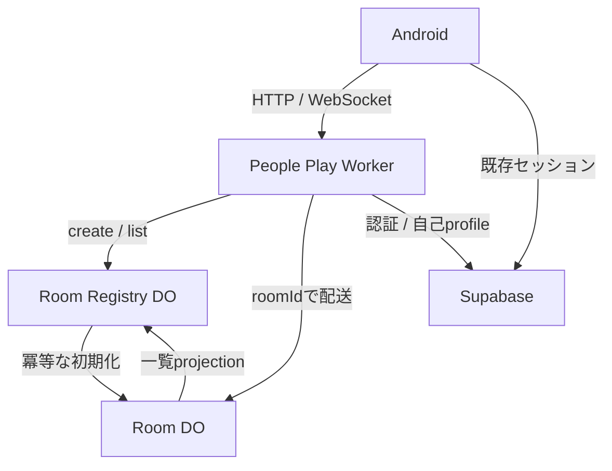
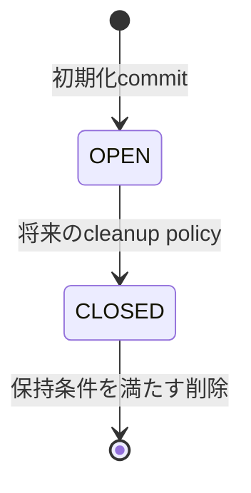
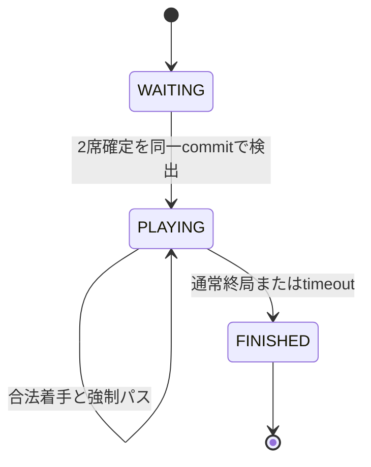
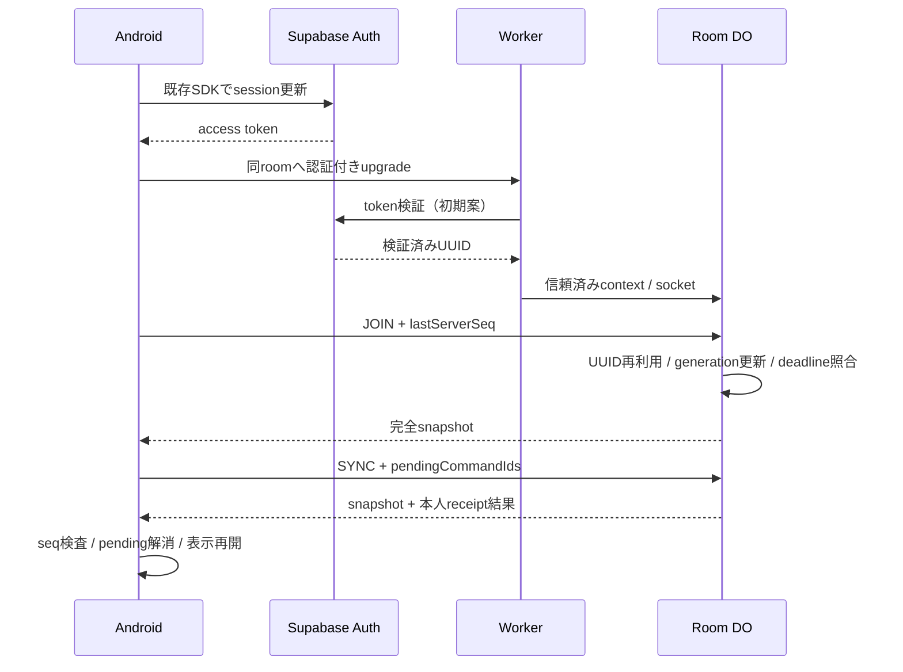

# 新ふたり対戦：Durable Object / WebSocket 詳細設計

調査基準日：2026-09-28（JST）。`git fetch origin main` で取得した remote main：`b17d063c411cbd2ff59bb08f6866fe2023cc6770`（PR #111 マージ後）。過去の作業ブランチのSHAを基準にはしていない。

本書は設計案であり、コード、Cloudflare設定、DB、既存画面を変更していない。「確定」は依頼で与えられた外部仕様、「推奨」は実装方式の提案、「未決」は外部仕様または実環境の確認が必要な事項を表す。未決事項に仮の本番動作を割り当てない。

## 1. 目的と非目的

「AIと対局→学ぶ→検討する→勝ち方のコツを見る→たまに人と遊ぶ」という体験の中で、カジュアルな共有部屋を実現する。入室と着席を分離し、観戦者と2人の着席者が同じサーバー状態を見る。最初は各人10分、通常8×8リバーシ、黒先手、自動開始、自動パスとする。

新方式は Worker + 部屋ごとの Durable Object（以下 Room DO）+ WebSocket を使用する。Supabaseは認証・プロフィールに残す。レーティング、ランク、ランダムマッチング、自由チャット、リアクション、時間選択UI、結果保存用DB設計は対象外。旧方式の置換を目的に既存の機能や不変条件を無条件に継承しない。現在のUIの絵・レイアウトも変更しない。

## 2. 現行構成の調査結果

以下のパスはリポジトリルート相対。ファイルに記述された状態と、未確認の本番環境を区別する。

| 調査対象 | 実際に確認した内容 | 新方式への扱い |
|---|---|---|
| `app/src/main/kotlin/com/example/othello/PeopleEnjoyHomeScreen.kt` | 対戦・イベント・交流のコールバックを持つ入口 | 対戦導線だけ新接続へ結ぶ |
| 同 `PeoplePlayLobbyScreen.kt` | `PeoplePlayLobbyRoom` は名前リソース、時間、対局中、観戦表示等を保持。`roomId` はない。20/15/10/5/3分のサンプル。テーブル作成は未接続 | デザインを維持し、サーバー一覧へのmapperを追加する |
| 同 `PeoplePlayRoomScreen.kt` | `PeoplePlayRoomUiState`、`RoomReferenceBoard` による固定表示。セル操作・離席は接続未実装 | 外側のstate/イベント接続を新設する |
| 同 `StandardModeNavigation.kt` | PEOPLE_HOME / PEOPLE_NAME_SELECTION / PEOPLE_MATCH / PEOPLE_ROOM / PEOPLE_SOCIAL。部屋へ渡すのは名前リソース・持ち時間で、roomIdではない | roomIdによる遷移が必要。画像の戻る・システムBack・退出の意味は仕様確認が必要 |
| 同 `PlayProfileSelectionFlow.kt`, `PendingPlayProfileStore.kt` | 現セッションUUIDに紐づく名前選択、保存待ち選択の再試行 | 名前準備の既存フローを再利用 |
| `core/auth/src/main/kotlin/com/example/othello/auth/Auth.kt` | `AuthGateway` と `UserSession(userId)`。アクセストークン提供portはない | UIにtokenを渡さない専用portを追加する設計 |
| appの `AuthSessionController.kt`, `OnlineSessionViewModel.kt` | 認証StateFlow・排他・セッション破棄。単一SupabaseComponentと旧対局の寿命管理 | 同一認証基盤を利用。旧coordinatorを新対局の所有者にしない |
| `data/supabase/src/main/kotlin/com/example/othello/data/supabase/SupabaseContracts.kt` | Auth / Postgrest / Realtimeを構築。`SupabasePlayProfileRepository` が自己UUIDの `play_profiles.display_name_id` と `play_display_names` を読む | 認証・表示名取得だけ再利用。新対局にRealtimeを使わない |
| `feature/profile/src/main/kotlin/com/example/othello/profile/Profile.kt` | `PlayDisplayName`, `PlayProfileLookup`, `PlayProfileRepository` | 表示名準備のドメインとして再利用 |
| `core/game/.../Board.kt`, `GameState.kt`, `TurnResolver.kt`, `Position.kt`, `CanonicalMoves.kt` | 純粋なKotlinの合法手・反転・パス・終局・座標・手順表現 | 第33章の共有候補 |
| `feature/match/.../OnlineMatchController.kt`, `OnlineMatchContracts.kt`, `MatchClock.kt`, `MatchStateMachine.kt` | 端末側ゲーム進行、P2P ACK、再同期、結果提出、再接続時計 | 新DO権威には持ち込まない |
| `core/network/.../MatchTransport.kt` | matchId / ply / previousStateHash / clockSnapshot / ACK等のP2P契約 | 汎用という名前でも新Room protocolへ流用しない |
| appの `WebRtcMatchCoordinator.kt`, `OnlineMatchRecoveryStore.kt` | transport生成、signaling、epoch、復旧checkpoint、結果確定の協調 | 不変条件だけ抽出する |
| `transport/webrtc/.../WebRtcContracts.kt` | Android WebRTC factory/transport、non-trickle ICE、STUN。TURN構成はない | 新経路は依存しない |
| `feature/matchmaking/.../Matchmaking.kt` とSupabase実装 | enqueue/cancel/claim、requestId、通知 | カジュアルなroom create/listには流用しない |
| `supabase/migrations/` | 旧queue / signaling / active participants / start ACK /結果・rating・replay検証 | 既存方式用。新方式の結果を旧RPCに投入しない |
| `cloudflare-admin/src/index.ts` | 管理API、アカウント削除、旧対局保守cron。service-roleを扱う | 公開対局Workerを分離する |
| `cloudflare-admin/src/research-validator.ts` | TypeScriptで既にリバーシの手順再生・hash計算がある | 検証資産として参照。第3の独立ルール実装を増やさない |
| `cloudflare-admin/wrangler.toml` | name=`othello-admin`, main=`src/index.ts`, compatibility_date=`2026-08-09`, 10分cron。DO binding/migrationなし | そのまま新対局の設定にはしない |
| `landing-page/wrangler.toml` | name=`chanriva`, main=`dist/server/index.js`, date=`2026-08-13`, nodejs_compat, ASSETS,独自ドメイン。DOなし | Webサイト配信と対局責務を分離 |
| `docs/02_オンライン対局/通常接続設計.md`, `再接続設計.md` | 旧接続・同期・復旧・終了の契約 | 第3章の不変条件比較に利用 |

`core/game/build.gradle.kts` は現在JVMのみ。mainソースのルールはAndroid/JVM固有APIに依存しないが、そのままWorkerで動く成果物ではない。ルートはKotlin 2.2.10。`data/supabase/build.gradle.kts` はSupabase BOM 3.6.0、Ktor OkHttp 3.2.3。新transportの依存は既存バージョンに揃えて検証する。

Supabase接続先は既存設定にある `https://zgzllmaoyymoeiqtybck.supabase.co`。`supabase/config.toml` はproject_idとPostgres 15等を記載するが、本番JWT署名方式を証明しない。リポジトリ内には `play_profiles` / `play_display_names` のDDLを確認できなかった。本番テーブルの不在を意味しない。RLS、grants、user_id一意制約、FK、非active名称の既存所有者による参照は実装前に読み取り確認が必要。既存の `profiles.display_name` とちゃんりばネームは同一視しない。

Cloudflare accountのプラン、実際のdeploy済みbinding、Supabase本番の鍵・RLSは調査していない。「設定ファイルにDOがない」と「アカウント全体にDOが存在しない」は別である。

## 3. 旧方式の責務整理

旧方式ではSupabaseがmatchmaking・signaling・開始合意・結果保存、WebRTCがプレイヤー間配送、Android controllerが盤面・時計・ACK・同期を担当する。`publish_match_signal_v2`、`match_signals_v2` のRealtime購読と補助SELECT、epoch付き開始ACK、結果のSQL replay等はその方式のために存在する。

失ってはいけないものは技術分割ではなく、次の不変条件である。

| 不変条件 | 新方式での実現 |
|---|---|
| identityと表示名を混同しない | 検証済みSupabase UUIDをparticipantキーにする |
| 応答が届かないことは未処理の証明ではない | 永続command receiptと再同期 |
| 再送は状態を二重に進めない | DO内の原子的commitとidempotency |
| 古い接続が現接続の状態を破壊しない | connection generationによるfencing |
| 終局済み状態は戻らない | result一意、FINISHEDガード |
| 通信断だけで勝敗を捏造しない | disconnectとleave/timeoutを分離 |
| 認証切替で前ユーザーの操作が混ざらない | session所有のrepository、破棄と再認証 |
| 復旧は整合した盤面・手番・時計をまとめて扱う | version付きsnapshot |

旧 `OnlineMatchController` の5分既定、45秒猶予、1.5秒debounce、旧epoch回数、peer ACK、rating、旧active-match排他は外部仕様ではない。新方式へコピーしない。`MatchTransport` のprotocolVersion=2とも別のprotocolを作る。

## 4. 新方式の全体構成



推奨する新ディレクトリは `cloudflare-people-play/`。公開Worker、Registry DO、Room DOを同一Worker内の別exportとして配置する。現在の管理Workerやlanding-pageに公開対局処理を混在させない。ドメイン、route、binding名、compatibility dateは実装時に決めて検証する。本書は既存設定にそれらがあるとは扱わない。

Room Registryは環境ごとに安定した名前で1個を初期案とする。roomIdはサーバー生成の推測困難なID、DOはそのIDから一意に解決する。クライアントが任意IDへ接続しただけで空部屋を生成してはならない。規模拡大時のregistry shardはAPI外の責務として追加できる。

## 5. 責務境界

| コンポーネント | 知ること・所有すること | 知らないこと・所有しないこと |
|---|---|---|
| Composable | 表示state、操作callback | token、socket、Supabase、サーバー勝敗決定 |
| state holder | 自分の役割、接続状況、表示時計、操作可否 | 認証検証、永続正本 |
| PeoplePlayRepository | HTTP/WS統合、snapshot reducer、pending command、再接続 | 合法性の最終裁定 |
| transport | serialization、通信、close、retry通知 | 勝者や席順の推測 |
| Worker gateway | JWT検証、profile解決、入力制限、room配送 | 盤面・時計の独立正本 |
| Registry DO | create intent、一覧projection、回復タスク | 着手の認可、席の最終確定 |
| Room DO | membership、seat、game、clock、receipt、seq、storage | UIレイアウト、旧matchmaking、rating |
| SharedRules | 盤面、合法手、反転、強制パス、終局 | UUID、通信、時計、storage |
| Supabase | 既存認証、profile、表示名 | 新対局のリアルタイム配送 |
| 将来ResultSink | 確定結果の冪等永続化 | 試合のFINISHED成立可否 |

外部I/O失敗をRoom DOの正本トランザクションに持ち込まない。Registryへの通知・将来の結果保存はoutbox境界に置く。

## 6. ドメインモデル

| 型 | 内容・制約 |
|---|---|
| RoomId | サーバー発行、変更・再利用しない。表示名ではない |
| AuthenticatedUserId | 検証済みSupabase UUID。client payloadのuserIdから作らない |
| DisplayName | play_profiles由来の表示値・名称ID。重複可能、認可に使わない |
| Participant | `(roomId, UUID)` が一意。membership状態、表示用profile snapshot、参照用participantRef |
| Seat | LEFT / RIGHT、owner、seatVersion。空席はowner=null |
| PlayerColor | BLACK / WHITE。LEFT=BLACK、RIGHT=WHITE固定 |
| RoomStatus | OPEN / CLOSED。対局状態とは別 |
| GameStatus | WAITING / PLAYING / FINISHED |
| TimeControl | kind、initialMillis、version。初期はFIXED_TOTAL、600000ms/人 |
| ClockState | blackRemainingMillis、whiteRemainingMillis、runningColor、turnStartedAt、deadlineAt、clockVersion |
| BoardState | 8×8、EMPTY/BLACK/WHITE、currentTurn、consecutivePasses、corePly |
| Move | row/column各0..7、color、moveSeq、server確定時刻 |
| CommandId | client発行の一意ID。保存してから送る。同じIDのpayload変更禁止 |
| ServerSeq | roomごとの永続単調増加整数。wireは10進文字列 |
| GameId | 自動開始で1回発行。部屋内の対局識別。再戦を今実装する意味ではない |
| GameResult | gameId、reason、winner nullable、石数、finishedAt、decidedAt |
| ConnectionMembership | UUID、clientInstanceId、connectionId、generation、tokenExpiresAt。participant/seatとは別 |
| CommandReceipt | UUID+commandId、payload digest、結果、appliedServerSeq、gameId |

`moveSeq` は実際の着石数、`corePly` は既存coreと同じくパスも数える。両者を混同しない。全体serverSeqは観戦者変化でも進むのでMOVEの盤面前提にはgameIdとexpectedMoveSeqを使う。TimeControlの将来候補は1200000/900000/600000/300000/180000msだが、create APIで選択させることはしない。

## 7. Room state machine

Registryだけが `PROVISIONING` のcreate intentを持ち、Room DOの永続初期化後に一覧対象 `OPEN` へ反映する。未初期化DOは404相当とし、空Roomとして扱わない。



OPENの内部でgameはWAITING/PLAYING/FINISHEDを持つ。FINISHEDだから即CLOSED、切断者ゼロだから即削除、という規則は未決Gを決めてしまうため入れない。CLOSEDから同じroomIdを再利用しない。cleanup有効化まで閉鎖・削除遷移は本番で実行しない。

## 8. Game state machine



WAITINGでは時計は停止、初期盤面。PLAYINGへの遷移時にgameId、黒手番、各600000ms、黒時計開始を同時確定する。通常終局とtimeout以外のFINISH理由は将来拡張。FINISHEDからWAITINGへ戻す再戦・席リセットは未決である。通信状態RECONNECTINGはAndroid/connection状態でありGameStatusではない。

## 9. Participant / Seat model

| 操作・現象 | Participant | Seat | Connection |
|---|---|---|---|
| 初入室 | UUIDで作成または既存を参照 | 空のまま＝観戦者 | 現接続を関連付け |
| 着席確定 | 同じparticipant | サーバーが確定 | 変えない |
| 一時切断 | 削除しない | 自動解放しない | offline / detach |
| 同UUID再接続 | 増やさない | 既存席を維持 | 新世代へ関連付け |
| 明示退出 | policy適用後LEFT等へ遷移 | phase別policyに従う | 正式な退出と切断を別処理 |
| 離席 | 部屋に残るかを仕様確認 | 未決の離席policy | socket closeと同義にしない |

Room membershipはJOINED/LEFT、connection presenceはonline/offlineとして分離する。切断した観戦者を人数へいつまで含めるかは未決であり、SpectatorPresencePolicyに閉じ込める。人数の内部集計値と表示値を同義と決めない。2席を同じUUIDが占めることは禁止する。複数端末、複数部屋への同時参加の制限は旧方式の制限を引き継がず未決とする。

## 10. 部屋作成フロー

1. Androidは既存profile準備を終え、createCommandIdを保存して認証付きPOSTを送る。
2. Workerは現在のセッションを検証し、本人のplay profileを解決する。未準備なら副作用前にエラー。
3. Registryは `(UUID, createCommandId)` を一意キーに、roomIdと初期化payloadを永続化する。既存なら同じroomIdを返す。
4. RegistryからRoomへ内部initializeを送る。RoomはroomId/create intentの一致を検証し、metadata、10分TimeControl、作成者participant、LEFT/BLACK、WAITING、初期盤面、serverSeq、projection outboxを一括保存する。
5. Roomの確定後にRegistryをOPENへ反映する。初期化の再実行は同じ結果を返す。違うpayloadでは上書きしない。
6. HTTP成功後、AndroidはroomIdへ接続・JOINする。作成者は既に左席なので着席操作を要求しない。

DO間には分散トランザクションがない。create intent→冪等initialize→projection更新のsagaとする。201/200は作成者着席の永続commit確認後のみ。確認待ちは202で同じcommandを再試行し、別部屋を作らない。Registryのロックを持ったままRoom→Registryの折り返しを待たない。未完了intentの回復走査とRoom outboxの両方で応答喪失から回復する。

## 11. 部屋一覧フロー

Registry DOのSQLiteにroomId、表示名キー、RoomStatus、GameStatus、左右席の表示用状態、観戦人数、TimeControl、sourceServerSeq、updatedAtを保存する。DO namespaceそのものを列挙する方式やWorker isolateのメモリ一覧を正本にしない。KVの結果整合性で席の予約を判定しない。

Roomは一覧に関係する状態変更と同じトランザクションでprojection outboxを更新する。RegistryはroomIdごとに大きいsourceServerSeqだけを採用し、同じseqは冪等、古いseqは無視する。通知失敗はRoomのalarmで再試行する。一覧は結果整合であり、着席判断・入室許可は必ずRoomで再検証する。

GET一覧は認証付き、安定したsort keyとopaque cursorでページングする。並び順、人数のpresence定義、閉鎖後の非表示時期は各policyとして未決。初期の一覧更新は画面表示・手動再取得・復帰時のHTTPで成立し、ロビー用WebSocketを先行導入しない。自動更新頻度は運用値とする。作成直後は返されたroomIdで直接移動できる。

Registryの回復走査は小分けに実行する。単一Registryの負荷が増えたらroomIdによるshardと集約層を追加できるが、初期実装に分散一覧の複雑さは持ち込まない。

## 12. 入室フロー

Workerが認証とprofileを解決してWSをRoomへ渡し、clientのJOIN_ROOMで入室を確定する。upgradeだけではゲーム情報を送らない。初回JOINはparticipantをUUIDでupsertし、座っていなければ観戦者となる。既存着席者の再JOINでは席を観戦者に変更しない。JOIN receipt、membership、connection generation、serverSeq、projectionをまとめて保存後、本人へsnapshot、他参加者へ必要な状態更新を送る。

初期は観戦OK固定。将来の観戦不可はAdmissionPolicyでJOIN前に判断し、認可前に盤面や参加者情報を送らない。Roomが未初期化/閉鎖の場合は拒否する。JOINの再送は人数を増やさず、異なるcommandIdでも同UUIDのmembershipは増やさない。

## 13. 着席フロー

確定しているのは「最初はLEFT/BLACK、2人目はRIGHT/WHITE」「2席が確定すれば開始」の2点である。着席要求 `SeatIntent` と着席許可 `SeatGrant` を分離し、SeatAdmissionPolicyが許可を出した後だけRoomがseatを確定する。

自由着席ならpolicyが自動でgrant、承認式なら将来の申請・承認処理がgrantを生成する。今回はどちらも本番既定にしない。承認者、期限、取消、拒否、UI、競合順序も未決Aに含める。APPROVE等のwire messageを今から固定しない。

grant適用では、membership、空席、seatVersion、本人が他席を占有していないこと、現在GameStatus、grantの一回性をDO内で再確認する。2人の同時要求では高々1件だけが同じ席を取得する。UIには現在着席操作が存在しないため、Phase 4の本番結線は仕様決定待ちとする。policy fakeを使ったドメイン試験は先行可能。

左席が空いたときの右席繰上げ、作成者退出、対局前の離席は未決。席や色を勝手に入れ替えない。

## 14. 自動対局開始

seat確定と `WAITING && LEFT.owner != null && RIGHT.owner != null && owners are distinct` の評価を同一の直列化・storageトランザクションで行う。条件成立時だけgameIdを発行し、PLAYING、通常初期配置、黒手番、各10分、黒turnStartedAt、deadline、GAME_STARTED effectを保存する。

開始専用client command、準備OK、peer ACKは不要。再送・再接続・projection再配信は既存PLAYINGを読むだけで時計をリセットしない。receiptとstateを一括commitするため、応答喪失後も二重開始しない。「exactly-once」は状態遷移の効果について保証し、イベント配送の一回性は保証しない。

## 15. MOVE処理

Room内の状態変更入口（message、alarm、close、initialize、回復RPC）を直列化する。JavaScriptが単一スレッドでもawaitを跨いだ競合は起こり得る。認証・profileの外部HTTPはトランザクション外で終え、最終権限と世代はcommit直前に再検証する。

1. protocol、message size、commandId、row/columnの型を検査する。検証済み接続UUID、token期限、現在connection generationを確認する。
2. room participantとしての関係とcommand参照権限を確認する。UUID+commandIdで永続receiptを検索する。既処理なら同一payloadに元結果を返し、異なるpayloadにはCOMMAND_ID_REUSEDを返す。完了済みMOVEへの再送を現在手番の違いで別エラーにしない。
3. 未処理の場合、JOINED、着席済み、gameId一致、PLAYING、本人手番を検査する。観戦者はここで拒否する。
4. 現サーバー処理時刻とdeadlineを比較する。時間切れならMOVEより先に第19章のFINISHを適用する。無効入力や再送でも別途期限照合を行え、期限切れを隠さない。
5. expectedMoveSeq、座標0..7、SharedRulesの合法性を検証する。client申告のcolor、時計、反転石、盤面、勝者は受け取らない。
6. 有効手について手番側の消費時間を確定し、SharedRulesで着石・反転・強制PASS・終局を計算する。次手番時計またはresultを決める。
7. board、turn、moveSeq、corePly、clock、result、serverSeq、ordered effects、receipt、projection outbox、alarm予定を原子的に保存する。違法手は盤面を変えず、再試行を安定させる必要のある拒否receiptだけ保存できる。
8. 永続commitを確認後にbroadcastし、COMMAND_RESULTを返す。送信失敗でもcommitを取り消さない。端末はsnapshot/receiptで復旧する。

同時MOVE・timeoutはこの直列化境界で一つずつ評価する。外部送信をトランザクションcallback内で行わず、再実行され得るcallbackでUUID発行などの非冪等副作用を起こさない。receiptしか変わらない拒否はgameのserverSeqを進めない。

## 16. PASS処理

clientからPASSを送らせない。着手後に既存 `resolveForcedPasses` 相当を実行し、相手合法手なしならPASS effectを追加して手番を戻す。両者なしなら終局する。WAITING→PLAYINGの初期局面でも同じrules前提を利用できるが通常配置ではパスはない。

MOVE、0回以上のPASS、必要ならFINISHを一つのcommitで保存し、effectsには順序indexを付ける。途中の「合法手なしなのに人間の操作待ち」という状態を公開しない。連続して同じ人の手番になる場合も、消費時間を一度確定して同じcommit時刻から再開する。自動パスにネットワーク待ち時間を課さない。

## 17. FINISH処理

唯一のfinish境界で `gameStatus == PLAYING && result == null` を検査する。gameIdごとに一意のresultを保存し、時計停止・serverSeq・effect・将来用outboxを同じcommitで確定する。

| 終了理由 | 判定者・内容 | 他の理由との境界 |
|---|---|---|
| NORMAL | SharedRulesで盤面満杯または両者合法手なし。石数比較、同数はwinner=null | 黒/白石数はサーバーで数える |
| TIMEOUT | Roomのdeadline照合。0になった側が敗北 | 石数を64対0等へ捏造せず、現盤面の石数を残す |
| 将来RESIGN | 明示的な新policy・command承認後のみ | leave/disconnectから推測しない |

通常finishedAtは確定時刻。timeoutは論理deadlineをfinishedAt、実際に処理した時刻をdecidedAtとして遅延を識別する。FINISHED後の古いalarm・MOVE・finish要求は再終局させない。結果のSupabase保存が失敗してもFINISHEDを巻き戻さない。永続記録の詳細は未決F。

## 18. Clock設計

初期TimeControlは固定持ち時間600000ms/人。加算・秒読みは本書の仕様に含めない。将来20/15/5/3分を追加するときはpreset catalogだけを追加できる構造にする。初期create requestから任意initialMillisを受け付けない。

正本は残り時間の基準値、runningColor、turnStartedAt、deadlineAt、clockVersion。PLAYINGの手番時計表示は `max(0, storedRemaining - max(0, serverNow - turnStartedAt))`。手番交代時だけ消費分を保存し、次手番のdeadlineを計算する。WAITING/FINISHEDはrunningColor=null。再接続は初期時間へのリセットではない。

DOの永続時刻はUnix epoch milliseconds。過去へ時刻が動いた場合は負の消費を0へ抑え、計測異常を記録する。Androidはsnapshot.serverNow、RTTに基づく時刻差推定と単調時計で表示を補間し、各秒broadcastは行わない。表示0でもclientが勝敗を確定せず、snapshot再取得を促すだけにする。

サーバー処理時刻を着手期限の裁定基準とする方式を推奨する。client時刻は信用できない。ネットワーク遅延補償の有無、切断中に時計が走り続けるか・停止するか・猶予を置くかは依頼では確定していないためClockInterruptionPolicyとして未決に残す。disconnectを即敗北としないことは確定。少なくとも再接続処理自体で時計を恣意的に増減させない。

## 19. Timeout確定方法

推奨は **Durable Object alarm + 各入口での期限照合 + 回復用照合**。Cloudflare公式のalarmはat-least-onceで、失敗時の自動再試行は有限（最大6回、初期2秒の指数backoff）。期限ちょうどの実行を保証する仕組みではない。[F1]

| 経路 | 役割 |
|---|---|
| alarm | 無通信の対局でもdeadline後に起動し、永続stateを読んでtimeout確定 |
| MOVE等command | deadline到達後の手を受理しない |
| reconnect / SYNC | 遅れたalarmを待たず最新の終局状態へ照合 |
| Registry回復走査 | 長期未照合のOPEN roomに内部reconcileを要求。alarm再試行枯渇を監視・補助 |

1 DOにつきalarmは一つなので、clock deadline、認証期限、projection再送、将来cleanupの各dueAtを保存し、最も近いものをsetAlarmするschedulerを設ける。alarmは起動後に最新clockVersionとdeadlineを読み、まだ期限前・既にFINISHEDなら古い予定を無効化する。終局後も他のdue taskを消さない。

SQLite storageのトランザクション内でstate変更とalarm予約を整合させる設計とし、実際に選ぶstorage APIでrollback・再起動試験を行う。同期SQL callback内で非同期APIを呼ぶ実装にしない。constructorで無条件にalarmを上書きせず、永続scheduleの復旧後に欠損を補修する。[F1][F3]

alarmが遅れた場合も論理deadlineを使うため、結果は遅延時間に左右されない。恒久的なプラットフォーム障害の間まで即時確定は保証できない。保証するのは「復旧後の照合で正しい一回の結果へ収束」「期限後の手を通さない」である。期限直前のMOVEとalarmの競合は同じ直列化境界で解決する。

## 20. WebSocket lifecycle

1. **connect/authenticate**：Androidの既存SDKから有効access tokenを取得し、Authorization Bearer付きupgradeを送る。URL queryにtokenを入れない。Workerで検証失敗なら101前に拒否する。
2. **accept**：Workerが信頼済み認証contextをRoomへ内部配送する。外部からの同名headerは消去し、偽のuserId headerをそのまま信じない。Roomは未初期化/閉鎖を確認する。
3. **join**：JOIN_ROOMでmembershipを確定し、UUID+clientInstanceIdの新generationを採番する。snapshotはJOIN許可後だけ送る。
4. **message**：毎回protocol、接続generation、token期限、membership、操作権限を確認する。
5. **disconnect**：connectionだけ離す。古い世代のcloseが新接続をofflineにしない。game/result/seatをclose handlerから変更しない。
6. **reconnect**：SDKでtoken更新、同roomへ再認証、JOINとsnapshot。participantはUUIDで再利用する。
7. **replace**：同一clientInstanceの旧接続をfenceし、close通知はbest effort。世代判定が安全性の本体。別端末の接続を置換するか併存させるかは未決。

tokenExpiresAtをattachmentと永続connectionに持つ。期限後はcommandだけでなく配信も停止し、alarmでcloseする。SDKで更新後に再接続する方式を初期案とし、独自のWS内refresh-token交換は作らない。Auth側の即時失効をどこまで反映するかは署名方式・再検証方針と合わせて確認する。通信上のheartbeatはliveness用で、対局時計や退出扱いの根拠にはしない。

## 21. WebSocket protocol

以下は新方式専用 `protocolVersion: 1` の設計案。旧MatchTransport v2と混ぜない。JSON objectのみ、未知のversion/type、不正な型・範囲を拒否する。client frame上限8KiBを初期運用案とし、実際の上限・頻度はconfigと負荷試験で決める。snapshotは別のサーバー送信上限を設ける。

| client → server | 用途・制約 |
|---|---|
| JOIN_ROOM | commandId、clientInstanceId、lastServerSeq（初回null）。接続先roomに参加/復帰 |
| SYNC_REQUEST | requestId、lastServerSeq、bounded pendingCommandIds。副作用のない最新照合 |
| MOVE | commandId、gameId、expectedMoveSeq、row、column |
| REQUEST_SEAT（境界案） | commandId、expectedSeatVersion。要求受付と席の確定を区別。未決A決定まで本番有効化しない |
| LEAVE_SEAT（境界案） | commandId、expectedSeatVersion。phase別仕様が決まるまで適用しない |
| LEAVE_ROOM（境界案） | commandId、expectedMembershipVersion。明示退出の意図。対局中の効果は未決B |

REQUEST_SEATに自動承認を含意させず、承認commandは今定義しない。START、READY、PASS、FINISH、SET_CLOCK、RESIGN、CHAT、REACTION、CHANGE_TIMEは初期protocolに存在しない。

```json
{
  "protocolVersion": 1,
  "type": "JOIN_ROOM",
  "commandId": "8f42b812-b9bc-4abc-beca-7690632470dd",
  "clientInstanceId": "aab2b003-2e56-4da8-9930-945ce0bf3d26",
  "lastServerSeq": "18"
}
```

```json
{
  "protocolVersion": 1,
  "type": "MOVE",
  "commandId": "0f0a45fb-f1e8-49c8-8cfa-0776051780b5",
  "gameId": "game-opaque-id",
  "expectedMoveSeq": 0,
  "row": 2,
  "column": 3
}
```

| server → client | 意味 |
|---|---|
| ROOM_SNAPSHOT | 最新の完全state、自分用権限、serverNow。JOIN/SYNCへの応答 |
| ROOM_STATE | commit後の完全snapshotとordered effects。初期はdeltaだけを送らない |
| COMMAND_RESULT | APPLIED/REJECTED、duplicate、appliedServerSeq、error。元receiptを返す |
| AUTH_EXPIRED | 更新tokenによる再接続を要求 |
| CONNECTION_REPLACED | 旧世代接続の操作停止 |
| PROTOCOL_ERROR | schema/version等のエラー。認可情報を過剰に返さない |

```json
{
  "protocolVersion": 1,
  "type": "COMMAND_RESULT",
  "commandId": "0f0a45fb-f1e8-49c8-8cfa-0776051780b5",
  "outcome": "APPLIED",
  "duplicate": true,
  "appliedServerSeq": "19",
  "error": null
}
```

ROOM_STATEのeffectsは同一serverSeq内でindexを付け、GAME_STARTED、MOVE_APPLIED、PASS_APPLIED、GAME_FINISHED、ROOM_MEMBERSHIP_CHANGED等を順序づける。複数effectでもsnapshotは最終整合状態1個。再配信で演出を重複しないよう `(roomId, serverSeq, index)` を識別する。既存UIに演出追加を要求するものではない。

error code案：AUTH_REQUIRED、AUTH_EXPIRED、PROFILE_REQUIRED、ROOM_NOT_FOUND、ROOM_CLOSED、NOT_JOINED、NOT_SEATED、NOT_YOUR_TURN、GAME_NOT_PLAYING、GAME_MISMATCH、STALE_MOVE_SEQUENCE、INVALID_COORDINATE、ILLEGAL_MOVE、COMMAND_ID_REUSED、STALE_CONNECTION、SEAT_CONFLICT、POLICY_UNAVAILABLE、RATE_LIMITED。未決policyを仮動作させる代わりに内部/検証環境でPOLICY_UNAVAILABLEとし、製品公開前のgateを通す。userIdやcolorを送って認可を取得するfieldはない。

## 22. HTTP API

base path案は `/v1/people-play`。すべて認証付きとする。実際のhostは未決。

| endpoint案 | 内容 |
|---|---|
| POST `/rooms` | createCommandIdのみを受ける。10分・観戦OKをサーバーで設定 |
| GET `/rooms?cursor=...&limit=...` | Registry projection一覧、nextCursor、取得時刻 |
| GET `/rooms/{roomId}` | 必要な場合のmetadata確認。ゲーム同期はWS snapshot |
| GET `/rooms/{roomId}/socket` | WebSocket upgrade。HTTP中に認証 |

```json
{
  "createCommandId": "62a4b33c-bf20-4e5d-ab7b-7742318d277e"
}
```

```json
{
  "roomId": "server-generated-room-id",
  "roomType": "TEN_MINUTES",
  "nameKey": "people_room_ten_minutes",
  "timeControl": { "kind": "FIXED_TOTAL", "initialMillis": 600000, "version": 1 },
  "creatorSeat": "LEFT",
  "creatorColor": "BLACK",
  "status": "OPEN"
}
```

createは201、新規作成でない冪等再試行は200、未確定は202+Retry-After。401認証失敗、403認可不可、404不存在、409command内容衝突、429制限、503依存先不調を区別する。202後も同じcreateCommandIdを使う。

HTTPは初期発見・作成のrequest/response、WSは入室後の順序あるstate同期を担当する。MOVEをHTTPとWSの両方から受ける初期設計にはしない。GETは座席確保を行わない。部屋名は表示用nameKeyをlocaleに応じて既存文字列へmappingし、同名の部屋をroomIdで区別する。

## 23. Authentication

現構成はSupabase AuthをSDK経由で使用しているが、AuthGatewayの公開sessionはUUIDだけである。将来 `AccessTokenProvider` をcore/authに追加し、data/supabase内部の既存clientで実装する。Compose、Domain、保存ログへtokenを流さず、refresh tokenをWorkerに渡さない。認証clientを二重構築しない。

初期の安全な方式として、固定した既存Supabase projectのAuthサーバーへaccess tokenを提示して検証する方式（`getUser` 相当）を推奨する。署名方式がリポジトリから確定できないためである。検証済み応答とclaimの整合からUUIDを得て、期限・issuer・audience・期待するユーザー種別を確認する。未検証JWTのdecodeだけでsubを採用しない。[S1][S2]

実プロジェクトが非対称署名鍵を使用すると確認できた場合は、固定projectの `/auth/v1/.well-known/jwks.json` によるローカル署名検証へ移行できる。alg allowlist、issuer/aud、exp/nbf、kid、鍵キャッシュ・ローテーション、未知kidの制限付き再取得を実装要件とする。token内のjku等を任意fetchしない。HS256ならanon keyを検証鍵にせず、Authへのオンライン検証を継続する。JWT signing secretやservice-roleを新公開Workerへコピーすることを既定にしない。

Authへのネットワーク失敗は認証成功扱いにしない。オンライン検証も既発行tokenの即時失効を万能に保証するとは扱わず、logout・account deletion・匿名認証・token寿命の実設定を確認する。長時間socketの期限処理は第20章のとおり。

表示名はverified UUIDから本人JWTを用いたPostgREST/RLSで `play_profiles` と名称catalogを取得する。クライアント提供displayNameで上書きしない。profile未準備はPROFILE_REQUIREDにし、Androidの既存選択フローへ戻す。一般 `profiles.display_name` やemail由来名を代用品にしない。非active名称を既存所有者が使う場合の参照権限は未確認であり、service-roleで回避せずDDL/RLSを確認する。RLSとData API grantsは別の確認項目である。[S3]

## 24. Authorization

| 操作 | 未JOIN接続 | 観戦者 | 黒プレイヤー | 白プレイヤー |
|---|---|---|---|---|
| JOIN | admissionを検証 | 冪等 | 冪等、席維持 | 冪等、席維持 |
| state/start/move/pass/finish受信 | 不可 | 可 | 可 | 可 |
| SYNC | 不可 | 可 | 可 | 可 |
| MOVE | 不可 | 不可 | PLAYINGかつ黒手番のみ | PLAYINGかつ白手番のみ |
| 着席要求 | 不可 | policy Aに従う | 他席重複不可 | 他席重複不可 |
| 離席 | 不可 | 席なし | phase別未決 | phase別未決 |
| 明示退出 | 不可 | membership終了方針に従う | 対局中の効果は未決B | 同左 |
| START/PASS/FINISH/時計変更 | 不可 | 不可 | 不可 | 不可 |

全行の前提は有効認証・現generationである。画面上のbutton disableは利便性だけで、認可はRoomが再実行する。作成者だからゲームの裁定・時計操作を許すことはない。seat承認権限も未決Aが決まるまで付与しない。

## 25. Idempotency

状態変更commandはUUID+commandIdを永続キーとし、正規化payload digest、outcome、appliedServerSeqを同時保存する。同じID・同じ内容は元receipt、同じID・異なる内容は衝突エラー。再送の成功は二重適用ではないのでduplicate=trueで返す。「duplicate move reject」の試験は追加適用の拒否を意味し、初回成功を後から失敗に変更しない。

createはRegistryでUUID+createCommandId、startはWAITINGガードとgameId、moveはreceiptとexpectedMoveSeq、finishはPLAYING/result-nullガードとgameId一意を併用する。receipt検索は現在の手番・FINISHED判定より先に行うが、他人のreceiptを読めないよう認証UUID/roomの境界は先に検査する。

receiptのTTLを未決の部屋保持期間より短く勝手に設定しない。保存サイズ制限、悪意の大量command、削除後の再送は運用設計が必要。roomId再利用禁止・閉鎖tombstone・create key保持方針をcleanupと一緒に決める。古いreceiptを破棄しても昔のMOVEが通らないようgameId/expectedMoveSeq/状態ガードを残す。

## 26. Ordering

serverSeqはRoomの永続stateに持ち、利用者が観測するaggregate変更のcommitごとに1増やす。観戦者増減と着手が別commitなら別seq、MOVE+PASS+FINISHを一括確定した場合は同seqのordered effectsとする。時計の表示ticks、単なるSYNC、receipt返却だけでは増やさない。

AndroidはroomIdと接続generationを照合後、seqが小さいstateを捨てる。同seqの盤面・演出を再適用しない。ただし現在のSYNC requestIdへの回答・自己connection情報・serverNowサンプルは同seqでも別のcontrol stateとして更新できる。大きいseqの完全snapshotは途中のseq欠落があっても採用できる。旧socketからの応答で新socket stateを上書きしない。

WebSocket単体の送信順序だけには依存せず、serverの送信queueもcommit順にする。将来delta replayを導入するときはbaseSeqから連続するevent rangeだけを適用し、欠損・保持期間外は必ず完全snapshotへ戻す。wireで整数を文字列にするのはJavaScriptの安全整数上限による丸め回避のため。

## 27. Reconnect / Sync



Androidは認証UUID、roomId、clientInstanceId、lastServerSeq、未解決commandを最小復旧情報として保存する。token自体や端末盤面を対局の正本として保存しない。認証ユーザーが変わったら前ユーザーのpendingを送らない。

再接続は指数backoffとjitter、ネットワーク復帰時の再試行を用いる。通信断を退出へ変換しない。snapshotとreceiptを照合し、適用済みcommandは再送不要。未処理なら同じID・同じpayloadだけを再送候補にし、gameId/expectedMoveSeqが既に変わっていたら自動で新しい手を作らない。新snapshot確認前はMOVE入力を無効にする。

## 28. Snapshot

完全snapshotはroom metadata、TimeControl、membership/席、公開表示用participant、spectator summary、game/盤面/手番、moveSeq/corePly、clock、result、serverSeq、serverNow、本人権限を含む。部屋の全connectionやtoken、他人のreceiptは含めない。実UUIDを公開識別子にする必要はないので、一覧や対戦表示はroom内participantRefで関連付け、DO内部でUUIDへ対応させる。

次は開始直後に黒本人へ返す例。名称重複は正常である。時刻は例示用Unix milliseconds。

```json
{
  "protocolVersion": 1,
  "type": "ROOM_SNAPSHOT",
  "requestId": "sync-1",
  "roomId": "server-generated-room-id",
  "serverSeq": "4",
  "serverNow": 1801000000000,
  "room": {
    "status": "OPEN",
    "nameKey": "people_room_ten_minutes",
    "spectatorsAllowed": true,
    "timeControl": { "kind": "FIXED_TOTAL", "initialMillis": 600000, "version": 1 }
  },
  "participants": [
    { "participantRef": "p1", "displayName": "ちゃんりば", "presence": "ONLINE" },
    { "participantRef": "p2", "displayName": "ちゃんりば", "presence": "ONLINE" }
  ],
  "seats": {
    "left": { "participantRef": "p1", "color": "BLACK", "version": 1 },
    "right": { "participantRef": "p2", "color": "WHITE", "version": 1 }
  },
  "spectators": { "count": 0, "preview": [] },
  "game": {
    "gameId": "game-opaque-id",
    "status": "PLAYING",
    "boardRows": ["........", "........", "........", "...WB...", "...BW...", "........", "........", "........"],
    "currentTurn": "BLACK",
    "moveSeq": 0,
    "corePly": 0,
    "consecutivePasses": 0,
    "clock": {
      "blackRemainingMillis": 600000,
      "whiteRemainingMillis": 600000,
      "runningColor": "BLACK",
      "turnStartedAt": 1801000000000,
      "deadlineAt": 1801000600000,
      "clockVersion": 1
    },
    "result": null
  },
  "self": {
    "participantRef": "p1",
    "role": "PLAYER",
    "seat": "LEFT",
    "membershipVersion": 1,
    "connectionGeneration": 2,
    "canMove": true,
    "legalMoves": [{"row":2,"column":3},{"row":3,"column":2},{"row":4,"column":5},{"row":5,"column":4}]
  }
}
```

WAITINGではgameId=null、時計停止、result=null。FINISHEDではrunningColor=null、resultあり。self/legalMovesは本人の手番かつPLAYINGの場合のみ含め、それ以外は空配列。UIはserver capabilityと接続状態を組み合わせる。snapshot sizeを抑えるため全観戦者名の無制限列挙は避け、previewの順序/人数上限はpolicyに閉じ込める。avatarのidentity/sourceは未決なので、この例は存在しないprofile fieldを仮定しない。

## 29. Durable Object Storage

新Room/RegistryにはSQLite-backed DOを推奨する。論理的な保存単位は下表とし、実際のDDLは実装Phaseで追加する。本書ではDBやwranglerを変更しない。[F3][F5]

| 保存単位 | 保存項目・更新タイミング |
|---|---|
| room_state（1行） | schemaVersion、roomId、metadata、TimeControl、Room/GameStatus、board、turn、clock、seq、gameId。aggregate変更ごと |
| participants / seats | UUID一意membership、profile snapshot、席owner/version。JOIN/seat/leave時 |
| connection_fences | UUID+clientInstance、generation、connectionId、expiry。attach/detach時 |
| command_receipts | payload digest、結果、適用seq。stateと同じcommit |
| move_history / effects | gameId、moveSeq、corePly、seq、必要な確定操作。将来replay用だが初期はsnapshot復旧 |
| result / outbox | 終局一意record、Registry projection、将来ResultSink。commitでenqueue、成功後ack |
| schedule | clock/auth/outbox等のdueAt、version。stateとalarm予約を整合 |
| Registry create_intents / room_index | create idempotency、未完了初期化、最新projectionとsourceSeq |

メモリcacheは高速化に限定する。復旧はschemaVersionを確認し、stateを読み、hibernation socketsのattachmentを列挙し、永続fenceと合うconnectionだけ再関連付け、deadlineと未送outboxを照合する。復旧前にmessageを処理しないよう `blockConcurrencyWhile` 等を使うが、長い外部HTTPをconstructor内で待たない。[F2][F4]

state/receipt/seq/resultの部分commitは禁止。SQL同期トランザクションと非同期storage transactionのどちらを採用するかはalarmも含めた原子性で判断する。永続確認前にbroadcastしない。必要なstorage flushを待ち、`allowUnconfirmed`による早期応答を使わない。メモリを更新してstorageが失敗した場合は送信せず永続stateから再構築する。

不明schema・破損stateを初期盤面へ勝手にリセットしない。fail closedと運用回復にする。通常のDO再生成は保存seqを継続する。PITR等でstorage自体を巻き戻す場合は別の障害復旧手順が必要で、既存clientのlastServerSeqと矛盾する状態をそのまま公開しない。復元世代/新identity等の手順は運用gateとする。

## 30. Hibernation

採用候補として推奨する。Roomは受信型のWebSocket serverであり、観戦者の無通信時間も長いため適合する。公式APIは `acceptWebSocket`、`getWebSockets`、WebSocket message/close handler、socket attachmentのserialize/deserializeを提供する。hibernation後はconstructorが再実行され、メモリは失われてもsocketは維持できる。[F2]

現行adminのcompatibility_dateは2026-08-09、wranglerはpackage上4.120.0であり、古い日付だけを理由にAPIを除外する必要はない。ただし既存2 WorkerにDO bindingがないため「今すぐ既存構成で利用中」とは言えない。新WorkerでSQLite-backed classとmigration/bindingを追加し、現CLI・型定義・account plan・実deploy環境で起動/休眠/復元を検証した後に採用を確定する。最新ドキュメントの設定構文を既存CLIへ無検証で貼り付けない。

attachmentはroomId、検証済みUUID、clientInstanceId、generation、expiry等の小さい復旧contextに限定し、JWTを保存しない。socket attachmentは盤面やmembershipの正本にしない。setIntervalで毎秒時計配信を続ける設計は避ける。利用不可なら標準WSで同じprotocolを維持できるが、コストとidle復旧の違いを再評価する。

## 31. Android側構成

以下は新設案であり、現在存在するmoduleと取り違えない。既存のmodule分割を尊重し、新しいRoom概念を旧feature/matchへ詰め込まない。

| 配置案 | class/interfaceと責務 |
|---|---|
| `core/peopleplay` / `com.example.othello.peopleplay` | RoomId等domain、RoomSnapshot、PeoplePlayRepository port、ConnectionState。Android/HTTP SDKに依存しない |
| `data/peopleplay` / `com.example.othello.data.peopleplay` | DefaultPeoplePlayRepository、RoomSnapshotReducer、PendingCommandStore。HTTP/WSを統合しseqとpendingを管理 |
| `transport/websocket` / `com.example.othello.transport.websocket` | PeoplePlayHttpClient、PeoplePlayWebSocketTransport、ProtocolCodec。既存Ktor/OkHttp系列で通信とserialization |
| `feature/peopleplay` / `com.example.othello.peopleplay.feature` | LobbyStateHolder、RoomStateHolder、ClockDisplayInterpolator、表示用state。StateFlowを公開 |
| `app` / `com.example.othello` | PeoplePlaySessionViewModel、PeoplePlayUiMapper、PeoplePlayRecoveryStore、既存Compose/navigationとの組立 |
| `core/auth` | AccessTokenProvider portのみ追加候補 |
| `data/supabase` | 同一SupabaseComponentを利用するtoken/profile adapter |

依存はUI→state holder→domain repository port、実装はdata→transport。Domainはdata/transportを知らない。Appのcomposition rootが現在の単一SupabaseComponentと新repositoryを組み立て、`OnlineSessionViewModel` から必要な認証寿命を共有する。旧 `WebRtcMatchCoordinator` を継承しない。

RoomStateはcanonical snapshot、connection、pendingCommands、recoverable errorを分ける。StateFlowは再描画・Activity再生成後にも最新状態を持つ。SharedFlowは一度の通知に限定し、game stateを取りこぼすイベントstreamだけで構成しない。表示時計のtickはstate holderが担当し、snapshotのboardを触らない。clientで盤面のoptimistic updateはしない。

復旧Storeは旧OnlineMatchRecoveryStoreとkeyを分ける。session変更でsocketを閉じ、送信queueと表示stateを破棄する。画面rotationで参加者・socketを増やさない。画面離脱・background時にsocketを維持するかと明示退出の関係はLifecyclePolicyで扱い、ComposableのdisposeをLEAVE_ROOMに直結させない。

## 32. UI state mapping

| ドメイン/接続状態 | 現在UIへのmapping |
|---|---|
| spectator | 盤面・両席・観戦表示を購読。セル操作と合法手表示なし |
| black player | 左席を自分、色は黒。黒手番・PLAYING・同期済みの時だけ入力可 |
| white player | 右席を自分、色は白。白手番・PLAYING・同期済みの時だけ入力可。画面左右を反転しない |
| WAITING | 初期盤面、未充足席、時計停止。開始buttonを追加しない |
| PLAYING | server board、手番、表示時計を反映。MOVE送信中は多重タップ抑止 |
| reconnecting | 最後の確定盤面を維持し入力停止。新snapshot後に再開。勝敗を出さない |
| FINISHED | 確定最終盤面とresultをstateに保持、MOVE不可、時計停止 |

Room titleはroomType/nameKeyから既存文字列へ、情報帯は左右seatのprofileと観戦summaryへ、盤面はsnapshotの64セルへmappingする。合法手マーカーはself.canMoveかつ接続同期済みの場合だけ表示する。SharedRulesをAndroidに置いてもサーバーから来た盤面を先に進めない。

現在の `PeoplePlayRoomScreen` はサンプル盤面とアバター、中央の単一持ち時間表示であり、左右別の残り時計、実名、着席要求、結果、再接続状態をすべて表示するslotは確認できない。これらを勝手に追加・小型化する設計にはしない。UiMapperまで準備し、表示位置/方法の外部仕様決定をAndroid本結線のgateとする。「10分」という部屋設定表示を片側の残り時計と同一視しない。

戻る画像・システムBack・「退出する」は現在local navigationである。Bが未決のまま全部を投了に結ばない。「離席する」もphase別policyに基づきcallbackを配線する。現行 `GridLeft/Right/Top/Bottom`、共通セル計算、盤面アセットと石・合法手の描画座標は接続実装でも維持する。

## 33. 既存ゲームcore再利用

`Board` は8方向の合法手/反転、`GameState.play/pass` は手番とply、`TurnResolver.resolveForcedPasses` は操作不要のパス、`CanonicalMoves` はa1〜h8/`--`表現を提供する。初期配置は白(3,3)/(4,4)、黒(3,4)/(4,3)。GameStateの終了条件は盤面満杯またはconsecutivePasses>=2なので、サーバーはplayだけでなくTurnResolverまで呼ぶ必要がある。

現状JVM moduleだがmainソースは純粋Kotlinである。推奨は **core/gameをKotlin MultiplatformのcommonMainへ整理し、JVMとJS IRを同じソースから生成する** 方式。Androidには既存APIを維持し、Workerには生成JSと薄いJSON/整数のbridgeをbundleする。DO、時計、認証、protocolは共有rulesに入れない。型exportのためにWorker側へ盤面アルゴリズムをコピーしない。[K1]

Phase 0でKotlin 2.2.10のJS生成物、module形式、Wrangler bundling、DOM/Node非依存、cold startとCPU時間、64bit hashを検証する。`Board.stateHash` はFNVのULong/overflowを使い、JavaScript Numberへの変換では壊れる。bridgeではhashを文字列化し、既存JVMと一致させる。`ResearchValidatorFixtureTest` のjava.util.Properties/resource loaderはJVMテスト側に残し、fixtureを共通形式で両targetへ渡す。

| 選択肢 | 評価 |
|---|---|
| KMP JVM + JS IR | 単一ルールソースを維持できるため第一候補。既存module移行・Worker実行の試験が前提 |
| Kotlin/Wasm等 | 境界・toolchain・runtimeの検証が増えるため初期優先度を下げる |
| 既存TS research-validatorを新engineにする | 単独ではAndroid Kotlinとの二重保守を残す。研究用I/O・検証契約も分離が必要 |
| 新たな手書きTSルールのコピー | 独立した第3実装になるので採用しない |

KMPが成立しない場合は実装担当が黙って複製せず、選択を設計判断として戻す。暫定移植を承認する場合でもrulesVersion、共通fixture、全合法手/反転/強制パス/終局の差分試験、単一仕様の所有者、最終共通化計画を必須にする。現在の `cloudflare-admin/src/research-validator.ts` と `core/game/src/test/resources/research-validator-v1.properties` はその比較資産として利用できる。

## 34. 旧WebRTCとの共存期間

新経路はPeople Playの対戦導線だけに接続し、旧WebRTC factory、signaling channel、queue、result RPC、rating、research保存を変更しない。新RoomId/GameId/Protocolの名前空間と復旧Storeを分ける。旧MatchTransportやOnlineMatchRepositoryを新repositoryの親型にしない。

feature gateで新経路を段階公開する。新Worker障害時に自動で旧P2Pへ切り替えると正本が二つになるので行わない。進行中Roomは同じDOで復旧する。新旧同時対局を許すかは未決で、旧DBのactive participant制限を新Roomにも適用したつもりにならない。旧方式の停止・削除は別承認の移行作業とする。

## 35. 移行手順

本書の後続タスク分割案。今回はどのPhaseも実装しない。

| Phase | 作業単位 | 完了条件・依存 |
|---|---|---|
| 0 調査gate | JWT/JWKS、play profile RLS、Cloudflare利用可否、KMP bundle spike、未決仕様整理 | 実環境と共有rulesの成立確認。A/B/UI等の決定者へ戻す |
| 1 protocol/domain | Room/Participant/Seat/Game/Clock、codec、version、policy ports | 型・例・state machineと契約試験が一致 |
| 2 registry/create/list | 新Worker骨格、SQLite DO、create saga、projection、HTTP | creator自動LEFT/BLACK、再送で同room |
| 3 join/spectator | 認証、profile解決、JOIN、membership、socket/hibernation | UUID重複なし、未認可配信なし、復元可能 |
| 4 seat/auto-start | SeatIntent/Grant、空席競合、自動開始 | A決定後に本番policyを接続。開始高々一回 |
| 5 move/pass/finish | SharedRules adapter、権限、receipt、seq、snapshot | 合法手のみ適用、強制パス・通常終局一致 |
| 6 clock/timeout | 時計、alarm scheduler、期限競合、回復照合 | 無通信でも期限後に収束。切断時計仕様決定 |
| 7 reconnect/sync | fencing、token更新、receipt照合、snapshot reducer | commit後応答喪失・DO再生成から復旧 |
| 8 Android接続 | modules、ViewModel、mapper、navigation roomId、操作配線 | UI未決を解消。盤面optimisticなし、既存画面維持 |
| 9 spectator integration | 観戦者の受信・人数・preview、JOIN/退出、多端末検証 | playerへの誤権限なし。presence policy決定 |
| 10 不変条件/回帰/段階公開 | 旧方式比較、障害試験、負荷、rollback、ロビー画像比較 | 新旧を壊さず公開可能。cleanup/運用gate確認 |

Phase番号は開発分割であって、時計や認証のない対局を本番公開する順序ではない。Phase 2以降の新wrangler/DB/コード変更には別の実装依頼が必要。結果Supabase保存、リアクション、時間選択、投了UIは別Phaseとして後で定義する。

## 36. テスト戦略

| 層 | 必須ケース・判定 |
|---|---|
| SharedRules Unit | 初期黒先手、全合法手、8方向反転、不正座標、占有セル、片側pass、両側pass、満盤、引分。JVM/JSの同一fixture・ランダム合法手列差分 |
| Room Domain Unit | creator自動黒、spectator、第二席、二重START防止、間違い手番/違法手拒否、重複MOVE、commandId内容衝突、通常FINISH/二重FINISH防止 |
| Clock Unit | 手番消費、0境界、強制pass後同側時計、timeout、古いalarm、同時MOVE/timeout、再接続で時間リセットなし。fake timeで境界を検査 |
| Worker/DO Integration | create saga各段階の失敗、同create key再送、同席競合、commit後socket送信失敗、DO再生成、storage transaction rollback、alarm retry、hibernation復元 |
| Auth/Security Integration | tokenなし/期限切れ/違うissuer/偽署名/偽userId、profile未準備、権限外profile、spectator MOVE禁止、古いgeneration、payload/頻度上限 |
| Registry Integration | projection順序逆転、Room確定後Registry不通、回復走査、同名room、一覧の古い席情報で入室してもRoomが再検証 |
| Reconnect Integration | disconnect、同UUIDの再接続でparticipant不増、旧close無効化、pending receipt復旧、stale serverSeq無視、gap時full snapshot、別sessionへのpending漏れなし |
| Android Unit/Integration | reducerの順序、同seq control応答、clock補間、認証切替、rotation、no optimistic、合法手表示の自分/相手/観戦分岐 |
| Android Screenshot | 既存room/lobbyの320/360/390dp JA/EN、800dp高を維持。アセット/座標/ロビーの視覚回帰なし |

「duplicate move reject」は盤面・moveSeqが一度しか進まないことを確認する。再送へのreceiptがAPPLIEDでも合格条件に反しない。DO restore試験は単なる同インスタンス内の再JOINではなく、メモリ破棄・constructor再実行後にstorageから再構築する。

本番のalarm精度はUnitだけでは証明できないため、Workers test環境と隔離したstagingで検証する。現在のドキュメント作成では新実装の試験やCI成功を主張しない。既存ゲームcoreのテストを移行時に保持し、旧通常接続・再接続の不変条件との比較表をPhase 10の成果物にする。

## 37. Failure mode

| 障害・競合 | 期待動作・回復 |
|---|---|
| auth failure / Auth不通 | 101前拒否、または期限切れ接続停止。検証省略で通さない |
| room missing | 404。任意roomIdから自動新規作成しない |
| stale connection | generation不一致で拒否。旧closeは新接続を切り離さない |
| duplicate command | 同内容はreceipt返却、異内容は衝突。再適用なし |
| DO restart / hibernation | storageとattachment/fenceから復旧。盤面や時計を初期化しない |
| network disconnect | offline表示/再試行。自動敗北・自動退出にしない |
| client reconnect | 再認証、同UUIDへ接続、snapshot/receipt照合 |
| simultaneous commands | Roomの直列化とtransactionで順番に再検証。席・手番の二重更新なし |
| timeout race | 最新deadlineと裁定時刻を検査し一つの結果へ確定 |
| finish race | gameId result一意/FINISHEDガード。二重broadcastはseqで無害化 |
| commit成功・応答喪失 | snapshotとreceiptで適用済みを認識。client推測でundoしない |
| storage failure | 成功返信しない。永続stateから再読込し、未確定メモリを配信しない |
| Registry通知失敗 | outbox再送。一覧は古くてもRoomの権限判断は正しい |
| create中にWorker終了 | Registry intentから同room初期化を再開 |
| alarm再試行枯渇 | 監視・回復走査・次入口で照合。永久放置を検知する |
| schema mismatch | fail closed。空盤面にresetせず運用復旧 |
| profile取得失敗 | 入室を不確かな名前で成功させず、再試行/既存準備導線 |

観測項目はroom/game/command相関ID、seq、処理時間、outbox遅延、期限と確定の遅延、再接続回数、auth失敗カテゴリ。token・email・不要な個人情報・全文payloadはログに残さない。監視自体を毎秒room broadcastにしない。

## 38. Security

クライアントのuserId、displayName、seat、color、手番、board、反転石、合法手、時計、winner、finishedAt、serverSeqを正本として信用しない。roomId/commandId/expectedMoveSeqも入力値であり存在・型・一致を検査する。clientInstanceIdは接続整理用で認証証明ではない。

TLS/WSSを使用し、Bearerをquery・URL・ログへ出さない。公開Workerに管理WorkerのADMIN_TOKEN/service-roleを共用しない。DO内部初期化やprojection更新は公開HTTPとして開放せず、binding経由の信頼境界で受ける。入口headerの偽装を除去する。

message byte上限、JSON depth、command頻度、connection数、create数、pending ID数、snapshot sizeを運用制限として設ける。制限超過は明示的に返し、勝敗へ変換しない。room内人数上限等が製品挙動を変える場合は仕様決定が必要。クライアントOrigin検査は補助であり、Android通信では認証の代わりにならない。

認可はWorkerの検証に加えてRoomのmembership/seat/generationで行う。UIDの公開を最小化し、receiptは本人だけが照会できる。profileのHTML等をUI命令として解釈しない。結果永続化追加時もclientの「勝った」という申告からDBを更新しない。

## 39. 将来拡張ポイント

| 拡張 | 追加する境界 | 変えない基盤 |
|---|---|---|
| 20/15/5/3分 | TimeControl catalog、後日確定するcreate/選択UI | Room clock model、MOVE検証 |
| 固定リアクション | 別のEphemeralInteractionHandler、認可/頻度制限 | board state/receipt/seqを汚さない。永続対象かは後で決める |
| 観戦不可 | RoomAdmissionPolicy、metadata、一覧表示policy | player権威、rules |
| resign | 独立commandとFinishPolicy reason | FINISHED一意境界、結果outbox |
| result persistence | ResultSink adapter、冪等キーgameId、永続outbox | リアルタイム終局をDB障害に依存させない |
| delta replay | event retention、baseSeq/range、protocol capability | snapshot fallback、serverSeq |
| 承認着席 | SeatAdmissionPolicyと後日確定する申請UI/API | SeatGrant適用と自動開始 |

現在は反応messageもチャットmessageも追加しない。将来拡張のための責務分離と、未確定機能の先行実装は区別する。

## 40. 未決事項一覧

以下は外部仕様として決定していない。実装者はpolicyの存在を理由に都合のよい既定値を本番へ入れない。技術提案の採否と、体験を決める仕様判断を分ける。

| ID | 未決内容 | 今回の隔離方法 | 決定後の変更先・gate |
|---|---|---|---|
| A | 2人目は自由着席か黒の承認か。承認取消/期限等 | SeatIntentとSeatGrantを分離 | SeatAdmissionPolicy、Room handler、着席UI。Phase 4本番gate |
| B | PLAYING中の明示退出の効果 | disconnectとLEAVE_ROOMを分離 | ExplicitLeavePolicy、navigation/state holder。Phase 8 gate |
| C | 投了のUI・仕様 | FinishPolicy拡張点だけ | 将来command/UI、result reason |
| D | 観戦禁止部屋 | 初期allowed=true、AdmissionPolicy分離 | metadata/create方針、JOIN認可 |
| E | 時間選択UI・変更操作 | TimeControlを分離、初期10分固定 | catalogと後日API/UI |
| F | 結果をどのtableへ何を残すか | FINISHEDとResultSink/outbox分離 | persistence adapter、別DB設計 |
| G | 終了部屋の一覧保持・storage削除時期 | CleanupPolicy、tombstone/receipt保持境界 | Registry/Room scheduler。削除を有効化する前のgate |
| H | WAITING/PLAYING/FINISHEDの離席、左空席、作成者退出、再戦 | SeatLifecyclePolicy、gameId | Room seat handler、UI可否 |
| I | 切断中の時計・猶予、遅延補償、裁定時刻の外部合意 | ClockInterruptionPolicy、時間源adapter | Clock/timeout。Phase 6 gate |
| J | 複数端末、複数部屋、新旧同時対局 | ConnectionPolicy、ParticipationPolicy | generation管理、admission。旧制限を無断継承しない |
| K | 切断観戦者の人数、有効presence期間、preview順、一覧sort | SpectatorPresencePolicy、RoomListPolicy | Room projection、Registry query、mapper |
| L | 着席UI、2人分時計、名前/結果/再接続表示、Backの意味 | UiMapperと表示stateまで分離 | 既存Composeへの接続仕様。デザインは今回変更しない |
| M | avatar source、名称更新反映時点、非active名称 | ParticipantProfileResolver、profile snapshot | Supabase adapter、mapper |
| N | 本番JWT alg/JWKS/expiry/失効・匿名Auth | TokenVerifier port | gateway認証方式、session lifecycle。Phase 0確認 |
| O | play_profiles/catalogのDDL、RLS、grants、unique/FK | ProfileResolverの契約 | 読み取り調査後に必要なら別DBタスク。今回はDB変更しない |
| P | Cloudflare plan/route/bindings、Hibernation・SQLite利用条件 | 新Worker構成を既存から分離 | Phase 0/2で環境確認・別実装 |
| Q | KMP JS成果物のWorker適合性 | SharedRules adapter、差分fixture | Phase 0で採否。失敗時は設計へ戻す |
| R | logout/account deletion時の参加席・進行対局の扱い | SessionPolicy、AccountLifecyclePolicy | 認証cleanup、Roomへの内部通知。勝敗を推測しない |
| S | 人数・接続・作成制限、retry保管、監視、PITR手順 | 運用configと復旧手順 | security/cleanup/operations。製品制限は合意が必要 |

### 参照した公式資料

リポジトリ調査に加え、実装方式の成立性を以下の一次資料で確認した。サービス仕様・SDKは更新されるため、実装時はリポジトリの固定バージョンと照合する。

- [F1] [Cloudflare Durable Objects Alarms](https://developers.cloudflare.com/durable-objects/api/alarms/)：alarmの一回性ではなくat-least-once、再試行、constructor注意事項。
- [F2] [Cloudflare WebSocket Hibernation](https://developers.cloudflare.com/durable-objects/best-practices/websockets/)：accept/getWebSockets、attachment、休眠復帰。
- [F3] [Cloudflare SQLite storage API](https://developers.cloudflare.com/durable-objects/api/sqlite-storage-api/)：storage、SQL、transaction、永続性。
- [F4] [Durable Object state API](https://developers.cloudflare.com/durable-objects/api/state/)：初期化・concurrency・socket管理。
- [F5] [Durable Object migrations](https://developers.cloudflare.com/durable-objects/reference/durable-objects-migrations/)：class/binding/migrationの構成。現CLIとの照合が必要。
- [S1] [Supabase JWT](https://supabase.com/docs/guides/auth/jwts)、[Signing keys](https://supabase.com/docs/guides/auth/signing-keys)：JWT検証と鍵方式。
- [S2] [Supabase Auth getUser](https://supabase.com/docs/reference/javascript/auth-getuser)：Authサーバーによるユーザー検証。
- [S3] [Supabase Changelog](https://supabase.com/changelog)：Data API公開設定の変化を含む更新確認。実際のgrants/RLSを別途確認する。
- [K1] [Kotlin JS project setup](https://kotlinlang.org/docs/js-project-setup.html)、[Kotlin Multiplatform project structure](https://kotlinlang.org/docs/multiplatform/multiplatform-discover-project.html)：共有source setとJS targetの構成。

本書の作成で変更したのはこのMarkdownのみ。コード実装、refactoring、Cloudflare/DB変更、PR作成、commit/push/main mergeは行わない。
