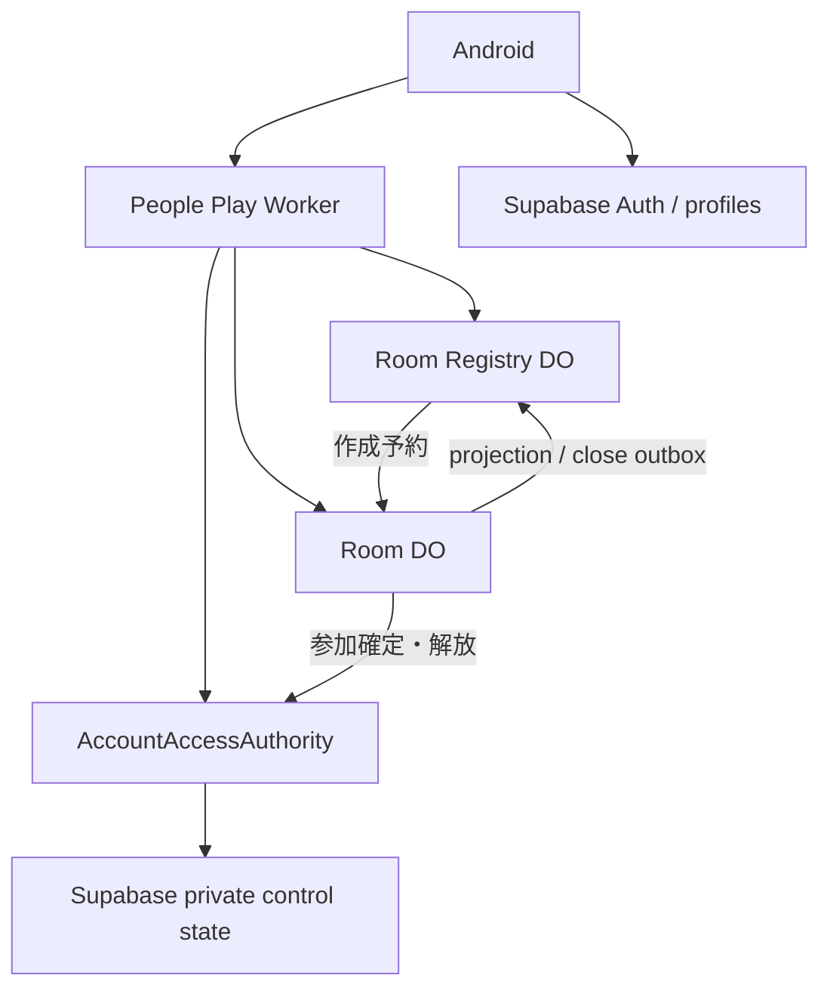
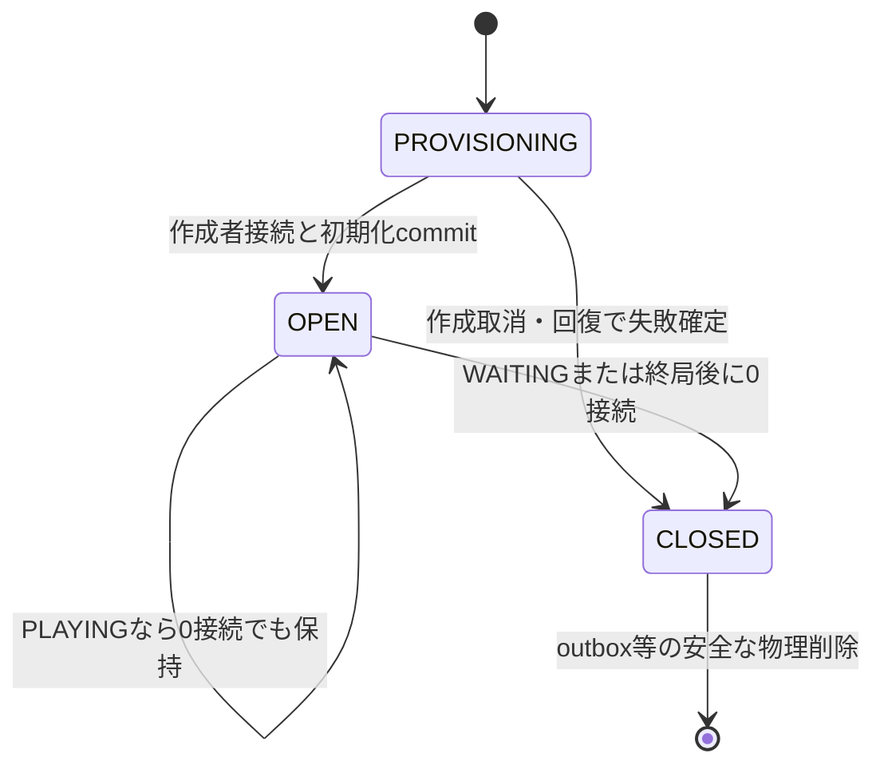
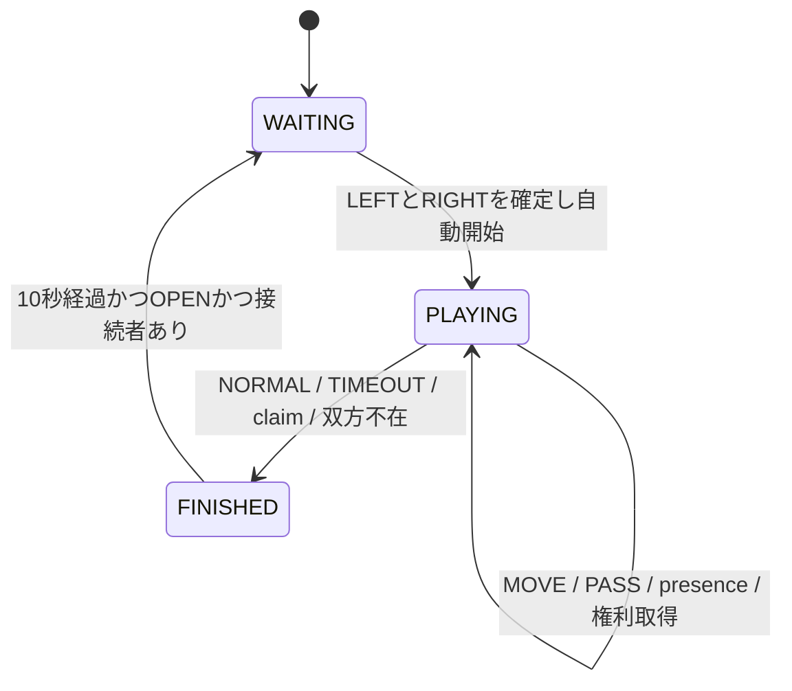
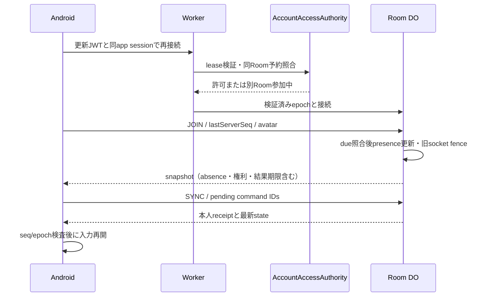

# 新ふたり対戦：Durable Object / WebSocket 詳細設計

更新基準日：2026-09-28（JST）。今回 `git fetch origin main` で取得した開始時 remote main：`1c613f88d356de5849bcdbb3e7bc3ae3daa3b774`（設計書PR #112マージ後）。初版のコード調査基準は `b17d063c411cbd2ff59bb08f6866fe2023cc6770`。今回も現行認証・設定・本文を確認し、過去SHAを開始地点に固定していない。

本書は設計案であり、コード、Cloudflare設定、DB、既存画面を変更していない。「確定」は依頼で与えられた外部仕様、「推奨」は実装方式の提案、「未決」は外部仕様または実環境の確認が必要な事項を表す。未決事項に仮の本番動作を割り当てない。

## 1. 目的と非目的

カジュアルな共有部屋で、観戦者と2人の着席者が同じサーバー状態を見る。初期は各人10分、通常8×8、黒先手、自動開始・自動パス。入室と着席を分離し、席は常にLEFT/BLACKから埋める。作成者は作成直後に自動着席するが、その後のhost privilegeは持たない。

今回確定した仕様は、自由着席、WAITINGの即時席解放、PLAYINGのabsenceと継続時計、60秒で発生する永続的な離脱負けclaim権、双方60秒不在のNO_CONTEST、FINISHED 10秒、部屋再利用、接続中人数による閉鎖、後発ログイン拒否、1アカウント1Room、セッション単位avatarである。本文の旧未決記述を置き換える。

新方式はWorker + Room Durable Object（Room DO）+ WebSocket。Supabaseは認証・プロフィールに加え、本書で提案するアプリログイン/参加排他の制御用stateを担う。盤面・時計・対局結果のリアルタイム正本はDOから移さず、Supabase Realtimeは使わない。

本更新はMarkdownのみ。コード・DB・migration・wrangler・テスト・Compose・アセットは変更しない。右上「⋮」の仕様だけを設計に追加する。rating、random matchmaking、自由チャットは非対象。リアクション、投了、観戦禁止、時間選択、結果保存先、再戦専用UIは将来仕様である。新ゲームへの自動準備と再着席は今回の確定範囲であり、再戦専用UIとは別。

## 2. 現行構成の調査結果

以下のパスはリポジトリルート相対。ファイルに記述された状態と、未確認の本番環境を区別する。

| 調査対象 | 実際に確認した内容 | 新方式への扱い |
|---|---|---|
| `app/src/main/kotlin/com/example/othello/PeopleEnjoyHomeScreen.kt` | 対戦・イベント・交流のコールバックを持つ入口 | 対戦導線だけ新接続へ結ぶ |
| 同 `PeoplePlayLobbyScreen.kt` | `PeoplePlayLobbyRoom` は名前リソース、時間、対局中、観戦表示等を保持。`roomId` はない。20/15/10/5/3分のサンプル。テーブル作成は未接続 | デザインを維持し、サーバー一覧へのmapperを追加する |
| 同 `PeoplePlayRoomScreen.kt` | `PeoplePlayRoomUiState`、`RoomReferenceBoard` による固定表示。セル操作・離席は接続未実装 | 外側のstate/イベント接続を新設する |
| 同 `StandardModeNavigation.kt` | PEOPLE_HOME / PEOPLE_NAME_SELECTION / PEOPLE_MATCH / PEOPLE_ROOM / PEOPLE_SOCIAL。部屋へ渡すのは名前リソース・持ち時間で、roomIdではない | roomIdによる遷移が必要。戻る・システムBackは明示退出に統一（第9/32章） |
| 同 `PlayProfileSelectionFlow.kt`, `PendingPlayProfileStore.kt` | 現セッションUUIDに紐づく名前選択、保存待ち選択の再試行 | 名前準備の既存フローを再利用 |
| `core/auth/src/main/kotlin/com/example/othello/auth/Auth.kt` | `AuthGateway` と `UserSession(userId)`。アクセストークン提供portはない | UIにtokenを渡さない専用portを追加する設計 |
| appの `AuthSessionController.kt`, `OnlineSessionViewModel.kt` | 認証StateFlow・排他・セッション破棄。単一SupabaseComponentと旧対局の寿命管理 | 同一認証基盤を利用。ログイン成功公開の前にアプリsession admissionが必要 |
| `data/supabase/src/main/kotlin/com/example/othello/data/supabase/SupabaseContracts.kt` | Auth / Postgrest / Realtimeを構築。`SupabasePlayProfileRepository` が自己UUIDの `play_profiles.display_name_id` と `play_display_names` を読む | 認証・表示名取得だけ再利用。新対局にRealtimeを使わない |
| `feature/profile/src/main/kotlin/com/example/othello/profile/Profile.kt` | `PlayDisplayName`, `PlayProfileLookup`, `PlayProfileRepository` | 表示名準備のドメインとして再利用 |
| `core/game/.../Board.kt`, `GameState.kt`, `TurnResolver.kt`, `Position.kt`, `CanonicalMoves.kt` | 純粋なKotlinの合法手・反転・パス・終局・座標・手順表現 | 第33章の共有候補 |
| `feature/match/.../OnlineMatchController.kt`, `OnlineMatchContracts.kt`, `MatchClock.kt`, `MatchStateMachine.kt` | 端末側ゲーム進行、P2P ACK、再同期、結果提出、再接続時計 | 新DO権威には持ち込まない |
| `core/network/.../MatchTransport.kt` | matchId / ply / previousStateHash / clockSnapshot / ACK等のP2P契約 | 汎用という名前でも新Room protocolへ流用しない |
| appの `WebRtcMatchCoordinator.kt`, `OnlineMatchRecoveryStore.kt` | transport生成、signaling、epoch、復旧checkpoint、結果確定の協調 | 不変条件だけ抽出する |
| `transport/webrtc/.../WebRtcContracts.kt` | Android WebRTC factory/transport、non-trickle ICE、STUN。TURN構成はない | 新経路は依存しない |
| `feature/matchmaking/.../Matchmaking.kt` とSupabase実装 | enqueue/cancel/claim、requestId、通知 | カジュアルなroom create/listには流用しない |
| `supabase/migrations/` | 旧queue / signaling / active participants / start ACK /結果・rating・replay検証 | 既存方式用。新方式の結果を旧RPCに投入しない |
| `cloudflare-admin/src/index.ts` | 管理API、アカウント削除、旧対局保守cron。service-roleを扱う | 公開対局Workerを分離する |
| `cloudflare-admin/src/research-validator.ts` | TypeScriptで既にリバーシの手順再生・hash計算がある | 検証資産として参照。第3の独立ルール実装を増やさない |
| `cloudflare-admin/wrangler.toml` | name=`othello-admin`, main=`src/index.ts`, compatibility_date=`2026-08-09`, 10分cron。DO binding/migrationなし | そのまま新対局の設定にはしない |
| `landing-page/wrangler.toml` | name=`chanriva`, main=`dist/server/index.js`, date=`2026-08-13`, nodejs_compat, ASSETS,独自ドメイン。DOなし | Webサイト配信と対局責務を分離 |
| `docs/02_オンライン対局/通常接続設計.md`, `再接続設計.md` | 旧接続・同期・復旧・終了の契約 | 第3章の不変条件比較に利用 |

`core/game/build.gradle.kts` は現在JVMのみ。mainソースのルールはAndroid/JVM固有APIに依存しないが、そのままWorkerで動く成果物ではない。ルートはKotlin 2.2.10。`data/supabase/build.gradle.kts` はSupabase BOM 3.6.0、Ktor OkHttp 3.2.3。新transportの依存は既存バージョンに揃えて検証する。

Supabase接続先は既存設定にある `https://zgzllmaoyymoeiqtybck.supabase.co`。`supabase/config.toml` はproject_idとPostgres 15等を記載するが、本番JWT署名方式を証明しない。リポジトリ内には `play_profiles` / `play_display_names` のDDLを確認できなかった。本番テーブルの不在を意味しない。RLS、grants、user_id一意制約、FK、非active名称の既存所有者による参照は実装前に読み取り確認が必要。既存の `profiles.display_name` とちゃんりばネームは同一視しない。

今回再確認したAuthGatewayはUUIDだけを公開し、SupabaseAuthGatewayはSDKのAuthenticatedをそのままdomainへ変換する。AuthSessionControllerはsignIn・復元・sessionStatus購読からAuthenticatedへ遷移するため、signInボタンの後だけ排他確認を足しても抜け道が残る。現行コード/configにはアプリsession leaseやactive roomの排他authorityを確認できない。PostgrestのrequireValidSession=trueはJWT保持の確認であって後発ログイン拒否ではない。第23章で全入口とサーバー認可の改修を後続Phaseに定義する。

Cloudflare accountのプラン、実際のdeploy済みbinding、Supabase本番の鍵・RLSは調査していない。「設定ファイルにDOがない」と「アカウント全体にDOが存在しない」は別である。

## 3. 旧方式の責務整理

旧方式ではSupabaseがmatchmaking・signaling・開始合意・結果保存、WebRTCがプレイヤー間配送、Android controllerが盤面・時計・ACK・同期を担当する。`publish_match_signal_v2`、`match_signals_v2` のRealtime購読と補助SELECT、epoch付き開始ACK、結果のSQL replay等はその方式のために存在する。

失ってはいけないものは技術分割ではなく、次の不変条件である。

| 不変条件 | 新方式での実現 |
|---|---|
| identityと表示名を混同しない | 検証済みSupabase UUIDをparticipantキーにする |
| 応答が届かないことは未処理の証明ではない | 永続command receiptと再同期 |
| 再送は状態を二重に進めない | DO内の原子的commitとidempotency |
| 古い接続が現接続の状態を破壊しない | connection generationによるfencing |
| 同じ対局の終局を取り消さない | gameIdごとのresult一意。Roomは別gameIdで再利用 |
| clientが通信障害から勝敗を推測しない | DOがpresence・60秒権利・claim・timeout・NO_CONTESTを確定 |
| 認証切替で前ユーザーの操作が混ざらない | session所有のrepository、破棄と再認証 |
| 復旧は整合した盤面・手番・時計をまとめて扱う | version付きsnapshot |

旧 `OnlineMatchController` の5分既定、45秒猶予、1.5秒debounce、旧epoch回数、peer ACK、rating、旧active-match排他は外部仕様ではない。新方式へコピーしない。`MatchTransport` のprotocolVersion=2とも別のprotocolを作る。

## 4. 新方式の全体構成



新設案は `cloudflare-people-play/`。gateway、RoomRegistry、Room DO、AccountAccessAuthority adapterを配置する。管理Worker/landing-pageから分離する。既存wranglerに新bindingがあるとは扱わない。

**推奨する排他authorityはSupabase PostgreSQLの非公開control state**。AccountAccessAuthorityの下にLoginSessionAuthorityとActiveRoomRegistryを置き、認証UUID単位の行ロック/一意制約でログインと参加予約を直列化する。既存アプリがPostgRESTへ直接アクセスする構成なので、DB側認可も同じsession stateを参照できる方式を第一候補にする。WorkerメモリやRoom単位のロックではアカウント全体を排他できない。Phase 0でAPI/RLS/運用を検証し、別方式へ変える場合も同じ不変条件を維持する。

Room Registryは一覧とcreate intentの正本。ActiveRoomRegistryはUUID→参加中roomIdの正本で、名前が似ていても別責務である。Room DOはゲームと部屋内membership/presenceの正本。DOとDBには分散トランザクションがないため、予約・fence・確定・解放のsagaで結ぶ（第12/23章）。

## 5. 責務境界

| コンポーネント | 所有するもの | 所有しないもの |
|---|---|---|
| Composable / UI mapper | 表示とcallback、⋮のenabled/disabled/秒数 | token、通信、権利・勝敗の判定 |
| state holder | 接続状態、表示時計/absence秒数、pending、結果close | サーバーの10秒期間 |
| PeoplePlayRepository / transport | HTTP/WS、snapshot reducer、再送、復旧 | optimistic盤面、席順推測 |
| Worker gateway | JWT検証、admitted session確認、profile、入力制限 | gameの正本、独立したログインlock |
| LoginSessionAuthority | 先着アプリログイン、lease、世代、失効とfence | gameの勝敗、avatar選択 |
| ActiveRoomRegistry | UUIDの単一参加予約、membershipEpoch、解放receipt | 席・手番・部屋内人数 |
| Room Registry DO | create intent、一覧projection、閉鎖tombstone | 着手権限、アカウント排他 |
| Room DO | membership/presence、席、ゲーム、権利、時計、10秒、閉鎖、永続receipt/seq | UI、rating、名前のidentity化 |
| SharedRules | 合法手、反転、パス、通常終局 | absence、時計、認証 |
| ResultSink（将来） | gameId単位の冪等結果保存 | FINISHED成立条件 |

外部HTTP/DB待ちをRoom storage transactionに入れない。権限確認結果を使う際は有効期限・sessionEpoch・membershipEpochをcommit時に再確認する。authority間の失敗はoutbox/回復照合へ閉じ込め、未確認の新規参加や二重ログインを成功扱いにしない。

## 6. ドメインモデル

| 型 | 内容・制約 |
|---|---|
| RoomId | サーバー発行。表示名とは別。CLOSEDのIDを再利用しない |
| AuthenticatedUserId / DisplayName | 検証済みSupabase UUID / play_profiles由来の重複可能な表示名 |
| AppLoginSession | server発行appSessionId、検証済みauthSessionId、sessionEpoch、leaseUntil、状態。UUIDに高々1つ有効 |
| AppRunId | アプリ起動単位。ログインlease/tokenとは別。WS再接続/画面回転で変えない |
| AvatarChoice | ADULT_MAN（成人男性）/ ADULT_WOMAN（成人女性）/ BOY（男児）/ GIRL（女児）/ MAGIC_WAND（魔法の杖）/ MAGIC_BOOK（魔法の本）。AppRunId内で初回create/join時に選択し再利用。DBへ保存しない |
| ActiveRoomMembership | UUID、roomId、membershipEpoch、RESERVED/ACTIVE/RELEASING、operationId |
| Participant | room内UUID一意。JOINED/LEFT、表示名、AppRunId/avatar、participantRef。offlineでもidentityを増やさない |
| Seat | LEFT/RIGHT、owner、個別version。両席全体のseats.versionをexpectedSeatVersionと照合する。WAITINGにRIGHTだけ存在させない |
| GamePlayers | gameIdに固定したblack/whiteのUUIDと表示snapshot。FINISHEDでseatを空にしても結果の対戦者は保持 |
| PlayerColor | LEFT=BLACK=先手、RIGHT=WHITE。毎ゲームの着席順で決まる |
| RoomStatus / GameStatus | OPEN/CLOSEDとWAITING/PLAYING/FINISHEDを分離 |
| PlayerPresence | ONLINE/ABSENT、absenceStartedAt、absenceEpoch、claimDueAt。手番と独立 |
| DisconnectForfeitRight | gameId、holder UUID、target UUID、acquiredAt、sourceAbsenceEpoch。取得後は終局まで取消しない |
| TimeControl / ClockState | 初期600000ms/人。remaining、runningColor、turnStartedAt、deadlineAt、clockVersion |
| BoardState / Move | 8×8、turn、corePly（pass含む）、moveSeq（着石のみ） |
| GameId / RoundEpoch | 開始ごと新gameId。WAITING世代RoundEpochは古い着席要求を次ゲームへ適用しないための技術的識別子 |
| CommandId / ServerSeq | UUID+commandIdで永続dedupe。room lifetime全体のseqはWAITING復帰でも戻さず、wireは文字列 |
| GameResult | gameId、finishReason、outcome、winner、石数、finishedAt、decidedAt |
| FinishedWindow | finishedEnteredAt、finishedUntil=finishedEnteredAt+10000。論理終局時刻と表示期間開始を分離 |
| ConnectionMembership | appSessionId/epoch、membershipEpoch、AppRunId、connectionId/generation、認証/生存期限 |
| CommandReceipt | UUID+commandId、payload digest、結果、appliedServerSeq、gameId/roundEpoch |

**GameResult整合制約：**

| finishReason | outcome | winner |
|---|---|---|
| NORMAL | BLACK_WIN / WHITE_WIN / DRAW | BLACK / WHITE / null |
| TIMEOUT | BLACK_WIN / WHITE_WIN | 時間切れ側の相手 |
| DISCONNECT_FORFEIT | BLACK_WIN / WHITE_WIN | 有効claimを確定した側 |
| DOUBLE_DISCONNECT | NO_CONTEST | null |

DRAWとNO_CONTESTは異なる。winner=nullだけで集計・表示を分岐しない。NO_CONTESTは将来の通常勝敗・引分集計から除外する。席とGamePlayersを分けることで、終局時の自動離席・結果表示・次の対局の色決定を両立する。

## 7. Room state machine / lifecycle



PROVISIONINGは内部作成処理で、公開Room状態ではない。OPENで1人以上の現在接続中memberがいれば、作成者や対戦者がいなくても維持する。WAITINGの観戦者だけの部屋も有効。PLAYINGで0接続になっても、時計・双方60秒不在の判定を継続し、終局前に削除しない。

**閉鎖とFINISHED保持は別の軸にする。** 依頼には「FINISHEDは必ず10秒」と「終局後0人なら即閉鎖」の両方があるため、0人ならRoomを即CLOSED・新規入室不可・一覧から除外しつつ、内部の確定game/resultはFINISHEDのまま少なくともfinishedUntilまで保持する。10秒より前にWAITINGへ戻したり同roomIdを再作成したりしない。memberのいるOPEN Roomは必ず10秒を経てWAITINGへ戻す。全員が結果UIを閉じただけならconnectionは残るので閉鎖しない。

CLOSEDのsnapshot取得やJOINは拒否する。close commitにregistry tombstoneと全membership解放outboxを含める。一覧の論理削除は即時要求とし、配送遅延中のGET一覧はRoomの現状態を確認してCLOSEDを除外する（第11章）。物理storage削除の時期は、receipt/outbox/結果保存の保守要件と別問題である。

## 8. Game state machine



absenceはPlayerPresenceでありGameStatusをPAUSEDへ変えない。WAITINGでは時計停止、初期盤面、gameId=null。2席が揃うと新gameId、固定GamePlayers、黒手番、各10分を同時確定する。FINISHEDへの入口はgameIdごとに一回だけ。

FINISH commit時に両seatを空け、接続中の元対戦者を観戦者へ移す。10秒間は最終盤面とresult/GamePlayersを保存し、着席を拒否する。新規観戦入室はOPENであれば許可。10秒後にOPENかつ接続者ありならroundEpochを進め、初期盤面・空席・gameId=nullへ戻す。過去のresult/GamePlayers/absence/rightsを新ゲームのactive stateへ引き継がない。古い結果は別gameIdの履歴として扱う。

0接続なら第7章の閉鎖処理を適用する。Roomが再利用されても過去gameIdはFINISHEDのままであり、同じ対局をWAITINGへ巻き戻す意味ではない。

## 9. Participant / Seat / presence model

| 操作・現象 | membership / 接続 | Seat / gameへの効果 |
|---|---|---|
| 作成者の初回接続 | create予約からJOINED | 自動LEFT/BLACK。以後は特権なし |
| 通常入室 | UUID再利用、現在connectionを関連付け | 観戦者。PLAYING中の元player復帰だけ当該GamePlayersへ再関連付け |
| WAITING 離席 | JOINED/onlineのまま | 即空席、本人は観戦者 |
| WAITING 退出/戻る/Back | LEFT、connection detach | 席も同時解放 |
| WAITING 通信断 | 即offline、人数から除外 | 席を即解放。60秒保持なし。再JOINは観戦者 |
| PLAYING 離席 | 操作無効 | サーバーでも拒否 |
| PLAYING 退出/戻る/Back | 明示membership終了、offline | player absence開始。GamePlayers/対局上の席は終局まで保持 |
| PLAYING 通信断/アプリ終了 | offline、identityは保持 | 同じplayer absence開始。時計継続 |
| PLAYING 復帰 | 同UUID・有効session・参加排他を検証 | 元GamePlayersへ復帰。権利は取消さない |
| FINISH | 部屋にonlineなら観戦者 | 両seat自動解放、結果用GamePlayersは10秒保持 |
| 観戦者の通信断 | 即offline、観戦人数から即除外 | 60秒ルールなし |
| 観戦者の退出/戻る/Back | 確認なしでmembership終了 | 最終接続者ならphaseに応じ閉鎖 |

membership（その部屋への参加関係）、presence（現在の接続）、game player（そのgameIdの対戦者）を分ける。通信断中のmembership記録を保持しても人数には含めない。部屋が存続する間のoffline membershipは第12章の参加lockに残し、明示退出またはRoom閉鎖で解放する。WAITING席の保持ではない。Roomをまたぐ際に未確認のdisconnectだけで勝手に移動しない。

現在接続中人数は認証・session lease・connection generationが有効でJOIN済みのUUID数。socket本数ではない。観戦人数はそのうちseat playerでない人数。PLAYINGで明示退出したplayerのgame recordは他Roomへの参加membershipとは区別され、元Roomへ戻る場合は先に現在Roomを退出する。

avatarは初回create/join前に6種類から1回選ぶ。AppRunId内で再接続・別Room移動・対局再利用を跨いで同じ値を使い、アプリ終了後の新AppRunIdでは再選択する。プロフィールDBやaccount control DBに保存しない。Room表示に必要なavatarIdはconnection attachment/参加表示cacheに持ち、再起動後は有効clientの再提示で復元する。identity/権限には使わない。

## 10. 部屋作成フロー

0接続の公開WAITING roomを作ってしまうと即閉鎖仕様に抵触するので、**HTTP作成予約と接続を伴う作成完了を分離**する。

1. Androidはadmitted app sessionとprofileを確認し、AppRunIdのavatarを初回だけ選択する。createCommandIdを保存する。
2. POSTでRegistryにcreate intentとroomIdを予約する。ActiveRoomRegistryはUUIDに別Room参加がないことを原子的に検査し、このroomIdをRESERVEDにする。
3. HTTPは202（PROVISIONING、roomId、接続先）を返す。この段階を「部屋作成完了」と表示せず、一覧にも出さない。応答喪失は同commandで照合する。
4. 作成者が認証付きWSでJOIN_ROOMとcreateCommandIdを送る。Roomはcreate intent、参加予約、現session、profile、avatarを検証する。
5. **作成者のonline membership + LEFT/BLACK + WAITING初期盤面 + OPEN + seq + receipt + projectionを同一Room commitで確定**する。これが部屋作成の完了点で、再度「着席する」を要求しない。
6. 参加予約をACTIVEへ確定する。予約中でも他Roomは拒否されるため、DB/Room間の応答喪失で二重参加は起こらない。ROOM_CREATED effect/snapshotで成功を通知する。

create keyはUUID+createCommandIdで永続dedupe。異なる内容の再利用は拒否し、成功後再送で同じroomIdを返す。WS接続が一度も来ない予約は内部作成失敗の回復処理で取消し、room側に旧予約fenceを置いてから参加予約を解放する。予約TTLだけで別roomIdを許可しない。作成後のclose/退出は全員と同じ規則で、作成者だけの維持権や終了権を設けない。

## 11. 部屋一覧フロー

RoomRegistry DOはroomId、nameKey、RoomStatus、GameStatus、左右席、接続中観戦人数、TimeControl、sourceServerSeq、updatedAtを永続保存する。同名部屋を許容し、roomIdで識別する。namespace列挙やWorkerメモリを一覧の正本にしない。

Roomの一覧関連commitでprojection outboxを更新し、RegistryはroomIdごとの新しいseqだけを採用する。FINISHEDの10秒は「FINISHED / 結果表示中」を返し、席が空でもWAITINGと推測しない。WAITING復帰のcommit後だけ一覧をWAITINGへ変える。観戦者通信断・FINISH時の観戦者化も人数projectionへ反映する。

単なる結果整合cacheだけでは「閉鎖roomを一覧から消す」「10秒中にWAITINGを先行表示しない」を満たせない。初期GET一覧はRegistryの候補をbounded batchでRoomのmetadata/reconcileへ照会し、応答した現在stateで表示・補修する。CLOSEDは除外し、到達不能は古いOPEN/WAITINGを正しいものとして返さず一時取得不能として扱う。応答直後の状態変更までは原子的な全Room snapshotにできないため、JOIN/着席時にもRoomで再検証する。

閉鎖tombstoneは遅い旧projectionで復活させない。Room listから消す時点は確定済みで、未決なのは細かな並び順、page/cursor方式の詳細、更新頻度、表示preview順である。将来cache-only化するなら表示整合性の許容値を別途合意する。

## 12. 入室フロー / one-account-one-room

### 12.1 単一権威と永続予約

**ActiveRoomRegistryをUUID単位のサーバー権威にする。** 推奨実体はSupabase private control table（第23章のアカウント行に紐づく）。roomIdの唯一性を各Room DOから独立に検査するだけでは、A/B同時JOINが両方成功してしまうため不可。

| 現状態 | 要求 | 結果 |
|---|---|---|
| FREE | AへJOIN/create | 行ロック下でAをRESERVED、membershipEpochを増やす |
| AがRESERVED/ACTIVE | Aへ同session再接続 | 同参加の復旧。新participantを作らない |
| AがRESERVED/ACTIVE | BへJOIN/create | ALREADY_IN_ROOM。Aのstateやsocketを変更しない |
| AをRELEASING | BへJOIN | 解放確認まで拒否/再試行。先にBを許可しない |
| Aの正式解放完了 | BへJOIN | Bを新epochで予約可能 |

ログインも参加もadmitted sessionのみ実行可能。同時A/B予約は同じUUID行に対する原子的処理で一方だけ成功する。予約の所有者やepochをclient指定値だけで確定しない。

### 12.2 JOIN saga

Workerは認証・app lease・profileを検証し、ActiveRoomRegistryで参加を予約する。Roomは内部で伝えられたreservationId/epochを受け、現sessionと閉鎖状態を再確認し、JOIN/connectionをcommitする。続いてRegistry側をACTIVEにする。ACTIVE確定応答喪失中もRESERVEDは他Roomを排他する。通信失敗時はoperationIdで同じ処理を再開する。

再接続では同UUIDを再利用する。WAITINGで通信断により空いた元席は返さず観戦者。PLAYINGで当該gameIdのplayerなら元playerとして復帰。FINISHEDなら観戦者として最終盤面/resultを返す。Room CLOSEDなら新規作成せず拒否し、authorityの古い参照を閉鎖証明で解放する。

### 12.3 正式退出と解放順

LEAVE_ROOMはまずRoomでmembership終了、旧connection/参加epochをfenceし、PLAYINGならabsenceを開始する。そのcommit証明をもとにActiveRoomRegistryが同じroomId/epochだけを解放する。Roomの応答喪失時もoutboxで解放を再試行する。clientはlocal navigationを即実行してよいが、別Room JOINはサーバー解放完了まで成功しない。

明示退出後に別Roomへ参加しても、元gameIdのplayer/absence/rightは終局まで残る。これは二重Room membershipではない。元Roomに復帰するには現Roomを先に退出する必要がある。元Roomが終局しても、別Roomの新epochを古いreleaseで消さない。

一時通信断だけではRoomが存続している間の参加予約を自動で別Roomへ移さない。WAITING席は即解放し、人数は即減る。offline membershipは同Roomへの復帰または認証付き明示退出APIで整理できる。最後のconnectionを失ってRoom自体が閉鎖した場合は全membershipを解放する。PLAYINGで0接続のときは終局まで閉鎖しない。

未完了予約をTTLだけでFREEにしない。Roomへ照会し、未適用ならcancel fenceをRoomへ永続化、適用済みなら復旧/正式退出をcommitしてから解放する。照会不能中は安全側に排他を保持する。DB transactionやRoom mutation lockを保持したまま相互RPCを待たず、各段階を永続operationとして分離する。

## 13. 着席フロー / Seat lifecycle

**初期仕様は自由着席。部屋主承認、承認UI、APPROVE command、host権限は設けない。** REQUEST_SEATは許可待ち申請ではなく、条件を満たせばそのcommitで着席する要求である。SeatIntent/SeatGrantを内部型として使っても承認待ち状態は作らない。

Roomはonline JOINED、現session/membershipEpoch、WAITING、expectedRoundEpoch/seatVersion、他席に座っていないことを検査する。LEFT空ならLEFT/BLACKへ、LEFTがonlineで占有されているならRIGHT/WHITEへ確定し、同commitで自動開始する。clientに色や席を選ばせない。同時要求はDOの順序で先着LEFT、次RIGHT。

expectedSeatVersionが古い要求は競合エラーと最新snapshotを返す。clientは最新状態を表示し、必要なら新commandIdで着席を再要求する。古いpayloadを同じcommandIdのまま書き換えない。上記の着席順は成功した要求の順序であり、同じ古いversionの同時要求を両方成功させる意味ではない。

WAITINGで観測可能な席は「両方空」または「LEFTのみ」。RIGHTだけ、または両席が埋まったままWAITINGの状態を公開しない。左のdisconnectと次の着席が競合した場合、先にdisconnectが成立すれば旧左を外し、最新versionで成功する次の着席者がLEFTになる。右の着席・開始が先なら以後の左切断はPLAYINGのabsenceになる。型/transaction invariantでRIGHT-onlyを防ぐ。

WAITINGのLEAVE_SEATはseatを空にして観戦者へ、LEAVE_ROOM/Backは席とmembershipを同時解放、通信断は席を即解放する。作成者にも同じ規則を適用する。PLAYINGのLEAVE_SEATは拒否。FINISHEDで両seatは空、10秒間はREQUEST_SEATを拒否。次WAITINGでは誰でも改めてLEFTから着席でき、前回の席や色を予約しない。

## 14. 自動対局開始

WAITINGで2つの異なるUUIDの席が確定した瞬間、同じRoom transactionでPLAYINGへ遷移する。新gameId、GamePlayers、通常初期盤面、黒手番、各600000ms、黒時計、presence=ONLINE、権利なしをまとめて保存する。旧gameのresult/absence/権利を参照しない。

gameId発行・seat確定・start receipt・serverSeq・clock alarm予約は一つのcommit。再送はreceiptを返し、再JOINはsnapshotを返すだけでSTARTを重複させない。exactly-once相当とは効果が一回であることを指し、配送は重複し得る。開始/準備OK/peer ACKは不要。

expectedRoundEpochで前回WAITINGの遅延したREQUEST_SEATを拒否する。FINISHED→WAITINGの再利用は、同一gameIdのSTART再実行ではなく新しい着席サイクルである。

## 15. MOVE処理

message、close、alarm、認証fence、内部回復をRoomの同じ直列化境界へ入れる。外部認証/DB照会はtransaction外、採用するsession許可のepochと有効期限はcommit時にも検査する。

1. schema、現接続generation、JWT/app lease、membershipEpochを検証する。
2. UUID+commandIdのreceiptを検索する。同内容の既処理は元結果、内容違いはCOMMAND_ID_REUSED。現在手番/FINISHEDより先にdedupeするが他人のreceiptは返さない。
3. 第19章のdue照合を行う。期限を過ぎたtimeout/双方不在を無視して着手を通さない。
4. gameId一致、PLAYING、本人がGamePlayersかつ当該seat owner、online JOINED、本人手番、expectedMoveSeq、座標、合法性を検査する。
5. 手番側の経過時間を確定し、SharedRulesでMOVE→強制PASS→必要な通常FINISHを計算する。相手がABSENTでも合法手は許可する。
6. board、turn、moveSeq/corePly、clock、presence/rightの必要な期限更新、seq、effects、receipt、outbox、alarmを原子的に保存する。**MOVE/手番交代でabsenceStartedAtや取得済み権利を変更しない。**
7. 永続commit後にsnapshot/effectsとCOMMAND_RESULTを送る。送信失敗でundoしない。

合法性・勝敗・残り時間をclient申告から採用しない。拒否receiptのみでは盤面seqを進めない。client盤面のoptimistic updateは行わない。transaction callbackに外部送信を入れず、再実行で非冪等な副作用を起こさない。

## 16. PASS処理

client PASSは存在しない。SharedRulesのresolveForcedPassesを着手commit内で実行し、片方合法手なしなら自動PASS、両者なしならNORMAL終局とする。MOVE/PASS/FINISHはordered effectsに記録し、公開snapshotは整合した最終stateとする。

自動パスで同じ側が続けて打つ場合も消費時計を一度確定し、同じサーバー時刻から次手番を開始する。相手のabsenceは継続し、PASSは60秒カウントをリセットしない。パスを待つ間だけ時計を止める独自猶予は作らない。

## 17. FINISH処理 / claim / DOUBLE_DISCONNECT

### 17.1 結果の唯一の確定点

`PLAYING && currentGameId == requestedGameId && result == null` を共通finish境界で検査する。gameId一意のresult、FINISHED、時計停止、両seat解放、finishedEnteredAt/Until、seq、effect、outboxを同じcommitで保存する。

FINISH commitでclaim権を失効させ、以後のself.canClaimはfalseとする。権利取得の診断履歴を保持しても行使可能な権利として返さない。時計は論理終局時刻までの消費を確定して停止し、遅延したalarmの処理待ち時間を追加消費させない。

| finishReason | 成立条件 | outcome |
|---|---|---|
| NORMAL | SharedRulesの通常終局 | 石数でBLACK_WIN/WHITE_WIN/DRAW |
| TIMEOUT | runningColorの期限到達 | 相手のWIN |
| DISCONNECT_FORFEIT | server確定済み権利を持つ本人の有効claim | claim側のWIN |
| DOUBLE_DISCONNECT | 両playerが現在ABSENTかつそれぞれ連続60秒以上 | NO_CONTEST、winner=null |

clientは勝敗を確定しない。TIMEOUT/離脱でも現盤面の石数を保存し、64対0等へ書き換えない。DRAWはNORMALの石数同数のみ。NO_CONTESTを通常引分として表示・集計しない。将来投了は別finishReasonとして追加し、退出からRESIGNを推測しない。

### 17.2 単独absenceと権利

PLAYINGのplayerがonlineでなくなったRoom確定時刻をabsenceStartedAt、期限を+60000msとする。原因（EXPLICIT_LEAVE、BACK、SOCKET_CLOSE、LIVENESS_EXPIRED、AUTH_EXPIRED等）は診断用に残せるが、ゲーム上は共通absence処理である。重複closeで開始時刻を更新しない。

60秒連続ABSENTで、相手playerがRoomでonlineなら、その相手に対象UUIDへのDisconnectForfeitRightを永続付与する。単独不在だけで自動敗北にはしない。期限時に相手もofflineなら、その時点では新権利を付与しない。相手が後に復帰し、対象がなお60秒以上連続不在なら、その再評価で権利を付与する。両者とも60秒を満たしていたなら先にNO_CONTESTを確定する。

60秒未満の復帰はabsence区間を閉じ、権利を作らない。再切断は新absenceEpochで0秒から計測。60秒を満たす復帰では、復帰presenceを変更する前に経過済み期限を照合して権利を記録する。alarm遅延で本来の権利を失わせない。

一度取得した権利はそのgameIdのFINISHまで保持する。対象の復帰、通常対局続行、holderの切断、手番変更で消さない。双方が別々の不在区間で権利を持つことも正常である。

### 17.3 明示claim

CLAIM_DISCONNECT_FORFEITはcommandIdとgameIdを持つ。Roomは有効認証/session、現参加・online connection、本人が現在gameのseat player、gameId一致、PLAYING、対象相手への保存済み権利を検証する。対象が現在onlineでも権利があれば有効。holderは復帰してから操作できる。手番は問わない。確認ダイアログなしで送信し、server確定を待つ。

期限照合後、最初にfinish transactionを成立させたclaimだけが勝つ。もう一方の新commandはGAME_NOT_PLAYING等で拒否。初回成功claimの同command再送は元receiptを返すだけで再終局しない。前gameIdの権利/claimは次ゲームに使えない。

### 17.4 双方不在と10秒期間

両者がABSENTになった瞬間には終局しない。両方の現在absenceStartedAt+60000を満たす最初の時刻、すなわち両期限のmaxがDOUBLE_DISCONNECTのdueAt。どちらかがその人の60秒前に戻れば両者条件は解消する。権利取得履歴ではなく「現在の連続不在」を検査する。

NORMAL、TIMEOUT、claim、DOUBLE_DISCONNECTは先に有効成立した結果だけを採用する（期限競合は第19章）。finishedAtは論理成立時刻、decidedAt/finishedEnteredAtは実際のcommit時刻。結果表示期間は `finishedEnteredAt + 10000` を使い、遅延alarmで表示期間を短縮しない。

10秒間、OPEN Roomでは元playerも新規入室者も観戦者として最終盤面/resultを見る。結果UI closeはlocal操作だけ。10秒後に接続者ありならWAITINGへ初期化し、active result/absence/rightsを破棄する。0接続は第7章の即閉鎖・内部FINISHED保持を適用する。過去resultの外部永続保存は将来ResultSinkへ分離する。

## 18. Clock設計

TimeControlは初期FIXED_TOTAL=600000ms/人。将来20/15/5/3分をpresetとして追加できるが、時間選択API/UIや加算を先行しない。正本はblack/whiteRemainingMillis、runningColor、turnStartedAt、deadlineAt、clockVersion。

**absence中も手番側の時計を止めない・延長しない・巻き戻さない。** 相手不在でもonline側は自分の手番なら打てる。着手後に不在側の手番になればその時計が進む。ゲーム全体のpauseやClockInterruptionPolicyによる停止分岐は設けない。

手番表示は `max(0, remaining - max(0, serverNow - turnStartedAt))`。MOVE成立時に消費分を確定して次手番のdeadlineを予約する。WAITING/FINISHEDは停止。presenceの切替や60秒権利付与はclockVersion/turnStartedAtを変えない。

DOはepoch millisecondsを保存し、負の経過は0へ抑えて異常を記録する。AndroidはserverNowと単調時計で見た目のみ補間する。clientの0表示はTIMEOUT確定でもclaim権付与でもない。毎秒broadcastは行わない。server処理時刻で期限を裁定する技術案を用い、ネットワーク遅延のclient自己申告で持ち時間を補償しない。

## 19. Timeout / absence / FINISHED scheduler

Cloudflare DOのalarmは1 DOに一つ、at-least-onceで重複し得る。自動retryも有限であるため、永続due taskの最短期限を予約し、alarmに加えて各message/JOIN/close/reconcile入口で期限を照合する。[F1]

| task | dueAt / guard | 効果 |
|---|---|---|
| CLOCK_TIMEOUT | turnStartedAt+手番remaining、gameId/clockVersion一致 | TIMEOUT |
| ABSENCE_THRESHOLD | 各absenceStartedAt+60000、gameId/absenceEpoch一致 | 条件を満たすonline相手に権利付与。単独敗北にしない |
| DOUBLE_ABSENCE | 両現在不在期限のmax、両absenceEpoch一致 | DOUBLE_DISCONNECT / NO_CONTEST |
| FINISHED_EXPIRES | finishedEnteredAt+10000、gameId/phaseVersion一致 | OPENかつ接続者あり→WAITING、0人→CLOSED |
| CONNECTION/SESSION_EXPIRY | 接続生存・JWT・app grantの期限/世代 | offline化、phase別席/absence処理 |
| OUTBOX / RECOVERY | 次retryAt、operationId | 一覧・参加解放・結果境界の再送 |

schedulerはdue taskを永続管理し最小dueAtをsetAlarmする。済んだtaskを消すかversionを進め、次を予約する。FINISHでclock/absence taskを無効化しても、10秒taskや解放outboxを消さない。WAITING復帰後に旧alarmが届いても旧gameId/epochで無効になる。

**競合順序の技術案：** Room入口の裁定時刻tを固定し、t以前に成立する自動期限をdueAt順で照合してから外部操作を適用する。absenceの権利取得は終局ではない。遅れたalarmでも、先に到達していたTIMEOUTやDOUBLE_DISCONNECTをclientの後着claim/MOVEで上書きしない。同一dueAtの自動候補は永続taskOrderで直列化し、最初の有効FINISHだけを採用する。通常終局/claimはそれぞれ有効commandがこの境界に到達した時刻を用いる。この順序を試験可能な契約とする。

接続復帰/切断も同じ入口を使う。復帰前にdueを照合するため、60秒ちょうどの復帰は「60秒未満」にはならない。手番変更はabsence taskの期限を変えない。双方不在条件が崩れたtaskやFINISHED後のclaimはguardで拒否する。

state/receipt/seq/scheduleとalarm予約を整合して保存する。選定するSQLite storage transaction APIでrollbackと再起動を検証し、同期callbackで非同期APIを実行しない。constructorで無条件にsetAlarmを上書きしない。[F3]

alarm遅延・長期障害にはRegistry/制御authorityの回復走査と次入口で対応する。実時刻ぴったりの配信は保証できないが、期限前の権利/WAITING遷移を許さず、復旧時に永続期限から正しい状態へ収束させる。10秒は論理期間として固定し、client都合で短縮しない。

## 20. WebSocket lifecycle

1. **authenticate**：既存Supabase JWTとadmitted app sessionを検証。別端末の新sessionはログイン時点で拒否されるためRoomで後勝ち置換しない。
2. **reserve/join**：ActiveRoomRegistryで同Room参加を確保し、Roomがmembershipとconnection generationをcommitする。認可前にstateを配信しない。
3. **message**：現JWT/app grantの期限とepoch、membershipEpoch、connection generation、操作権限を確認する。
4. **disconnect**：現世代だけをoffline化。WAITING playerは即席解放、PLAYING playerはabsence開始、spectatorは即人数から除外。0接続はphase別cleanupへ進む。
5. **explicit leave / Back**：同じoffline遷移に加えmembershipを正式終了して参加lockを解放する。PLAYINGでのゲーム上の効果はdisconnectと同じabsenceであり投了ではない。
6. **reconnect**：同有効app sessionの再認証を許可し、UUIDで既存participantを再利用する。phaseに応じ席/観戦stateを復元する。
7. **connection replacement**：同一の有効app sessionによるtransport再接続だけ、新generationに切替える。新接続をatomicにattachし旧世代をfenceするため、後着の旧closeでabsenceを再開始しない。別ログインsessionをこの経路で置換しない。

ONLINEはserverで認可済みconnectionが生存と判定される状態。アプリ強制終了・電波喪失はclose通知が直ちに来るとは限らないため、ping/pong等の生存期限を設ける。presence検知時刻からabsenceを始め、client申告の切断時刻で遡らせない。heartbeat周期/失効時間は運用値としてPhase 0で確定し、60秒のゲーム猶予と別にする。hibernationでも生存確認が止まらない方式を試験する。

JWT/app grant期限後は操作と配信を停止し、expiry handlerでphase別offline処理を行う。SDKによるtoken更新と同session再接続は許可。tokenやrefresh tokenをsocket URL/attachmentに保存しない。auth/session lease失効と単なるsocket再接続は区別し、アカウント全体の有効sessionをsocket closeだけで即解放しない。

## 21. WebSocket protocol

新方式専用protocolVersion=1。旧P2P v2とは独立する。schema/size/versionを検査し、未知commandを拒否する。frame上限・頻度は運用configであり製品上の観戦人数上限ではない。

| client → server | 必須情報・意味 |
|---|---|
| JOIN_ROOM | commandId、AppRunId、avatarId、lastServerSeq。create時のみcreateCommandId。sessionは認証contextで結ぶ |
| SYNC_REQUEST | requestId、lastServerSeq、上限付きpendingCommandIds |
| REQUEST_SEAT | commandId、expectedRoundEpoch、expectedSeatVersion。WAITINGの自由着席 |
| LEAVE_SEAT | commandId、expectedRoundEpoch、expectedSeatVersion。WAITINGだけで観戦者へ戻る |
| LEAVE_ROOM | commandId、expectedMembershipEpoch、cause。membership終了。PLAYINGならabsence |
| MOVE | commandId、gameId、expectedMoveSeq、row/column |
| CLAIM_DISCONNECT_FORFEIT | commandId、gameId。保存済み権利を明示行使 |

```json
{
  "protocolVersion": 1,
  "type": "CLAIM_DISCONNECT_FORFEIT",
  "commandId": "88242fbd-4a92-4aba-ab05-7aad08818f32",
  "gameId": "game-opaque-id"
}
```

claimに勝者・対象の不在秒数・権利true等を送らせない。対象は当該gameの相手から導く。確認ダイアログなしで送信するが、receipt/snapshotが返るまで勝敗表示を確定しない。clientのカウント0は送信権限の証拠ではない。

```json
{
  "protocolVersion": 1,
  "type": "JOIN_ROOM",
  "commandId": "8f42b812-b9bc-4abc-beca-7690632470dd",
  "appRunId": "aab2b003-2e56-4da8-9930-945ce0bf3d26",
  "avatarId": "MAGIC_BOOK",
  "lastServerSeq": "18"
}
```

```json
{
  "protocolVersion": 1,
  "type": "MOVE",
  "commandId": "0f0a45fb-f1e8-49c8-8cfa-0776051780b5",
  "gameId": "game-opaque-id",
  "expectedMoveSeq": 0,
  "row": 2,
  "column": 3
}
```

| server → client | 意味 |
|---|---|
| ROOM_SNAPSHOT | 第28章の完全state。presence・権利・10秒期限まで復元可能 |
| ROOM_STATE | 完全snapshot + commit内ordered effects |
| COMMAND_RESULT | commandId、APPLIED/REJECTED、duplicate、appliedServerSeq、error |
| ROOM_CLOSED | 終了したRoomとreason、最終seq。表示画面を閉じる判断材料 |
| AUTH_EXPIRED / APP_SESSION_INVALID | 同session token更新またはアプリ再認証が必要 |
| CONNECTION_REPLACED | 同sessionの旧socketのみfence |
| PROTOCOL_ERROR | schema/version等 |

effectsはROOM_CREATED、MEMBERSHIP_CHANGED、SEAT_CHANGED、GAME_STARTED、MOVE_APPLIED、PASS_APPLIED、PLAYER_ABSENT、PLAYER_RETURNED、FORFEIT_RIGHT_GRANTED、GAME_FINISHED、ROOM_WAITING、ROOM_CLOSEDを候補とする。stateはsnapshotが正本、effectsは演出/通知補助。serverSeq/indexで重複演出を防ぐ。RIGHT確定とGAME_STARTED、GAME_FINISHEDと両席解放はそれぞれ同commitにまとめる。

```json
{
  "protocolVersion": 1,
  "type": "COMMAND_RESULT",
  "commandId": "88242fbd-4a92-4aba-ab05-7aad08818f32",
  "outcome": "APPLIED",
  "duplicate": false,
  "appliedServerSeq": "21",
  "error": null
}
```

error例：AUTH_REQUIRED、APP_SESSION_IN_USE、APP_SESSION_INVALID、ALREADY_IN_ROOM、PROFILE_REQUIRED、ROOM_NOT_FOUND、ROOM_CLOSED、NOT_JOINED、NOT_SEATED、NOT_YOUR_TURN、GAME_NOT_PLAYING、GAME_MISMATCH、FINISHED_WINDOW_ACTIVE、CLAIM_NOT_ELIGIBLE、STALE_ROUND、STALE_MEMBERSHIP、STALE_CONNECTION、STALE_MOVE_SEQUENCE、ILLEGAL_MOVE、COMMAND_ID_REUSED、RATE_LIMITED。既取得権利がないclaimや観戦者claimはserverで拒否する。

START、READY、PASS、FINISH、SET_CLOCK、APPROVE、RESIGN、CHAT、REACTION、CHANGE_TIMEは初期protocolに作らない。結果画面closeはlocal UI操作で、10秒を短縮するACK commandは存在しない。

## 22. HTTP API

実hostは実装時に確定。アプリsession admission用とRoom用を分離する。acquire/resumeは有効Supabase認証とそれぞれの取得・復旧証明を検証するbootstrap入口で、すでにadmittedなapp sessionを前提としない。provisional認証の自己破棄も最小例外とする。Room APIはadmitted session必須。

| endpoint案 | 内容 |
|---|---|
| POST `/v1/app-sessions/acquire` | Supabase認証後、アプリログインを先着で許可。後発は409 APP_SESSION_IN_USE |
| POST `/v1/app-sessions/resume` | 同authSession/端末resume proofで同lease復旧 |
| POST `/v1/app-sessions/renew` | 同session/epochだけlease更新 |
| POST `/v1/app-sessions/release` | 正式logout。旧Room接続fenceと連携 |
| POST `/v1/people-play/rooms` | createCommandIdで作成予約。timeは10分固定 |
| GET `/v1/people-play/rooms` | 検証済み一覧、cursor、取得時刻 |
| GET `/v1/people-play/rooms/{roomId}` | 現metadata、phase、closed確認 |
| GET `/v1/people-play/rooms/{roomId}/socket` | JWT/app session付きupgrade |
| POST `/v1/people-play/rooms/{roomId}/leave` | socketがない場合も明示退出可能。WS LEAVE_ROOMと同じhandler/receiptを使う |

createは接続前なので202 PROVISIONINGとroomIdを返す。作成者WS/JOINのcommitを作成成功にする（第10章）。同key再要求は同reservation/roomの現状態を返し、閉鎖済みならCLOSEDを返して部屋を作り直さない。

```json
{
  "createCommandId": "62a4b33c-bf20-4e5d-ab7b-7742318d277e"
}
```

```json
{
  "roomId": "server-generated-room-id",
  "creationStatus": "PROVISIONING",
  "roomType": "TEN_MINUTES",
  "timeControl": { "kind": "FIXED_TOTAL", "initialMillis": 600000, "version": 1 },
  "socketPath": "/v1/people-play/rooms/server-generated-room-id/socket"
}
```

HTTPはログインadmission・部屋発見・作成予約・切断中の明示退出、WSは入室確定後の順序あるゲーム通信を担当する。MOVE/claimを二重のHTTP経路に増やさない。離脱中でもRoom Aの正式退出を行えることが「先にAから退出してBへ」の要件を満たす。leave再送でBのmembershipを消さないようexpectedMembershipEpochを必須にする。

## 23. Authentication / single-login

### 23.1 現構成と標準機能の限界

現行SupabaseAuthGatewayはSDKのAuthenticatedをUUIDだけのUserSessionへ変換し、AuthSessionControllerはsignIn、signUp後、restoreSession、sessionStatus購読からAuthenticatedを公開する。lease取得の入口はない。token取得portも未公開なので、既存単一SupabaseComponent内にAccessTokenProviderとAppSessionGateway adapterを追加する後続設計とする。

Supabase標準のSingle session per userは後発を拒否する方式ではなく、最新ログイン側を残す方式で、反映もtoken refreshのタイミングに依存する。今回の要件には使えない。[S4] Supabase認証tokenが発行されたことと、アプリへのログインが受理されたことを区別する。

Phase 0では実projectの標準single-session設定も確認する。有効なら、provisional認証の発行だけで先発sessionを失効させ得るため、独自admissionと併用して要件を満たしたことにはしない。後続の移行作業で標準の後勝ち設定を無効にする等、先発を守る構成を確認してから公開する。今回は設定を変更しない。

### 23.2 推奨authorityと取得

**LoginSessionAuthorityの正本をSupabase PostgreSQL private schemaに置く。** UUIDに一意のadmitted session行を持ち、transactionで先着を取得する。既存profile等への直接PostgRESTアクセスも同じstateで認可できる点を重視する。authority adapterはWorkerに置くがWorkerメモリにlockを持たない。新migration/RPC/RLSは後続Phase 1Aであり今回は作成しない。

保存候補：user_id、app_session_id、auth_session_id、session_epoch、resume proof hashまたは端末公開鍵、lease_until、ACTIVE/DRAINING/RELEASED、operationId、fence/outbox。raw password/refresh token/avatarは保存しない。ActiveRoomRegistryも同じUUIDのtransaction境界で操作できる別recordとして配置する。

1. SDKで本人認証する。この時点のsessionはprovisionalで、アプリ画面や保護repositoryを有効にしない。
2. サーバーがSupabase tokenを検証し、UUIDと検証済みsession_idを得る。acquire transactionで空きなら新appSessionId/epochを確定する。
3. 既に他の有効sessionがあればAPP_SESSION_IN_USEを返す。既存rowの期限延長・上書き・既存端末logoutを行わない。同一operationの再送は同じ結果を返す。
4. Androidはacquire成功後だけAuthState.Authenticatedを公開する。購読経路/復元/signUp後も必ず同じadmission gateを通す。
5. 拒否された端末は自分のprovisional認証だけを破棄する。Supabase signOutのglobal scopeで既存端末を失効させない。現行signOut()の無指定呼び出しを流用せず、SDKのlocal scopeを確認して実装する。[S5]

これは「有効なアプリログインが1つ」の保証であり、認証サービス内にprovisionalなauth session/JWTが一瞬も作られないという保証ではない。拒否tokenでアプリ機能へアクセスできないサーバー認可が必須。

### 23.3 RLSとサーバー側強制

後発拒否をAndroid UIだけで実現してはいけない。新WorkerはJWTに加えauthorityのadmitted sessionを検査する。現在直接呼んでいるPostgREST/RPC/旧signaling等の保護経路も、検証済みauth.uid/session_idと有効app sessionが一致することをserver側で照合するmigration計画を立てる。admission/自己session解放だけはprovisional sessionにも必要な最小例外とする。

制御tableをclientから直接INSERT/UPDATE可能にしない。claimを手書きuserId/bodyで代用せず、最小権限RPC・固定search_path・明示EXECUTE権限・RLSを設計する。必要な内部fence完了通知はserver専用権限に限定し、管理Workerの広いservice-role共有を既定にしない。全アプリ経路を棚卸しし、古いclientがadmissionを迂回する状態ではsingle-login対応完了としない。

### 23.4 lease、再接続、失効

有効な同app sessionはtoken refresh/WS reconnectで同appSessionIdを保ち、resume proofとauthSessionIdを照合する。別authSessionId・別端末から「同じUUIDだからresume」とはしない。AppRunIdは起動単位で別管理するので、同login leaseを復元してもアプリ再起動後のavatarは再選択する。

lease heartbeat周期/期限はPhase 0でOS background動作と合わせて決める運用値。60秒absenceや10秒結果表示とは無関係。一時socket切断だけでlogin leaseを即解放しない。lease有効中の後発ログインは拒否する。期限後の安全な再取得には旧sessionをDRAININGへして、旧Roomのconnection/session epochをfenceしてから新sessionを許可する。旧端末がまだ接続可能ならその状態も照合し、単に新しいログイン要求が来たことを既存session失効理由にしない。

Roomへの認可grantにはsessionEpochと短いvalidUntilを持たせ、Roomはcommit/配信時に期限を確認する。失効時は該当Roomへinvalidateを送り、Roomは旧epochの操作・配信をfenceしてphase別disconnectをcommitする。**新sessionを有効化する前に旧grantの無効化ackまたは有効期限到達を確認**し、旧grantの遅延配送も最低許容epochで拒否する。期限待ちの場合も旧接続がONLINEに残らないようRoomでexpire処理を照合する。fenceの確認不能時は新sessionを成功扱いにしない。

lease失効後は既に有効でなくなったsessionの復旧であり、有効sessionの後勝ち追い出しではない。logout/account deletionもこのfence境界を通し、RoomはWAITING席解放/PLAYING absence/観戦者offlineを適用する。game resultを削除やlogoutだけで捏造しない。認証サービス障害時は新admissionをfail closedにする。

### 23.5 JWT / profile

現在のリポジトリだけでは本番署名方式を確定できない。初期案は固定Supabase projectへtokenを提示する検証（getUser相当）と、サーバー側で検証されたsession_idの照合。ローカルclaim decodeだけを信用しない。[S1][S2] 非対称鍵使用が確認できれば固定JWKS URL、alg allowlist、issuer/aud/exp/nbf、kidとbounded key rotationで検証する。HS256でanon keyを署名鍵にせず、秘密署名鍵を公開Workerへコピーしない。

Supabase access tokenの妥当性とapp sessionの有効性は両方必要。signOut/delete後も既発行JWTが期限まで使える点を考慮し、admitted rowとauth session存在を照合する。user_metadataを認可に使わない。

表示名は本人JWTのRLSでplay_profiles/catalogを解決する。名前重複は正常で、email由来名へfallbackしない。非active名称と名称更新反映時点は残課題。avatarはこのprofile照会やDBに混ぜない。

## 24. Authorization

| 操作 | 観戦者 | WAITING着席者 | PLAYING player | FINISHEDのmember |
|---|---|---|---|---|
| state受信 / SYNC | 可 | 可 | 可 | 最終盤面/resultを受信 |
| REQUEST_SEAT | WAITINGのみ自由着席 | 重複席不可 | 不可 | 10秒中は不可 |
| LEAVE_SEAT | 席なし | 可、観戦者へ | 不可 | 席なし |
| MOVE | 不可 | 不可 | online本人手番のみ。相手offlineでも可 | 不可 |
| CLAIM_DISCONNECT_FORFEIT | 不可 | 不可 | online本人・当該gameの権利ありなら手番を問わず可 | 新claim不可 |
| LEAVE_ROOM / Back | 確認なし退出 | 席も解放 | membership終了＋absence | 確認なし退出 |
| 結果UI close | localのみ | 該当なし | 該当なし | server期間に影響なし |

すべて有効app session/JWT・現membership/connection generationを前提とする。未JOINはsnapshotやclaimを受け付けない。作成者にも承認・強制終了・時計操作等の特権はない。client表示のdisabledや秒数は認可の代わりにならない。

## 25. Idempotency

UUID+commandIdをRoom全期間のキーとし、type/gameId/roundEpochを含む正規化payload digest、outcome、appliedServerSeqをstateと同じtransactionに保存する。同内容再送は元receipt、違う内容は衝突。Room再利用でreceiptを初期化しない。

| 対象 | 一回性の境界 |
|---|---|
| app login acquire | UUID行の先着取得＋operationId。同auth session再送は既存lease |
| create / JOIN | create key・参加reservation/epoch・UUID membership |
| seat / start | roundEpoch/seatVersion、WAITING→PLAYING guard、新gameId |
| MOVE | command receipt、gameId/expectedMoveSeq、手番/合法性 |
| 権利付与 | gameId+holder+target、一度trueになれば終局まで維持 |
| claim / FINISH | receipt＋PLAYING/result-null＋gameId一意result |
| FINISHED→WAITING | finishedUntil/gameId/phaseVersion guard、roundEpoch更新 |
| close / release | CLOSED guard、roomId+membershipEpoch、outbox operationId |

終了後の同じ成功claim再送は元receiptを返す。別commandの二番目claimは拒否する。gameId不一致の古いcommandは次gameへ適用しない。receiptを捨てる場合もgame/round/epochのguardを残し、削除済みroomIdを復活させない。

閉鎖と物理receipt削除は分離する。outbox未完了の削除や短いTTLによる予約取り直しは禁止。保持期間の数値は運用要件として第40章に残す。

## 26. Ordering

serverSeqはroom lifetime全体の単調増加整数。MOVE、presence、権利付与、FINISH、WAITING復帰、closeなど観測可能state commitで進める。時刻表示tick、receipt返却だけでは進めない。MOVE/PASS/FINISHが同commitなら同seq内indexを付ける。

AndroidはroomId、sessionEpoch、membershipEpoch、connection generationを検査し、古いseqで巻き戻さない。新gameIdだからserverSeqが小さくてもよい、という扱いにしない。同seqの盤面/演出は再適用しないが、現SYNC requestIdへのserverNowや自己接続情報はcontrol stateとして更新できる。

snapshotは完全stateなのでgapがあっても最新へ復旧できる。将来deltaは連続baseSeqのみ適用し、欠落時はsnapshotへ戻す。旧Room membershipのrelease/close通知で新Roomのstateを消さない。DB/Room間のoperationにもepochを持たせ、古いackを別予約に適用しない。

## 27. Reconnect / Sync



同じ有効app sessionの再接続は二重ログインではない。token refreshで新たなlogin leaseを取得しない。別端末の新loginは先に拒否する。AppRunId内ではavatarを再利用し、新しいアプリ起動なら初回部屋操作前に再選択する。

新しいsocketでのJOINは新commandIdを使う。同一socket内のJOIN再送だけ同commandIdを再利用し、participantの一意性はUUIDで維持する。古いJOIN receiptを返すだけで新socketのattachを省略してはならない。

| 復帰時のRoom/game | 結果 |
|---|---|
| WAITING | 観戦者。通信断前の席は保持していない |
| PLAYING、本人が当該game player | 元playerへ復帰。60秒未満ならその区間の新権利なし、取得済み権利は維持 |
| FINISHED / OPEN | 観戦者。最終盤面/result/finishedUntil |
| 次ゲームのWAITING/PLAYING | 現在stateへ同期。旧gameの席・権利を持ち込まない |
| CLOSED | 拒否しロビーへ。空部屋を再生しない |
| 別Room参加中 | ALREADY_IN_ROOM。現在Roomを勝手に退出しない |

未解決MOVE/claimはreceiptを照合し、未処理なら同じIDとpayloadのみ再送候補にする。古いgameIdなら新game用commandを自動生成しない。切断中に取得済みだったclaim権もsnapshotで復元する。再接続前のlocal権利フラグで勝敗を確定しない。

## 28. Snapshot

room metadata、serverSeq/serverNow、roundEpoch、seat、GamePlayers、board、turn、clock、presence/absence期限、holder別権利、result、finishedEnteredAt/Until、self capabilitiesを含める。participant UUIDはDO内部identityとし、公開表示はroom内participantRefを使用できる。token・他人のreceipt・resume proofは配信しない。

以下は黒が61秒時点で60秒連続不在となり、onlineの白が権利を取得した例。白は相手手番なのでMOVE不可だがclaimは可能である。

```json
{
  "protocolVersion": 1,
  "type": "ROOM_SNAPSHOT",
  "requestId": "sync-1",
  "roomId": "server-generated-room-id",
  "serverSeq": "20",
  "serverNow": 1801000061000,
  "room": {
    "status": "OPEN",
    "nameKey": "people_room_ten_minutes",
    "roundEpoch": 1,
    "timeControl": { "kind": "FIXED_TOTAL", "initialMillis": 600000, "version": 1 },
    "spectatorsAllowed": true,
    "connectedMemberCount": 1
  },
  "participants": [
    { "participantRef": "p1", "displayName": "ちゃんりば", "avatarId": "MAGIC_BOOK" },
    { "participantRef": "p2", "displayName": "ちゃんりば", "avatarId": "ADULT_WOMAN" }
  ],
  "seats": {
    "version": 2,
    "left": { "participantRef": "p1", "color": "BLACK", "version": 1 },
    "right": { "participantRef": "p2", "color": "WHITE", "version": 1 }
  },
  "spectators": { "count": 0, "preview": [] },
  "game": {
    "gameId": "game-opaque-id",
    "status": "PLAYING",
    "players": { "black": "p1", "white": "p2" },
    "boardRows": ["........","........","........","...WB...","...BW...","........","........","........"],
    "currentTurn": "BLACK",
    "moveSeq": 0,
    "corePly": 0,
    "consecutivePasses": 0,
    "clock": {
      "blackRemainingMillis": 600000,
      "whiteRemainingMillis": 600000,
      "runningColor": "BLACK",
      "turnStartedAt": 1801000000000,
      "deadlineAt": 1801000600000,
      "clockVersion": 1
    },
    "presence": {
      "black": { "state": "ABSENT", "absenceStartedAt": 1801000001000, "absenceEpoch": 1, "claimDueAt": 1801000061000 },
      "white": { "state": "ONLINE", "absenceStartedAt": null, "absenceEpoch": 0, "claimDueAt": null }
    },
    "forfeitRights": {
      "black": null,
      "white": { "target": "BLACK", "acquiredAt": 1801000061000, "sourceAbsenceEpoch": 1 }
    },
    "result": null,
    "finishedEnteredAt": null,
    "finishedUntil": null
  },
  "self": {
    "participantRef": "p2",
    "role": "PLAYER",
    "seat": "RIGHT",
    "sessionEpoch": 1,
    "membershipEpoch": 1,
    "connectionGeneration": 2,
    "canMove": false,
    "canLeaveSeat": false,
    "canRequestSeat": false,
    "disconnectForfeit": { "rightAcquired": true, "canClaim": true, "target": "BLACK", "eligibleAt": 1801000061000 },
    "legalMoves": []
  }
}
```

blackRemainingMillisは基準残量で、serverNowとの差を引いた見た目は539000ms。UIはpresenceのABSENTを理由にこの補間を止めない。opponent absenceは自分の色とgame.presenceから復元できる。rightAcquiredと現在操作可能canClaimを分け、権利保持中でも自身が未同期/offlineならUI操作は無効にする。

FINISHED snapshotでは両seatのparticipantRef=null、GamePlayers・最終board・result・finishedUntilあり、全online memberはspectator、canRequestSeat/canMove/canClaim=false。途中入室者にも同じresultを渡す。WAITING復帰ではgameId/result/active presence/rights=null、初期盤面、両席空、roundEpoch更新。過去の結果はactive gameとは別に保持する。

GameResultの例：

```json
{
  "gameId": "draw-game-id",
  "finishReason": "NORMAL",
  "outcome": "DRAW",
  "winner": null,
  "blackCount": 32,
  "whiteCount": 32,
  "finishedAt": 1801000300000,
  "decidedAt": 1801000300000
}
```

```json
{
  "gameId": "no-contest-game-id",
  "finishReason": "DOUBLE_DISCONNECT",
  "outcome": "NO_CONTEST",
  "winner": null,
  "blackCount": 2,
  "whiteCount": 2,
  "finishedAt": 1801000080000,
  "decidedAt": 1801000080200
}
```

avatarIdは許可された6値に限り、DB profileとして扱わない。hibernation attachment/client再提示で復元し、全接続喪失時の復元待ち表示は安全なplaceholderでよい。人数は正確なonline集計、previewは表示用の一部であり人数上限ではない。

## 29. Durable Object Storage / 制御state

Room/RoomRegistryはSQLite-backed DOを推奨。DB制御authorityとゲームstorageを明確に分ける。

| 保存単位 | 項目・更新境界 |
|---|---|
| room_state | schemaVersion、Room/GameStatus、roundEpoch、currentGameId、board、clock、serverSeq。全aggregate commit |
| participants / seats | UUID、membership/epoch、profile表示snapshot、席owner/version。JOIN/leave/seat/disconnect/FINISH |
| game_players / presence | gameId固定player、現在online、absenceStartedAt/epoch、dueAt。ゲーム中は元playerの明示退出後も保持 |
| forfeit_rights | gameId、holder/target、取得時刻・根拠absenceEpoch。一度付与したらFINISHまで保持 |
| result / finished_window | finishReason/outcome/winner/石数、時刻、finishedUntil。gameId一意 |
| connection_fences | sessionEpoch、membershipEpoch、connection generation、grant/liveness期限。token保存なし |
| receipts / history | command digestと結果、moves/effects。Room再利用でdedupeを消さない |
| schedule / outbox | clock/absence/both/10秒/auth/再送のdueAtとversion、registry/参加解放operation |
| RoomRegistry | create intent、projection、closed tombstone |
| Supabase private control（将来追加） | login lease、authSessionId、sessionEpoch、active room reservation/epoch、fence operation。盤面・リアルタイム時計は置かない |

**avatar選択はDBに保存しない。** Roomの永続participant profileや上記control tableにavatarを入れない。現在socketの小さいattachmentとメモリ表示cache、clientのAppRunId内メモリで再構成する。attachmentはDBプロフィールではなく接続寿命の表示情報。通信断後の表示cacheが失われてもidentity/ゲーム結果は影響しない。

復旧はschema確認→state/presence/rights/結果期限読込→hibernation socketとfence照合→due処理→outbox再送→送受信再開。blockConcurrencyWhile等で初期化未完了のstateを公開しない。古いメモリ上の時計や権利を正本にしない。

hibernationでsocketが保存されているだけならabsenceを開始しない。本当のsocket喪失は保存済みliveness期限またはserverが喪失を検知した時刻からoffline化する。stateを復元できない場合に初期盤面や新absence開始で上書きしてはならない。

Room/DB間はsagaで、片方のtransactionの中に外部RPCを入れない。永続commit確認後だけbroadcast。CLOSEDでも10秒内部保持・参加解放・tombstone配信が完了するまではdeleteAllしない。安全な物理削除の保持期間は運用検討として残す。

## 30. Hibernation

受信型Room WSにはHibernation APIを推奨候補とする。現adminのcompatibility_date=2026-08-09、wrangler=4.120.0を確認済みだが、既存WorkerにはDO bindingがなく、本番accountで利用できると断言しない。新WorkerでSQLite class/migration/bindingを追加するPhaseに起動・休眠・復元・alarmを検証する。[F2][F5]

acceptWebSocket/getWebSocketsとattachmentを使い、constructor再実行後もconnectionを認証epochへ関連付ける。attachmentはappSessionId/epoch、membershipEpoch、generation、期限、AppRunId/avatarId等の小さい接続context。JWT/refresh tokenは含めない。ゲーム・権利・結果期限はstorageに置く。

1秒ごとのbroadcastやメモリsetTimeoutだけで60秒/10秒を保証しない。hibernation中もalarmでclock/absence/FINISHEDを進める。heartbeatの自動応答APIと最終応答時刻の観測可否を固定CLI/runtimeで検証し、必要ならalarm時のliveness照合と組み合わせる。休眠そのものを通信断にしない。採用できなくてもprotocol/domainは変えず、通常WSのコストと復旧動作を評価する。

## 31. Android側構成

既存moduleを尊重し、以下を後続実装で新設/拡張する。本更新でファイルは追加しない。

| 配置案 | class/interfaceと責務 |
|---|---|
| core/auth / com.example.othello.auth | AccessTokenProvider、AppSessionGateway、AdmittedAppSession。Supabase認証とアプリadmissionを区別 |
| data/supabase | 既存単一SDK clientのtoken adapter、AppSessionGateway adapter、認証control RPC adapter |
| core/peopleplay / com.example.othello.peopleplay | Room/Game/Presence/Result/Rightモデル、repository port。SDK非依存 |
| data/peopleplay / com.example.othello.data.peopleplay | DefaultPeoplePlayRepository、SnapshotReducer、PendingCommandStore、ActiveRoom admission adapter |
| transport/websocket / com.example.othello.transport.websocket | HTTP/WS、ProtocolCodec。既存Ktor/OkHttp系列 |
| feature/peopleplay / com.example.othello.peopleplay.feature | LobbyStateHolder、RoomStateHolder、Clock/AbsenceDisplayInterpolator |
| app / com.example.othello | PeoplePlaySessionViewModel、UiMapper、RecoveryStore、AppRunAvatarStore、既存navigation結線 |
| 既存AuthSessionController | 全認証入口でadmission後だけAuthenticated公開、lease失効時cleanup |

UI→state holder→repository→transportの境界を守る。ComposeからSupabase/HTTP/WSを直接扱わない。旧WebRtcMatchCoordinatorを新sessionの親にしない。認証clientは追加構築せず現在のcomposition rootを使う。

StateFlowはcanonical snapshot、接続/同期待ち、pending、local result visibilityを分離する。SharedFlowは一度の通知のみ。時計/absence表示tickはサーバー基準時刻から補間し、権利boolや盤面をoptimisticに変えない。自己手番だけlegalMoves表示。claim選択は即送信し、結果はserver stateで反映する。

AppRunAvatarStoreはプロセス内セッションで保持し、画面rotation/Room移動/WS再接続では選び直さない。終了・次起動では未選択に戻す。ログインresume proof等の安全な復旧情報とavatarの寿命を混同しない。プロセスdeath後に古いavatarを永続Storeから復元しない。

画像の戻る・システムBack・退出buttonは同じleave use caseへ。local遷移は即時でもserverへのleave commandはrepository寿命で送信/再試行し、部屋参加lock解放を追跡する。Compose disposeやrotationだけを明示退出に変換しない。実socket断が起きた場合はserver presence規則に従う。

## 32. UI state mapping

既存Roomのタイトル・情報帯・盤面・離席/退出の基本レイアウト、GridLeft/Right/Top/Bottom、64セル共通計算、PNGを維持する。今回はUI実装を変更しない。右上の「⋮」追加が後続実装に必要であることを仕様として明記する。

| 状態 | 入力/表示 |
|---|---|
| WAITING spectator | 初期盤面、空席表示、自由着席可能。合法手なし |
| WAITING seated | 左黒表示、離席可。離席後は観戦者。開始buttonなし |
| PLAYING black/white | 固定左右/色、自分の手番かつ同期済みならMOVE可。相手ABSENTでも可。離席disabled |
| PLAYING spectator | 盤面/presence/結果を購読、MOVE/claim不可 |
| reconnecting | 最後の確定盤面を保持、入力停止。時計は表示可能範囲で継続補間 |
| FINISHED | 最終盤面・finishReason/outcome/result、両席空、全員観戦者。10秒中の着席不可 |
| WAITING復帰 | 新roundEpoch、初期盤面・空席。前回色/権利をUIに残さない |
| CLOSED | ロビーへ戻す。部屋を再生成しない |

**⋮メニュー：** 「相手の離脱負けを確定」を常時表示する。観戦者、WAITING、FINISHED、権利なしはdisabled。権利なしで相手ABSENTかつ60秒未満なら「相手の離脱負けを確定（あとXX秒）」としてdisabled表示。秒数はmax(0, ceil((claimDueAt-estimatedServerNow)/1000))を見た目に使う。0になってもserverのrightAcquired/canClaim確認前にenabledへしない。必要ならSYNCを要求する。

権利ありのonline・同期済みplayerはenabled。対象相手が復帰していてもenabledを維持する。権利holderが切断中は操作を無効にするが、権利自体を消さず再接続snapshotで復元する。選択時の確認ダイアログはなく即CLAIM_DISCONNECT_FORFEIT送信。pending中は二重タップを抑止する。

結果UIを閉じるのはlocal表示だけで、serverへ10秒短縮や次game開始を要求しない。FINISHED途中の入室者にも最終盤面と結果を表示する。NO_CONTESTは「引き分け」と表示しない。文言詳細、着席操作の配置、左右別の残り時計等の視覚設計は残課題だが、今回確定した操作の意味を再び未決に戻さない。

avatarは6択・セッション内再利用。選択UIの配置は後続デザイン課題。部屋作成/初入室の前に選択し、再接続時に強制表示して復旧を妨げない。

## 33. 既存ゲームcore再利用

`Board` は8方向の合法手/反転、`GameState.play/pass` は手番とply、`TurnResolver.resolveForcedPasses` は操作不要のパス、`CanonicalMoves` はa1〜h8/`--`表現を提供する。初期配置は白(3,3)/(4,4)、黒(3,4)/(4,3)。GameStateの終了条件は盤面満杯またはconsecutivePasses>=2なので、サーバーはplayだけでなくTurnResolverまで呼ぶ必要がある。

現状JVM moduleだがmainソースは純粋Kotlinである。推奨は **core/gameをKotlin MultiplatformのcommonMainへ整理し、JVMとJS IRを同じソースから生成する** 方式。Androidには既存APIを維持し、Workerには生成JSと薄いJSON/整数のbridgeをbundleする。DO、時計、認証、protocolは共有rulesに入れない。型exportのためにWorker側へ盤面アルゴリズムをコピーしない。[K1]

Phase 0でKotlin 2.2.10のJS生成物、module形式、Wrangler bundling、DOM/Node非依存、cold startとCPU時間、64bit hashを検証する。`Board.stateHash` はFNVのULong/overflowを使い、JavaScript Numberへの変換では壊れる。bridgeではhashを文字列化し、既存JVMと一致させる。`ResearchValidatorFixtureTest` のjava.util.Properties/resource loaderはJVMテスト側に残し、fixtureを共通形式で両targetへ渡す。

| 選択肢 | 評価 |
|---|---|
| KMP JVM + JS IR | 単一ルールソースを維持できるため第一候補。既存module移行・Worker実行の試験が前提 |
| Kotlin/Wasm等 | 境界・toolchain・runtimeの検証が増えるため初期優先度を下げる |
| 既存TS research-validatorを新engineにする | 単独ではAndroid Kotlinとの二重保守を残す。研究用I/O・検証契約も分離が必要 |
| 新たな手書きTSルールのコピー | 独立した第3実装になるので採用しない |

KMPが成立しない場合は実装担当が黙って複製せず、選択を設計判断として戻す。暫定移植を承認する場合でもrulesVersion、共通fixture、全合法手/反転/強制パス/終局の差分試験、単一仕様の所有者、最終共通化計画を必須にする。現在の `cloudflare-admin/src/research-validator.ts` と `core/game/src/test/resources/research-validator-v1.properties` はその比較資産として利用できる。

## 34. 旧WebRTCとの共存期間

Room transport、gameId/roomId、pending/recovery Store、結果保存の経路を旧方式から分離する。旧P2P ACK、signaling、rating、research result RPCを新Roomへ流用しない。新Worker障害時に旧WebRTCへ自動fallbackして二つの正本を作らない。

今回のsingle-loginはアプリ全体の変更仕様なので、旧AuthGateway/旧保護APIに無関係として放置できない。後続Phaseでは共通admission gateと必要なserver認可を導入し、旧WebRTC対局ロジックとUIを維持しつつ認証の迂回を塞ぐ。旧versionとの互換・最低対応version・移行時の既存loginのadmission手順をPhase 0で確認する。今はコードや設定を変更しない。

one-account-one-roomは新Roomの参加に適用する。旧matchとの同時利用を製品として許すか、旧active-matchと新ActiveRoomRegistryを統合するかは未確定である。新Room同士の二重参加禁止と混同せず、共存のrelease gateとして残す。

## 35. 移行手順

今回は設計書だけを更新する。以下は別途実装依頼を受けるための分割と依存関係である。

| Phase | 作業単位 | 完了条件 / 依存 |
|---|---|---|
| 0 技術調査 | single-loginの全認証入口/旧API/RLS棚卸し、1Room authorityとsaga検証、KMP shared rules spike、DO/SQLite/Hibernation確認、Supabase JWT/session_id検証 | first-login-winsと参加排他の実現経路、lease/liveness運用値、旧client移行計画を確認 |
| 1 domain/protocol | GameResultの3軸、Presence/Right/Session/Membership、RoundEpoch、command/snapshot、state machine | 契約fixture、60秒/10秒の型・guardが一致 |
| 1A login/参加authority | private control state・限定RPC/RLSのmigration計画と実装、admission/renew/resume/release、参加reserve/confirm/release、fence | 先着login保持、後発拒否、同session復旧、同時A/B JOINの排他。DB変更はこの将来Phase |
| 2 registry/create/list | create予約→WS完了、projection/close tombstone、一覧の現phase照合 | creator即LEFT/BLACK、作成再送一回、0接続公開部屋を作らない |
| 3 join/presence | JOIN/観戦、connection generation/liveness、avatar、membership/saga復旧 | 同UUID不増、観戦者即offline/人数反映、Hibernation復元 |
| 4 seat/start | 自由着席、LEFT→RIGHT、WAITING離席/退出/切断、自動開始 | RIGHT-onlyなし、作成者特権なし、START一回 |
| 5 rules/move/finish | shared rules、MOVE/PASS、通常結果、receipt/seq | 不正手拒否、通常終局一回、GameResult整合 |
| 6 clock/absence | 継続時計、60秒権利、明示claim、双方不在、統合alarm | Phase 3 presence・5 FINISHに依存。clockとabsence競合を一体検証 |
| 6B finished/reuse/cleanup | FINISHED 10秒、席解放、再WAITING、新gameId、0人close、一覧削除と参加lock解放 | Phase 6の全finish理由と統合。独立したlifecycle試験 |
| 7 reconnect/sync | 同session再接続、rights/期限snapshot、pending照合、旧epoch拒否 | Phase 1A/3/6/6B依存。DO再生成で期限/権利を失わない |
| 8 Android接続 | 認証admission、avatar、roomId導線、state holder、⋮claim、Back/leave mapping | 基本レイアウト維持、権利表示のserver依存、結果closeはlocal |
| 9 spectator統合 | FINISHED途中入室、結果・人数・観戦者だけWAITING、運用安全上限 | 製品人数上限なし、spectator MOVE/claim不可 |
| 10 回帰/段階公開 | 旧方式不変条件、認証移行、障害/負荷、画像回帰、運用回復 | app-wide single-login・1Room保証を迂回する入口なし |

依存の要点：absenceはpresence検知を必要とし、clock/timeoutと同じfinish境界で競合するため単独で公開しない。FINISHED 10秒とRoom再利用/cleanupは「通常終局だけ」の試験で済ませず全理由で検証する。DBへの結果保存、投了・リアクション・観戦禁止・時間選択は別機能である。

## 36. テスト戦略

実装時に以下を契約/Unit、Worker/DO Integration、認証DB Integration、Android、stagingへ分けて検証する。今回はテストコードを変更しない。

### 36.1 Seat / WAITING

| ケース | 期待結果 |
|---|---|
| creator auto LEFT/BLACK | 作成完了と同commitで着席、追加ボタン不要 |
| creator leave seat | 部屋にonlineのままspectator、LEFT空 |
| another participant seats | 次の人がLEFT/BLACK |
| LEFT empty / RIGHT occupied競合 | 不変条件違反を作らない |
| WAITING disconnect | 席即解放、60秒保持なし、再JOINはspectator |
| WAITING leave seat | membership維持、spectatorへ |
| WAITING exit / Back | membershipと席を同時解放 |
| creator exits / other member remains | Room存続、host権限なし |
| concurrent second-seat requests | 一人のみ確定、START一回、黒先手 |
| old round REQUEST_SEAT | 次roundに適用しない |

### 36.2 PLAYING absence / claim

| ケース | 期待結果 |
|---|---|
| single player disconnect | absenceStartedAtを一回記録 |
| 重複close / 古いgeneration close | timerを再開始しない |
| clock during absence | 手番時計を停止・延長・巻戻ししない |
| connected opponent MOVE | 本人手番なら通常どおり受理 |
| MOVE/PASS/turn change | absence timerをリセットしない |
| reconnect at 59999ms | その区間の権利なし |
| disconnect again | 新absenceEpochで新60秒 |
| 60000ms到達 / alarm遅延 | serverが条件評価し権利付与、勝敗はまだ未確定 |
| target reconnect after right | 権利を維持、対象onlineでもclaim可 |
| holder disconnect / reconnect | 権利を維持・snapshot復元 |
| both independently earn rights | 両方の権利を保存 |
| first valid claim | その側WIN、DISCONNECT_FORFEIT、一回FINISHED |
| second concurrent/stale claim | FINISHED後の新claimを拒否 |
| successful same claim resend | receiptだけ返し二重finishなし |
| claim before 60s | CLAIM_NOT_ELIGIBLE |
| spectator claim | 権限拒否 |
| previous-game claim | 次gameに影響なし |
| opponent offline at threshold | その時は新権利なし。復帰時に条件再評価 |
| seat leave during PLAYING | UI disabled、serverでも拒否 |
| exit / Back / close / auth expiry | 原因は異なっても共通absence、時計継続 |

### 36.3 DOUBLE_DISCONNECT

- 両方切断した瞬間にはFINISHしない。
- 片方が自身の60秒前に戻れば双方条件は不成立。
- 一人だけ60秒到達ではNO_CONTESTにしない。
- 両方が連続60秒不在なら一回だけDOUBLE_DISCONNECT。
- outcome=NO_CONTEST、winner=null。DRAW扱い・通常勝敗集計は禁止。
- 両期限がずれた場合はmaxの期限で評価する。
- TIMEOUTが先ならTIMEOUT、claim/通常終局が先ならそのresultを維持。
- DO restore・duplicate alarm・遅延reconnectで結果が変わらない。

### 36.4 FINISHED / reuse

- FINISH commitで両席解放、onlineの元playerはspectator。
- FINISHED期間は10000ms。9999msでは着席もWAITING移行も不可。
- 全員が結果UIを閉じても期間を短縮しない。
- 一覧は10秒中FINISHED。空席だからWAITINGと表示しない。
- 新spectator JOIN可、最終盤面/result/finishedUntilを受信。
- 既存spectatorにも同じ結果。FINISHED中のREQUEST_SEATは拒否。
- 10000ms経過、接続者ありならWAITING。空席・初期盤面・新roundEpoch。
- active absence/claim rights/resultを次ゲームへ持ち込まない。
- 次の最初の着席者がBLACK。前回勝敗/色/作成者で優先しない。
- 旧game alarm/claim/seat commandが次gameを変更しない。
- alarm遅延時でもresult公開commitから10秒を確保。
- 0人の即CLOSEDでも内部FINISHED記録を10秒より早く消さず、再入室不可。

### 36.5 Room lifecycle

- 作成者退出後もmemberありならRoom維持。
- spectator-only WAITING room存続、そのspectatorがLEFTへ着席可能。
- WAITINGの最後のonline member退出/切断で即CLOSED。
- 最後のspectator切断でも同じ。offline記録だけではRoom維持しない。
- PLAYINGで0接続になっても双方不在/timeout確定前に削除しない。
- NO_CONTEST後0接続ならclose、spectatorがいればFINISHED表示後再WAITING。
- close時にregistryから除外、遅い旧projectionで復活しない。
- CLOSEDのactive-room参照が解放され、次Roomへ参加可能。
- closeとJOIN競合はRoomの順序で一方を確定。閉鎖後JOINは拒否。
- 未接続create reservationは公開Roomではない。取消と遅延JOINをfenceする。

### 36.6 Session / participation

- 同UUIDの同時ログインで先着一つのみadmitted、後発拒否。
- 後発拒否時に先発session/端末がlogoutされない。
- restoreSession、SDK購読、signUp後からadmissionを迂回できない。
- 拒否されたJWTでWorker/保護PostgREST/RPCを利用できない。
- 同有効app sessionのtoken更新・WS再接続は成功。
- 別session/偽resume proofは再接続扱いしない。
- lease期限/fence中に新旧両sessionが有効にならない。
- 同アカウントのA/B同時JOINは一方だけ成功。
- A参加中のB要求は拒否し、Aを自動退出しない。
- Aを明示退出しRoom側fence/解放後にBへ参加できる。
- Aの遅延releaseでBの新membershipEpochを消さない。
- reserve/Room commit/confirm各段階の障害から復旧できる。
- avatarは6値のみ、AppRunId内で固定、再起動で再選択、DBに保存しない。

### 36.7 既存検証と層ごとの担当

SharedRules Unitは初期配置・黒先手・8方向反転・違法手・自動pass・通常終局・hashをJVM/JS共通fixtureで比較する。Room Unitはfake server timeでclock/absence/finishの境界を試験する。Worker/DO Integrationは永続commit失敗、再生成、hibernation、alarm再試行、outboxを確認する。認証DB IntegrationはUUID行競合、RLS、権限、lease/fence sagaを確認する。

Androidはstale seq無視、no optimistic、役割別合法手、claimメニュー、カウント0でも未付与ならdisabled、result close、認証切替・rotationを試験する。画像回帰は320/360/390dp JA/EN、800dp高を維持し、既存ロビー/Roomの基本レイアウトとアセットを保つ。新⋮の実装時のみ仕様に従って検証する。

全層でauth failure、room missing、wrong turn、duplicate MOVE、DO restore、same UUID不増、duplicate FINISH防止を継続する。stagingでは実alarm遅延・liveness・OS background・DB障害を確認し、Unit成功だけで運用上の精度を断言しない。

## 37. Failure mode

| 障害/競合 | 回復・不変条件 |
|---|---|
| auth failure / DB制御authority不通 | 新admission/JOIN拒否。JWTだけで排他を省略しない |
| 後発login | 明示拒否、先発保持。global signOut禁止 |
| session revoke / lease expiry | 旧Room接続fence→phase別offline。新session公開と競合させない |
| A/B同時JOIN | UUID予約transactionで一方だけ成功 |
| reserve後失敗 | operation照合、Room cancel fence/退出確認後解放。単なるTTL再利用禁止 |
| stale connection / close | generation不一致を無視、現在presenceを破壊しない |
| network disconnect | WAITING席解放、PLAYING absence、spectator即offline。時計継続 |
| duplicate command | 同receiptまたはID衝突。追加適用なし |
| Room missing / CLOSED | 404/ROOM_CLOSED、勝手に再作成しない |
| DO restart / hibernation | board/時計/権利/10秒期限を復旧。休眠を通信断にしない |
| MOVE / claim / timeout / 双方不在競合 | 第19章の直列化・due順とresult一意guard |
| commit成功・送信失敗 | snapshot/receiptで復旧。過去commandを新gameへ変換しない |
| Registry通知失敗 | 永続outbox再送、一覧GETで現phase/closedを確認 |
| 終局後0人 | Room閉鎖、内部FINISHEDを10秒保持、参加lock解放 |
| DB/Room release応答喪失 | epoch付き照合。Bが先に入室できる穴を作らない |
| storage failure / schema mismatch | 未確定state配信禁止、fail closed、勝手に初期化しない |
| alarm遅延/再試行枯渇 | 次入口/回復走査でdue照合。期限前権利・早期WAITINGを禁止 |

監視候補はauth admission拒否率、lease/fence滞留、参加予約滞留、presence検知遅延、60秒権利付与遅延、10秒遷移遅延、outbox遅延、claim競合。room/game/operationIdで相関し、token・resume proof・email・生payloadをログへ残さない。具体的な閾値は運用項目とする。

## 38. Security

clientのUUID、session_id、seat、color、board、手番、時計、absenceStartedAt、権利、result/outcome/winner、serverSeqは正本として採用しない。JWT署名とclaim検証後のidentityを使い、app admission・membership・gamePlayer権限を別々に検査する。avatarは表示用の6値だけ許可し、権限に使わない。

single-loginをUIだけ、one-roomをRoom個別のcheckだけで実現したことにしない。Supabaseの保護API/RLSとWorkerに同じadmitted session境界を通す。制御tableへのclient直接書込み、未検証のuser_metadata認可、server専用fence RPCの公開は禁止。プロファイルの読み取り権限とゲーム操作権限も別である。

HTTPS/WSS、token非URL化、最小権限RPC、command size/depth/rate制限、connection制限を設ける。安全上限は資源防御であって製品「観戦最大○人」ではない。資源枯渇は一時受付不能として返し、接続失敗を勝手な敗北に変えない。実際にplayerがofflineになった場合は全員共通のabsence規則を適用する。

claim APIに対象playerやwinnerを任意指定する機能を入れない。gameIdと保存済み権利から相手を確定する。旧game claim、古いsession grant、旧Room release、偽FINISHED closeで新stateを操作できないことを検証する。

## 39. 将来拡張ポイント

| 拡張 | 追加箇所 | 維持する境界 |
|---|---|---|
| 20/15/5/3分 | TimeControl catalog、後日UI/API | clock/absenceは独立 |
| fixed reaction | EphemeralInteractionHandler、認可/頻度制限 | board/finish正本と分離 |
| spectator disable | RoomAdmissionPolicy/metadata | 初期観戦OKを維持 |
| resign | 独立commandとfinishReason | FINISHED一意、退出absenceと別 |
| result persistence | ResultSink、gameId冪等outbox | NO_CONTESTは通常勝敗に含めない |
| 再戦専用UI | 確定後の別UX | 現在の10秒→自由再着席を勝手に短縮しない |
| delta replay | event retention、capability | 完全snapshot fallback |
| registry scale | shard/cursor/取得計画 | Room/Accountの権威を混ぜない |

承認着席は初期製品仕様に含めず、そのUI/commandを将来拡張として先行設計しない。自由チャット、rating、random matchmakingは引き続き非対象。

## 40. 解消事項と残る未決事項

### 40.1 今回解消した事項

| 旧項目 | 確定した内容 | 反映章 |
|---|---|---|
| A 着席承認 | 自由着席、LEFT→RIGHT。承認UI/command/hostなし | 6/9/13/14/21/24 |
| B 明示退出 | PLAYINGでは共通absence開始。確認なし退出、claimは明示操作 | 9/17/20/32 |
| I 切断時計 | 止めない、延長しない、相手offlineでも着手可 | 15/18/19 |
| H WAITING席 | 離席→観戦者、退出→membership終了、切断→即空席 | 9/12/13 |
| H 作成者 | 初回自動左席以外に特権なし。退出しても他memberがいれば維持 | 7/10/13 |
| H 次ゲーム | 毎回自由再着席、最初が黒。過去色/勝敗を引き継がない | 8/14/17 |
| G FINISHED/Room寿命 | 10秒固定、OPENでは観戦入室可/着席不可、0人非PLAYINGは即閉鎖 | 7/8/11/17/19 |
| K 観戦presence/人数 | 現在接続中だけ、切断即除外。製品上限なし | 9/11/36/38 |
| J 複数login | login時点で後発拒否、既存有効session維持 | 20/23/31 |
| J 複数Room | 1アカウント1Room、先Roomを自動退出させない | 12/22/23 |
| M avatar | 起動セッション内6択を再利用、DB保存なし | 6/9/28/29/31 |
| L Back/claim UI | Back=退出、⋮に常時項目、権利で有効化、確認なしclaim | 21/24/32 |

上記を未決として実装を止めない。内部policy名を残しても外部動作を再選択できることにはしない。

### 40.2 残る外部仕様・将来仕様

| 項目 | 未確定の範囲 | 隔離先 |
|---|---|---|
| C 投了 | UI、操作、result reasonの追加時期 | FinishPolicy / 将来protocol |
| D 観戦禁止 | 設定UI/作成API | AdmissionPolicy。初期はOK固定 |
| E 時間選択 | 20/15/5/3分の選択・変更UI | TimeControl catalog / 作成UI |
| F 結果保存 | Supabase保存先・保存項目・保持 | ResultSink。ゲームstateと分離 |
| リアクション | 固定種類・表示・保存の要否 | EphemeralInteractionHandler |
| 再戦専用UI | 専用操作の有無/UX | 新round着席の上位UI |
| 一覧sort/preview | 細かな並び順・preview順/件数 | RoomListPolicy / mapper |
| 画面詳細 | 着席操作、左右時計、avatar選択、結果等の具体配置/文言 | UiMapper / Compose。⋮の機能仕様自体は確定 |
| 名称更新 | profile変更を部屋内でいつ反映、非active名称の扱い | ParticipantProfileResolver |
| 新旧共存 | 旧WebRTC対局と新Roomの同時利用をどう扱うか | ParticipationPolicy / rollout |

自由チャット、rating、random matchmakingは未決の初期必須機能ではなく非対象と明記する。

### 40.3 技術確認・運用値（製品仕様の再質問と分ける）

| 項目 | 確認/決定内容 | 担当Phase・境界 |
|---|---|---|
| 認証実環境 | JWT署名/JWKS/session_id、Auth失効、RLS/grants、既存API一覧 | Phase 0 / TokenVerifier・AppSessionAuthority |
| leaseとliveness | heartbeat/expiry、background、resume proof保管、旧grant fence、障害時回復 | Phase 0/1A/3。後発拒否・60秒規則は変更しない |
| DB control authority | private schema/限定RPC/権限、旧client移行・最低version | Phase 0/1A。今回はmigrationなし |
| Cloudflare | account plan、route、DO/Hibernation、固定CLI構文 | Phase 0/2 |
| shared rules | KMP JS bundle/runtime/hash整合 | Phase 0/5 |
| storage物理削除 | 閉鎖tombstone、receipt、結果、outboxの安全な保持時間 | Phase 6B/10。Roomを一覧に残す理由にはしない |
| 安全上限/監視 | socket数、frame、rate、batch、alert、PITR | Phase 9/10。製品観戦人数上限とは別 |
| 時刻裁定 | 同一dueAtのtaskOrderと精度、公式alarm遅延の観測 | Phase 6。第19章の技術案を契約試験へ |

### 参照した公式資料

リポジトリ調査に加え、実装方式の成立性を以下の一次資料で確認した。サービス仕様・SDKは更新されるため、実装時はリポジトリの固定バージョンと照合する。

- [F1] [Cloudflare Durable Objects Alarms](https://developers.cloudflare.com/durable-objects/api/alarms/)：alarmの一回性ではなくat-least-once、再試行、constructor注意事項。
- [F2] [Cloudflare WebSocket Hibernation](https://developers.cloudflare.com/durable-objects/best-practices/websockets/)：accept/getWebSockets、attachment、休眠復帰。
- [F3] [Cloudflare SQLite storage API](https://developers.cloudflare.com/durable-objects/api/sqlite-storage-api/)：storage、SQL、transaction、永続性。
- [F4] [Durable Object state API](https://developers.cloudflare.com/durable-objects/api/state/)：初期化・concurrency・socket管理。
- [F5] [Durable Object migrations](https://developers.cloudflare.com/durable-objects/reference/durable-objects-migrations/)：class/binding/migrationの構成。現CLIとの照合が必要。
- [S1] [Supabase JWT](https://supabase.com/docs/guides/auth/jwts)、[Signing keys](https://supabase.com/docs/guides/auth/signing-keys)：JWT検証と鍵方式。
- [S2] [Supabase Auth getUser](https://supabase.com/docs/reference/javascript/auth-getuser)：Authサーバーによるユーザー検証。
- [S3] [Supabase Changelog](https://supabase.com/changelog)：Data API公開設定の変化を含む更新確認。実際のgrants/RLSを別途確認する。
- [S4] [Supabase User sessions](https://supabase.com/docs/guides/auth/sessions)：標準single-sessionは最新ログインを残す方式で、今回の後発拒否とは異なる。session_idと失効境界の確認。
- [S5] [Supabase Signing out](https://supabase.com/docs/guides/auth/signout)：global/local/othersのscopeと既発行JWTの扱い。拒否側から既存sessionを失効させない。
- [K1] [Kotlin JS project setup](https://kotlinlang.org/docs/js-project-setup.html)、[Kotlin Multiplatform project structure](https://kotlinlang.org/docs/multiplatform/multiplatform-discover-project.html)：共有source setとJS targetの構成。

本更新で変更するのはこのMarkdownのみ。新規ドキュメントブランチへcommitしPRを作成する。コード・DB・migration・wrangler・アセット・テストは変更せず、mainへマージしない。
