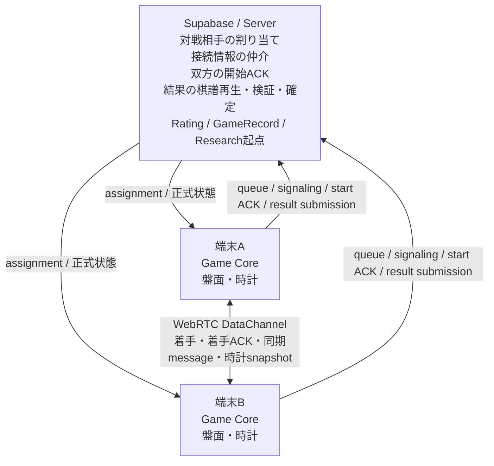
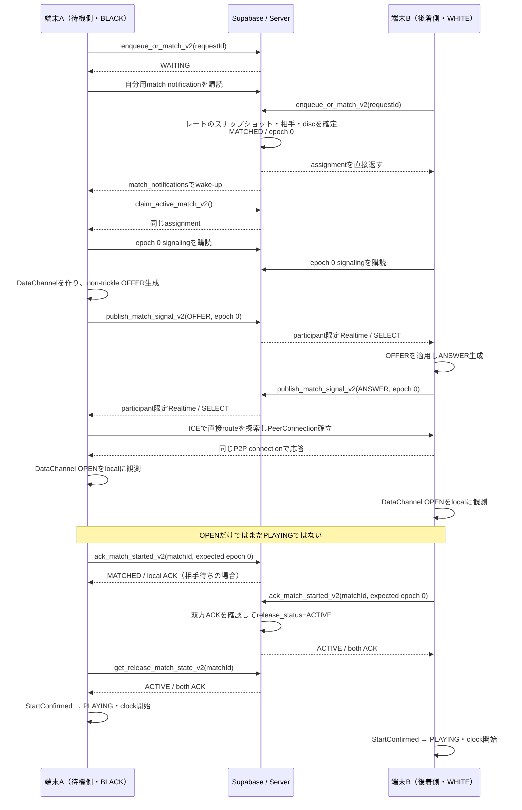
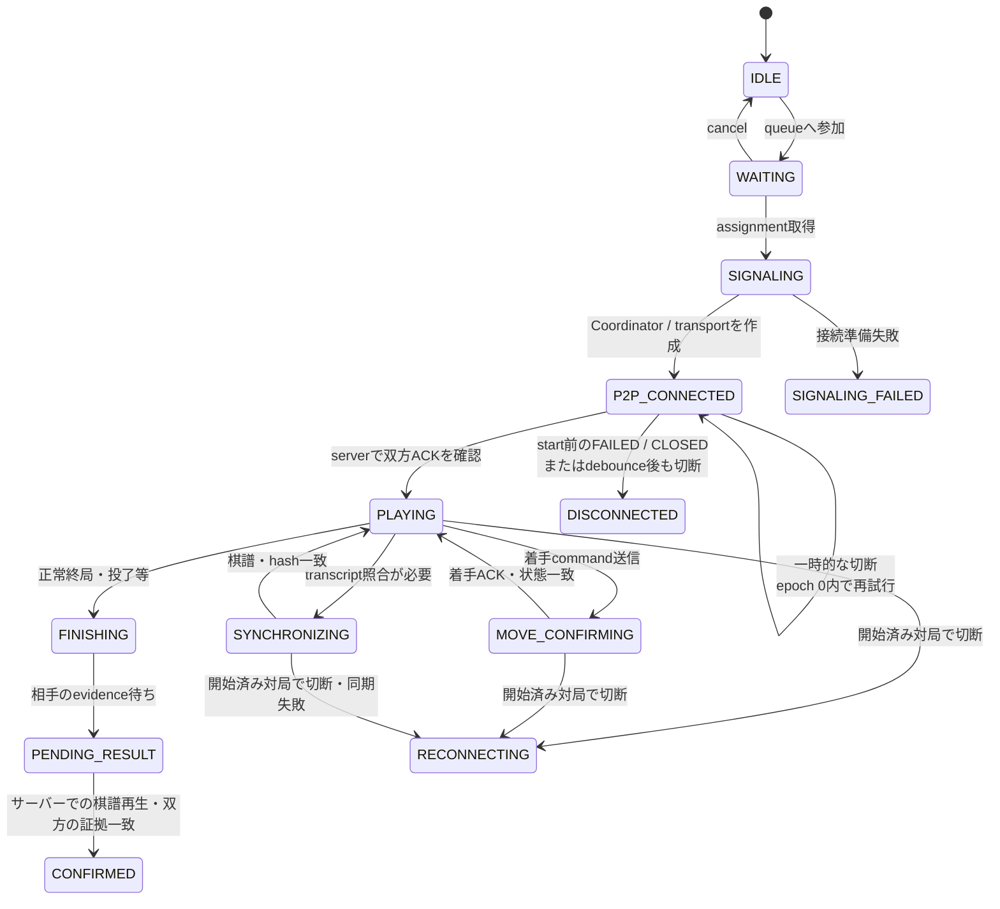
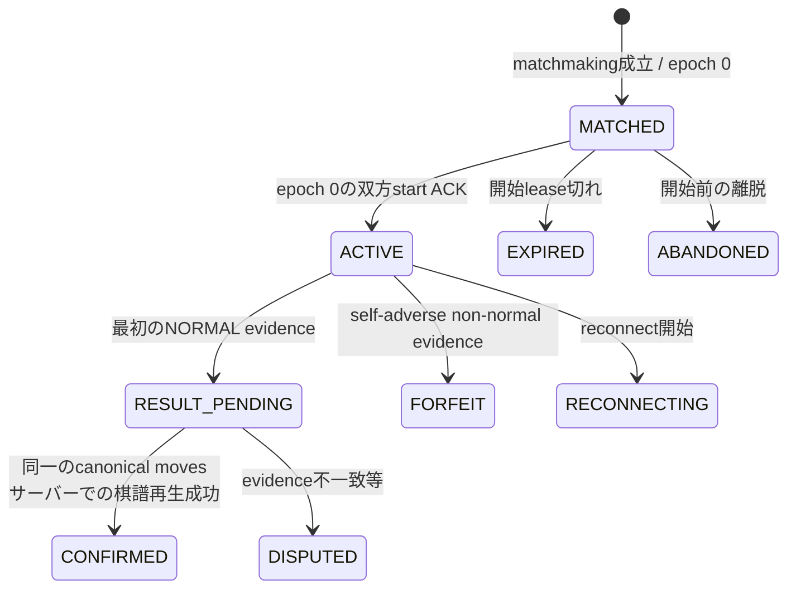

# オンライン対局 通常接続設計

## この資料について

この資料は、オンライン対局のAPIや操作手順を網羅する参照資料ではありません。通常の初回接続が、なぜ「対局中の通信は端末同士、正式な確定はサーバー」という構成になったのかを、設計判断と現在の実装の流れに沿って説明します。

文書間の役割は次のとおりです。

- [システム構成](../01_全体設計/システム構成.md) — リポジトリ全体のモジュール、セキュリティ、責務境界
- この資料 — 通常のオンライン接続を、構成を選んだ理由から説明
- [再接続設計](再接続設計.md) — 一度成立した接続が失われた後の障害・復旧設計
- [運用マップ](../01_全体設計/運用マップ.md) — どの処理がどこで動き、運用時にどこを見るか

説明の正本は現在の`release-hardening` コードです。特に`WebRtcMatchCoordinator`、`OnlineMatchController`、`SupabaseMatchmakingRepository`、`SupabaseRealtimeSignalingDataSource`、`AndroidWebRtcTransport`、マイグレーション `202608250030_release_match_hardening.sql`と、その単体テスト / pgTAPを確認して記述しています。

## 1. まず5分で分かる全体像

設計思想を一文にすると、**通信量の多い対局本体は端末同士で行い、第三者による確認が必要な境界だけサーバーに任せる**、です。

対局中の着手は、サーバーを経由せず端末同士が直接通信する方式（P2P）で送ります。Android アプリ間のリアルタイム接続を作る技術（WebRTC）のうち、任意のデータを運べる通信路（DataChannel）を使います。一方、対戦相手の決定、接続開始の双方確認、結果の検証、レートやGameRecordの更新はSupabase上のサーバー処理が担当します。



SupabaseはP2Pの着手を常時中継せず、対局をリアルタイム実況しているわけでもありません。それでも「通信路が開いた」という各端末の観測だけで正式な対局開始とはしません。双方が接続確認通知（ACK）を、初回の接続世代番号（epoch 0）についてサーバーへ送り、サーバーが双方のACKを確認してから、各端末は`PLAYING`へ進みます。

終局時も同じ考え方です。端末から受け取った正規化済み着手履歴をサーバーが決定的に再生（replay）し、合法性、終局、勝敗、最終盤面hashを導出します。P2Pは通信コストを抑えるための経路であって、レートや永続記録の信用境界ではありません。

## 2. なぜこの構成なのか

### 専用ゲームサーバーを対局本体に置かない理由

一般的な専用ゲームサーバー方式では、各対局の着手、盤面、時計などをサーバーが受け取り、相手へ配信できます。サーバーが全通信を観測しやすい一方、対局数と着手数に応じてサーバー通信量、処理量、場合によってはDB書き込みが増えます。

ちゃんりばは、小規模運用でSupabase等の無料枠または低コストの範囲に収めやすく、対局数に比例してサーバー側のリアルタイム通知機能（Realtime）の通信量やDB書き込みが急増しにくい構成を目指しています。これは無料運用を保証するものではありません。外部サービスの料金と利用上限は変わり得ます。

そのため、たとえば60手の対局で、毎手の着手、盤面、時計、自端末の状態をサーバーへ送り続けません。両端末は同じゲームルール実装（Game Core）で盤面を進め、高頻度で一時的な通信をDataChannelへ移します。

### それでも全部をP2Pにしない理由

低コストにしたいからといって、誰と誰が対局したか、正式に開始したか、最終結果、レート、GameRecord、Researchへ渡す確定情報まで端末の自己申告にはしません。Androidアプリは利用者が制御できる環境であり、第三者による改変や悪意あるリクエストを信用境界の内側に置けないからです。

現在の責任分界は次の考え方です。ここでサーバーが持つ正式状態（server authority）とは、サーバーが正式状態と確定権限を持つことです。

- **P2P** — 高頻度で、対局中だけ必要になり、両端末で決定的に検証できる通信
- **サーバー** — 正式性、公平性、排他性、永続性が必要な境界

つまり、サーバーを使わない設計ではありません。サーバーを使う価値が高い処理へ利用を集中させています。

## 3. サーバーとP2Pの責任分界

| 処理 | 主担当 | 現在の実装と理由 |
|---|---|---|
| 認証 | サーバー | Supabase Authのユーザー 識別情報を、用途を絞ったサーバー 関数呼出し（RPC）とユーザー別行制限（RLS）の境界にする |
| matchmaking | サーバー | `enqueue_or_match_v2`が公式レートスナップショットと1ユーザー 1つの進行中対局制約を使い、正式な相手とBLACK / WHITEを決める |
| 対局成立通知 | サーバー / Realtime | 待機中の本人へ対局成立を早く知らせる。通知がなくても取得 / 定期確認で復旧できる |
| signaling | サーバー / Realtime | P2P接続前のOFFER / ANSWERを参加者限定、epoch限定で仲介する |
| PeerConnection / ICE | 自分の端末と相手端末 | 直接通信できるネットワーク 経路を探し、WebRTC接続を作る |
| 着手コマンド / 着手ACK | P2P | 毎手の高頻度通信をサーバーから外す。`commandId`、`ply`、hashで重複・順序・盤面を検査する |
| 盤面進行 | 各端末のゲーム中核（Game Core） | 同じ合法手を決定的に適用する。進行中 boardをサーバーへ保存し続けない |
| 対局時計 | 各端末 / P2P | monotonic 時計を各端末で進め、着手などのメッセージに時計スナップショットを含める。tickをサーバーへ送らない |
| 開始 ACK | サーバー | 両端末が同じ対局 / epochのDataChannelを利用可能と確認したことを、正式状態として集約する |
| 結果提出 | サーバーRPC | 永続化へ入る用途を絞った認証済み入口。正常終了では双方から提出された結果確定の証拠（evidence）を待つ |
| 棋譜再生（replay） | サーバー | クライアントが宣言したwinnerを信用せず、双方が同じ意味で読める正規化済み着手履歴（canonical moves）を合法手として再生し、結果と盤面一致確認値である状態ハッシュ（state hash）を導出する |
| レート | サーバートランザクション | Androidから直接変更できない。確定処理と同じトランザクションで更新する |
| GameRecord | サーバートランザクション | 検証済み結果だけを変更不能な記録として保存する |
| Research起点 | サーバー側の確定データ | GameRecord等が揃った確定経路の最後で起動し、異常・未確定対局を混入させない |

## 4. この資料で使う用語

| 用語 | この資料での意味 |
|---|---|
| P2P | 端末同士が直接通信する方式。着手などの対局中メッセージを運ぶ。 |
| WebRTC | アプリ間のリアルタイム通信を構築する技術。ここではAndroid端末間のP2P接続に使う。 |
| DataChannel | WebRTC上で任意のデータを送る通信路。着手、着手ACK、同期メッセージ、終了用control等を送る。 |
| matchmaking | 対戦相手を探し、正式な対局、disc、レートスナップショットを成立させる処理。 |
| 待機対局取得（waiting 取得） | 待機中だった端末が、通知後または再試行時に自分の有効な割り当てをサーバーから取得すること。現在のRPCは`claim_active_match_v2`。 |
| signaling | WebRTC接続前に、OFFER / ANSWERなどの接続情報をサーバー経由で交換する処理。対局データそのものの中継ではない。現在の実装は候補を1件ずつ送信せず、ICE gathering後の候補をSDPへまとめるnon-trickle ICEである。 |
| OFFER | 「この接続条件で始められる」というWebRTCの接続提案。現在のプロトコルではBLACKが送る。 |
| ANSWER | OFFERを受けたWHITEが返すWebRTCの接続応答。 |
| SDP | OFFER / ANSWERに含まれる接続条件の表現。現在の実装はICE gathering後にまとめて送るnon-trickle方式。 |
| ICE | 2台の端末間で実際に通信できる経路候補を探す仕組み。 |
| STUN | 自端末が外部ネットワークからどう見えるかを知り、直接経路を見つける助けとなるサーバー。対局データのrelayではない。 |
| TURN | 直接接続できないとき、通信データそのものを中継（relay）するサーバー。現在の`release-hardening`実装にはTURN設定がない。 |
| Realtime | Supabase Postgres Changesの通知機能。対局 可用性とsignalingのcoordinationに限定して使う。 |
| ACK | 受領・利用可能の確認。この資料ではDataChannelの着手ACKと、接続開始をサーバーへ知らせる開始 ACKを文脈で区別する。 |
| 開始 ACK / 双方ACK（双方の ACK） | 開始 ACKは「このepochのDataChannelを利用できる」と端末がサーバーへ送る確認。双方ACKは両端末の開始 ACKが揃った状態である。 |
| 接続世代（epoch） | 同じ対局内で、どの接続世代を扱っているかを識別する番号。epoch 0は初回接続、epoch 1は1回目、epoch 2は2回目、epoch 3は3回目の再接続である。 |
| 現在の接続世代（current epoch） | その時点でサーバーが正式に扱っている接続世代。サーバー DBの`negotiation_epoch`を基準にする。 |
| 対象接続世代（expected epoch） | ACKや再開リクエストが「どのepochを対象にしているか」をサーバーへ伝える番号。古いリクエストを新しいepochへ適用しないための識別札になる。 |
| 正式状態（正式な） | サーバーが持つ正式状態。端末の画面や端末内観測より優先する。 |
| クライアントの状態（client state） | 1台のAndroid端末が持つセッション状態。`WAITING`や`P2P_CONNECTED`など、端末だけが知る状態も含む。 |
| サーバーの正式状態（server state） | Supabaseの`matches.release_status`等に保存される正式な対局状態。 |
| 状態ハッシュ（state hash） | 盤面状態を決定的な短い値で表したもの。着手前後の状態一致確認に使う。 |
| ply | 棋譜上の手数。1回の着手を1 plyとして数える。 |
| 正規化済み着手履歴（canonical transcript） | 両端末とサーバーが同じ意味で解釈できる形式に正規化した着手履歴。このアプリではほぼ棋譜に相当する。 |
| commandId | 1回の着手送信を識別するID。再送を新しい着手として二重適用しないために使う。 |
| 冪等（idempotent） | 同じリクエストが重複しても、二重作成・二重レート更新などにならず同じ結果へ収束する性質。 |
| RLS | 行 レベル セキュリティ。Supabase/PostgreSQLで、ユーザーごとに読める行を制限する仕組み。 |
| RPC | Androidからサーバー上の限定された関数を呼ぶ仕組み。この資料では主にPostgreSQL関数をSupabase経由で呼ぶことを指す。 |
| 参加者 | その対局へ正式に割り当てられた参加者。自分の端末のユーザーと相手端末のユーザーの2者。 |
| Protocol 2 | リリースハードニング後のクライアントが使う、サーバーによる正式な結果とepochを認識する接続／再接続を持つ現行オンライン対局プロトコル。 |
| ロール／disc | 盤上のBLACK / WHITE。WebRTCの初回接続情報交換でも使い、BLACKがOFFER、WHITEがANSWERを担当する。 |
| サーバー再生（サーバー replay） | サーバーが正規化済み着手履歴（canonical moves）をゲーム中核（Game Core）相当の規則で再生し、合法性、終局、勝敗、hashを導出する処理。 |
| lease | キューや対局を有効とみなす期限。クライアントが消えたときにreservationを永久に残さないために使う。 |
| トランザクション | 複数のDB更新を一まとまりとして成功または失敗させ、途中状態を外へ確定しない仕組み。 |
| スナップショット | ある時点の値を固定して表したもの。レートスナップショット、時計スナップショット、同期スナップショットなどがある。 |
| non-trickle ICE | ICE 候補を1件ずつ送らず、候補収集を待ってOFFER / ANSWERのSDPへまとめる方式。 |
| 通信路（transport） | 実際にデータを運ぶ通信路。この資料では主にWebRTC DataChannelと、その接続状態を指す。 |
| 状態照合（reconcile / reconciliation） | 端末が持つ状態とサーバーの正式状態を照合し、正しい状態へ合わせ直すこと。 |
| 上限付き | 再試行や検索を無制限に続けず、回数、時間、件数などの範囲を決めて行うこと。 |

## 5. 通常接続の全体シーケンス

次の図では、端末Aが先にキューで待ち、端末Bが後から参加して対局が成立する例を示します。BLACK / WHITEはサーバーが割り当てるため、先着・後着とdiscは本来独立です。図を読みやすくするため、ここでは端末AがBLACK、端末BがWHITEになった場合を描いています。



通知またはHTTP応答が失われても、同じ`requestId`での定期確認、`claim_active_match_v2`、初回の`SELECT`と回数を制限した状態照合（reconciliation）が有効な割り当てや接続情報を回収します。Realtimeだけを唯一の配信保証にはしていません。

## 6. 通常接続のクライアント状態

Android側の論理状態は次のように進みます。実装上は`MatchmakingController`が`IDLE`、`WAITING`、`SIGNALING`を担当し、割り当てが`OnlineSessionViewModel`へ渡された後、`OnlineMatchController`が`P2P_CONNECTED`以降を担当します。図はその引き継ぎ（handoff）を1本のセッションとして表しています。



`P2P_CONNECTED`は実際の`MatchStatus`名ですが、`OnlineMatchController`の初期値としてCoordinator生成時から使われます。名前に`CONNECTED`とあっても、PeerConnectionやDataChannelが完全にOPENしたこと、サーバーで双方ACKが揃ったこと、対局を開始できることのいずれも、この状態だけでは意味しません。UI上の意味は「P2P接続と開始確認を進めている段階」です。

重要なのは、`DataChannel OPEN`が`P2P_CONNECTED`から`PLAYING`への直接遷移条件ではないことです。OPEN後の開始 ACKと、サーバーが返す双方ACK済みの正式状態が必要です。また、図の`DISCONNECTED`はクライアントの`MatchStatus.DISCONNECTED`です。きっかけとなるWebRTC側の`TransportState.DISCONNECTED`とは同じ名前でも別の状態であり、短い揺れはクライアント状態を`DISCONNECTED`へ終端させずepoch 0内で再試行できます。

初回開始が完了した後の`RECONNECTING`以降は[再接続設計](再接続設計.md)が説明します。双方開始 ACK完了前の切断境界は第19章で現在の実装経路を明記します。

## 7. クライアント状態とサーバー状態は違う

自分の端末は、画面、DataChannel、保留中の着手、端末内 時計を観測できます。サーバーはP2P通信路を常時見ていないため、その細かい状態をDBへそのまま複製しません。逆に、サーバーは正式な参加者、epoch、双方ACK、結果取得、レート トランザクションを知っていますが、端末のDataChannelが今この瞬間OPENかを直接は知りません。

Protocol 2でサーバーへ永続化する正式状態は`matches.release_status`です。通常系で関係する主要遷移だけを抜き出すと次のとおりです。



`PLAYING`はクライアント状態、`ACTIVE`はサーバー状態です。両者は関連しますが同じものではありません。この違いが、一度通信が切れたときの「端末の観測よりサーバーの正式状態を優先する」というReconnect設計につながります。

なお、legacy compatibility用の`matches.server_status`も残っていますが、hardening クライアントのライフサイクル authorityは`release_status`です。`server_status=CONFIRMED`への更新は、確定トランザクションの最後で既存Research 収集を起動する互換境界としても使われます。

## 8. 対戦相手の割り当て（Matchmaking）

matchmakingは単なる「近くのレートを検索するSELECT」ではありません。`SupabaseMatchmakingRepository`は、待機セッションごとに安定したUUIDを`requestId`として保持し、`enqueue_or_match_v2(requestId)`を呼びます。同じリクエストが通信失敗で再送されても、別キュー 行や別対局を作らないためです。

サーバー側はAndroidから現在レートを受け取りません。`ratings.current_rating`をスナップショットし、近い候補を探します。候補選択には`FOR UPDATE SKIP LOCKED`とユーザー単位の ロックを使い、同時実行でも同じユーザーが複数対局へ割り当てられないようにします。`active_match_participants.user_id`のデータベース制約が、1ユーザー 1つの進行中対局の最終的な不変条件です。

先着の待機端末をA、後着をBとすると、Bのenqueue RPCが対局を作ってBへ割り当てを直接返します。データベース トリガーは非公開な`match_notifications` 行を両者分作り、RPC 呼び出し元であるBの通知は不要なので削除し、待っているA向けのwake-upを残します。Aは自分の通知をRealtimeで受けると`claim_active_match_v2()`を呼び、同じ有効な割り当てを取得します。

通知は低遅延のためにあり、唯一の正解経路ではありません。通知が遅延・欠落しても、フォアグラウンド待機中は75秒ごとに同じ`requestId`で`enqueue_or_match_v2`を呼び、有効な割り当てを回収できます。`claim_active_match_v2`も応答喪失後に同じ割り当てを返せます。逆に、定期確認だけにすると成立通知の反映がポーリング間隔まで遅れるため、通知と代替経路を組み合わせています。

`MainActivity`の通知 購読は`WAITING`の間だけ生存し、割り当て取得後に閉じます。これにより対局中まで対局 可用性を購読し続けません。

## 9. 接続情報交換（Signaling）

P2Pは端末同士の直接通信ですが、最初から相手の接続条件を知っているわけではありません。「相手へどう接続するか」という情報だけは、直接通信路を作る前に別経路で交換する必要があります。この接続準備情報の交換がsignalingです。

`WebRtcMatchCoordinator`は割り当てを受けると`SupabaseRealtimeSignalingDataSource`を通じて`match_signals_v2`を購読します。BLACKがOFFER、WHITEがANSWERを作り、`publish_match_signal_v2` RPCで送ります。signalはプロトコル 2、対局、参加者、ロール、現在の`negotiation_epoch`、期限に拘束されます。Androidからテーブルへ直接INSERTする経路はありません。

RLSは、認証済みユーザーが自分の進行中の対局の現在の接続世代（epoch）だけを読めるようにします。つまり誰でも他人のSDPを購読できる構造ではありません。サーバー側はペイロード ダイジェスト、type別スロット 件数、epochを使って重複や過剰送信も制限し、クライアント側もdelivery trackerとhandled setで同じsignalを再処理しません。

購読開始時は既存行の`SELECT`とRealtimeを組み合わせ、その境界で通知を取り逃がす競合（race condition）に対して、順序付き`SELECT`を最大1回行います。この状態照合（reconciliation）後も接続情報の購読自体は`WebRtcMatchCoordinator.close()`まで維持されます。通常の着手を運ぶためではなく、接続中の調整と後の再接続に備えるためです。サーバーが`ACTIVE`の間はRLS上、初回接続の情報行は進行中の接続情報交換対象ではありません。

## 10. WebRTC / DataChannel

`WebRtcMatchCoordinator`は`AndroidWebRtcTransportFactory`から対局専用transportを作ります。BLACKはofferer用DataChannelを先に作ってからOFFERを生成し、WHITEはremote OFFERを適用してANSWERを返し、offererがそれを適用します。

現在の実装はnon-trickle ICEです。ICE 候補を1件ずつサーバーへ流すのではなく、ICE gathering完了を待った端末内 SDPを1つのOFFER / ANSWERとしてsignalingします。DataChannelがOPENした後、通常の対局データはサーバーを離れます。

着手は`MoveCommand`として送られ、少なくとも次のcontextを持ちます。

- `matchId` — 別対局のメッセージを混ぜない
- `commandId` — 再送を同じ着手として扱う
- `ply` — 何手目かを確認する
- `previousStateHash` — 着手前の盤面一致を確認する
- real 着手とプロトコル バージョン
- 送信時の時計スナップショット

受信側はサーバーが割り当てた相手disc、turn、ply、hash、合法手、コマンド fingerprintを検証します。同じ`commandId`と同じペイロードが再送された場合は着手を再適用せず、同じ`MoveAck`を返します。同じIDで内容だけ変えたメッセージはプロトコル エラーです。

送信側は回数を制限した再試行後もACKを得られなければ、むやみに次の着手へ進まず`SyncMessage.REQUEST`で同期へ切り替えます。スナップショットの正規化済み棋譜（canonical transcript）をゲーム中核（Game Core）で再生し、plyとhashを確認します。強制passも両端末が決定的に適用するため、サーバーへpass eventを逐次送る必要はありません。

`MatchClock`は各端末のmonotonic timeで進みます。UIの時計 tickをネットワークやサーバーへ送るのではなく、着手や終局メッセージのスナップショットで相互確認します。Reconnect時のチェックポイントとtranscript synchronizationの詳細は別資料へ委ねます。

## 11. なぜ開始 ACKが必要か

DataChannel OPENは各端末で発生する端末内eventです。自分の端末ではOPENでも、相手端末ではまだOPENしていない、あるいは相手のサーバー確認だけが失敗している可能性があります。片側の観測だけを「正式に対局開始した証拠」にはできません。

そこで両端末は、初回接続を表すepoch 0を明示して`ack_match_started_v2(matchId, expectedNegotiationEpoch = 0)`を呼びます。SQL関数は参加者を認証し、対局行をロックし、期待するepochが現在の接続世代（epoch）か確認してから`match_start_acks_v2`へidempotentにACKを記録します。

1人目のACKだけでは`release_status`は`MATCHED`のままです。2人のACKが同じ現在の接続世代（epoch）に揃ったときだけ、サーバーは`ACTIVE`へ遷移します。`OnlineMatchController`はACK 応答だけに依存しません。ACKの回数を制限した再試行を使い切っても応答を利用できない場合は、`get_release_match_state_v2`を1度呼び、同じepochの正式なACK状態を照合します。サーバーでローカルACKが記録済みならその状態を採用し、同じepochで`ACTIVE`かつ双方のACKを確認してから`StartConfirmed`を適用し、`PLAYING`と時計開始へ進みます。サーバーでローカルACKを確認できない場合は、対局を開始しません。

期待するepochを持つことで、古いDataChannel OPEN コールバックが後から届いても、将来のReconnect epochへ誤ってACKを追加できません。通常接続のepoch 0から、この世代-awareな契約が始まっています。

## 12. なぜRealtimeを対局中ずっと使わないのか

現在のarchitectureでSupabase Realtimeを使うのは、非公開な対局成立通知とSDP signalingです。P2P成立後の次の情報はRealtimeへ流しません。

- 着手 コマンド / 着手 ACK
- 進行中の盤面状態
- 時計 tick / 進行中 時計
- 結果 submission
- レート update

結果はauthenticated RPCで提出し、レートはサーバー トランザクションで更新します。signaling 購読はReconnectに備えてCoordinatorの生存期間中維持されますが、対局データ transportとして使われるわけではありません。

この限定は、対局数と手数に比例するRealtime trafficやDB 書き込み amplificationを避けるための責任分界です。また、着手のネットワーク パスを端末間にできるため、サーバー hopを必須にしません。ただしネットワーク latencyが常に小さくなることを保証するものではありません。

## 13. STUN / TURNとコスト・到達性

P2P接続では、端末が家庭や携帯ネットワークの内側にあり、互いの到達可能なaddressをそのまま知らないことがあります。ICEは利用できる経路候補を集めて接続を試します。

STUNは、自分の端末が外部からどう見えるかを知り、端末同士が直接つながるための補助をします。TURNは、直接つながれない場合に対局データそのものをサーバー経由でrelayします。

現在の`DefaultIceServers.publicStun`には`stun:stun.l.google.com:19302`だけが設定され、`WebRtcMatchCoordinator`もその設定で通信路（transport）を作ります。つまり現在の実装はSTUN-onlyで、TURN relayは構成されていません。relay trafficとその運用境界を持たない一方、制限の厳しいNAT、firewall、UDP制限などの組合せによってはP2P接続できない環境があり得ます。

これは「TURNは常に有料だから使わない」という固定的な料金判断でも、結果のセキュリティ強化の欠陥でもありません。現在の製品における到達性（reachability）・可用性（availability）とサーバーによる中継運用のトレードオフです。実ネットワークでの成功率は2台実機テストで確認し、TURNが必要かは利用環境と運用条件を含めて別途判断します。

## 14. 対局中にサーバーへ送らないもの

通常の各手でサーバーへ送らないものを明確にすると、次のとおりです。

- 毎手の着手 コマンドと着手 ACK
- 毎手適用後のboard全体
- forced passの逐次event
- UI更新ごとの時計 tick
- 進行中の盤面状態／クライアントのセッション状態
- DataChannel上の同期リクエスト / スナップショット

これらはDataChannelと各端末のゲーム中核（Game Core） / `MatchClock`で扱います。アプリ内の非公開な復旧 チェックポイントは端末内へ保存されますが、Supabase上の進行中の対局ログではありません。

サーバーは、matchmakingや開始 ACKなどの境界を除き、対局中の盤面をリアルタイム実況していません。そのためサーバー trafficは手数や時計 tickへ直接比例しにくい一方、端末間の一致確認、重複処理、再送、同期をクライアント プロトコルが担う必要があります。

## 15. 終局時にサーバーへ戻すもの

P2P対局でも、正式な記録とレートのために終局時はサーバーが持つ正式状態（server authority）へ戻ります。`OnlineMatchController`は`MatchSubmission`を組み立て、`SupabaseOnlineMatchRepository`が`submit_match_result_v2`へ次を渡します。

- idempotentな`requestId`
- 正規 着手 履歴
- finish reason
- 非正常終了（non-normal）時のloser disc
- 上限付きな最終 時計 JSON

プロトコル 2 アダプターはクライアント計算のwinnerや最終 hashをRPCへ渡しません。SQLは参加者 authorizationと対局行 ロックを先に行った後、`release_replay_game_v2`で正規化済み着手履歴（canonical moves）を決定的に再生します。token形式、pass、合法手を検査し、最終盤面hash、disc数、結果、終了済みかどうかをサーバー側で導出します。

正常終了では、同じepochについて双方が同一の正規化済み着手履歴（canonical moves）と正常終了の証拠を提出し、棋譜再生が終局まで成功した場合だけ確定経路へ進みます。片側だけなら`RESULT_PENDING`で待ち、証拠が一致しなければ`DISPUTED`となりレートを変更しません。

確定時は1トランザクションで、`match_results_v2`、変更不能な`game_records`、双方の`rating_history`、`ratings`、`user_game_records`を整合させます。既存Research収集を起動する旧Protocol 1の`server_status=CONFIRMED`への更新は、それらが揃った後のトランザクション末尾で行われます。Research参加同意など別の条件はResearch側の設計に従います。

投了、タイムアウト、切断等の非正常終了（non-normal） finishは正常終了と同じwinner自己申告ではなく、実際のloser 参加者によるself-adverse 確認材料を要求します。単なるconnectivity 障害や一方だけの正常終了 取得から、レート対象 GameRecordを製造しません。

## 16. サーバーの正式状態が必要な理由

「P2Pで対局できるなら、レートも端末から更新すればサーバー利用をさらに減らせる」と考えることはできます。しかしレート、GameRecord、Researchのソースは一度壊れると他ユーザーや集計へ影響する永続データです。利用者が制御できるAndroidクライアントを、その更新権限のauthorityにはできません。

現在の実装は次の境界を置きます。

- Androidにはサービスロール（service_role） キーを含めない
- authenticated 参加者だけがnarrow RPCを呼べる
- Androidから正式レート／最高レート／検証済み結果を直接`UPDATE`できない
- 正常終了は双方の同一正規 確認材料を要求する
- legal replay、終了済み、winner、hashをサーバーが再構築する
- idempotent 取得とトランザクションで重複確定を防ぐ
- レート / GameRecord / Research起点を同じ確定順序の内側に置く

P2Pでサーバーが毎手を観測しない以上、共謀する2アカウントが同じ合法棋譜を作る残存リスクまでは消えません。一方、非合法な棋譜、任意に選んだ勝者、構文だけが正しい偽ハッシュをそのまま正式結果にする経路は、サーバーでの棋譜再生によって閉じています。コスト境界と信頼境界の両方を明示した設計です。

## 17. コストを考慮したアーキテクチャ

この設計は、安さのために正しさを犠牲にしたものではありません。負荷の性質で処理場所を分けています。

| 性質 | 配置 | 例 |
|---|---|---|
| 高頻度・一時的・両端末で検証可能 | P2P | 着手、着手ACK、時計スナップショット、transcript synchronization |
| 低頻度・正式性や永続性が必要 | サーバー | matchmaking、開始 ACK、結果 replay、レート、GameRecord |

通常の1手はDataChannel上の着手コマンドと小さな相手端末へのACKで完結し、Supabaseリクエストを発生させません。サーバー処理はキュー、接続情報交換、開始、終局などの境界へ集中します。これにより、対局時間中の時計tickや手数が、そのままRealtime使用量やDB書込み数にはなりません。

Supabaseのfree tierや低コスト運用を意識した構成ですが、特定の料金、利用上限、将来の無料利用をこの資料では保証しません。現在の条件はSupabase等の公式情報を確認する必要があります。重要なのは「サーバーを使わない」ことではなく、「サーバーが正式状態を持つ価値が高い処理にサーバー リソースを使う」ことです。

## 18. 設計上のトレードオフ

| 判断 | 得られるもの | 受け入れる複雑さ・制約 |
|---|---|---|
| DataChannelで対局データをP2P送信 | サーバー帯域と着手ごとの処理を抑え、サーバー hopを必須にしない | NAT / firewallの影響、片側だけの観測、再試行 / dedup / sync プロトコルが必要 |
| STUN-only | TURN relayのtraffic・認証情報・運用境界を持たない | direct 経路を作れないネットワークでは接続できない可能性 |
| Realtimeをcoordinationに限定 | 着手ごとの Realtime usageとDB 書き込みを避ける | サーバーは進行中 boardを常時観測できず、終局時replayが必要 |
| 開始 ACKをサーバーへ集約 | 片側OPENだけで公式開始にしない | handshakeとRPC / 状態確認が1段増える |
| サーバーによる正式な確定処理 | レート、GameRecord、Researchの入力データの整合性を守る | 棋譜再生、双方の証拠、トランザクション、タイムアウト時の状態照合（reconciliation）が必要 |
| 固定したリクエストID／通知＋定期確認 | 応答喪失や通知遅延から回復できる | クライアントとSQLの冪等性、リース、ロックが必要 |

この複雑さを受け入れた理由は、高頻度の通信量をP2Pへ移しても、開始・結果・永続データの信頼境界（trust boundary）をサーバーに残すためです。P2P特有の非対称な障害観測が再接続プロトコルを複雑にした経緯は、[再接続設計](再接続設計.md)で詳しく扱います。

## 19. 通常系から再接続へ

ここまでが正常な初回接続です。

```text
epoch 0
  -> matchmaking / assignment
  -> OFFER / ANSWER signaling
  -> ICE / PeerConnection
  -> DataChannel OPEN
  -> epoch 0の双方start ACK
  -> サーバー: ACTIVE
  -> クライアント: PLAYING
```

### epoch 0の開始確認前に切断した場合

ここにはReconnectとの明確な境界があります。通常の初回接続では、`OnlineMatchController`は同じepochについてサーバーの`ACTIVE`を確認し`StartConfirmed`を適用するまで、内部の`started`をfalseに保ち、クライアントの状態は`P2P_CONNECTED`です。サーバーも双方ACKが揃うまでは`MATCHED / epoch 0`です。

この段階で`TransportState.DISCONNECTED`を観測すると、Controllerは1.5秒のdebounceを置きます。短時間でOPENへ戻る、またはCoordinatorがサーバーの`MATCHED`を読み直して再試行する場合は、次epochを作らずepoch 0のsignaling / 開始 handshakeを続けます。判定器の`MATCHED`分岐は`SIGNAL_CURRENT_EPOCH`であり、`resume_match_v2`を呼びません。

`FAILED` / `CLOSED`になった場合、またはdebounce後も切断が残る場合は、`started == false`なので`beginReconnectGrace()`には入りません。Controllerは`abandon_match_v2`を呼び、サーバーの`MATCHED`を`ABANDONED`、理由を`CANCELLED_BEFORE_START`とし、クライアントを`MatchStatus.DISCONNECTED`へ進めます。`transportFailureBeforeStartAbandonsReservation`は、このパスが切断 結果をsubmitせずreservationを解放することを固定しています。

abandon RPCを完了できない場合も、クライアントはエラー付き`DISCONNECTED`になります。サーバーの`MATCHED`には2分の初回leaseがあり、その期限後は状態照合または件数を制限したmaintenanceが`MATCH_START_TIMEOUT`によるレート対象外の`EXPIRED`へ進めます。どちらの終了でもepoch 1、レート対象結果、レート、GameRecord、Research起点を作りません。

### 開始確認後に切断した場合

サーバーがepoch 0の双方ACKを受けて`ACTIVE`になり、Controllerが同じ正式状態を確認して`StartConfirmed`を適用すると、クライアントは`PLAYING`になります。この開始済み状態の`PLAYING` / `MOVE_CONFIRMING` / `SYNCHRONIZING`で切断が継続した場合に、Controllerの通常セッションは`beginReconnectGrace()`とepoch 1以降のReconnect プロトコルへ入ります。

実装上の境界判定は二段あります。Controllerが現在セッションの切断を処理する入口では、`started`と上記3つのクライアント状態を確認します。一方、Coordinatorが再交渉やプロセス復旧を始める入口では、先にサーバー状態を読みます。サーバーがまだ`MATCHED`ならepoch 0内を扱い、サーバーがすでに`ACTIVE` / `RECONNECTING`ならその正式状態を基準に復旧操作を選びます。

後者は、開始 ACKのDB コミット後にHTTP応答だけを失った場合やプロセス 復旧では、端末がまだ`P2P_CONNECTED`に見えてもサーバーでは対局開始済みになり得るためです。したがってReconnectとの境界は「クライアントが一度`PLAYING`を表示したか」だけでは決めません。ただし本節の問いである**サーバー双方ACK完了前の`MATCHED / epoch 0`**では、どちらの入口から見ても新しいepochを作らず、上記のepoch 0 再試行または開始前終了を選びます。

Reconnectでは「自分が切断を観測したか」と「サーバーが正式に開始したreconnectへ参加するか」を分離し、古い再試行と新しい切断も区別します。

その障害パターン（failure model）、受動側端末、ACK 応答喪失、期待するepoch、有限の再接続回数上限は[再接続設計](再接続設計.md)を参照してください。通常接続から引き継がれる最も重要な前提は、**DataChannelがOPENであることと、サーバー上で対局継続が確定していることは別**、という点です。

## 20. 現在の設計原則

1. **高頻度の対局通信は端末間で完結させる。** 着手、時計スナップショット、同期メッセージはDataChannelで送り、着手ごとのサーバー リクエストを作らない。
2. **信頼が必要な境界はサーバーが正式状態を持つ。** 対局 割り当て、開始 ACK、結果 replay、レート、GameRecordはサーバーが正式状態を持つ。
3. **通信路の接続だけを対局開始の証拠にしない。** DataChannel OPENだけで`PLAYING`にせず、epoch 0の双方ACKを確認する。
4. **クライアント セッション状態とサーバー永続状態を分ける。** `PLAYING`と`ACTIVE`を同じ状態 machineとして扱わない。
5. **Realtimeは調整基盤であり、対局中の通信路ではない。** 対局通知とsignalingに用途を限定する。
6. **再試行は状態を認識し、冪等にする。** 固定したリクエストID、コマンドID、expected epochを持たせ、重複配信や応答喪失を二重処理へ変えない。
7. **公式結果はサーバー側で再構築・検証する。** クライアントのwinnerやhashを正式情報にせず、正規化済み着手履歴（canonical moves）を再生する。
8. **コスト効率のためにレート / GameRecord / Researchの整合性を弱めない。** 高頻度trafficを外しても永続データのトランザクション境界はサーバーに残す。
9. **接続障害から公式結果を作らない。** 未開始、片側取得、再接続失敗だけではレート対象記録を作らない。
10. **通常接続から接続世代を識別できる復旧契約を確立する。** 初回からepoch 0を明示し、再接続時にも同じ対局 世代をサーバーと照合できるようにする。

この設計は、すべてのネットワークでP2P接続できることや、すべての不具合がないことを証明するものではありません。現在のコードが守る責任分界と不変条件（invariant）を示し、STUN-onlyの到達性、Android WebRTCの実挙動、実ネットワーク上の順序（ordering）は2台実機テストで確認する対象として残します。
