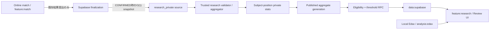
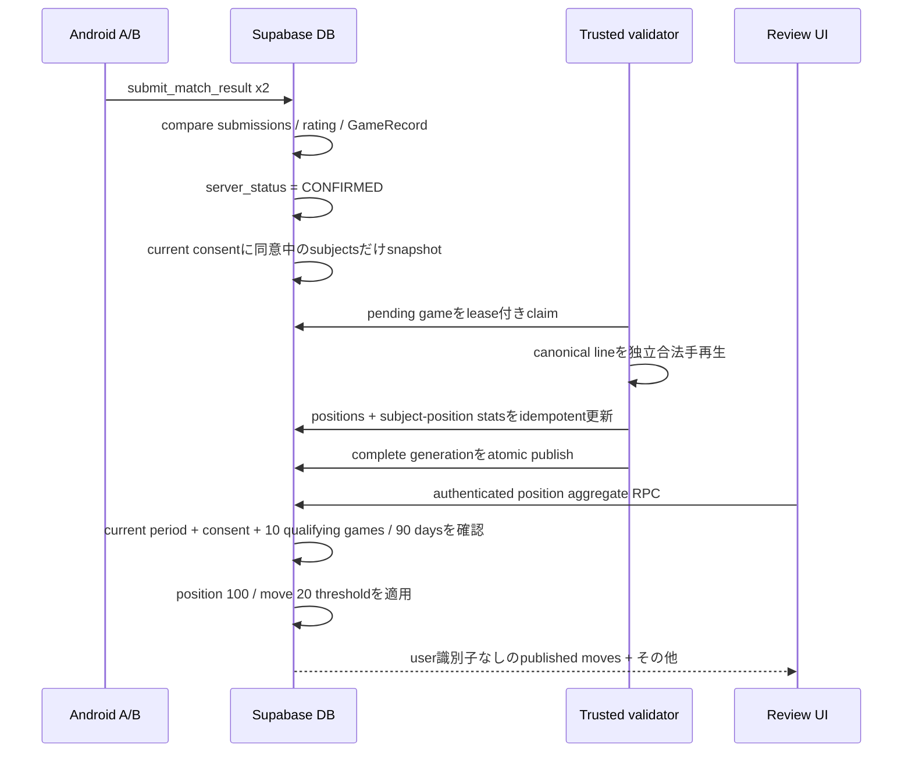

# ちゃんりば 研究データ設計記録

- 状態: 実装済み（migrations 018–023 / Android / Researchバッチ）。本文は実装前設計の履歴
- リポジトリ基準点: `260c1381663fe76c405f33e02be2ac0cc6c831f0`
- 直前の設計文書コミット: `3f92338593beda96c8afeac6e5edcfba3d7b2dcc`
- 確認日: 2026-08-11
- 対象範囲: 対局後に「人間がその局面で何を選び、その後どうなったか」を集約公開する機能

> **履歴資料:** この文書は、現在の運用手順ではありません。実装前の設計判断と、その実装へ渡した不変条件を保存しています。

本文中の「現行の事実」は上記リポジトリ 基準点時点を指し、現在のHEADを意味しない。設計はマイグレーション 018〜023、`:feature:research`、`:data:supabase`、`cloudflare-admin`の検証器 / バッチ、`.github/workflows/research-batch.yml`として実装済みである。現在の運用手順は[研究データ運用](../03_研究データ/研究データ運用.md)、現在のDB正本は[`supabase/migrations`](../../supabase/migrations)を参照する。

## 0. 結論

推奨するのは、次のハイブリッド方式である。

1. 個人向け `game_records` とは別に、研究専用のコンパクトな確定棋譜ソースを長期保持する。
2. アカウント lifetimeから独立した内部 `research_subject_id` を導入し、研究ソースには、サーバーで取得した確定時刻、結果、finish reason、各同意済み対象者の対局前レート、参加 期間を保存する。
3. Androidから研究用生データデータを投稿させない。`CONFIRMED` 遷移をDBで検出し、研究用スナップショットを作る。
4. 信頼済みbackendが正規化済み着手履歴（canonical moves）を独立に合法手再生し、受理した棋譜だけを集計する。
5. 集計の中間層では、局面ごとに「研究対象者別の選択回数」を保持する。公開層では対象者IDを完全に除いた集計スナップショットだけを保持する。
6. Androidは、Opt-in設定・自分の利用資格・しきい値通過済み集計だけをRPCから取得する。生データ テーブルをSELECTしない。
7. `1ユーザー = 総weight 1` はイベント数ではなく、局面ごとのユーザー内選択比率を先に計算してからユーザー間平均することで保証する。

この方式は後述の案Dに相当する。個人GameRecordの最新50件制限と研究データの長期育成を分離しつつ、Opt-out後とアカウント削除後も同意済み寄与を保持し、レート bucket変更・期間変更時の再集計可能性を残す。

## 1. 現行実装の調査結果

### 1.1 ArchitectureとAndroidの境界

現行の事実:

- `:core:game` は純粋な Kotlinで、盤面、合法手、着手、pass、終局、正規 着手、局面 hashを所有する。
- `:feature:match` は進行中の対局を所有し、Edax/analysisへ依存しない。境界 checkでも禁止されている。
- `:feature:records` は変更不能なな `GameRecord` と取得ポートを所有する。
- `:feature:review` は `GameRecord` から任意ply・variationの `GameState` を再構築し、`:analysis:api` のみを利用する。
- `:analysis:edax` はAndroidローカルのJNI実装であり、Supabaseや進行中の対局へ到達しない。
- Supabase SDK型は `:data:supabase` 内に閉じられ、アプリへはアプリ独自ポートだけが公開される。

根拠:

- [システム構成](../01_全体設計/システム構成.md)
- [`scripts/check-boundaries.ps1`](../../scripts/check-boundaries.ps1)
- [`GameRecord.kt`](../../feature/records/src/main/kotlin/com/example/othello/records/GameRecord.kt)
- [`ReviewSession.kt`](../../feature/review/src/main/kotlin/com/example/othello/review/ReviewSession.kt)
- [`SupabaseContracts.kt`](../../data/supabase/src/main/kotlin/com/example/othello/data/supabase/SupabaseContracts.kt)

研究機能でもこの方向を維持する。進行中の対局は研究機能を知らず、レビューだけがEdax結果と研究集計を画面上で合流させる。

### 1.2 当時のDB テーブルと研究機能の関係

| テーブル | 現行の事実 | 研究機能での扱い |
| --- | --- | --- |
| `profiles` | Auth作成時にトリガーで作成する内部ID 行。表示名列は持たず、アカウント削除後も共有棋譜整合性のtombstoneとして残る | research 提供者のFK先には使わない。アカウント削除後の研究保持をプロフィール tombstoneへ依存させない |
| `ratings` | 現在レート・peakを保持。Androidは更新不能 | 研究では現在値を使わず、対局確定時のレート beforeをスナップショットする |
| `rating_history` | 1ユーザー / 対局で一意。確定時に2行追加。ユーザーごと最新100件へprune | 長期研究の再集計元にはできない。確定時に `rating - delta` を研究側へcopyする |
| `matches` | サーバー 状態は `CREATED/PENDING_RESULT/CONFIRMED/DISPUTED/ABANDONED`。参加者のみSELECT | `CONFIRMED` 遷移だけを研究収集の起点とする |
| `match_submissions` | 両参加者の正規化済み着手履歴（canonical moves）/結果/hash/finish reason一致を確認。確定後に削除 | 研究側から直接参照し続けない |
| `game_records` | 1対局 1行。正規化済み着手履歴（canonical moves）、結果、最終 hash、players、時刻、time control、finish reasonを保持 | 収集時の信頼済みソース。研究長期保存は別テーブルへcopyし、以後FK依存しない |
| `user_game_records` | ユーザーとGameRecordの参照。各ユーザーの最新50参照を保持 | 研究保持と分離する。研究テーブルから参照しない |
| `account_deletion_requests` | Androidは要求のみ。信頼済み ワーカーが非公開データ削除・Auth削除・完了処理 | 削除要求受付時の新規収集停止と、Auth削除前の研究対象者 切り離しを既存ワークフローへ追加する |
| `match_signaling` / 通知 / ACK / 有効な予約 | オンライン セッション用 | 研究機能から参照しない |
| 認証情報 / 検証 tables | 初回公開版では物理削除 | 研究機能から参照しない |

根拠となるマイグレーションは[`supabase/migrations`](../../supabase/migrations)の001〜017、特に002、009、010、011、014、016、017である。

### 1.3 GameRecordの作成・保持

現行の事実:

1. 両参加者が同じ正規化済み着手履歴（canonical moves）、結果、最終 hash、finish reasonを提出した場合だけ `CONFIRMED` になる。
2. `CONFIRMED` トランザクション内でGameRecordを1件作り、レートを1回だけ更新する。
3. GameRecordは `match_id` がPKで、クライアントにはINSERT/UPDATE/DELETE権限がない。
4. `user_game_records` は各ユーザーにつきfinished_at降順で最新50参照を残す。
5. どの `user_game_records` からも参照されないGameRecordは削除でき、その後確定済み 対局も短期保持後に削除できる。
6. Kotlinの `recent()` も最大50件へ制限する。

注意点として、GameRecordのRLSは `players` 配列で参加者を判定し、`user_game_records` の存在自体を可視性条件にしていない。そのため、片方の参照がprune済みでも相手側参照によって行が残っている間は、DB上の行寿命は厳密な「各ユーザー 50件」と一致しない場合がある。研究設計はこの寿命へ依存しない。

### 1.4 結果と正規化済み着手履歴（canonical moves）の信頼度

現行の事実:

- DBは参加者、P2P 開始 ACK、ペイロード形式、サイズ、列挙値、両者一致、重複submit、レート二重更新を検証する。
- `NORMAL` は空棋譜不可で、`RESIGNATION/TIMEOUT/DISCONNECT` は0手を許容する。
- 現行DBは正規化済み着手履歴（canonical moves）をReversiルールで一手ずつ再生していない。両クライアントが同じ不正な合法性ペイロードを提出した場合まで独立検証する仕組みではない。

したがって研究集合知へ取り込む前に、信頼済みbackendで独立した合法手再生が必要である。これは現在のオンライン/レート経路を作り直す指示ではなく、研究データ汚染を防ぐ追加境界である。

### 1.5 RLS・RPC・公開プロフィール

現行の事実:

- 正式な 書き込みは狭い `SECURITY DEFINER` RPCを通す。
- Androidへサービスロール（service_role） キーを置かない。
- authenticated ロールには必要最小限のテーブル権限だけを付与し、RLSを併用する。
- internal クリーンアップ/prune RPCはauthenticated/公開から実行不能である。
- `public_profiles` viewと`profiles.display_name`は初回公開版では物理削除し、公開プロフィールを提供しない。

研究APIは `public_profiles` とjoinしてはならない。研究応答には `user_id`、表示名、opponent、対局ID、個別棋譜へのリンクを含めない。

### 1.6 アカウント削除

現行の事実:

- Androidは `request_account_deletion()` のみ実行できる。
- 信頼済み Cloudflare ワーカーがサービスロール（service_role）専用 RPCでDBをprepareし、Researchの識別情報を切り離しし、Auth 管理者 APIで識別情報を削除してからcompleteする。
- 非公開 レート、レート 履歴、本人の記録参照は削除される。認証情報／検証機能は初回公開版に存在しない。
- opponentのshared 変更不能な GameRecordを壊さないため、プロフィール UUIDは匿名tombstoneとして残り得る。

研究機能を追加すると、削除要求受付時に有効な参加期間を閉じて新規収集と閲覧を止め、Authの識別情報削除前にアカウントUUIDと研究対象者のリンクを不可逆に外す段階が必要になる。すでに収集され、検証器により受理済みとなる寄与と集計の重みは削除しない。

### 1.7 再利用できる部分と変更が必要な部分

再利用する:

- `CONFIRMED` を唯一の研究収集起点とする。
- 正規 着手形式、結果、finish reason、最終 hash、time control、確定済み時刻。
- `rating_history.rating - rating_history.delta` による対局前レート。
- 現在の アカウント削除 ワーカーとretryable 削除 リクエスト。
- RLS、既定拒否（deny by default） privilege、サービスロール（service_role）専用 administrationの思想。
- `:core:game` の座標系と合法手テストデータを検証器の相互テストへ利用する。

追加が必要:

- 明示的Opt-inと参加期間。
- GameRecordとは独立した研究ソース 保持。
- サーバー側 legal replay/検証。
- 1ユーザー 重みを保証する非公開 集計中間層。
- しきい値適用済みの公開RPC。
- Give-to-Get 利用資格。
- 同意バージョン、Opt-out後の将来収集停止、アカウント削除時の研究対象者 切り離し。
- `:feature:research` と `:data:supabase` の新しいポート実装。
- 研究テーブル/RPCを含む境界/pgTAP/セキュリティ 契約。

## 2. 推奨アーキテクチャ

### Android

- 新規 `:feature:research` が、参加状態、利用資格、研究局面 概要のアプリ独自インターフェースとUI 状態を所有する。
- `:data:supabase` がRPC DTOとSupabase SDK実装を所有する。
- `:feature:review` は研究インターフェースだけを利用し、Edax結果と合法手座標でmergeする。
- `:feature:match`、`:feature:matchmaking`、`:core:network`、`:transport:webrtc` はresearchへ依存しない。
- variation局面は閲覧問い合わせに利用できるが、variationそのものを研究提供データへ保存しない。
- 研究データの応答はメモリ内だけの キャッシュを基本とする。Opt-out/sign-out時に即消去し、過去に取得した集合データをOFF後もdiskから閲覧できる設計にしない。

### Supabase/Postgres

- 生データ/非公開研究テーブルは非exposed スキーマ `research_private` に置く。
- `anon` / `authenticated` / `PUBLIC` へスキーマ usage・テーブル権限を与えない。
- クライアント-facing RPCだけ `public` に置き、`SECURITY DEFINER SET search_path = ''`、スキーマ-qualified 問い合わせ、明示GRANTを使う。
- `CONFIRMED` 遷移では研究スナップショットをO(1)で作るだけにし、棋譜再生・集計は行わない。
- 収集対象は、`CONFIRMED` の線形化点で現在の同意バージョンへ同意済みの有効な参加期間を持つ参加者だけ。相手がOFFでも、ON側本人の選択だけを提供データとして数える。

### 信頼済み検証器 / aggregator

- Androidとは別の信頼済み backendで動かす。既存Cloudflare ワーカーの拡張または専用ワーカーを候補とする。
- サービスロール（service_role） シークレットはワーカー シークレットとしてのみ保持する。
- 保留中 research 対局をlease付きで取得し、正規化済み棋譜（canonical line）を独立再生する。
- 検証、局面 extraction、対象者・局面再計算、集計 世代作成を担当する。
- provider固有typeをAndroidへ公開しない。

### Edaxとの関係

- Edaxは従来どおりAndroidローカルのレビュー専用。
- サーバー側 Edax、クラウド analysis、Edax値の研究DB保存はv1では行わない。
- レビュー UIが同じ合法手座標に対して、Edaxの `EXACT/HEURISTIC/BOOK` と研究の選択/結果を並べる。

## 3. 推奨データモデル

以下は論理モデルであり、今回マイグレーションは作成しない。名前は実装時の推奨名である。

### 3.1 `research_private.policy_versions`

| 項目 | 設計 |
| --- | --- |
| 目的 | 利用資格、公開しきい値、normalization、collection状態と現在の同意をバージョン管理 |
| PK | `policy_version bigint` |
| 重要列 | `effective_at`, `research_consent_version integer`, `eligibility_min_games=10`, `eligibility_window_days=90`, `position_min_users=100`, `move_min_users=20`, `min_decisions_per_qualifying_game=10`, `ruleset_version`, `normalization_version`, `collection_enabled`, `is_active` |
| FK | `research_consent_version -> consent_versions` |
| 一意 | 有効な行が1つだけになるpartial 一意 |
| インデックス | `is_active`, `effective_at desc` |
| 保持 | 参照中および監査・再集計に必要な期間、過去バージョンを長期保持 |

値をコード constantだけにせず、変更履歴を残す。Androidがしきい値や現在の同意バージョンを決定してはならない。有効なポリシーの切替は、収集と直列化する単一のポリシー pointer更新として扱う。

### 3.2 `research_private.consent_versions`

| 項目 | 設計 |
| --- | --- |
| 目的 | 明示同意文書を整数バージョンで識別し、同意時の内容を監査可能にする |
| PK | `consent_version integer` |
| 重要列 | `effective_at`, `document_sha256`, `summary`, `created_at` |
| FK | なし |
| 一意 | `document_sha256` |
| インデックス | `effective_at desc` |
| 保持 | 参加 期間またはポリシーから参照される間と、監査に必要な期間長期保持 |

初期値は `research_consent_version = 1` とする。本文自体はバージョン管理されたリポジトリ内リソースで提供し、DBのダイジェストと一致させる。特定法制度上の「匿名加工情報」等の用語は、適合性を別途確認しない限り使わない。

### 3.3 `research_private.research_subjects`

| 項目 | 設計 |
| --- | --- |
| 目的 | アカウント lifetimeと独立して、`1 user = total weight 1` の内部単位を保持 |
| PK | `research_subject_id uuid`（推測不能なrandom UUID） |
| 重要列 | `account_user_id uuid null`, `link_state=LINKED/DELETION_PENDING/UNLINKED`, `linked_at`, `unlinked_at`, `created_at` |
| FK | `profiles` / `auth.users` へのFKは張らない |
| 一意 | `account_user_id is not null` のpartial 一意 |
| インデックス | linked アカウント lookup用partial 一意、`link_state` |
| 保持 | 提供データの重み維持・再集計に必要な期間長期保持。寄与を保持する間はUNLINKED 対象者も保持 |

`account_user_id` は、本人向けRPCを対象者へ解決するための一時的なアカウント リンクである。アカウント削除時は有効な期間を閉じ、`account_user_id = null`、`link_state = UNLINKED` とする。research側にはアカウントUUIDのhash、プロフィール FK、旧アカウントへ戻す別mappingを残さない。切り離し後の対象者は「サービスアカウントから切り離された研究用内部対象者」であり、法的・数学的な匿名性を主張するものではない。

同じ人物が後日新しいアカウントを作成しても新規対象者を作り、過去対象者へ再接続しない。このためアカウント再作成や複数アカウントを横断した「一人」を技術的に統合はしないが、各対象者について局面総重み 1を厳守する。これはSybil対策とは別問題である。

### 3.4 `research_private.participation_periods`

| 項目 | 設計 |
| --- | --- |
| 目的 | 明示Opt-inの期間、再Opt-in世代、同意バージョンを保持 |
| PK | `participation_id uuid` |
| 重要列 | `research_subject_id`, `started_at`, `ended_at`, `policy_version_at_start`, `consent_version`, `created_at` |
| FK | `research_subject_id -> research_subjects`; `policy_version_at_start -> policy_versions`; `consent_version -> consent_versions` |
| 一意 | `ended_at is null` のopen期間は対象者ごとに最大1件。`(participation_id, research_subject_id)`も一意 |
| インデックス | `(research_subject_id, started_at desc)`, open partial インデックス |
| 保持 | 同意 provenanceと過去提供データの再集計に必要な期間長期保持 |

有効な参加状態は、open 期間があり、対象者が `LINKED` で、期間の `consent_version` が有効なポリシーの現在の同意バージョンと一致する場合だけである。バージョン mismatchのopen 期間はcollectionにも閲覧にも使わない。再同意・再Opt-inでは既存期間を閉じて新しい行を作り、利用資格を0から開始する。過去行を再openしない。

### 3.5 `research_private.games`

| 項目 | 設計 |
| --- | --- |
| 目的 | 個人GameRecordから独立した、再集計可能なcompact research ソース |
| PK | `research_game_id bigint generated identity` |
| 重要列 | `source_match_key bytea`, `source_kind=ONLINE`, `canonical_moves`, `result`, `finish_reason`, `final_position_hash`, `time_control`, `confirmed_at`, `ruleset_version`, `validation_status`, `validator_version`, `attempt_count`, `lease_expires_at`, `processed_at`, `rejection_code` |
| FK | `source_match_id`、`game_records`、プロフィール/auth テーブルへのFKは張らない |
| 一意 | `source_match_key`。対局 UUIDのサーバー側 ダイジェスト等を使い、二重収集を防止 |
| インデックス | `(validation_status, lease_expires_at, confirmed_at)`, `confirmed_at` |
| 保持 | 受理済みは研究機能の提供・再集計に必要な期間長期保持。REJECTEDは診断期間後（推奨30日）削除可能 |

直接の対局 FKを持たないため、個人GameRecord pruningや終了済み 対局 クリーンアップ後も残る。`source_match_key` は一般クライアントへ返さず、元対局 UUID自体や可逆mappingを保存しない。正規化済み棋譜（canonical line）は非公開であり一般クライアントへ返さない。有効な同意を持つ参加者が0人ならresearch 対局自体を作らない。

### 3.6 `research_private.game_contributors`

| 項目 | 設計 |
| --- | --- |
| 目的 | どの同意済み研究対象者の選択を1 提供データとして扱うかを保持 |
| PK | `(research_game_id, research_subject_id)` |
| 重要列 | `participation_id`, `disc`, `rating_before`, `rating_algorithm_version`, `outcome_from_subject_perspective`, `confirmed_at`, `decision_count`, `contribution_status=PENDING/ACCEPTED/REJECTED`, `accepted_at` |
| FK | `research_game_id -> games on delete cascade`; `research_subject_id -> research_subjects`; `(participation_id,research_subject_id) -> participation_periods` |
| 一意 | 対象者/対局は1行だけ。ソース 対局との組合せで二重寄与不能 |
| インデックス | `(participation_id, confirmed_at desc)`, `(research_subject_id, contribution_status)` |
| 保持 | 受理済みは期間 close、Opt-out、同意バージョン変更、アカウント 切り離し後も研究機能に必要な期間長期保持 |

`rating_before` はクライアント入力ではなく、確定トランザクションの `rating_history.rating - delta` からcopyする。現在レートで後付け分類しない。`decision_count` は検証器が、その対象者のdiscで実際に選択した合法手だけを数える。0手終了は受理済みにできるが集計へ加える判断がなく、利用資格にも数えない。

### 3.7 `research_private.positions`

| 項目 | 設計 |
| --- | --- |
| 目的 | 集計対象局面のlossless dictionary |
| PK | `position_id bigint generated identity` |
| 重要列 | `ruleset_version`, `normalization_version`, `black_bits bit(64)`, `white_bits bit(64)`, `side_to_move`, `legal_move_mask bit(64)` |
| FK | なし |
| 一意 | `(ruleset_version, normalization_version, black_bits, white_bits, side_to_move)` |
| インデックス | 一意 インデックスでlookup。必要なら局面 公開 token hash |
| 保持 | ソースまたは集計から参照される間長期 |

v1の局面 識別情報は盤面の黒bitboard、白bitboard、手番（side to move）である。`ply`、wall-時計、対象者、対局、consecutive pass数をキーに含めない。選択可能な局面だけを記録し、forced passや終了済み 局面は選択 局面として数えない。

既存 `GameState.stateHash()` はFNV hashに現在の player、pass数、plyを連結するため、研究DBのlossless キーとしては使わない。公開tokenは例として `r8v1:<black-hex>:<white-hex>:B|W` のようにバージョン付き・可逆・衝突なしとする。

v1では回転・鏡映・色反転による同一視を行わない。将来D4対称正規化を導入する場合は `normalization_version` を上げ、生データ research ソースから別世代を再構築する。

### 3.8 `research_private.aggregation_generations`

| 項目 | 設計 |
| --- | --- |
| 目的 | 部分更新中の値を公開せず、完全な集計をatomic publish |
| PK | `generation_id bigint` |
| 重要列 | `policy_version`, `normalization_version`, `status=BUILDING/READY/PUBLISHED/FAILED`, `source_watermark`, `started_at`, `completed_at`, `published_at` |
| 一意 | PUBLISHED 有効な世代はポリシー/normalization単位で1つ |
| インデックス | `(status, started_at)`, `published_at desc` |
| 保持 | 現在の + 直前1generationを推奨。古いものは削除可能 |

### 3.9 `research_private.aggregation_segments`

| 項目 | 設計 |
| --- | --- |
| 目的 | ALL、将来のレート帯・期間など、サーバー定義の有限区分を表す |
| PK | `(generation_id, segment_key)` |
| 重要列 | `segment_type`, `rating_min_inclusive`, `rating_max_exclusive`, `period_start`, `period_end`, `definition_version` |
| FK | `generation_id -> aggregation_generations` |
| 一意 | 世代内の`segment_key` |
| インデックス | `segment_key` |
| 保持 | 世代と同じ |

Androidから任意のmin/max レートや任意期間を渡させない。固定区分だけを選択可能にし、differencing attackを抑える。v1は `ALL` のみでよい。

### 3.10 `research_private.subject_position_totals`

| 項目 | 設計 |
| --- | --- |
| 目的 | 1ユーザー 重みの分母 `N(u,p)` を保持する非公開/rebuildable中間表 |
| PK | `(generation_id, segment_key, position_id, research_subject_id)` |
| 重要列 | `occurrence_count` |
| FK | 世代、区分、局面、研究対象者 |
| 一意 | PKそのもの |
| インデックス | `(generation_id,segment_key,position_id)`, `(research_subject_id,generation_id)` |
| 保持 | rebuildable キャッシュ。有効な/previous 世代のみ |

### 3.11 `research_private.subject_position_moves`

| 項目 | 設計 |
| --- | --- |
| 目的 | 対象者ごとの着手選択回数と結果内訳を保持 |
| PK | `(generation_id, segment_key, position_id, research_subject_id, move_index)` |
| 重要列 | `choice_count`, `win_count`, `draw_count`, `loss_count` |
| FK | 対応するsubject_position_total、局面、世代 |
| 一意 | PKそのもの |
| インデックス | `(generation_id,segment_key,position_id,move_index)`, `(research_subject_id,generation_id)` |
| 保持 | rebuildable キャッシュ。有効な/previous 世代のみ |

### 3.12 `research_private.position_aggregates`

| 項目 | 設計 |
| --- | --- |
| 目的 | 局面全体の公開判定用集計 |
| PK | `(generation_id, segment_key, position_id)` |
| 重要列 | `unique_contributors`, `generated_at` |
| FK | 世代、区分、局面 |
| 一意 | PKそのもの |
| インデックス | `(generation_id,segment_key,position_id)` |
| 保持 | 世代と同じ |

### 3.13 `research_private.move_aggregates`

| 項目 | 設計 |
| --- | --- |
| 目的 | 着手の公開判定、選択率、結果率を返す |
| PK | `(generation_id, segment_key, position_id, move_index)` |
| 重要列 | `unique_contributors`, `choice_weight_sum numeric`, `win_weight_sum numeric`, `draw_weight_sum numeric`, `loss_weight_sum numeric`, `child_position_id` |
| FK | 世代、区分、局面、子階層 局面 |
| 一意 | PKそのもの |
| インデックス | `(generation_id,segment_key,position_id)` |
| 保持 | 世代と同じ |

### 3.14 アカウントとの対応解除ライフサイクル

research 提供データを削除しないため、アカウント削除向けの寄与削除ジョブやaffected-局面 rebuildは設けない。削除要求受付トランザクションで有効な期間を閉じ、対象者を `DELETION_PENDING` にする。その後、既存アカウント削除 ワーカーがservice-onlyかつidempotentな切り離し処理を呼び、別トランザクションで `account_user_id = null / UNLINKED` へ移す。再試行時にlinked 対象者が見つからなければ成功済みとして扱う。切り離し処理は提供者、research 対局、対象者・局面 stats、published 集計を変更しない。

## 4. GameRecordと研究データの分離方針

### 比較

| 案 | 長所 | 短所 | 評価 |
| --- | --- | --- | --- |
| A. `game_records` を長期化 | 最小実装。既存正規化済み棋譜（canonical line）を直接使える | 最新50件の上限付き storageを破壊。個人閲覧保持と研究保持が結合。アカウント削除・privacy境界が曖昧 | 非推奨 |
| B. 研究用生データ棋譜を別保存 | compactで再集計しやすい。レート/期間/opening定義変更に強い | 生データ lineと対象者 リンクを非公開に長期保持する。集計時に毎回棋譜再生が必要 | 単独では不足 |
| C. 局面判断だけ長期保存 | GameRecordから完全分離。削除・局面問い合わせが明快 | 1対局約60行で容量とインデックス負荷が大きい。opening再分類やnormalization変更に弱くなりやすい | Free運用では主ソースにしない |
| D. 研究生データ ソース + 対象者・局面中間 + 公開スナップショット | compactな再集計ソース、正確な重み、速い公開問い合わせ、アカウント 切り離し後の再集計を両立 | pipelineと世代管理が必要 | 推奨 |

推奨Dでは、長期のソース of truthは `research_private.games`、`research_subjects`、`participation_periods`、`game_contributors` である。対象者・局面 tablesと公開集計は再構築可能な派生データとする。個人GameRecordを削除しても研究ソースは残る。Opt-outまたはアカウント削除で個人向けデータを処理しても、同意中に収集された研究ソースと重みは維持される。

## 5. データフロー

詳細:

1. 既存オンライン 確定処理が `CONFIRMED` 以外なら何もしない。
2. `CONFIRMED` への初回遷移を収集の唯一の境界時点とし、その線形化点で現在の同意バージョンに同意済みの有効な期間を持つ参加者だけを収集する。
3. 収集は正規 ソースとサーバー側 レートスナップショットを数行INSERTするだけ。棋譜再生はしない。
4. ワーカーは `FOR UPDATE SKIP LOCKED` 相当とleaseで対局を一度だけ取得する。
5. 初期盤面から全tokenを再生し、合法手、pass、最終 hash、正常終了終局結果を検証する。
6. 実際に選択肢が存在した局面だけを抽出する。forced passは選択として数えない。
7. Opt-in 提供者がその局面で打った着手だけをその対象者の統計へ加える。OFFのopponentの着手を、そのopponentの寄与として数えない。
8. 同一対象者/局面の全履歴から分母と着手比率を再計算する。global 集計へ対局1件をそのまま加算しない。
9. 完成した世代だけをpublishする。
10. RPCは利用資格としきい値を毎回サーバー側で再確認して返す。

### 収集（ingest）の線形化点と競合（race condition）

境界時点は対局開始時ではなく、既存確定処理 トランザクションが初めて `server_status = CONFIRMED` を成立させる瞬間とする。この同一トランザクション内でresearch スナップショットを作るため、棋譜・レート・同意状態の組合せが一意に決まる。実装では次の順序でロックする。

1. 有効なポリシー pointerをshare ロックし、`collection_enabled` と現在の `research_consent_version` を固定する。
2. 参加者にリンクされた研究対象者をUUID昇順で `FOR UPDATE` ロックする。
3. `link_state = LINKED`、削除要求中でないこと、open 期間があること、期間の同意バージョンが現在のと一致することを再確認する。
4. 条件を満たすsideだけ `games` / `game_contributors` をidempotent INSERTする。0 sideならresearch 行を作らない。

Opt-out、再同意、アカウント削除 リクエスト受付も同じ対象者 行をロックする。現在の同意バージョンの切替は同じポリシー pointerをexclusive ロックする。これにより、並行操作はDBのロック取得順で次のどちらかへ必ず線形化される。

- 対局開始時ONでも、Opt-outが先にコミットしてから確定済みなら収集しない。確定済みが先なら収集し、その寄与は後のOFFで削除しない。
- 対局開始時OFFでも、現在の同意へ同意した新期間が先にコミットしてから確定済みなら、その対局のON側判断を収集する。研究提供の同意境界は対局開始ではなく確定済みであることを同意/UIに明示する。
- 確定済みとOpt-outが同時なら、同じ対象者 ロックで先に線形化された操作が決める。二重判定や中間状態はない。
- 同意バージョン切替が先なら旧バージョン 期間は不一致となり収集しない。確定済みが先なら、その時点で現在のだったバージョンに基づく収集を保持する。
- アカウント削除 リクエスト受付が先なら期間を閉じ `DELETION_PENDING` にするため収集しない。確定済みが先なら収集済み寄与を保持し、その後アカウント リンクだけを外す。

ワーカー 検証がOpt-outやアカウント 切り離しより後になっても、確定済み時点で収集済みの保留中 提供データは取消さない。合法性検証に合格すれば受理済みへ進め、失敗なら通常どおりREJECTEDにする。

### 検証規則

- `server_status = CONFIRMED` のみ。
- legacyで `final_position_hash is null` のGameRecordは研究対象外。
- 正規 token列が初期盤面から合法に再生できること。
- `--` はそのsideに合法手がない場合だけ。
- `NORMAL` は終局局面かつ盤面結果とofficial 結果が一致すること。
- `RESIGNATION/TIMEOUT/DISCONNECT` は途中局面を許容し、official 確定済み 結果を保存する。
- 最終 hashは再生結果と一致すること。
- 検証 障害はレート/GameRecordを変更せず、研究側だけREJECTEDにする。

## 6. `1ユーザー = 総weight 1` の正確な集計

局面 `p`、サーバー-defined 区分 `s`、研究対象者 `u`、着手 `m` を考える。アカウント削除後も同じ対象者を用いるため、切り離しによって重みは変わらない。

- `N(u,p,s)`: ユーザー `u` が局面 `p` で何らかの着手を選んだ回数
- `N(u,p,m,s)`: そのうち着手 `m` を選んだ回数
- `W(u,p,m,s) = N(u,p,m,s) / N(u,p,s)`

ユーザーごとに必ず次が成立する。

`Σm W(u,p,m,s) = 1`

局面の一意 ユーザー数を `U(p,s)` とすると、着手選択率は次である。

`choice_rate(p,m,s) = Σu W(u,p,m,s) / U(p,s)`

例: あるユーザーがC4を8回、D3を2回なら、そのユーザーの寄与はC4=0.8、D3=0.2である。別のユーザーが1局だけC4ならC4=1.0であり、100局対1局でもユーザー総重みは同じ1である。

結果率も同じ重みを使う。`Win(u,p,m,s)` をそのユーザーが着手 `m` を選んだ対局の勝数とすると、着手 `m` の勝率は次である。

`win_rate(p,m,s) = Σu [Win(u,p,m,s) / N(u,p,s)] / Σu W(u,p,m,s)`

draw/喪失も同様である。これにより、同じ着手を大量に指したユーザーが勝率でも過大重みを持たない。分母を `N(u,p,m,s)` にしてユーザーごとの着手勝率を単純平均する方式は、たまに選んだ着手と常用着手を同じ重みにするため採用しない。

レート 区分ごとに集計する場合、各対局の `rating_before` がその区分に属するsampleだけを先にfilterし、その区分内で上記を再計算する。複数区分の値を足してALLを作ってはならない。同じユーザーが複数レート帯に現れるためである。

## 7. 100人 / 20人 / その他の一意条件

### 局面（局面）

- `U(p,s) = count(distinct research_subject_id)`。UIでは「一意 contributors」と表現する。
- `U(p,s) >= active_policy.position_min_users` のときだけ局面を公開可能。
- 99以下では `INSUFFICIENT_SAMPLE` のみ返し、実数99を返さない。
- 開始 局面、任意ply、最終前、variationのいずれも同じ判定を使う。

### 着手（着手）

- `U(p,m,s) = count(distinct research_subject_id where N(u,p,m,s) > 0)`。
- 20以上の着手だけcoordinate、選択 rate、結果 rate、着手 一意 件数を個別表示する。
- 19以下の着手はcoordinate別統計を返さない。

### その他

- suppressed 着手集合の `choice_weight_sum`、win/draw/喪失 重みを合算して1つの `OTHER` を返す。
- `OTHER` の一意 contributorsは、suppressed 着手の一意数の単純和ではなく、suppressed 着手のどれかを選んだ `distinct research_subject_id` のunionで計算する。
- `OTHER` unionが20未満ならexact 一意 件数は返さず、nullまたは「20未満」とする。
- `OTHER` は複数着手の集合なので子階層 drill-downを提供しない。

### 子局面（子階層 局面）

- 公開着手の子階層であっても、子階層 局面自身について `U(child,s) >= 100` を再確認する。
- parentの100条件や着手の20条件を子階層へ引き継がない。
- 子階層が未達なら `canExplore=false` だけを返し、子階層 集計は返さない。
- forced passが発生する場合、着手適用後にforced passを解決した「次に選択可能な手番（side to move）」の局面を子階層とする。

しきい値は問い合わせ時に有効なポリシーから読む。20を変更した場合、着手集計の基礎値はそのまま使い、個別/OTHERの分類だけを変えられる。

## 8. Give-to-Getの利用資格

### 確定規則

現在の 参加 期間について、次をすべて満たす場合だけeligibleとする。

1. 呼び出し元のアカウントへリンクされた対象者が `LINKED` で、open 参加 期間が存在する。
2. 期間の同意バージョンが有効なポリシーの現在の `research_consent_version` と一致する。
3. `source_kind = ONLINE`、`contribution_status = ACCEPTED`。
4. 信頼済み 検証器が合法手再生・結果・最終 hashの整合性検証を完了している。
5. 本人の `decision_count >= min_decisions_per_qualifying_game`。初期値は10。
6. `confirmed_at >= server_now - 90 days` かつ、その提供データが現在の 参加 期間に属する。
7. 上記を満たすdistinct research 対局数が10以上。

90日境界はサーバーの`timestamptz`で `[now - interval, now]`、下限inclusiveとする。Android時刻を使わない。

集計 inclusionと利用資格は分離する。`ACCEPTED` かつ `decision_count` が1〜9の対局では、その合法な判断を集計へ含めるが、Give-to-Getの1局には数えない。0手終了は判断がないため集計にも加算せず、利用資格の水増しにも使えない。

### RPCの動作

- `set_research_participation(true, accepted_consent_version)`: 現在の バージョンと一致する明示同意だけを受理する。有効な同バージョン 期間がすでにあればidempotent。OFF後またはバージョン mismatch後は旧期間を再openせず、新期間を作る。
- `set_research_participation(false, null)`: open 期間をサーバー時刻でclose。idempotent。以後の集計 RPCは即拒否するが、過去提供データは変更しない。
- `get_research_participation_status()`: ON/OFF、`RECONSENT_REQUIRED`、現在の同意バージョン、現在の 期間のqualifying 件数、必須 件数、window days、eligibleを返す。自分の情報だけ。
- `get_research_position(...)`: 毎回現在の 期間と件数をDBで検証する。クライアントの `eligible=true` を信用しない。

再Opt-inまたは再同意では新しい期間を作り、件数は0から始める。過去期間の局数を現在の 利用資格へ流用しない。90日経過で10未満へ落ちた場合も、次のRPCで自動失効する。Cronだけに依存しない。

## 9. Opt-in / Opt-out / アカウント削除

### 9.1 同意バージョンとOpt-in

- 研究参加ONには現在の `research_consent_version` への明示同意を必須とする。初期バージョンは1。
- 現在の バージョンとopen 期間のバージョンが一致しなければ、参加は有効とみなさず、新規収集も閲覧も許可しない。
- 再同意では旧期間を閉じ、新期間を開始する。旧期間のqualifying gamesは流用しない。
- feature launch以前のGameRecordは、当時の研究同意がないためbackfillしない。
- 同意は、研究参加中のオンライン対局を集合知へ提供すること、個人scoutingとして公開しないこと、集合統計として公開すること、OFF後は新規提供と閲覧を止めるが過去寄与は利用継続すること、アカウント削除後もアカウント リンクを外して寄与を保持する場合があること、生データ データを一般クライアントへ出さないこと、Give-to-Get方式であることを含む。

### 9.2 Opt-in判定時点

`CONFIRMED` 成立時点を唯一の判定境界とする。対局開始時の状態はスナップショットしない。OFFのまま確定済みになった過去対局を後日のON操作でbackfillしない。ON/OFF/同意/削除との競合は第5章の共通ロック規約で線形化する。

### 9.3 片方だけOpt-inした対局

- 片方だけONでも、ON側対象者自身が選んだ着手だけを寄与として受理する。
- OFF側には提供者 行を作らず、OFF側の判断をその対象者の重みへ入れない。
- 完全な正規化済み棋譜（canonical line）はON側判断の合法性・局面文脈を検証する非公開 ソースとして保持できる。ただしOFF側のアカウント/対象者IDをresearch 提供者として保存せず、一般クライアントへ生データ lineを公開しない。
- 参加は対局単位ではなく対象者単位の同意である。相手がOFFであることを理由にON側の提供を無効にしない。

### 9.4 Opt-out

- Opt-outは「過去同意の撤回」ではなく「今後の提供停止」と定義する。
- OFF トランザクションでopen 期間をサーバー時刻により閉じる。これより後に線形化された確定済みから新しい提供データを作らない。
- 集計 RPCはOFF トランザクション直後から拒否し、Androidのmemory キャッシュも消去する。
- OFF前に収集済みの保留中/受理済み 提供データは削除せず、集計対象状態も変更しない。保留中は検証器結果に従って受理済みまたはREJECTEDへ進める。
- 過去受理済み 提供データと集計の重みは保持し、Opt-outを理由とした集計再生成は行わない。
- 再Opt-inは新期間を開始し、Give-to-Get 件数を0から計算する。過去期間の提供データ自体は残すが、新期間の資格へ旧局数を流用しない。

### 9.5 アカウント削除

- アカウント削除 リクエスト受付トランザクションで対象者をロックし、open 期間を閉じ、`link_state = DELETION_PENDING` とする。以後の新規収集と閲覧を止める。
- 既存ワーカーは非公開 アカウント データの既存処理に加え、Authの識別情報削除前にservice-only 切り離しを実行する。
- 切り離しは `account_user_id` をnullにして `UNLINKED` とする。研究テーブルには旧アカウントUUID、プロフィール FK、旧アカウントUUIDのhash、復元用mappingを残さない。
- `research_subject_id`、参加 periods、受理済み contributors、compact ソース、対象者・局面 stats、集計の重みは保持する。アカウント削除を理由に再集計やしきい値後退を発生させない。
- 切り離し後も同一対象者内の全履歴をまとめられるため、`1 user = total weight 1`、レート bucket変更、期間区分変更、集計再生成を維持できる。
- 新しく作成されたアカウントは新対象者を受け取り、過去対象者へ再接続しない。
- 切り離し RPCはidempotentとし、ワーカー 再試行で既にリンクがなければ成功済みを返す。研究対象者を削除・再生成しない。
- アカウント/プロフィール/auth 識別情報との直接リンクは消えるが、生データ研究データを運営者が管理権限で扱えるという前提は変わらず、完全匿名や特定法制度上の匿名加工を保証するものではない。

### 9.6 保持（保持）の表現

research ソース、対象者、提供データは「研究機能の提供・再集計に必要な期間、長期保持する」と表現し、無期限保持は約束しない。サービス終了、研究方式変更、法令・ポリシー変更、明示的なデータ マイグレーションや運営上の保持変更を妨げない。

## 10. RLS / RPC / API境界

### クライアント向けRPC

| RPC | ロール | 内容 |
| --- | --- | --- |
| `set_research_participation(enabled, accepted_consent_version)` | authenticated | 呼び出し元自身の明示同意済み期間だけを開始/終了。ON時は現在の バージョン一致必須 |
| `get_research_participation_status()` | authenticated | 呼び出し元自身のON/OFF、再同意要否、現在の同意バージョン、進捗、利用資格、有効なポリシー値 |
| `get_research_position(position_token, segment_key)` | authenticated | 利用資格と100/20 しきい値適用済み集計だけを返す |

`get_research_position` 応答の推奨shape:

- `available`: boolean
- `reason`: `AVAILABLE / NOT_ELIGIBLE / INSUFFICIENT_SAMPLE / UNKNOWN_POSITION`
- `generation_id`, `segment_key`, `published_at`
- 局面の `unique_contributors`（公開可能時のみ）
- 公開着手ごとのcoordinate、選択 rate、実戦win/draw/喪失 rate、一意 contributors、`can_explore`
- `OTHER` 集計
- 有効なしきい値値とmetric説明

返してはいけないもの:

- ユーザーID、対象者ID、display name
- 対局ID、GameRecord ID、正規化済み棋譜（canonical line）
- opponent条件
- 特定ユーザー filter
- 100未満局面の実数
- 20未満着手の個別件数/rate/coordinate別統計
- 任意レート範囲・任意日付範囲

### Service限定RPC

- 保留中 research 対局 取得/lease/再試行
- 検証完了・reject
- 集計 世代 ビルド/publish
- アカウント削除 リクエスト時の収集停止と研究対象者 切り離し
- maintenance クリーンアップ

すべて `PUBLIC/anon/authenticated` からexecute不可、service_roleだけに明示grantする。生データ/非公開 テーブルはデータ APIへ直接公開しない。

### Viewを使わない理由

Supabase/Postgresの通常viewはcreator権限で動作する場合がある。`public_profiles`は初回公開版で物理削除し、研究でも呼び出し元 利用資格とdynamic しきい値が必要なため利用しない。クライアント-facing surfaceはテーブル/view SELECTではなく、narrow RPCへ限定する。

## 11. 不正利用・privacyの脅威model

| Threat | 対策 |
| --- | --- |
| Androidが生データ研究行を偽造 | クライアント INSERT/UPDATEなし。確定済み トリガーからのみ収集 |
| 両クライアントが同じ不正棋譜を提出 | 信頼済み 検証器が初期盤面から合法再生。研究側でreject |
| 同一対局二重寄与 | ソース 対局 キー 一意 + `(game,research_subject)` PK + idempotent ワーカー |
| 1ユーザーの大量対局で操作 | 局面内でユーザー total 重みを1へ正規化 |
| 大量アカウント/Sybil | 重み正規化では防げない。Auth abuse監視、アカウント age/検証等は将来ポリシー。しきい値だけをSybil耐性と誤認しない |
| レート偽装 | レート beforeはサーバー rating_historyからスナップショット。クライアント parameterなし |
| 小集団の個人推測 | 局面 100、着手 20、OTHER、サーバー-defined 区分、生データ非公開 |
| レート/期間の差分攻撃 | 任意filter禁止。有限のversioned 区分だけ。各区分で100/20を独立判定 |
| 時系列差分攻撃 | 集計スナップショットを一定間隔でpublishし、生データ realtime 件数を返さない。必要なら一意数をbucket表示する |
| 特定player scouting | ユーザー/opponent/player filter、個人履歴API、対局 リンクを設けない |
| OFF後の端末キャッシュ閲覧 | research キャッシュはメモリ内だけの。OFF/sign-outで消去。RPCは毎回サーバー 利用資格確認 |
| Ingest ワーカー二重実行 | lease、`SKIP LOCKED`、attempt、idempotent 一意 制約 |
| IngestとOpt-out/アカウント削除 競合 | 対象者単位ロック。収集、期間 close、削除 保留中、切り離しを直列化。削除 リクエスト中対象者は新規収集不可 |
| 同意バージョン切替との競合 | 有効なポリシー pointerを収集時にロック。旧バージョン 期間はcollection/閲覧とも無効 |
| アカウント削除後の直接逆参照 | 対象者のアカウント リンクをnull化し、プロフィール/auth FK・アカウント hash・復元mappingをresearch スキーマへ残さない |
| 切り離しによる重み消失 | 提供者と対象者IDを維持し、切り離しでは集計/ソースを変更しない |
| 部分的集計公開 | 変更不能な 世代を完成後にatomic pointer switch |
| サービスロール（service_role）漏洩 | Android/リポジトリへ置かず、信頼済み runtime シークレットのみ。logへtoken/生データ JWTを出さない |

100/20 しきい値は実用的な集約公開境界であり、数学的な匿名性保証やDifferential Privacyではない。v1でnoise付加は行わないが、細かい区分を無制限に増やさない。

## 12. Supabase Freeを考慮したコスト評価

2026-08-11時点のSupabase公式表示では、FreeはDB 500 MB、RAM 500 MB、egress 5 GB、Storage 1 GBであり、DBが500 MBを超えると読み取り専用になる。数値は変更され得るため、実装時・公開時に公式pricingを再確認する。

- <https://supabase.com/pricing>
- <https://supabase.com/docs/guides/platform/billing-on-supabase>
- <https://supabase.com/docs/guides/platform/database-size>

### 保存容量（Storage）

- 圧縮した正規化済み棋譜（canonical line）は最大240文字で、research 対局 + 提供者は概ね小さい。
- 容量支配要因は対象者・局面中間表とそのインデックスである。
- 60 decisions/対局、派生行とインデックスを合計150〜300 bytes/判断と仮定すると、概算9〜18 KB/対局になる。これは設計用の粗い推定であり、実マイグレーション後に `pg_column_size` と `pg_total_relation_size` で測定する。
- 既存テーブルと安全余裕を考えると、Free 500 MBは数万局規模のpilotには使えても、無期限の本番研究基盤としては保証できない。

推奨運用:

- DB使用量350 MBをwarning、425 MBをcollection pause検討の目安にする。
- 容量不足時は `collection_enabled=false` にして新規研究収集だけ止める。オンライン、GameRecord、Edaxを止めない。
- ソース of truthを黙ってpruneして「長期・再集計可能」という仕様を破らない。上限到達時はupgradeまたは別のcold archiveを明示判断する。
- 中間世代は現在の + previousだけ残す。
- rejected ソース、失敗log、古いwork itemには短期保持を設定する。

### 計算量（Computation）

- 確定処理 hot パスは数行スナップショットだけ。
- 検証/集計はGitHub Actionsの定期実行 single ジョブで行う。Cloudflare ワーカー Cronはアカウント削除等の軽量・期限優先処理へ限定する。
- 1対局ごとに公開 集計を全面再構築しない。対象者/局面のaffected キーだけincremental更新し、定期full rebuildで監査する。
- 大きなポリシー/レート bucket変更は新世代をオフライン経路でビルドして切り替える。
- Supabase CronはSQL/関数/HTTP ジョブを実行できるが、公式推奨どおり長時間・高並列ジョブを避ける。ワーカー バッチは小さく再開可能にする。

参考: <https://supabase.com/docs/guides/cron>

### 問い合わせ / 外向き通信量（egress）

- 1 局面の合法手数は小さく、公開応答は小さい。
- Androidへ生データ decisionsを送らないためegressとprivacyの両方を抑えられる。
- 局面/世代単位のサーバー キャッシュは可能だが、呼び出し元 利用資格 check自体は省略しない。

## 13. マイグレーション計画

実装時は次の順序を推奨する。既存データのretroactive backfillは行わない。

1. `research_private` スキーマ、同意 versions、ポリシー versions、research subjects、参加 periods、既定拒否（deny by default） privilegeを追加する。`research_consent_version=1` を登録し、collectionはOFFにする。
2. 明示同意付きOpt-in/状態 RPC、現在の同意 mismatch、再Opt-in 期間 resetのpgTAPを追加する。既存オンライン機能へ影響させない。
3. research games/contributors/positionsと収集 トリガーを追加する。トリガーはcollection OFFならno-op。対象者/ポリシー ロック順と確定済み線形化点を契約 テストで固定する。
4. アカウント削除 リクエスト受付時の期間 close/`DELETION_PENDING` と、既存ワーカーから呼ぶidempotent 対象者 切り離しを追加する。research ソースや集計を削除する処理は入れない。
5. 信頼済み 検証器を実装し、Coreと共有したテストデータでboard/side/pass/最終 hashを相互テストする。
6. 非公開 対象者・局面 tables、世代、区分、集計 テーブルを追加する。
7. 100/20/OTHER/子階層 しきい値と、現在の 期間・現在の同意・判断 10以上を判定するGive-to-Get RPCを追加する。
8. `:feature:research`、`:data:supabase` アダプター、SettingsのOpt-in/同意、レビュー表示を追加する。進行中の対局 モジュールへ依存を加えない。
9. Hosted setup、maintenance、capacity alert、privacy/同意文書を更新する。
10. 全テストとload/capacity計測後に `collection_enabled=true`。feature launch前GameRecordは取り込まない。

各マイグレーションはadditiveにし、公開RPCをgrantする前にテーブル/RLS/privilege テストを通す。重いbackfillや集計 ビルドをマイグレーション トランザクション内で行わない。

## 14. テスト戦略

### pgTAP / DB 契約

- 99 一意 usersでは局面非公開、100人目の受理済み 提供データ後に公開。
- 着手 19 一意では個別非公開、20人目で個別公開。
- 複数suppressed 着手が `OTHER` に合算され、一意 ユーザーがunionである。
- 1ユーザーが同じ局面を100回、別ユーザーが1回でも各ユーザー総重みが1。
- C4 8回/D3 2回のユーザーが0.8/0.2になる。
- 結果 rateもユーザー正規化後に計算される。
- レート bucketはlower inclusive / upper exclusive。境界値を両側で確認。
- 90日ちょうどはeligible、90日+最小単位は除外。
- 現在の 期間のqualifying 対局が9局では不可、10局目後に可。
- `ACCEPTED + decision_count=9` は利用資格を増やさないが、9個の合法判断は集計へ入る。
- `ACCEPTED + decision_count=10` は利用資格を1増やし、判断も集計へ入る。
- 検証器 REJECTED、または確定済みでも検証器未完了の対局は利用資格を増やさず、集計にも入らない。
- 0 判断 対局はqualifying 件数を増やさず、集計にも判断を追加しない。
- ON中に受理済み 提供データを作ってからOFFにしても、提供者/ソース/対象者・局面/集計値が残る。
- Opt-out トランザクション直後に集計 RPCが拒否され、OFF後に確定済みとなった対局は収集されない。
- Opt-out前に収集済み保留中 行は、OFF後のワーカー 検証成功で受理済みになり集計へ入る。
- 再Opt-inは新期間で0局から始まり、旧期間のqualifying gamesを数えない一方、過去research 提供データと集計は残る。
- アカウント削除 リクエストで期間が閉じて収集/閲覧が止まり、切り離し後も提供者/ソース/集計値が維持される。
- アカウント/プロフィール/非公開データは既存削除ポリシーどおり処理され、研究対象者から旧アカウントUUID・プロフィール・Authの識別情報を直接resolveできない。
- アカウント削除 ワーカー 再試行、切り離し RPC再実行で対象者/提供データ/集計が壊れない。
- 切り離し前後で同一対象者の局面 重み合計と一意 提供者数が変化しない。
- 削除後に同じ人物が新アカウントを作っても新対象者となり、旧対象者へ自動・手動再接続されない。
- Black ON / White OFFではBlack decisionsだけ、Black OFF / White ONではWhite decisionsだけが対応対象者へ入る。
- OFF側には提供者 行を作らず、OFF側判断をOFF側の重みとして集計しない。
- 同意バージョン一致でcollection/閲覧が可能。不一致では両方不可で `RECONSENT_REQUIRED`。再同意は新期間を作る。
- 重複 対局 収集、重複 ワーカー completionでも1 提供データだけ。
- concurrent ワーカー 取得で同じ対局を2 ワーカーが処理しない。
- 確定済み vs Opt-out、確定済み vs アカウント削除 リクエスト、確定済み vs 同意バージョン切替が対象者/ポリシー ロックで一意に直列化される。
- GameRecord/user_game_records/対局をprune後もresearch ソースと集計が残る。
- parent公開でも子階層 99ならdrill-down不可、子階層 100で可。
- DISPUTED/PENDING_RESULT/ABANDONEDは収集されない。
- 生データ/非公開 テーブルをanon/authenticated/公開がSELECT/INSERT/UPDATE/DELETEできない。
- service-only RPCをauthenticatedがexecuteできない。
- 応答にユーザーID、対局ID、正規化済み棋譜（canonical line）が存在しない。
- ポリシー しきい値変更で問い合わせ分類が変わり、元データを失わない。

### 検証器のunit / プロパティテスト

- initial board、board conversion、side conversion、coordinate mapping。
- legal 正常終了 対局、forced pass、double pass、0-ply 非正常終了（non-normal） finish。
- illegal 着手、unnecessary pass、missing pass、extra token、invalid side、hash mismatch。
- 正常終了 結果と終了済み disc 件数不一致。
- Kotlin ゲーム中核（Game Core）と検証器が同じテストデータで全判断 局面/legal 着手 setを返す。
- symmetryをv1で適用しないこと。
- 提供者 color以外の着手をその対象者へ加算しないこと。
- 判断 件数が対象者自身の合法な選択だけを数え、forced passとopponent 着手を含めないこと。

### Android unit / UI テスト

- OFF/ON/progress/eligible 状態。
- 同意バージョン 1の明示同意、再同意要求、同意文の必須説明。
- OFFでもオンライン、records、Edax、variationが利用可能。
- Edax unavailableでもresearch表示は独立。research unavailableでもEdaxは独立。
- ply/variation移動時の古い research 結果を破棄。
- Opt-out/sign-outでmemory キャッシュ 消去。
- 20未満着手は個別表示せず `その他`。
- 子階層 unavailableをtapしても生データ 問い合わせへ迂回しない。
- `feature:match` と `feature:matchmaking` にresearch依存がない境界 テスト。

### 負荷・容量テスト

- 1万/5万対局相当テストデータでrelation/インデックス sizeを計測。
- hot 局面、一意 midgame tailの双方で集計時間を計測。
- 世代 rebuild中も旧世代だけが返る。
- ワーカー crash、lease expiry、再試行、poison 対局隔離。
- 大量のアカウント 切り離しでも提供データ再計算は発生せず、idempotent 切り離し バッチを再開できる。

## 15. 不変条件

以下が破れたら設計バグである。

1. `CONFIRMED` 以外の対局を収集せず、検証器で受理済みでない対局を集計や利用資格へ入れない。
2. 現在の同意バージョンへ明示同意した有効な期間を `CONFIRMED` 線形化点で持たないユーザーの判断を、そのユーザーの寄与として取得しない。
3. Opt-outまたはアカウント削除 リクエスト受付後に線形化された確定済みから、新しいresearch 提供データを作らない。
4. Opt-out前に収集され受理済みとなったresearch 提供データは残り、集計から除外しない。
5. Opt-out前に収集済みの保留中 提供データは、OFFを理由に取消さず検証器結果で受理済み/REJECTEDを決める。
6. アカウント削除後も採用済みresearch 提供データ、研究対象者、集計の重みを保持する。
7. アカウント削除後、research 提供データまたは対象者から旧アカウント/プロフィール/Authの識別情報を直接逆参照できるFK・UUID・hash・復元mappingをresearch スキーマに残さない。
8. アカウント削除によって集計の重み、一意 提供者数、選択率を失わない。
9. 同一 `(source match, research subject)` が2回寄与しない。
10. 片側Opt-inの場合、ON側本人の判断だけを寄与とし、OFF側判断をOFF側の提供データとして保存・集計しない。
11. サーバー側 legal replayに失敗した対局が利用資格や集計へ入らない。
12. `decision_count < 10` の対局をGive-to-Getのqualifying 対局に数えない。
13. `ACCEPTED` かつ `decision_count` が1〜9の合法判断は集計へ寄与できる。
14. 有効なポリシーと同意バージョンが一致する現在の 参加 期間の直近90日で、10 qualifying games以上の場合だけeligibleである。
15. Opt-out直後から集合研究データを閲覧できない。
16. 再Opt-in・再同意時に旧期間の提供局数で即eligibleにならず、新期間で0から始める。
17. 同意バージョン mismatchではcollectionも集合データ閲覧も許可しない。
18. レート bucketはクライアント値や現在レートではなく、サーバー スナップショットのレート beforeを使う。
19. 任意の局面/区分/研究対象者について着手 重み合計が1である。
20. 同一対象者の対局数を増やしても、その局面での総重みは1を超えない。
21. 局面 一意 提供者が100未満の集計をクライアントへ返さない。
22. 着手 一意 提供者が20未満の個別統計をクライアントへ返さない。
23. 子階層はparentと独立して100 一意条件を満たす。
24. 生データ research ソース、対象者・局面中間、研究対象者IDを一般クライアントが取得できない。
25. 公開応答にユーザー、対象者、opponent、対局、GameRecordを追跡できる識別子を含めず、個人playerを追跡できるAPIを提供しない。
26. GameRecord pruning、プロフィール tombstone、Auth 削除が研究ソースをcascade deleteしない。
27. 研究保持が個人の最新50GameRecord保持数を増やさない。
28. 集計 ビルド途中の世代を公開しない。
29. サービスロール（service_role） シークレットをAndroid、APK/AAB、リポジトリ、クライアント logへ置かない。
30. 進行中の対局、レート、WebRTC、時計、finish プロトコルが研究検証器/集計の完了を待たない。
31. Edax評価と人間実戦統計を同じmetricとして混同しない。

## 16. 実装時に想定したPR分割（履歴）

以下は未着手backlogではなく、実装前に想定した分割記録である。現在状態はマイグレーション、コード、テスト、[研究データ運用](../03_研究データ/研究データ運用.md)を正とする。

### PR 2A: Research基盤 / 同意

- 非公開 スキーマ、同意/ポリシー versions、research subjects、参加 periods。
- 明示同意付きOpt-in/状態 RPC、バージョン mismatch、再同意期間 reset。
- RLS/ACL/pgTAP。
- Settings UIのOpt-inと同意バージョン。
- まだcollection/閲覧はOFF。

### PR 2B: 確定結果の収集 / 検証器

- O(1) 確定済み 収集。
- 信頼済み ワーカー 取得/lease/再試行。
- independent Reversi replay。
- ゲーム中核（Game Core）とのテストデータ 相互テスト。
- ソース 対局 dedupe。
- 確定済み/Opt-out/同意/削除 リクエストの共通ロック順と競合 テスト。

### PR 2C: 集計 / privacy API

- 局面 dictionary、対象者 重み中間表、世代/区分。
- 1ユーザー 重み algorithm。
- 100/20/OTHER/子階層。
- Give-to-Get RPC。
- concurrency/load tests。

### PR 2D: Android レビュー統合

- `:feature:research` ポート/UI 状態。
- `:data:supabase` アダプター。
- レビューでEdaxと研究値を座標merge。
- 古い 結果/キャッシュ/Opt-out 消去。
- 進行中の対局 dependency 境界。

### PR 2E: Researchの識別情報 ライフサイクル / アカウントとの対応解除

- アカウント削除 リクエスト受付時の期間 closeと `DELETION_PENDING`。
- idempotent 対象者 切り離し。アカウントUUID/FK/hash/mappingを残さず提供データと重みを維持。
- existing Cloudflare ワーカーのAuth削除前の順序更新。
- 削除/確定済み 競合、再試行、重みを失わない、逆リンクなし pgTAP。

### PR 2F: 運用 / launch

- 集計 スケジュール、世代 monitoring、capacity alert。
- Hosted setup、privacy/同意、DEVICE_TEST更新。
- Free容量実測。
- collection feature flagを最後にON。

## 17. 残る判断事項の分類

### 決めないと実装不能なプロダクト判断

なし。Opt-out後の過去寄与保持、アカウント削除時の識別情報 切り離しと寄与保持、片側Opt-in、`decision_count >= 10` のqualifying 対局、整数同意バージョンと必須説明は確定済みである。

### 実装時に技術判断できる

- 信頼済み 検証器を既存Cloudflare ワーカーへ入れるか、専用ワーカーへ分けるか。
- ワーカー バッチ size、lease時間、再試行回数。
- REJECTED ソースの診断保持（推奨30日）。
- 公開 一意 usersをexact表示するか `100+ / 500+` のbucket表示にするか。
- 世代 publish頻度。v1推奨は数時間〜日次で、Realtimeにはしない。
- 対象者・局面中間表の物理圧縮・partition・インデックス詳細。

### 後から変更可能

- 10局、90日、100 users、20 usersの数値。
- レート bucket定義とバージョン。
- fixed期間区分。
- opening分類/バージョン。
- D4 symmetry normalizationの新バージョン。
- Edaxとの表示比較方法。
- 自分自身の傾向比較。ただし個人データは本人専用RPCとして別設計にする。

## 18. 実装フェーズへ渡した確定仕様（履歴）

- 基準はmerge コミット `260c1381663fe76c405f33e02be2ac0cc6c831f0`。
- 研究提供は整数バージョンで管理する現在の同意への明示Opt-in。OFFでもオンライン、GameRecord、Edax、端末内/variation機能は制限しない。同意 mismatchではcollection/閲覧とも無効。
- 収集境界は `CONFIRMED` 線形化点。有効なポリシー、対象者、参加 期間を共通ロック順で確認し、Opt-out・同意変更・削除 リクエストとの競合を一意に決める。
- 片側Opt-inを許可し、ON側本人の判断だけを寄与として保存・集計する。
- 閲覧資格は現在の同意に一致する有効な参加期間で、直近90日以内に `ACCEPTED` かつ本人 `decision_count >= 10` のオンライン 対局が10局以上。OFFで即失効、再ON/再同意は新期間で0から。
- `ACCEPTED` かつ判断 1〜9の対局は合法判断を集計へ含めるが、利用資格には数えない。0手終了はどちらも増やさない。
- 研究対象はサーバー `CONFIRMED`、最終 hashあり、信頼済み 検証器で合法再生できたオンライン 対局だけ。保留中/DISPUTED/ABANDONEDは除外。
- 個人GameRecordと研究保持を分離する。研究ソースはGameRecord/対局へFKを張らず、pruning後も再集計可能にする。
- 保存方式は、アカウント独立の研究対象者 + 非公開 compact research 対局 + 提供者 スナップショット + rebuildable 対象者・局面 stats + 変更不能な published 集計 世代。
- Opt-outは将来提供と閲覧だけを止め、過去に収集/受理済みされた寄与を削除せず、集計対象状態も変更しない。
- アカウント削除はresearch 提供データ削除ではなく識別情報 切り離しとする。対象者のアカウント リンクをnull化し、旧アカウントへ戻すFK/hash/mappingを残さず、過去寄与と重みを維持する。新アカウントを過去対象者へ再接続しない。
- 局面 キーは8x8 black/white bitboard + 手番（side to move） + ruleset/normalization バージョン。v1はsymmetry統合なし。forced passは選択として数えない。
- 1ユーザー 重みは、局面内でユーザーの着手頻度を先に1へ正規化し、その後ユーザー間平均する。global event 件数平均は禁止。
- 局面は100 一意 users以上で公開。着手は20 一意 users以上のみ個別公開。未満はOTHERへ統合。子階層は独立して100条件を再判定。
- レート帯はサーバーのレート before スナップショットを使う。現在レート/クライアント レートを使わない。
- Androidへ生データ研究データ、ユーザーID、対局ID、opponent filterを渡さない。クライアント-facing surfaceは利用資格/しきい値適用済みRPCだけ。
- 進行中の対局 モジュールからresearchへ依存させない。Edaxは従来どおり端末内 レビュー専用で、レビュー UIだけが座標上で研究値と比較する。
- heavy 検証/集計は確定処理 hot パスで行わず、専用最小権限DB ロールを使うGitHub Actionsのlease付き・上限付き・idempotent バッチで行う。Actionsへservice_roleは渡さない。
- アカウント削除完了前に、収集停止・期間 close・対象者 切り離しを再試行可能に完了させる。研究重みの再集計・削除は行わない。
- 実装開始前に決める未確定のプロダクト仕様はない。ワーカー配置やバッチ size等は第17章の実装時判断に従う。
