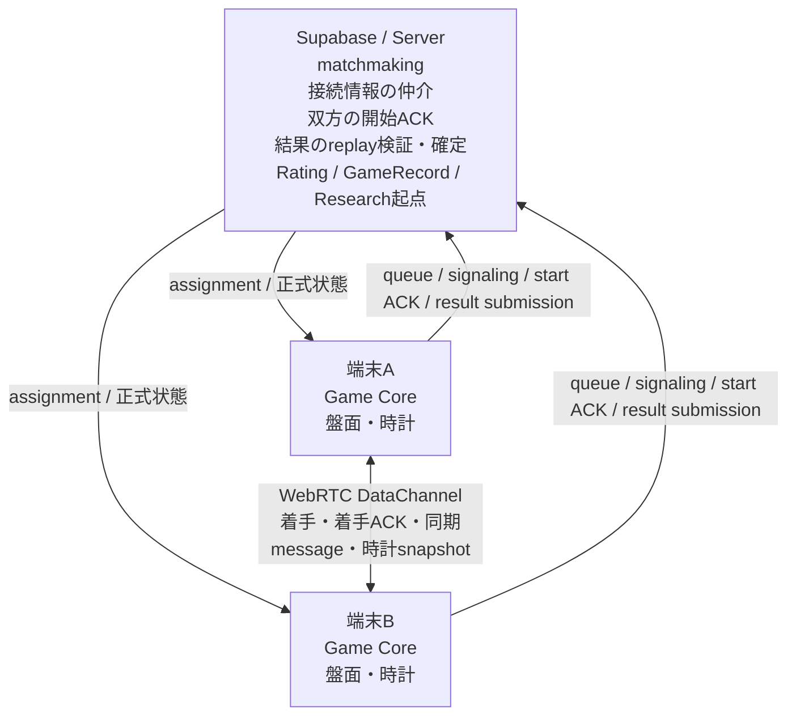
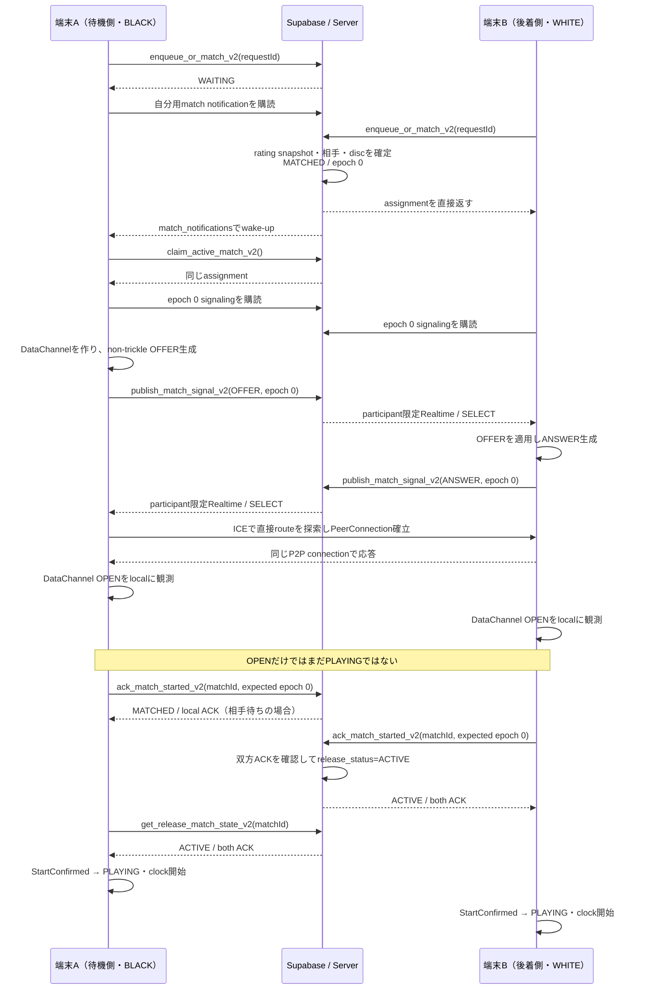
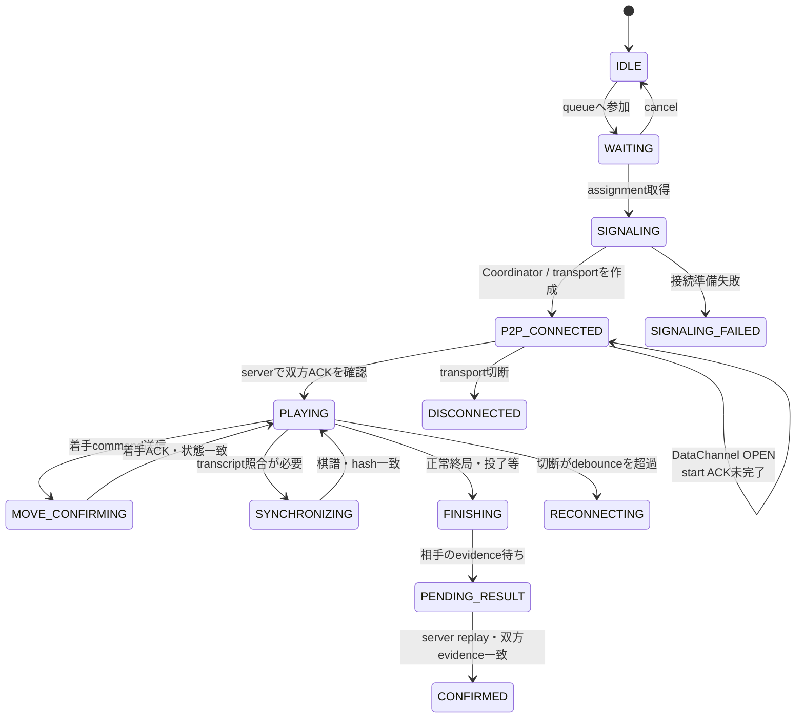
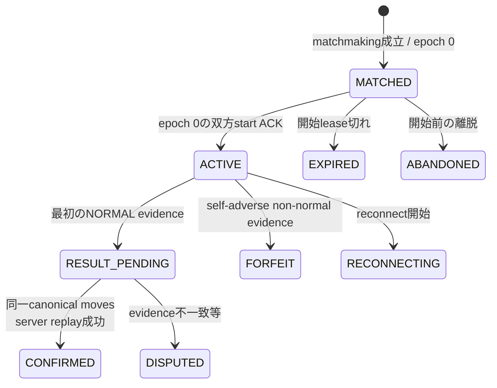

# Online Match Connection — Design Story

## この資料について

この資料は、オンライン対局のAPIや操作手順を網羅するreferenceではありません。通常の初回接続が、なぜ「対局中の通信は端末同士、正式な確定はサーバー」という構成になったのかを、設計判断とactual implementationの流れに沿って説明するdesign storyです。

文書間の役割は次のとおりです。

- [ARCHITECTURE.md](../ARCHITECTURE.md) — repository全体のmodule、security、責務境界
- この資料 — 通常のオンライン接続を、構成を選んだ理由から説明
- [Online Match Reconnect — Design Evolution and Failure Recovery](ONLINE_MATCH_RECONNECT_DESIGN_STORY.md) — 一度成立した接続が失われた後のfailure / recovery設計
- [Operations Map](OPERATIONS_MAP.md) — どの処理がどこで動き、運用時にどこを見るか

説明の正本はcurrent `release-hardening` codeです。特に`WebRtcMatchCoordinator`、`OnlineMatchController`、`SupabaseMatchmakingRepository`、`SupabaseRealtimeSignalingDataSource`、`AndroidWebRtcTransport`、migration `202608250030_release_match_hardening.sql`と、そのunit test / pgTAPを確認して記述しています。

## 1. まず5分で分かる全体像

設計思想を一文にすると、**通信量の多い対局本体は端末同士で行い、第三者による確認が必要な境界だけサーバーに任せる**、です。

対局中の着手は、サーバーを経由せず端末同士が直接通信する方式（P2P）で送ります。Androidアプリ間のリアルタイム接続を作る技術（WebRTC）のうち、任意のdataを運べる通信路（DataChannel）を使います。一方、対戦相手の決定、接続開始の双方確認、結果の検証、RatingやGameRecordの更新はSupabase上のサーバー処理が担当します。



SupabaseはP2Pの着手を常時中継せず、対局をリアルタイム実況しているわけでもありません。それでも「通信路が開いた」という各端末の観測だけで正式な対局開始とはしません。双方が接続確認通知（ACK）を、初回の接続世代番号（epoch 0）についてサーバーへ送り、サーバーが双方のACKを確認してから、各端末は`PLAYING`へ進みます。

終局時も同じ考え方です。端末から受け取った正規化済み着手履歴をサーバーが決定的にreplayし、合法性、終局、勝敗、最終盤面hashを導出します。P2Pは通信コストを抑えるための経路であって、Ratingや永続記録の信用境界ではありません。

## 2. なぜこの構成なのか

### 専用ゲームサーバーを対局本体に置かない理由

一般的な専用ゲームサーバー方式では、各対局の着手、盤面、時計などをサーバーが受け取り、相手へ配信できます。サーバーが全通信を観測しやすい一方、対局数と着手数に応じてサーバー通信量、処理量、場合によってはDB書き込みが増えます。

ちゃんりばは、小規模運用でSupabase等の無料枠または低コストの範囲に収めやすく、対局数に比例してサーバー側のリアルタイム通知機能（Realtime）の通信量やDB書き込みが急増しにくい構成を目指しています。これは無料運用を保証するものではありません。外部サービスの料金とquotaは変わり得ます。

そのため、たとえば60手の対局で、毎手の着手、盤面、時計、自端末の状態をサーバーへ送り続けません。両端末は同じゲームルール実装（Game Core）で盤面を進め、高頻度で一時的な通信をDataChannelへ移します。

### それでも全部をP2Pにしない理由

低コストにしたいからといって、誰と誰が対局したか、正式に開始したか、最終結果、Rating、GameRecord、Researchへ渡す確定情報まで端末の自己申告にはしません。Androidアプリは利用者が制御できる環境であり、第三者による改変や悪意あるrequestを信用境界の内側に置けないからです。

現在の責任分界は次の考え方です。ここでserver authorityとは、サーバーが正式状態と確定権限を持つことです。

- **P2P** — 高頻度で、対局中だけ必要になり、両端末で決定的に検証できる通信
- **Server** — 正式性、公平性、排他性、永続性が必要な境界

つまり、サーバーを使わない設計ではありません。サーバーを使う価値が高い処理へ利用を集中させています。

## 3. ServerとP2Pの責任分界

| 処理 | 主担当 | 現在の実装と理由 |
|---|---|---|
| 認証 | Server | Supabase Authのuser identityを、狭いserver function呼出し（RPC）とuser別row制限（RLS）の境界にする |
| matchmaking | Server | `enqueue_or_match_v2`がofficial rating snapshotとone-active-match制約を使い、正式な相手とBLACK / WHITEを決める |
| match availability notification | Server / Realtime | 待機中の本人へmatch成立を早く知らせる。通知がなくてもclaim / heartbeatで復旧できる |
| signaling | Server / Realtime | P2P接続前のOFFER / ANSWERをparticipant限定、epoch限定で仲介する |
| PeerConnection / ICE | 自分の端末と相手端末 | 直接通信できるnetwork routeを探し、WebRTC接続を作る |
| 着手command / 着手ACK | P2P | 毎手の高頻度通信をサーバーから外す。`commandId`、`ply`、hashで重複・順序・盤面を検査する |
| 盤面進行 | 各端末のGame Core | 同じ合法手を決定的に適用する。live boardをserverへ保存し続けない |
| 対局時計 | 各端末 / P2P | monotonic clockを各端末で進め、着手などのmessageにclock snapshotを含める。tickをserverへ送らない |
| start ACK | Server | 両端末が同じmatch / epochのDataChannelを利用可能と確認したことを、正式状態として集約する |
| 結果提出 | Server RPC | 永続化へ入る狭い認証済み入口。NORMALでは双方から提出された確認材料（evidence）を待つ |
| 棋譜replay | Server | clientが宣言したwinnerを信用せず、双方が同じ意味で読める正規化済み着手履歴（canonical moves）を合法手として再生し、結果と盤面一致確認値（state hash）を導出する |
| Rating | Server transaction | Androidから直接変更できない。確定処理と同じtransactionで更新する |
| GameRecord | Server transaction | verified resultだけをimmutable recordとして保存する |
| Research起点 | Server-side確定データ | GameRecord等が揃った確定経路の最後で起動し、異常・未確定対局を混入させない |

## 4. この資料で使う用語

| 用語 | この資料での意味 |
|---|---|
| P2P | 端末同士が直接通信する方式。着手などの対局中messageを運ぶ。 |
| WebRTC | アプリ間のリアルタイム通信を構築する技術。ここではAndroid端末間のP2P接続に使う。 |
| DataChannel | WebRTC上で任意のdataを送る通信路。着手、着手ACK、同期message、terminal control等を送る。 |
| matchmaking | 対戦相手を探し、正式なmatch、disc、rating snapshotを成立させる処理。 |
| waiting claim | 待機中だった端末が、通知後またはretry時に自分のactive assignmentをserverから取得すること。current RPCは`claim_active_match_v2`。 |
| signaling | WebRTC接続前に、接続提案などの情報をserver経由で交換する処理。対局dataそのものの中継ではない。 |
| OFFER | 「この接続条件で始められる」というWebRTCの接続提案。current protocolではBLACKが送る。 |
| ANSWER | OFFERを受けたWHITEが返すWebRTCの接続応答。 |
| SDP | OFFER / ANSWERに含まれる接続条件の表現。current実装はICE gathering後にまとめて送るnon-trickle方式。 |
| ICE | 2台の端末間で実際に通信できるroute候補を探す仕組み。 |
| STUN | 自端末が外部networkからどう見えるかを知り、直接経路を見つける助けとなるserver。対局dataのrelayではない。 |
| TURN | 直接接続できないとき、通信dataそのものをrelayするserver。current production codeにはTURN設定がない。 |
| Realtime | Supabase Postgres Changesの通知機能。match availabilityとsignalingのcoordinationに限定して使う。 |
| ACK | 受領・利用可能の確認。この資料ではDataChannelの着手ACKと、接続開始をserverへ知らせるstart ACKを文脈で区別する。 |
| epoch | 接続の世代番号。通常の初回接続はepoch 0、再接続はepoch 1..3。古いcallbackを現在の接続へ混ぜないためにも使う。 |
| authoritative | サーバーが持つ正式状態。端末の画面やローカル観測より優先する。 |
| client state | 1台のAndroid端末が持つsession状態。`WAITING`や`P2P_CONNECTED`など、端末だけが知る状態も含む。 |
| server state | Supabaseの`matches.release_status`等に保存される正式なmatch状態。 |
| state hash | 盤面状態を決定的な短い値で表したもの。着手前後の状態一致確認に使う。 |
| ply | 棋譜上の手数。1回の着手を1 plyとして数える。 |
| canonical move history / transcript | 両端末とサーバーが同じ意味で解釈できる形式に正規化した着手履歴。このアプリではほぼ棋譜に相当する。 |
| commandId | 1回の着手送信を識別するID。再送を新しい着手として二重適用しないために使う。 |
| idempotent | 同じrequestが重複しても、二重作成・二重Rating更新などにならず同じ結果へ収束する性質。 |
| RLS | Row Level Security。Supabase/PostgreSQLで、userごとに読めるrowを制限する仕組み。 |
| RPC | Androidからserver上の限定されたfunctionを呼ぶ仕組み。この資料では主にPostgreSQL functionをSupabase経由で呼ぶことを指す。 |
| participant | そのmatchへ正式に割り当てられた参加者。自分の端末のuserと相手端末のuserの2者。 |
| protocol 2 | release-hardening clientが使う、server-authoritative resultとepoch-aware connection/reconnectを持つ現行online match protocol。 |
| role / disc | 盤上のBLACK / WHITE。WebRTCの初回signaling roleにも使い、BLACKがOFFER、WHITEがANSWERを担当する。 |
| server replay | serverがcanonical movesをGame Core相当の規則で再生し、合法性、終局、勝敗、hashを導出する処理。 |
| lease | queueやmatchを有効とみなす期限。clientが消えたときにreservationを永久に残さないために使う。 |
| transaction | 複数のDB更新を一まとまりとして成功または失敗させ、途中状態を外へ確定しない仕組み。 |
| snapshot | ある時点の値を固定して表したもの。rating snapshot、clock snapshot、sync snapshotなどがある。 |
| non-trickle ICE | ICE candidateを1件ずつ送らず、候補収集を待ってOFFER / ANSWERのSDPへまとめる方式。 |

## 5. 通常接続の全体sequence

次の図では、端末Aが先にqueueで待ち、端末Bが後から参加してmatchが成立する例を示します。BLACK / WHITEはserverが割り当てるため、先着・後着とdiscは本来独立です。図を読みやすくするため、ここでは端末AがBLACK、端末BがWHITEになった場合を描いています。



通知またはHTTP responseが失われても、同じ`requestId`でのheartbeat、`claim_active_match_v2`、初期SELECTとbounded reconciliationがactive assignmentやsignalingを回収します。Realtimeだけを唯一のdelivery guaranteeにしていません。

## 6. 通常接続のclient state

Android側の論理状態は次のように進みます。実装上は`MatchmakingController`が`IDLE`、`WAITING`、`SIGNALING`を担当し、assignmentが`OnlineSessionViewModel`へ渡された後、`OnlineMatchController`が`P2P_CONNECTED`以降を担当します。図はそのhandoffを1本のsessionとして表しています。



重要なのは、`DataChannel OPEN`が`P2P_CONNECTED`から`PLAYING`への直接遷移条件ではないことです。OPEN後のstart ACKと、serverが返す双方ACK済みの正式状態が必要です。`RECONNECTING`以降は[Reconnect design story](ONLINE_MATCH_RECONNECT_DESIGN_STORY.md)が説明します。

## 7. Client stateとServer stateは違う

自分の端末は、画面、DataChannel、保留中の着手、local clockを観測できます。サーバーはP2P通信路を常時見ていないため、その細かい状態をDBへそのまま複製しません。逆に、サーバーは正式な参加者、epoch、双方ACK、結果claim、Rating transactionを知っていますが、端末のDataChannelが今この瞬間OPENかを直接は知りません。

protocol 2のserver persisted stateは`matches.release_status`です。通常系で関係する主要遷移だけを抜き出すと次のとおりです。



`PLAYING`はclient state、`ACTIVE`はserver stateです。両者は関連しますが同じものではありません。この違いが、一度通信が切れたときの「端末の観測よりサーバーの正式状態を優先する」というReconnect設計につながります。

なお、legacy compatibility用の`matches.server_status`も残っていますが、hardening clientのlifecycle authorityは`release_status`です。`server_status=CONFIRMED`への更新は、確定transactionの最後で既存Research captureを起動する互換境界としても使われます。

## 8. Matchmaking

matchmakingは単なる「近くのratingを検索するSELECT」ではありません。`SupabaseMatchmakingRepository`は、待機sessionごとに安定したUUIDを`requestId`として保持し、`enqueue_or_match_v2(requestId)`を呼びます。同じrequestが通信失敗で再送されても、別queue rowや別matchを作らないためです。

server側はAndroidから現在ratingを受け取りません。`ratings.current_rating`をsnapshotし、近い候補を探します。candidate selectionには`FOR UPDATE SKIP LOCKED`とuser-scoped lockを使い、同時実行でも同じuserが複数matchへ割り当てられないようにします。`active_match_participants.user_id`のdatabase constraintが、1 user 1 active matchの最終的な不変条件です。

先着の待機端末をA、後着をBとすると、Bのenqueue RPCがmatchを作ってBへassignmentを直接返します。database triggerはprivateな`match_notifications` rowを両者分作り、RPC callerであるBの通知は不要なので削除し、待っているA向けのwake-upを残します。Aは自分の通知をRealtimeで受けると`claim_active_match_v2()`を呼び、同じactive assignmentを取得します。

notificationは低遅延のためにあり、唯一の正解経路ではありません。通知が遅延・欠落しても、foreground待機中は75秒ごとに同じ`requestId`で`enqueue_or_match_v2`を呼び、active assignmentを回収できます。`claim_active_match_v2`もresponse loss後に同じassignmentを返せます。逆に、heartbeatだけにすると成立通知の反映がpolling間隔まで遅れるため、notificationとfallbackを組み合わせています。

`MainActivity`のnotification subscriptionは`WAITING`の間だけ生存し、assignment取得後に閉じます。これにより対局中までmatch availabilityを購読し続けません。

## 9. Signaling

P2Pは端末同士の直接通信ですが、最初から相手の接続条件を知っているわけではありません。「相手へどう接続するか」という情報だけは、直接通信路を作る前に別経路で交換する必要があります。この接続準備情報の交換がsignalingです。

`WebRtcMatchCoordinator`はassignmentを受けると`SupabaseRealtimeSignalingDataSource`を通じて`match_signals_v2`を購読します。BLACKがOFFER、WHITEがANSWERを作り、`publish_match_signal_v2` RPCで送ります。signalはprotocol 2、match、participant、role、現在の`negotiation_epoch`、期限に拘束されます。Androidからtableへ直接INSERTする経路はありません。

RLSは、認証済みuserが自分のlive matchのcurrent epochだけを読めるようにします。つまり誰でも他人のSDPを購読できる構造ではありません。server側はpayload digest、type別slot count、epochを使って重複や過剰送信も制限し、client側もdelivery trackerとhandled setで同じsignalを再処理しません。

購読開始時は既存rowのSELECTとRealtimeを組み合わせ、その境界で通知を取り逃がすraceに対して一度だけbounded ordered SELECTを行います。このreconciliation後もsignaling subscription自体は`WebRtcMatchCoordinator.close()`まで維持されます。通常の着手を運ぶためではなく、接続中のcoordinationと後のReconnectに備えるためです。serverが`ACTIVE`の間はRLS上、initial signaling rowはlive signaling対象ではありません。

## 10. WebRTC / DataChannel

`WebRtcMatchCoordinator`は`AndroidWebRtcTransportFactory`からmatch専用transportを作ります。BLACKはofferer用DataChannelを先に作ってからOFFERを生成し、WHITEはremote OFFERを適用してANSWERを返し、offererがそれを適用します。

current implementationはnon-trickle ICEです。ICE candidateを1件ずつserverへ流すのではなく、ICE gathering完了を待ったlocal SDPを1つのOFFER / ANSWERとしてsignalingします。DataChannelがOPENした後、通常の対局dataはserverを離れます。

着手は`MoveCommand`として送られ、少なくとも次のcontextを持ちます。

- `matchId` — 別matchのmessageを混ぜない
- `commandId` — 再送を同じ着手として扱う
- `ply` — 何手目かを確認する
- `previousStateHash` — 着手前の盤面一致を確認する
- real moveとprotocol version
- 送信時のclock snapshot

受信側はserverが割り当てた相手disc、turn、ply、hash、合法手、command fingerprintを検証します。同じ`commandId`と同じpayloadが再送された場合は着手を再適用せず、同じ`MoveAck`を返します。同じIDで内容だけ変えたmessageはprotocol errorです。

senderはbounded retry後もACKを得られなければ、むやみに次の着手へ進まず`SyncMessage.REQUEST`で同期へ切り替えます。snapshotのcanonical transcriptをGame Coreでreplayし、plyとhashを確認します。forced passも両端末が決定的に適用するため、serverへpass eventを逐次送る必要はありません。

`MatchClock`は各端末のmonotonic timeで進みます。UIのclock tickをnetworkやserverへ送るのではなく、着手や終局messageのsnapshotで相互確認します。Reconnect時のcheckpointとtranscript synchronizationの詳細は別資料へ委ねます。

## 11. なぜstart ACKが必要か

DataChannel OPENは各端末で発生するlocal eventです。自分の端末ではOPENでも、相手端末ではまだOPENしていない、あるいは相手のserver確認だけが失敗している可能性があります。片側の観測だけを「正式に対局開始した証拠」にはできません。

そこで両端末は、初回接続を表すepoch 0を明示して`ack_match_started_v2(matchId, expectedNegotiationEpoch = 0)`を呼びます。SQL functionはparticipantを認証し、match rowをlockし、expected epochがcurrent epochか確認してから`match_start_acks_v2`へidempotentにACKを記録します。

1人目のACKだけでは`release_status`は`MATCHED`のままです。2 participantのACKが同じcurrent epochに揃ったときだけ、serverは`ACTIVE`へ遷移します。`OnlineMatchController`はACK responseだけに依存せず`get_release_match_state_v2`でも正式状態を取得し、同じepochで`ACTIVE`かつboth ACKを確認してから`StartConfirmed`を適用し、`PLAYING`とclock開始へ進みます。

expected epochを持つことで、古いDataChannel OPEN callbackが後から届いても、将来のReconnect epochへ誤ってACKを追加できません。通常接続のepoch 0から、このgeneration-awareな契約が始まっています。

## 12. なぜRealtimeを対局中ずっと使わないのか

current architectureでSupabase Realtimeを使うのは、privateなmatch availability notificationとSDP signalingです。P2P成立後の次の情報はRealtimeへ流しません。

- move command / move ACK
- live board state
- clock tick / live clock
- result submission
- Rating update

結果はauthenticated RPCで提出し、Ratingはserver transactionで更新します。signaling subscriptionはReconnectに備えてCoordinatorの生存期間中維持されますが、対局data transportとして使われるわけではありません。

この限定は、対局数と手数に比例するRealtime trafficやDB write amplificationを避けるための責任分界です。また、着手のnetwork pathを端末間にできるため、server hopを必須にしません。ただしnetwork latencyが常に小さくなることを保証するものではありません。

## 13. STUN / TURNとコスト・到達性

P2P接続では、端末が家庭や携帯networkの内側にあり、互いの到達可能なaddressをそのまま知らないことがあります。ICEは利用できる経路候補を集めて接続を試します。

STUNは、自分の端末が外部からどう見えるかを知り、端末同士が直接つながるための補助をします。TURNは、直接つながれない場合に対局dataそのものをserver経由でrelayします。

current `DefaultIceServers.publicStun`には`stun:stun.l.google.com:19302`だけが設定され、`WebRtcMatchCoordinator`もその設定でtransportを作ります。つまりcurrent implementationはSTUN-onlyで、TURN relayは構成されていません。relay trafficとその運用境界を持たない一方、restrictive NAT、firewall、UDP制限などの組合せによってはP2P接続できない環境があり得ます。

これは「TURNは常に有料だから使わない」という固定的な料金判断でも、result security hardeningの欠陥でもありません。current productのreachability / availabilityとserver relay運用のtrade-offです。実networkでの成功率は2台実機testで確認し、TURNが必要かは利用環境と運用条件を含めて別途判断します。

## 14. 対局中にserverへ送らないもの

通常の各手でserverへ送らないものを明確にすると、次のとおりです。

- 毎手のmove commandとmove ACK
- 毎手適用後のboard全体
- forced passの逐次event
- UI更新ごとのclock tick
- live board state / client session state
- DataChannel上の同期request / snapshot

これらはDataChannelと各端末のGame Core / `MatchClock`で扱います。app-privateなrecovery checkpointは端末内へ保存されますが、Supabase上のlive game logではありません。

serverは、matchmakingやstart ACKなどの境界を除き、対局中の盤面をリアルタイム実況していません。そのためserver trafficは手数やclock tickへ直接比例しにくい一方、端末間の一致確認、重複処理、再送、同期をclient protocolが担う必要があります。

## 15. 終局時にserverへ戻すもの

P2P対局でも、正式な記録とRatingのために終局時はserver authorityへ戻ります。`OnlineMatchController`は`MatchSubmission`を組み立て、`SupabaseOnlineMatchRepository`が`submit_match_result_v2`へ次を渡します。

- idempotentな`requestId`
- canonical move history
- finish reason
- non-normal時のloser disc
- boundedなfinal clock JSON

protocol 2 adapterはclient計算のwinnerやfinal hashをRPCへ渡しません。SQLはparticipant authorizationとmatch row lockを先に行った後、`release_replay_game_v2`でcanonical movesを決定的に再生します。token形式、pass、合法手を検査し、最終盤面hash、disc数、result、terminalかどうかをserver側で導出します。

NORMAL resultでは、同じepochについて双方が同一のcanonical movesとNORMAL evidenceを提出し、replayがterminalまで成功した場合だけ確定経路へ進みます。片側だけなら`RESULT_PENDING`で待ち、evidenceが一致しなければ`DISPUTED`となりRatingを変更しません。

確定時は1 transactionで、`match_results_v2`、immutableな`game_records`、双方の`rating_history`、`ratings`、`user_game_records`を整合させます。既存Research captureを起動するlegacy `server_status=CONFIRMED`への更新は、それらが揃った後のtransaction末尾で行われます。Research参加同意など別の条件はResearch側の設計に従います。

投了、timeout、disconnect等のnon-normal finishはNORMALと同じwinner自己申告ではなく、実際のloser participantによるself-adverse evidenceを要求します。単なるconnectivity failureや一方だけのNORMAL claimから、rated GameRecordを製造しません。

## 16. Server authorityが必要な理由

「P2Pで対局できるなら、Ratingも端末から更新すればserver利用をさらに減らせる」と考えることはできます。しかしRating、GameRecord、Research sourceは一度壊れると他userや集計へ影響する永続dataです。利用者が制御できるAndroid clientを、その更新権限のauthorityにはできません。

current implementationは次の境界を置きます。

- Androidにはservice-role keyを含めない
- authenticated participantだけがnarrow RPCを呼べる
- Androidからofficial Rating / peak / verified resultを直接UPDATEできない
- NORMALは双方の同一canonical evidenceを要求する
- legal replay、terminal、winner、hashをserverが再構築する
- idempotent claimとtransactionで重複確定を防ぐ
- Rating / GameRecord / Research起点を同じ確定順序の内側に置く

P2Pでserverが毎手を観測しない以上、2つのcolluding accountが同じ合法棋譜を作るresidual riskまでは消えません。一方、illegal transcript、arbitrary winner、syntactically validなfake hashをそのまま公式結果にする経路はserver replayで閉じています。コスト境界とtrust boundaryの両方を明示した設計です。

## 17. Cost-aware architecture

この設計は、安さのために正しさを犠牲にしたものではありません。負荷の性質で処理場所を分けています。

| 性質 | 配置 | 例 |
|---|---|---|
| 高頻度・一時的・両端末で検証可能 | P2P | 着手、着手ACK、clock snapshot、transcript synchronization |
| 低頻度・正式性や永続性が必要 | Server | matchmaking、start ACK、result replay、Rating、GameRecord |

通常の1手はDataChannel上のmove commandと小さなpeer ACKで完結し、Supabase requestを発生させません。server処理はqueue、signaling、開始、終局などの境界へ集中します。これにより、対局時間中のclock tickや手数が、そのままRealtime使用量やDB write数にはなりません。

Supabaseのfree tierや低コスト運用を意識した構成ですが、特定の料金、quota、将来の無料利用をこの資料では保証しません。現在の条件はSupabase等の公式情報を確認する必要があります。重要なのは「serverを使わない」ことではなく、「server authorityの価値が高い処理にserver resourceを使う」ことです。

## 18. 設計上のtrade-off

| 判断 | 得られるもの | 受け入れる複雑さ・制約 |
|---|---|---|
| DataChannelで対局dataをP2P送信 | server帯域とper-move処理を抑え、server hopを必須にしない | NAT / firewallの影響、片側だけの観測、retry / dedup / sync protocolが必要 |
| STUN-only | TURN relayのtraffic・credential・運用境界を持たない | direct routeを作れないnetworkでは接続できない可能性 |
| Realtimeをcoordinationに限定 | per-move Realtime usageとDB writeを避ける | serverはlive boardを常時観測できず、終局時replayが必要 |
| start ACKをserverへ集約 | 片側OPENだけで公式startにしない | handshakeとRPC / state確認が1段増える |
| server-authoritative finalization | Rating、GameRecord、Research sourceの整合性を守る | replay、bilateral evidence、transaction、timeout reconciliationが必要 |
| stable request / notification＋heartbeat | lost responseやnotification delayから回復できる | clientとSQLのidempotency、lease、lockが必要 |

この複雑さを受け入れた理由は、高頻度trafficをP2Pへ移しても、開始・結果・永続dataのtrust boundaryをserverに残すためです。P2P特有の非対称な障害観測がReconnect protocolを複雑にした経緯は、Reconnect design storyで詳しく扱います。

## 19. 通常系からReconnectへ

ここまでが正常な初回接続です。

```text
epoch 0
  -> matchmaking / assignment
  -> OFFER / ANSWER signaling
  -> ICE / PeerConnection
  -> DataChannel OPEN
  -> epoch 0の双方start ACK
  -> server ACTIVE
  -> client PLAYING
```

一度`PLAYING`へ入った後にDataChannelが失われ、短い通信揺れを無視する待機処理（debounce）を超えた場合、接続世代はepoch 1以降へ進みます。そこでは「自分が切断を観測したか」と「serverが正式に開始したreconnectへ参加するか」を分離し、古いretryと新しい切断も区別します。

そのfailure model、passive peer、ACK response loss、expected epoch、finite reconnect budgetは[Online Match Reconnect — Design Evolution and Failure Recovery](ONLINE_MATCH_RECONNECT_DESIGN_STORY.md)を参照してください。通常接続から引き継がれる最も重要な前提は、**DataChannelがOPENであることと、server上で対局継続が確定していることは別**、という点です。

## 20. 現在の設計原則

1. **High-frequency game traffic stays peer-to-peer.**  着手、clock snapshot、同期messageはDataChannelで送り、per-move server requestを作らない。
2. **Server authority is reserved for boundaries that require trust.**  match assignment、start ACK、result replay、Rating、GameRecordはserverが正式状態を持つ。
3. **Transport connection is not sufficient evidence of match start.**  DataChannel OPENだけで`PLAYING`にせず、epoch 0の双方ACKを確認する。
4. **Client session state and server persisted state are different concepts.**  `PLAYING`と`ACTIVE`を同じstate machineとして扱わない。
5. **Realtime is coordination infrastructure, not the live game transport.**  match notificationとsignalingに用途を限定する。
6. **Retries are state-aware and idempotent.**  stable request ID、command ID、expected epochを持たせ、重複deliveryやlost responseを二重処理へ変えない。
7. **Official results are reconstructed and verified server-side.**  clientのwinnerやhashをauthorityにせずcanonical movesをreplayする。
8. **Cost efficiency must not weaken Rating / GameRecord / Research integrity.**  高頻度trafficを外しても永続dataのtransaction境界はserverに残す。
9. **Connectivity failure must not manufacture an official result.**  未開始、片側claim、reconnect失敗だけではrated recordを作らない。
10. **Normal connection establishes the generation-aware recovery contract.**  初回からepoch 0を明示し、Reconnect時にも同じmatch generationをserverと照合できるようにする。

この設計は、すべてのnetworkでP2P接続できることや、すべての不具合がないことを証明するものではありません。current codeが守る責任分界とinvariantを示し、STUN-onlyの到達性、Android WebRTCの実挙動、実network上のorderingは2台実機testで確認する対象として残します。
