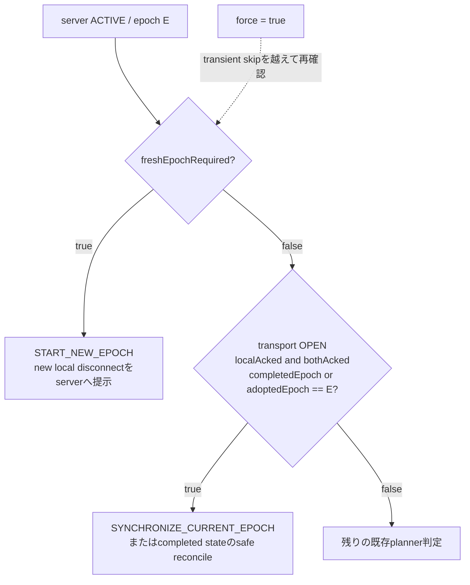
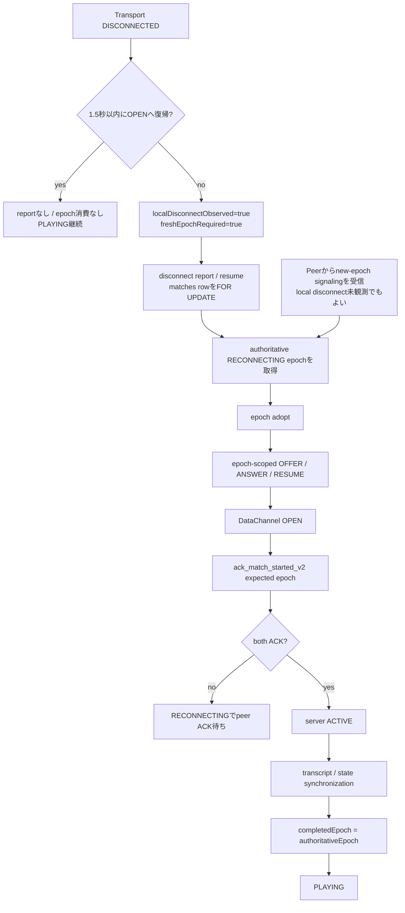

# Online Match Reconnect — Design Evolution and Failure Recovery

- Baseline: `release-hardening` at `6b914f5acfc0cc9f0182ec2ab78ae687d8e34d22`
- Main implementation: [`WebRtcMatchCoordinator.kt`](../app/src/main/kotlin/com/example/othello/WebRtcMatchCoordinator.kt), [`OnlineMatchController.kt`](../feature/match/src/main/kotlin/com/example/othello/match/OnlineMatchController.kt)
- Client/server contract: [`OnlineMatchContracts.kt`](../feature/match/src/main/kotlin/com/example/othello/match/OnlineMatchContracts.kt), [`SupabaseContracts.kt`](../data/supabase/src/main/kotlin/com/example/othello/data/supabase/SupabaseContracts.kt)
- Server authority: [`202608250030_release_match_hardening.sql`](../supabase/migrations/202608250030_release_match_hardening.sql)

## 1. この資料について

この資料は、現在のRPCやclassを網羅的に列挙するreferenceではない。オンライン対戦の再接続が、なぜ単純なtransport recoveryではなく、server authorityとnegotiation epochを明示した設計になったのかを残すdesign storyである。

説明の基準は上記baselineのactual codeである。途中のcommitに存在した挙動はfailure modelを説明するために扱い、現在仕様と混同しない。設計の変化は、commit messageの順番ではなく、次のような「不足していた情報を何で補ったか」という流れとして読む。

| Commit | 閉じようとしたfailure modelと設計上の役割 |
|---|---|
| `d30af8d38c7a06a71ff84273eac20f4f41d8f87b` — `Harden reconnect and recovery abuse boundaries` | reconnectを無制限なclient retryにせず、server-ownedなepoch 0..3、role/epochで隔離したsignaling、bounded recoveryとして定義した |
| `f19b5b294f69637157fe0c63f5d30afb6d5443e1` — `Harden legacy result and recovery boundaries` | transient `DISCONNECTED`のdebounceと、renegotiation前のserver state read／plannerを導入した |
| `e76b605fb87e9a318dfda42eb60dd73fcb7e28f9` — `Close reconnect race and schedule legacy cleanup` | old `ACTIVE` readとdisconnect reportの競合を、row lock下の1回だけのepoch incrementへ収束させた |
| `69cb78c8c0722c4620de5172876a385d4683e499` — `Make reconnect recovery negotiation epoch-aware` | local `RECONNECTING`という粗い状態を分解し、passive peer、ACK response loss、stale generationを扱えるepoch-aware stateとexpected-epoch RPCへ移行した |
| `6b914f5acfc0cc9f0182ec2ab78ae687d8e34d22` — `Prevent completed reconnect retries from spending epochs` | 完了済みepochの後から発火するforce retryと、本当に新しいdisconnectを区別した |

## 2. 背景

CHANRIVAの対局中の着手、時計、transcript同期はWebRTC DataChannelによるP2Pで進む。一方、Supabase PostgreSQLはmatchmaking、signalingの許可、match lifecycle、start ACK、result authority、Rating、GameRecord、Research起点となる確定データを担当する。

この責務分担では、ある端末のWebRTCが`OPEN`へ戻ったことと、server上で対局の再開が確定したことは同じではない。片側だけが新しいchannelを見ていても、相手が同じgenerationへ参加したとは限らない。また、RPC responseが届かなかったことからDB transactionの成否は判断できない。

したがってreconnectで守る対象は、接続感だけではない。両participantが同じnegotiation epochを共有し、そのepochのDataChannelを双方がACKし、transcriptを同期してから対局へ戻ることが必要である。これを満たせない場合は、勝者を推測してrated resultを作らず、boundedな`EXPIRED`へ収束させる。

## 3. 初期モデル

初期のreconnectは、概念的には次のモデルだった。

```text
local DISCONNECTED
  -> RECONNECTING
  -> renegotiation
  -> DataChannel OPEN
  -> PLAYING
```

これはMVPとして不合理な設計ではない。両端末がほぼ同時に切断を認識し、RPCが明確に成功し、callbackが順番どおり届く通常ケースには十分だった。

しかし、P2Pでは両端末の観測が対称とは限らない。Android callback、WebRTC state、signaling、HTTP response、PostgreSQL transactionは別々に進む。単一の`RECONNECTING`だけでは、少なくとも次を区別できなかった。

- 自分が物理切断を観測して新しいreconnectを要求しているのか
- peerが開始したauthoritative epochへ参加しているだけなのか
- ACK requestをまだ送っていないのか、送ったがresponseだけ失ったのか
- serverではACKが片側だけなのか、双方完了して`ACTIVE`なのか
- 同じepochを現在交渉中なのか、すでに同期まで完了したのか
- retryが現在の障害に対するものか、以前予約された遅延jobなのか

現在の複雑さは、この不足していた情報をclient stateとserver contractへ明示した結果である。

## 4. Failure 1 — 片側だけが切断を観測する

WebRTCの切断観測は対称ではない。例えばAだけが`DISCONNECTED`を観測し、debounce後のdisconnect reportによってserverが`RECONNECTING / epoch 1`へ進んでも、Bは旧DataChannel上で`PLAYING`のままということがある。

Bはepoch 1の`OFFER`または`RESUME`を受け取り、新しいPeerConnection/DataChannelを準備できる。しかし以前のモデルでは、reconnect participantであることがlocal `DISCONNECTED`から導かれていた。Bは切断を観測していないためControllerがreconnect recoveryへ入らず、すでに対局開始済みであることを理由にDataChannel `OPEN`後のstart ACK pathへ入れなかった。

その結果、transport自体は復旧してもcurrent epochのbilateral ACKが成立しない。serverは`RECONNECTING`から`ACTIVE`へ戻せず、deadline後はrated winnerを作らない`EXPIRED`へ進む。このfailureから、「切断を申告したこと」と「authoritative reconnect epochへ参加すること」を同じbooleanで表してはいけないことが分かった。

## 5. 設計上の転換 — local transport stateとprotocol stateを分離

`69cb78c8`では、Controllerのreconnect stateを`ReconnectEpochProgress`として分解した。中心となる考え方は、local transport observationとserver-authoritative protocol generationを別の軸にすることである。

| Field | 現在の意味 | なぜ必要か |
|---|---|---|
| `authoritativeEpoch` | clientが受け入れた最新のserver negotiation epoch | local callbackの回数ではなく、どのserver generationが現在の基準かを保持するため |
| `adoptedEpoch` | 現在このclientがsignaling／DataChannel ACKへ参加しているepoch。完了後は`null`になる | passive peerを含め、「このepochのparticipantである」ことをlocal disconnectとは独立に表すため |
| `completedEpoch` | bilateral ACK後のtranscript/state synchronizationまで完了したepoch | 完了済みgenerationを遅延retryや重複signalingで再び開かないため |
| `signalingStarted` | adopted epochについてsignaling開始を記録したmilestone | epochを知っただけの状態と、実際にnegotiationを開始した状態を区別して観測するため |
| `ackRequestSent` | adopted epochについてACK requestを送信しようとしたこと | request送信とserver commit確認を同一視しないため。これは成功証明ではない |
| `serverLocalAcked` | adopted epochについてserverがlocal ACKを確認した状態 | HTTP responseの有無ではなく、server row上のlocal evidenceを表すため |
| `serverBothAcked` | adopted epochについてserverが双方ACKを確認した状態 | DataChannel `OPEN`だけで`ACTIVE`へ戻さず、bilateral completionを要求するため |
| `localDisconnectObserved` | このadoptionの原因にlocal disconnect observationがあったか | local claimantとpassive participantを区別するため |
| `freshEpochRequired` | debounceを越えた新しいlocal disconnectが、まだauthoritative epoch adoptionに消費されていないこと | 完了済みepochのretryと、本当に次epochを必要とするeventを区別するため |

`passiveParticipation`は`adoptedEpoch != null && !localDisconnectObserved`から導出される。つまりpassiveであることは別のserver statusではなく、同じauthoritative epochへ参加しながらlocal disconnect evidenceを持たないclient-side relationである。

代表的なstate snapshotは次のようになる。

| 状況 | authoritative | adopted | completed | local disconnect | fresh required |
|---|---:|---:|---:|---:|---:|
| epoch Eの同期完了後 | E | `null` | E | false | false |
| その後に新しいlocal disconnectがdebounceを通過 | E | `null` | E | true | true |
| passive peerがepoch E+1 signalingを採用 | E+1 | E+1 | E | false | false |
| local claimantがepoch E+1を採用 | E+1 | E+1 | E | true | false |

## 6. Passive reconnect participation

現在の`WebRtcMatchCoordinator.handle()`は、roleに合うepoch-scoped `RESUME`、`OFFER`、`ANSWER`を受信すると、未完了のnew epochを`shouldAdoptReconnectEpochFromSignal()`で判定する。new authoritative epochであれば、peer自身が`DISCONNECTED`を観測していなくても`adoptAuthoritativeReconnectEpoch()`を呼ぶ。

```text
new authoritative epoch signaling
  -> epoch adopt
  -> RECONNECTING participantになる
  -> epoch-scoped signaling / transport generation
  -> DataChannel OPEN
  -> ackMatchStarted(matchId, expectedNegotiationEpoch)
  -> server bilateral ACK
  -> ACTIVE
  -> transcript/state synchronization
  -> completedEpoch更新
  -> PLAYING
```

このpathは`beginReconnectGrace()`を通らない。そのため`freshEpochRequired`やlocal disconnect claimを新しく作らない。passive peerはserver-authoritative negotiationへ参加するが、「相手が切断した」というevidenceを捏造しない。

`onDataChannelOpen(epoch)`は、開始済み対局でもControllerが`RECONNECTING`で`adoptedEpoch == epoch`なら`handleTransportRecovered(epoch)`へ進む。ACKはtransportが開いたという一般的な通知ではなく、採用済みの具体的epochへ結び付く。

## 7. Failure 2 — RPC response loss

分散システムでは、request failureとoperation failureは同じではない。

```text
client: ack_match_started_v2(epoch 3) を送信
server: transaction commit、双方ACK成立、ACTIVE / epoch 3
network: HTTP responseだけを喪失
client: request failureに見え、local RECONNECTINGが残る
```

ここでclientが「失敗したように見えたから次のreconnectを開始する」と判断すると、serverでは成功済みのepoch 3に対してfresh resumeを要求することになる。epoch budgetのserver contractから見ると、それは4回目のreconnect要求であり、`RECONNECT_BUDGET_EXHAUSTED_UNRATED`による`EXPIRED`が正しい応答になってしまう。原因はserverではなく、clientが曖昧なRPC結果を新しいprotocol eventとして解釈したことにある。

`69cb78c8`は、local `RECONNECTING`だけを次epoch開始の根拠にしないようにした。ACK requestのresponseを失ったときは、まずserver stateを読み、同じepochのACKがcommit済みかを確認する。

## 8. Server authoritative reconciliation

`OnlineMatchController.handleTransportRecovered()`は、adopted epochを指定して`ackMatchStarted()`を呼ぶ。例外になった場合、直ちに別epochを作るのではなく、`getMatchStartState()`でauthoritative rowを再取得する。

取得した`MatchStartAck`には`serverStatus`、`negotiationEpoch`、`localAcked`、`bothAcked`が含まれる。serverが同じepochについて`ACTIVE / localAcked / bothAcked`を返せば、clientはACK responseを受け取れなかった事実よりserver commitを優先し、`reconcileAuthoritativeStartState()`からtranscript synchronizationへ進む。

設計原則は「API呼出しが失敗したら同じmutationをblindly retryする」ではなく、「成否が曖昧なら、次のmutationより先にauthoritative stateを読む」である。`ackRequestSent`は送信の事実、`serverLocalAcked`と`serverBothAcked`はserver確認済みの事実として分離されている。

同期ではrequest ID付きの`SyncMessage`を交換し、canonical transcript、ply、state hashを検証する。`applySyncSnapshot()`が収束を確認して初めて`completedEpoch = authoritativeEpoch`となり、Controllerは`PLAYING`へ戻る。したがってserver ACKとtranscript completionも別のmilestoneである。

## 9. expected epoch contract

現在のKotlin contractは、`OnlineMatchRepository.ackMatchStarted()`と`resumeMatch()`の両方でnon-nullな`expectedNegotiationEpoch: Int`を必須にしている。`SupabaseOnlineMatchRepository`はそれを`p_expected_epoch`として`ack_match_started_v2()`／`resume_match_v2()`へ渡す。

これはretryがどのgenerationを対象にしていたかをserverが判定するためのfencing contextである。例えば「epoch 2用DataChannelのOPEN」で送ったACKがepoch 3へ遅れて届いても、epoch 3のACKとして扱ってはならない。

| RPC / request | 現在のserver behavior |
|---|---|
| `ack_match_started_v2`, future expected epoch | live matchのauthoritative epochより先なら拒否する |
| `ack_match_started_v2`, stale expected epoch | current stateを返すだけで、newer epochへACK rowを追加しない |
| `ack_match_started_v2`, current expected epoch | current epochへidempotentにACKし、双方分が揃った場合だけ`ACTIVE`へ戻す |
| `resume_match_v2`, future expected epoch | 拒否する |
| `resume_match_v2`, stale expected epoch while `ACTIVE` | current stateをread-onlyで返し、epochもbudgetも消費しない |
| `resume_match_v2` while `RECONNECTING` | current authoritative epochへjoinし、epochは増やさない |
| `resume_match_v2`, current expected epoch while `ACTIVE` | fresh reconnectとしてepochを1増やす。epoch 3なら増やさずunrated expiryへ進む |

SQL functionの`p_expected_epoch`にはmigration上`default null`が残っているが、現在のAndroid interfaceとSupabase adapterは必ずintegerを渡す。上表のstale/future fencingは、このcurrent client pathのnon-null expected epochに対するcontractである。

一般化すると、retry可能なmutationには「何をしたいか」だけでなく、「どのstate generationに対する操作だったか」を識別できるcontextが必要である。

## 10. Failure 3 — disconnect reportとresumeのrace

disconnectを観測したControllerは、debounce後に`submit_match_result_v2(..., DISCONNECT, opponent)`を送り、serverをbounded recoveryへ進める。同時にCoordinatorもserver stateを読み、必要なら`resume_match_v2()`を送る。この2要求がどちらも独立にepochを増やすと、1回のdisconnectでbudgetを2回消費する。

さらに、Coordinatorが`ACTIVE / same epoch`を読んだ直後にdisconnect reportがcommitするorderingがある。`f19b5b2`時点では、OPENかつlocal Controllerが`RECONNECTING`なら同期して終了する判断があり、read後にserverだけが次epochへ進む可能性が残った。`e76b605`は、debounceを越えたlocal reconnectではold `ACTIVE` readを完了証明とみなさず、`START_NEW_EPOCH`へ進むようにした。

server側では`resume_match_v2()`と`submit_match_result_v2()`が同じ`matches` rowを`FOR UPDATE`する。現在の更新式は、lock取得後に見た状態が`ACTIVE`の要求だけを`+1`し、`RECONNECTING`を見た後着要求は`+0`でcurrent epochへjoinする。

```text
report first: ACTIVE E -> RECONNECTING E+1 -> resume joins E+1
resume first: ACTIVE E -> RECONNECTING E+1 -> report joins E+1
```

これによりarrival orderが違っても、server stateはexactly one epoch incrementへ収束する。client plannerの`freshEpochRequired`は、このrow-locked transitionへ入るべきlocal eventが存在することを表す。

## 11. Failure 4 — completed recovery後のdelayed force retry

epoch-aware化後にも、最後にもう1つのfailureが残った。問題はACK response lossそのものではなく、その間に予約され、後から発火するforce retryだった。

```text
epoch 3 ACKがserverでcommit
  -> HTTP response loss
  -> clientは一時的にRECONNECTING
  -> retryCurrentOperation()がforce=true jobを予約
  -> 別経路のauthoritative reconciliationとtranscript syncが成功
  -> PLAYING / completedEpoch=3 / adoptedEpoch=null / freshEpochRequired=false
  -> 予約済みforce jobが遅れて発火
```

`69cb78c8`時点のplannerは`adoptedEpoch`と`freshEpochRequired`を見ていたが、`completedEpoch`を入力に持っていなかった。同期完了後は`adoptedEpoch`が`null`になるため、遅延jobからは「epoch 3を完了済み」という情報が見えない。`force=true`によってtransient skipを越え、`START_NEW_EPOCH`を選べた。

その結果、`resume_match_v2(expected_epoch=3)`はserverから見ればstaleではなくcurrent epochへのfresh requestである。serverは契約どおりbudget exhaustionとして`EXPIRED`にするが、clientの意図は古いretryだった。このfailureは、expected epochだけでは「同じcurrent epochの完了済みretry」と「同じcurrent epochから始まる新しいdisconnect」を区別できないことを示した。

## 12. completedEpoch と freshEpochRequired

`6b914f5`では、`scheduleTransportRenegotiation()`が実行時点の`ReconnectEpochProgress`を取り直し、`completedReconnectEpoch`を`planReleaseRenegotiation()`へ渡すようにした。重要なのはfield追加そのものではなく、判定の優先順位である。



actual plannerではterminal state、`RECONNECTING`／`MATCHED`のcurrent-epoch signalingを先に処理し、その後の`ACTIVE`で次の順序になる。

1. `freshReconnectEpochRequired == true`なら`START_NEW_EPOCH`。
2. freshでなく、transportが`OPEN`、serverのlocal/both ACKがtrueで、server epochがadvanced、adopted、またはcompletedのいずれかなら`SYNCHRONIZE_CURRENT_EPOCH`。
3. それ以外をtransient skipやfresh negotiationの既存判定へ渡す。

`SYNCHRONIZE_CURRENT_EPOCH`分岐は`requestReconnectEpochIfRequired()`より前にreturnするため、completed epochの遅延force retryは`resume_match_v2()`を呼ばない。Controller側も、`PLAYING / OPEN / adoptedEpoch=null / completedEpoch==serverEpoch / fresh=false`のauthoritative `ACTIVE` readを冪等な成功として扱う。

ここで`force=true`は、「completed authoritative epochを破棄して必ず新epochを作る」という意味ではない。通常のtransient skipで止めずserver reconciliationを試すためのhintであり、fresh eventとcompleted evidenceの意味を上書きしない。

## 13. Reconnect budget

reconnect budgetはclientのretry counterではなくmatch-wideなserver stateである。epoch 0がinitial negotiation、epoch 1..3が利用可能なreconnect generationであり、DB constraint、signaling、ACK、result evidenceにも0..3の境界が適用される。

完了済みepochへのstale requestやdelayed force retryはbudgetを使わない。一方、epoch 3のrecoveryが完了して`PLAYING`へ戻った後、本当に新しい`DISCONNECTED`がdebounceを越えれば、ControllerはcompletedEpoch 3を保持したまま`freshEpochRequired=true`にする。plannerではfreshがcompletedより優先される。

```text
ACTIVE / epoch 3 / completedEpoch 3
  -> new DISCONNECTED
  -> debounce経過
  -> freshEpochRequired=true
  -> current epoch 3へのfresh resumeまたはdisconnect report
  -> RECONNECT_BUDGET_EXHAUSTED_UNRATED
  -> EXPIRED（epoch 4は作らない）
```

つまり「retryをstate-awareにした」ことは、「reconnect budgetを無効にした」ことではない。曖昧な再送は消費させず、新しい障害eventだけをserver budgetへ提示する。

budget exhaustionはliveness failureであり、winner evidenceではない。`match_results_v2`、`rating_history`、`game_records`、`user_game_records`やResearch起点を作らず、rated forfeitにも変換しない。

## 14. 現在のreconnect lifecycle

現在の正常recoveryは、transport、server lifecycle、client protocol stateを次の順で収束させる。



local claimantではdebounce後に`freshEpochRequired`を立て、disconnect reportとresumeのどちらかがserver epochを開始する。passive peerではnew-epoch signalingそのものがadoption triggerであり、disconnect reportは送らない。どちらも採用後は同じepoch-scoped signaling、ACK、synchronization pathへ合流する。

process death recoveryでも、serverから回収したactive assignmentの`negotiationEpoch`とapp-private checkpointを起点にする。local snapshotだけをauthorityにせず、server lifecycleを再確認してからnegotiationまたはreconciliationを選ぶ。

## 15. 現在の設計原則

1. **Transport state is not protocol state.** `OPEN`はpacket pathの状態であり、server上のbilateral ACKやtranscript convergenceを意味しない。
2. **Local observation is not authoritative state.** 一方の`DISCONNECTED`や`RECONNECTING`だけから、相手やserverのgenerationを推測しない。
3. **Request failure is not operation failure.** HTTP response loss後はDB commit済みの可能性を考え、authoritative stateを読む。
4. **Retries must be idempotent or state-aware.** 同じrequestを安全に再送できない場合は、mutationの前にcurrent stateと対象generationを照合する。
5. **Stale requests must identify the generation/epoch they target.** ACKとresumeはcurrent Android contractでexpected epochを必ず送り、古いDataChannelやretryをnewer epochへ適用しない。
6. **Authoritative state belongs on the server.** lifecycle、current epoch、ACK集合、deadline、budget exhaustionはSupabaseが決める。
7. **Reconnect budget must be server-authoritative.** processごとのcounterではなく、locked match rowのepoch 0..3で制限する。
8. **Completed recovery and fresh disconnect are different events.** `completedEpoch`と`freshEpochRequired`を分け、前者のretryを抑止しつつ後者を新しいrecoveryへ進める。
9. **Race ordering should converge to the same state.** disconnect reportとresumeは、arrival orderにかかわらず同じ1 epochへjoinする。
10. **Recovery must not manufacture rated results or persistent match records.** livenessを証明できないreconnect failureはunrated expiryとし、Rating、GameRecord、Research入力へ変換しない。

## 16. Server-side invariants

現在のSQLが保証するreconnect関連の主要invariantは次のとおりである。

- `matches.negotiation_epoch`、protocol 2のACK、signal、result claimは0..3に制約される。
- `ack_match_started_v2()`と`resume_match_v2()`はauthenticated participantだけを受け入れ、対象`matches` rowを`FOR UPDATE`する。
- non-null expected epochがfutureなら、live requestを拒否する。
- stale ACKはauthoritative newer epochへACKを追加せず、current stateだけを返す。
- stale `ACTIVE` resumeはnewer epochを変更せず、budgetを消費しない。
- `ACTIVE` current epochへのfresh resumeだけがepochを`+1`する。`RECONNECTING`へのresumeは`+0`でjoinする。
- disconnect reportも同じrowをlockし、`ACTIVE`でのみ`+1`、`RECONNECTING`では`+0`となる。
- `publish_match_signal_v2()`はparticipant、role、protocol version、current epoch、live statusを検証し、別epochのsignalingを混在させない。
- current epochのparticipant 2名のACKが揃った場合だけ、`MATCHED`／`RECONNECTING`から`ACTIVE`へ遷移する。
- epoch 3のcurrent `ACTIVE`からfresh reconnectが必要なら、epoch 4を作らず`RECONNECT_BUDGET_EXHAUSTED_UNRATED`で`EXPIRED`にする。
- terminalized matchをreconnectで再開しない。
- reconnect budget exhaustionや片側のliveness allegationだけでは、rated result、Rating、GameRecord、Research起点を確定しない。

## 17. Client-side invariants

現在のKotlin実装が維持するclient-side invariantは次のとおりである。

- transient `DISCONNECTED`が1.5秒以内に`OPEN`へ戻れば、disconnect reportを送らずepochを消費しない。
- Coordinatorはrenegotiation前にserver stateを読み、local transport stateだけで次epochを決めない。
- passive peerはnew authoritative epoch signalingからepochをadoptできる。
- passive adoptionは`beginReconnectGrace()`を通らず、disconnect claimを生成しない。
- DataChannel `OPEN`時のACKは`adoptedEpoch`をexpected epochとして送る。
- ACK response loss時は`getMatchStartState()`でserver ACK状態をreconcileする。
- serverのlocal/both ACK確認後にtranscript synchronizationへ進み、その完了後に`completedEpoch`を更新して`PLAYING`へ戻る。
- completed authoritative epochは、`force=true`の遅延retryでも新epochとして再消費しない。
- debounceを越えた新しいlocal disconnectの`freshEpochRequired=true`はcompleted判定より優先される。
- stale signalingはepochで除外し、accepted roleとcurrent generationを満たすsignalだけをtransportへ適用する。

## 18. テスト戦略

reconnect testはhappy pathの関数呼出し数ではなく、failure modelごとのinvariantを固定している。

- **Transient disconnect:** `oneSidedTransientDisconnectReturnsToOpenWithoutConsumingServerReconnect`と`transientOpenWithUnchangedActiveEpochDoesNotRenegotiate`が、debounce内復帰でreport/resume/epoch消費がないことを確認する。
- **Passive peer:** `passivePeerAdoptsAuthoritativeEpochAndAcksWithoutDisconnectClaim`がclaimなしのadoption、current epoch ACK、同期後`PLAYING`を確認する。`passivePeerNewEpochSignalUsesCoordinatorAdoptionGate`はCoordinator `handle()`が使用するproduction adoption predicateを固定する。
- **Report/resume ordering:** planner testがreport先着時のcurrent-epoch signalingとold `ACTIVE` read時のfresh STARTを分ける。pgTAPはreport-first／resume-first双方でepochが1回だけ増え、bilateral ACK後に`ACTIVE`へ戻るfixtureを持つ。
- **ACK response loss:** `committedEpochTwoAckWithLostResponseReconcilesFromServerWithoutResume`と`committedEpochThreeAckWithLostResponseDoesNotConsumeEpochFour`が、ACK commit後のresponse lossをserver readから回復し、resumeを呼ばないことを確認する。
- **Delayed force retry:** `delayedForcedRetryAfterCompletedEpochThreeSynchronizesWithoutResume`が、`completedEpoch=3 / fresh=false / force=true`で同期を選び、production resume dispatch callbackが0回であることを確認する。Controller testは完了済み`ACTIVE`の再reconcileが冪等に`PLAYING`を維持することも確認する。
- **Genuine epoch 3 exhaustion:** `genuineDisconnectAfterCompletedEpochThreeRequestsBudgetDecision`がfresh=trueのplanner優先順位を固定する。pgTAPはcurrent epoch 3 resumeとDISCONNECT reportの両pathがepoch 4を作らずunrated `EXPIRED`になることを確認する。
- **Stale expected epoch:** pgTAPはstale DataChannel ACKがnewer epochへACK rowを作らないことと、stale `ACTIVE` resumeがcompleted epoch 3を変更しないことを確認する。future epochの拒否はSQL本体の分岐として実装されている。
- **Persistent data非生成:** budget exhaustion、片側disconnect、mutual disconnect、one-sided NORMAL等について、`match_results_v2`、`rating_history`、`game_records`が作られないことをpgTAPで確認する。

baselineのlocal Supabase pgTAPは542件すべてPASSしている。Kotlin unit test、Gradle compile/lint/assemble、Worker test、SQL security／boundary checkを含むGitHub Actions run `32719923138`も対象commitでsuccessした。

## 19. 最終監査結果

`6b914f5`に対する最後の限定監査結果は次のとおりだった。

```text
Critical: 0
High: 0
Medium blockers: 0
```

completed-epoch delayed force retryは、actual planner input、production dispatch、Controllerの冪等reconcileまで確認してCLOSEDと判定された。genuine epoch 3 exhaustion、stale ACTIVE race、passive peer participationも維持され、オンライン対戦release-hardeningは実装修正フェーズを終了して2台実機smokeへ進むGO判定となった。

これはreconnectにバグが存在しないことの証明ではない。unit testはplanner、dispatch gate、Controller、SQL transactionを層別に固定している一方、実Android WebRTC、実network handover、HTTP response loss、1.5秒delayと複数callbackの実scheduler orderingを1つのfixtureですべて再現してはいない。これらは2台実機smokeで確認するremaining integration riskである。

## 20. What this document is not

この資料は次のものではない。

- WebRTC一般の解説
- Supabase一般の解説
- オンライン対戦全体のAPI／state reference
- Research設計
- Rating policy仕様
- protocol 1 legacy compatibility仕様書

scopeは、protocol 2 reconnect designが現在のepoch-aware modelへ至った理由と、そのfailure recovery invariantに限定する。
