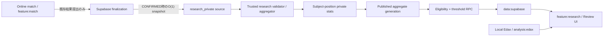
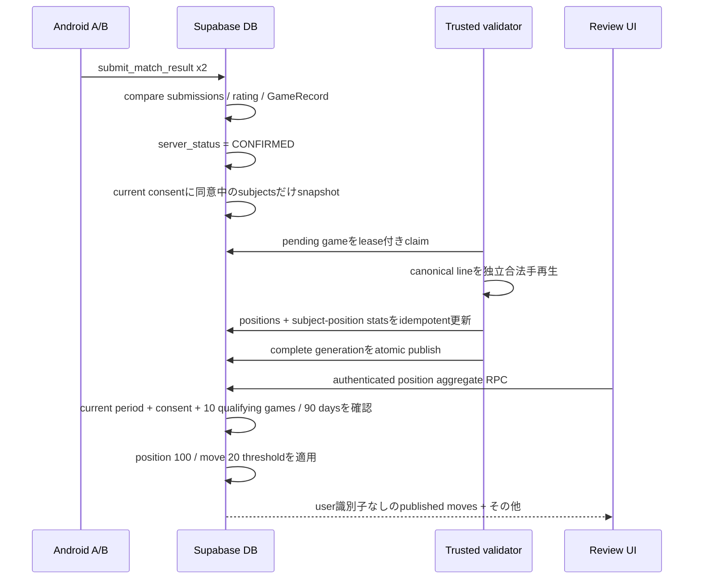

# ちゃんりば 研究データ機能 大枠設計

- Status: Product decisions accepted（未実装）
- Repository baseline: `260c1381663fe76c405f33e02be2ac0cc6c831f0`
- Previous design document commit: `3f92338593beda96c8afeac6e5edcfba3d7b2dcc`
- Reviewed at: 2026-08-11
- Scope: 対局後に「人間がその局面で何を選び、その後どうなったか」を集約公開する機能

この文書は、実装前の設計判断を記録する。以下では、現行コード・migrationから確認できる事実を「現行の事実」、今回確定した研究機能の仕様を「確定設計」、実装担当が合理的に選択できる事項を「実装時判断」と明記する。

## 0. 結論

推奨するのは、次のハイブリッド方式である。

1. 個人向け `game_records` とは別に、研究専用のコンパクトな確定棋譜ソースを長期保持する。
2. account lifetimeから独立した内部 `research_subject_id` を導入し、研究ソースには、サーバーで取得した確定時刻、結果、finish reason、各同意済みsubjectの対局前rating、participation periodを保存する。
3. Androidから研究用rawデータを投稿させない。`CONFIRMED` 遷移をDBで検出し、研究用snapshotを作る。
4. 信頼済みbackendがcanonical movesを独立に合法手再生し、受理した棋譜だけを集計する。
5. 集計の中間層では、局面ごとに「research subject別の選択回数」を保持する。公開層ではsubject IDを完全に除いたaggregate snapshotだけを保持する。
6. Androidは、Opt-in設定・自分のeligibility・threshold通過済みaggregateだけをRPCから取得する。raw tableをSELECTしない。
7. `1ユーザー = 総weight 1` はイベント数ではなく、局面ごとのユーザー内選択比率を先に計算してからユーザー間平均することで保証する。

この方式は後述の案Dに相当する。個人GameRecordの最新50件制限と研究データの長期育成を分離しつつ、Opt-out後とaccount deletion後も同意済み寄与を保持し、rating bucket変更・期間変更時の再集計可能性を残す。

## 1. 現行実装の調査結果

### 1.1 ArchitectureとAndroid境界

現行の事実:

- `:core:game` はPure Kotlinで、盤面、合法手、着手、pass、終局、canonical move、position hashを所有する。
- `:feature:match` はlive matchを所有し、Edax/analysisへ依存しない。boundary checkでも禁止されている。
- `:feature:records` はimmutableな `GameRecord` と取得portを所有する。
- `:feature:review` は `GameRecord` から任意ply・variationの `GameState` を再構築し、`:analysis:api` のみを利用する。
- `:analysis:edax` はAndroidローカルのJNI実装であり、Supabaseやlive matchへ到達しない。
- Supabase SDK型は `:data:supabase` 内に閉じられ、appへはアプリ独自portだけが公開される。

根拠:

- [`ARCHITECTURE.md`](../ARCHITECTURE.md)
- [`scripts/check-boundaries.ps1`](../scripts/check-boundaries.ps1)
- [`GameRecord.kt`](../feature/records/src/main/kotlin/com/example/othello/records/GameRecord.kt)
- [`ReviewSession.kt`](../feature/review/src/main/kotlin/com/example/othello/review/ReviewSession.kt)
- [`SupabaseContracts.kt`](../data/supabase/src/main/kotlin/com/example/othello/data/supabase/SupabaseContracts.kt)

研究機能でもこの方向を維持する。live matchは研究機能を知らず、ReviewだけがEdax結果と研究aggregateを画面上で合流させる。

### 1.2 現行DB tableと研究機能への関係

| Table | 現行の事実 | 研究機能での扱い |
| --- | --- | --- |
| `profiles` | Auth作成時にtriggerで作成する内部互換row。legacy `display_name`列はクライアント非公開・更新不可。account deletion後も共有棋譜整合性のtombstoneとして残る | research contributorのFK先には使わない。account削除後の研究retentionをprofile tombstoneへ依存させない |
| `ratings` | 現在rating・peakを保持。Androidは更新不能 | 研究では現在値を使わず、対局確定時のrating beforeをsnapshotする |
| `rating_history` | 1 user / matchでunique。確定時に2行追加。ユーザーごと最新100件へprune | 長期研究の再集計元にはできない。確定時に `rating - delta` を研究側へcopyする |
| `matches` | server statusは `CREATED/PENDING_RESULT/CONFIRMED/DISPUTED/ABANDONED`。participantのみSELECT | `CONFIRMED` 遷移だけを研究captureの起点とする |
| `match_submissions` | 両participantのcanonical moves/result/hash/finish reason一致を確認。確定後に削除 | 研究側から直接参照し続けない |
| `game_records` | 1 match 1行。canonical moves、result、final hash、players、時刻、time control、finish reasonを保持 | capture時の信頼済みsource。研究長期保存は別tableへcopyし、以後FK依存しない |
| `user_game_records` | userとGameRecordの参照。各userの最新50参照を保持 | 研究retentionと分離する。研究tableから参照しない |
| `account_deletion_requests` | Androidは要求のみ。trusted Workerがprivate data削除・Auth削除・完了処理 | 削除要求受付時の新規capture停止と、Auth削除前のresearch subject unlinkを既存workflowへ追加する |
| `match_signaling` / notification / ACK / active reservation | online session用 | 研究機能から参照しない |
| credential / verification tables | private evidence管理 | 研究機能から参照しない |

根拠となるmigrationは [`supabase/migrations`](../supabase/migrations) の001〜017、特に002、009、010、011、014、016、017である。

### 1.3 GameRecordの作成・保持

現行の事実:

1. 両participantが同じcanonical moves、result、final hash、finish reasonを提出した場合だけ `CONFIRMED` になる。
2. `CONFIRMED` transaction内でGameRecordを1件作り、ratingを1回だけ更新する。
3. GameRecordは `match_id` がPKで、clientにはINSERT/UPDATE/DELETE権限がない。
4. `user_game_records` は各userにつきfinished_at降順で最新50参照を残す。
5. どの `user_game_records` からも参照されないGameRecordは削除でき、その後confirmed matchも短期retention後に削除できる。
6. Kotlinの `recent()` も最大50件へ制限する。

注意点として、GameRecordのRLSは `players` 配列でparticipantを判定し、`user_game_records` の存在自体を可視性条件にしていない。そのため、片方の参照がprune済みでも相手側参照によってrowが残っている間は、DB上のrow寿命は厳密な「各user 50件」と一致しない場合がある。研究設計はこの寿命へ依存しない。

### 1.4 Resultとcanonical movesの信頼度

現行の事実:

- DBはparticipant、P2P start ACK、payload形式、サイズ、列挙値、両者一致、重複submit、rating二重更新を検証する。
- `NORMAL` は空棋譜不可で、`RESIGNATION/TIMEOUT/DISCONNECT` は0手を許容する。
- 現行DBはcanonical movesをReversiルールで一手ずつ再生していない。両clientが同じ不正な合法性payloadを提出した場合まで独立検証する仕組みではない。

したがって研究集合知へ取り込む前に、信頼済みbackendで独立した合法手再生が必要である。これは現在のonline/rating経路を作り直す指示ではなく、研究データ汚染を防ぐ追加境界である。

### 1.5 RLS・RPC・公開profile

現行の事実:

- Authoritative writeは狭い `SECURITY DEFINER` RPCを通す。
- Androidへservice-role keyを置かない。
- authenticated roleには必要最小限のtable権限だけを付与し、RLSを併用する。
- internal cleanup/prune RPCはauthenticated/PUBLICから実行不能である。
- legacy `public_profiles` viewは初回公開版では`anon`・`authenticated`の両方から権限を撤回し、公開プロフィールとして利用しない。

研究APIは `public_profiles` とjoinしてはならない。研究responseには `user_id`、表示名、opponent、match ID、個別棋譜へのlinkを含めない。

### 1.6 Account deletion

現行の事実:

- Androidは `request_account_deletion()` のみ実行できる。
- trusted Cloudflare Workerがverification Storageを削除し、service-role-only RPCでDBをprepareし、Auth Admin APIでidentityを削除してからcompleteする。
- private rating、rating history、credential、verification、本人のrecord参照は削除される。
- opponentのshared immutable GameRecordを壊さないため、profile UUIDは匿名tombstoneとして残り得る。

研究機能を追加すると、削除要求受付時にactive participation periodを閉じて新規captureと閲覧を止め、Auth identity削除前にaccount UUIDとresearch subjectのlinkを不可逆に外す段階が必要になる。すでにcaptureされ、validatorによりACCEPTEDとなる寄与とaggregate weightは削除しない。

### 1.7 再利用できる部分と変更が必要な部分

再利用する:

- `CONFIRMED` を唯一の研究capture起点とする。
- canonical move形式、result、finish reason、final hash、time control、confirmed時刻。
- `rating_history.rating - rating_history.delta` による対局前rating。
- current account deletion Workerとretryable deletion request。
- RLS、deny-by-default privilege、service-role-only administrationの思想。
- `:core:game` の座標系と合法手fixtureをvalidatorのcross-testへ利用する。

追加が必要:

- 明示的Opt-inと参加期間。
- GameRecordとは独立した研究source retention。
- server-side legal replay/validation。
- 1 user weightを保証するprivate aggregation中間層。
- threshold適用済みの公開RPC。
- Give-to-Get eligibility。
- Consent version、Opt-out後の将来capture停止、account deletion時のresearch subject unlink。
- `:feature:research` と `:data:supabase` の新しいport実装。
- research table/RPCを含むboundary/pgTAP/security contract。

## 2. 推奨アーキテクチャ

### Android

- 新規 `:feature:research` が、参加状態、eligibility、研究position summaryのアプリ独自interfaceとUI stateを所有する。
- `:data:supabase` がRPC DTOとSupabase SDK実装を所有する。
- `:feature:review` は研究interfaceだけを利用し、Edax結果と合法手座標でmergeする。
- `:feature:match`、`:feature:matchmaking`、`:core:network`、`:transport:webrtc` はresearchへ依存しない。
- variation局面は閲覧問い合わせに利用できるが、variationそのものを研究contributionへ保存しない。
- research responseはmemory-only cacheを基本とする。Opt-out/sign-out時に即clearし、過去に取得した集合データをOFF後もdiskから閲覧できる設計にしない。

### Supabase/Postgres

- raw/private研究tableは非exposed schema `research_private` に置く。
- `anon` / `authenticated` / `PUBLIC` へschema usage・table権限を与えない。
- client-facing RPCだけ `public` に置き、`SECURITY DEFINER SET search_path = ''`、schema-qualified query、明示GRANTを使う。
- `CONFIRMED` transitionでは研究snapshotをO(1)で作るだけにし、棋譜再生・集計は行わない。
- capture対象は、`CONFIRMED` の線形化点でcurrent consent versionへ同意済みのactive participation periodを持つparticipantだけ。相手がOFFでも、ON側本人の選択だけをcontributionとして数える。

### Trusted validator / aggregator

- Androidとは別のtrusted backendで動かす。既存Cloudflare Workerの拡張または専用workerを候補とする。
- service-role secretはworker secretとしてのみ保持する。
- pending research gameをlease付きでclaimし、canonical lineを独立再生する。
- validation、position extraction、subject-position再計算、aggregate generation作成を担当する。
- provider固有typeをAndroidへ公開しない。

### Edaxとの関係

- Edaxは従来どおりAndroidローカルのReview専用。
- server-side Edax、cloud analysis、Edax値の研究DB保存はv1では行わない。
- Review UIが同じ合法手座標に対して、Edaxの `EXACT/HEURISTIC/BOOK` と研究のchoice/outcomeを並べる。

## 3. 推奨データモデル

以下は論理モデルであり、今回migrationは作成しない。名前は実装時の推奨名である。

### 3.1 `research_private.policy_versions`

| 項目 | 設計 |
| --- | --- |
| 目的 | eligibility、公開threshold、normalization、collection状態とcurrent consentをversion管理 |
| PK | `policy_version bigint` |
| 重要column | `effective_at`, `research_consent_version integer`, `eligibility_min_games=10`, `eligibility_window_days=90`, `position_min_users=100`, `move_min_users=20`, `min_decisions_per_qualifying_game=10`, `ruleset_version`, `normalization_version`, `collection_enabled`, `is_active` |
| FK | `research_consent_version -> consent_versions` |
| UNIQUE | active rowが1つだけになるpartial unique |
| Index | `is_active`, `effective_at desc` |
| Retention | 参照中および監査・再集計に必要な期間、過去versionを長期保持 |

値をcode constantだけにせず、変更履歴を残す。Androidがthresholdやcurrent consent versionを決定してはならない。active policyの切替は、captureと直列化する単一のpolicy pointer更新として扱う。

### 3.2 `research_private.consent_versions`

| 項目 | 設計 |
| --- | --- |
| 目的 | 明示同意文書を整数versionで識別し、同意時の内容を監査可能にする |
| PK | `consent_version integer` |
| 重要column | `effective_at`, `document_sha256`, `summary`, `created_at` |
| FK | なし |
| UNIQUE | `document_sha256` |
| Index | `effective_at desc` |
| Retention | participation periodまたはpolicyから参照される間と、監査に必要な期間長期保持 |

初期値は `research_consent_version = 1` とする。本文自体はversion管理されたrepository内resourceで提供し、DBのdigestと一致させる。特定法制度上の「匿名加工情報」等の用語は、適合性を別途確認しない限り使わない。

### 3.3 `research_private.research_subjects`

| 項目 | 設計 |
| --- | --- |
| 目的 | account lifetimeと独立して、`1 user = total weight 1` の内部単位を保持 |
| PK | `research_subject_id uuid`（推測不能なrandom UUID） |
| 重要column | `account_user_id uuid null`, `link_state=LINKED/DELETION_PENDING/UNLINKED`, `linked_at`, `unlinked_at`, `created_at` |
| FK | `profiles` / `auth.users` へのFKは張らない |
| UNIQUE | `account_user_id is not null` のpartial unique |
| Index | linked account lookup用partial unique、`link_state` |
| Retention | contributionのweight維持・再集計に必要な期間長期保持。寄与を保持する間はUNLINKED subjectも保持 |

`account_user_id` は、本人向けRPCをsubjectへ解決するための一時的なaccount linkである。account deletion時はactive periodを閉じ、`account_user_id = null`、`link_state = UNLINKED` とする。research側にはaccount UUIDのhash、profile FK、旧accountへ戻す別mappingを残さない。unlink後のsubjectは「サービスaccountから切り離された研究用内部subject」であり、法的・数学的な匿名性を主張するものではない。

同じ人物が後日新しいaccountを作成しても新規subjectを作り、過去subjectへ再接続しない。このためaccount再作成や複数accountを横断した「一人」を技術的に統合はしないが、各subjectについて局面総weight 1を厳守する。これはSybil対策とは別問題である。

### 3.4 `research_private.participation_periods`

| 項目 | 設計 |
| --- | --- |
| 目的 | 明示Opt-inの期間、再Opt-in世代、同意versionを保持 |
| PK | `participation_id uuid` |
| 重要column | `research_subject_id`, `started_at`, `ended_at`, `policy_version_at_start`, `consent_version`, `created_at` |
| FK | `research_subject_id -> research_subjects`; `policy_version_at_start -> policy_versions`; `consent_version -> consent_versions` |
| UNIQUE | `ended_at is null` のopen期間はsubjectごとに最大1件。`(participation_id, research_subject_id)`もunique |
| Index | `(research_subject_id, started_at desc)`, open partial index |
| Retention | consent provenanceと過去contributionの再集計に必要な期間長期保持 |

有効な参加状態は、open periodがあり、subjectが `LINKED` で、periodの `consent_version` がactive policyのcurrent consent versionと一致する場合だけである。version mismatchのopen periodはcollectionにも閲覧にも使わない。再同意・再Opt-inでは既存periodを閉じて新しいrowを作り、eligibilityを0から開始する。過去rowを再openしない。

### 3.5 `research_private.games`

| 項目 | 設計 |
| --- | --- |
| 目的 | 個人GameRecordから独立した、再集計可能なcompact research source |
| PK | `research_game_id bigint generated identity` |
| 重要column | `source_match_key bytea`, `source_kind=ONLINE`, `canonical_moves`, `result`, `finish_reason`, `final_position_hash`, `time_control`, `confirmed_at`, `ruleset_version`, `validation_status`, `validator_version`, `attempt_count`, `lease_expires_at`, `processed_at`, `rejection_code` |
| FK | `source_match_id`、`game_records`、profile/auth tableへのFKは張らない |
| UNIQUE | `source_match_key`。match UUIDのserver-side digest等を使い、二重captureを防止 |
| Index | `(validation_status, lease_expires_at, confirmed_at)`, `confirmed_at` |
| Retention | ACCEPTEDは研究機能の提供・再集計に必要な期間長期保持。REJECTEDは診断期間後（推奨30日）削除可能 |

直接のmatch FKを持たないため、個人GameRecord pruningやterminal match cleanup後も残る。`source_match_key` は一般clientへ返さず、元match UUID自体や可逆mappingを保存しない。canonical lineはprivateであり一般clientへ返さない。active consentを持つparticipantが0人ならresearch game自体を作らない。

### 3.6 `research_private.game_contributors`

| 項目 | 設計 |
| --- | --- |
| 目的 | どの同意済みresearch subjectの選択を1 contributionとして扱うかを保持 |
| PK | `(research_game_id, research_subject_id)` |
| 重要column | `participation_id`, `disc`, `rating_before`, `rating_algorithm_version`, `outcome_from_subject_perspective`, `confirmed_at`, `decision_count`, `contribution_status=PENDING/ACCEPTED/REJECTED`, `accepted_at` |
| FK | `research_game_id -> games on delete cascade`; `research_subject_id -> research_subjects`; `(participation_id,research_subject_id) -> participation_periods` |
| UNIQUE | subject/gameは1行だけ。source matchとの組合せで二重寄与不能 |
| Index | `(participation_id, confirmed_at desc)`, `(research_subject_id, contribution_status)` |
| Retention | ACCEPTEDはperiod close、Opt-out、consent version変更、account unlink後も研究機能に必要な期間長期保持 |

`rating_before` はclient入力ではなく、確定transactionの `rating_history.rating - delta` からcopyする。現在ratingで後付け分類しない。`decision_count` はvalidatorが、そのsubjectのdiscで実際に選択した合法手だけを数える。0手終了はACCEPTEDにできるがaggregateへ加えるdecisionがなく、eligibilityにも数えない。

### 3.7 `research_private.positions`

| 項目 | 設計 |
| --- | --- |
| 目的 | 集計対象positionのlossless dictionary |
| PK | `position_id bigint generated identity` |
| 重要column | `ruleset_version`, `normalization_version`, `black_bits bit(64)`, `white_bits bit(64)`, `side_to_move`, `legal_move_mask bit(64)` |
| FK | なし |
| UNIQUE | `(ruleset_version, normalization_version, black_bits, white_bits, side_to_move)` |
| Index | unique indexでlookup。必要ならposition public token hash |
| Retention | sourceまたはaggregateから参照される間長期 |

v1のposition identityは盤面の黒bitboard、白bitboard、side-to-moveである。`ply`、wall-clock、subject、match、consecutive pass数をkeyに含めない。選択可能な局面だけを記録し、forced passやterminal positionはchoice positionとして数えない。

既存 `GameState.stateHash()` はFNV hashにcurrent player、pass数、plyを連結するため、研究DBのlossless keyとしては使わない。公開tokenは例として `r8v1:<black-hex>:<white-hex>:B|W` のようにversion付き・可逆・衝突なしとする。

v1では回転・鏡映・色反転による同一視を行わない。将来D4対称正規化を導入する場合は `normalization_version` を上げ、raw research sourceから別generationを再構築する。

### 3.8 `research_private.aggregation_generations`

| 項目 | 設計 |
| --- | --- |
| 目的 | 部分更新中の値を公開せず、完全なaggregateをatomic publish |
| PK | `generation_id bigint` |
| 重要column | `policy_version`, `normalization_version`, `status=BUILDING/READY/PUBLISHED/FAILED`, `source_watermark`, `started_at`, `completed_at`, `published_at` |
| UNIQUE | PUBLISHED active generationはpolicy/normalization単位で1つ |
| Index | `(status, started_at)`, `published_at desc` |
| Retention | current + 直前1generationを推奨。古いものは削除可能 |

### 3.9 `research_private.aggregation_segments`

| 項目 | 設計 |
| --- | --- |
| 目的 | ALL、将来のrating帯・期間など、server定義の有限segmentを表す |
| PK | `(generation_id, segment_key)` |
| 重要column | `segment_type`, `rating_min_inclusive`, `rating_max_exclusive`, `period_start`, `period_end`, `definition_version` |
| FK | `generation_id -> aggregation_generations` |
| UNIQUE | generation内の`segment_key` |
| Index | `segment_key` |
| Retention | generationと同じ |

Androidから任意のmin/max ratingや任意期間を渡させない。固定segmentだけを選択可能にし、differencing attackを抑える。v1は `ALL` のみでよい。

### 3.10 `research_private.subject_position_totals`

| 項目 | 設計 |
| --- | --- |
| 目的 | 1 user weightの分母 `N(u,p)` を保持するprivate/rebuildable中間表 |
| PK | `(generation_id, segment_key, position_id, research_subject_id)` |
| 重要column | `occurrence_count` |
| FK | generation、segment、position、research subject |
| UNIQUE | PKそのもの |
| Index | `(generation_id,segment_key,position_id)`, `(research_subject_id,generation_id)` |
| Retention | rebuildable cache。active/previous generationのみ |

### 3.11 `research_private.subject_position_moves`

| 項目 | 設計 |
| --- | --- |
| 目的 | subjectごとのmove選択回数と結果内訳を保持 |
| PK | `(generation_id, segment_key, position_id, research_subject_id, move_index)` |
| 重要column | `choice_count`, `win_count`, `draw_count`, `loss_count` |
| FK | 対応するsubject_position_total、position、generation |
| UNIQUE | PKそのもの |
| Index | `(generation_id,segment_key,position_id,move_index)`, `(research_subject_id,generation_id)` |
| Retention | rebuildable cache。active/previous generationのみ |

### 3.12 `research_private.position_aggregates`

| 項目 | 設計 |
| --- | --- |
| 目的 | position全体の公開判定用aggregate |
| PK | `(generation_id, segment_key, position_id)` |
| 重要column | `unique_contributors`, `generated_at` |
| FK | generation、segment、position |
| UNIQUE | PKそのもの |
| Index | `(generation_id,segment_key,position_id)` |
| Retention | generationと同じ |

### 3.13 `research_private.move_aggregates`

| 項目 | 設計 |
| --- | --- |
| 目的 | moveの公開判定、選択率、結果率を返す |
| PK | `(generation_id, segment_key, position_id, move_index)` |
| 重要column | `unique_contributors`, `choice_weight_sum numeric`, `win_weight_sum numeric`, `draw_weight_sum numeric`, `loss_weight_sum numeric`, `child_position_id` |
| FK | generation、segment、position、child position |
| UNIQUE | PKそのもの |
| Index | `(generation_id,segment_key,position_id)` |
| Retention | generationと同じ |

### 3.14 Account unlink lifecycle

research contributionを削除しないため、account deletion向けの寄与削除jobやaffected-position rebuildは設けない。削除要求受付transactionでactive periodを閉じ、subjectを `DELETION_PENDING` にする。その後、既存account deletion Workerがservice-onlyかつidempotentなunlink処理を呼び、別transactionで `account_user_id = null / UNLINKED` へ移す。retry時にlinked subjectが見つからなければ成功済みとして扱う。unlink処理はcontributor、research game、subject-position stats、published aggregateを変更しない。

## 4. GameRecordと研究データの分離方針

### 比較

| 案 | 長所 | 短所 | 評価 |
| --- | --- | --- | --- |
| A. `game_records` を長期化 | 最小実装。既存canonical lineを直接使える | 最新50件のbounded storageを破壊。個人閲覧retentionと研究retentionが結合。account deletion・privacy境界が曖昧 | 非推奨 |
| B. 研究用raw棋譜を別保存 | compactで再集計しやすい。rating/期間/opening定義変更に強い | raw lineとsubject linkをprivateに長期保持する。集計時に毎回棋譜再生が必要 | 単独では不足 |
| C. 局面decisionだけ長期保存 | GameRecordから完全分離。削除・局面queryが明快 | 1 game約60行で容量とindex負荷が大きい。opening再分類やnormalization変更に弱くなりやすい | Free運用では主sourceにしない |
| D. 研究raw source + subject-position中間 + 公開snapshot | compactな再集計source、正確なweight、速い公開query、account unlink後の再集計を両立 | pipelineとgeneration管理が必要 | 推奨 |

推奨Dでは、長期のsource of truthは `research_private.games`、`research_subjects`、`participation_periods`、`game_contributors` である。subject-position tablesと公開aggregateは再構築可能な派生データとする。個人GameRecordを削除しても研究sourceは残る。Opt-outまたはaccount deletionで個人向けdataを処理しても、同意中にcaptureされた研究sourceとweightは維持される。

## 5. データフロー

詳細:

1. 既存online finalizationが `CONFIRMED` 以外なら何もしない。
2. `CONFIRMED` への初回遷移をcaptureの唯一の境界時点とし、その線形化点でcurrent consent versionに同意済みのactive periodを持つparticipantだけをcaptureする。
3. captureはcanonical sourceとserver-side rating snapshotを数行INSERTするだけ。棋譜再生はしない。
4. workerは `FOR UPDATE SKIP LOCKED` 相当とleaseでgameを一度だけclaimする。
5. 初期盤面から全tokenを再生し、合法手、pass、final hash、NORMAL終局結果を検証する。
6. 実際に選択肢が存在した局面だけを抽出する。forced passは選択として数えない。
7. Opt-in contributorがその局面で打ったmoveだけをそのsubjectの統計へ加える。OFFのopponentのmoveを、そのopponentの寄与として数えない。
8. 同一subject/positionの全履歴から分母とmove比率を再計算する。global aggregateへ対局1件をそのまま加算しない。
9. 完成したgenerationだけをpublishする。
10. RPCはeligibilityとthresholdを毎回server-sideで再確認して返す。

### Captureの線形化点とrace

境界時点はmatch開始時ではなく、既存finalization transactionが初めて `server_status = CONFIRMED` を成立させる瞬間とする。この同一transaction内でresearch snapshotを作るため、棋譜・rating・同意状態の組合せが一意に決まる。実装では次の順序でlockする。

1. active policy pointerをshare lockし、`collection_enabled` とcurrent `research_consent_version` を固定する。
2. participantにlinkされたresearch subjectをUUID昇順で `FOR UPDATE` lockする。
3. `link_state = LINKED`、削除要求中でないこと、open periodがあること、periodのconsent versionがcurrentと一致することを再確認する。
4. 条件を満たすsideだけ `games` / `game_contributors` をidempotent INSERTする。0 sideならresearch rowを作らない。

Opt-out、再同意、account deletion request受付も同じsubject rowをlockする。current consent versionの切替は同じpolicy pointerをexclusive lockする。これにより、並行操作はDBのlock取得順で次のどちらかへ必ず線形化される。

- 対局開始時ONでも、Opt-outが先にcommitしてからCONFIRMEDならcaptureしない。CONFIRMEDが先ならcaptureし、その寄与は後のOFFで削除しない。
- 対局開始時OFFでも、current consentへ同意した新periodが先にcommitしてからCONFIRMEDなら、その対局のON側decisionをcaptureする。研究提供の同意境界は対局開始ではなくCONFIRMEDであることをconsent/UIに明示する。
- CONFIRMEDとOpt-outが同時なら、同じsubject lockで先に線形化された操作が決める。二重判定や中間状態はない。
- consent version切替が先なら旧version periodは不一致となりcaptureしない。CONFIRMEDが先なら、その時点でcurrentだったversionに基づくcaptureを保持する。
- account deletion request受付が先ならperiodを閉じ `DELETION_PENDING` にするためcaptureしない。CONFIRMEDが先ならcapture済み寄与を保持し、その後account linkだけを外す。

worker validationがOpt-outやaccount unlinkより後になっても、CONFIRMED時点でcapture済みのPENDING contributionは取消さない。合法性検証に合格すればACCEPTEDへ進め、失敗なら通常どおりREJECTEDにする。

### Validation rule

- `server_status = CONFIRMED` のみ。
- legacyで `final_position_hash is null` のGameRecordは研究対象外。
- canonical token列が初期盤面から合法に再生できること。
- `--` はそのsideに合法手がない場合だけ。
- `NORMAL` は終局局面かつ盤面結果とofficial resultが一致すること。
- `RESIGNATION/TIMEOUT/DISCONNECT` は途中局面を許容し、official confirmed resultを保存する。
- final hashは再生結果と一致すること。
- validation failureはrating/GameRecordを変更せず、研究側だけREJECTEDにする。

## 6. `1ユーザー = 総weight 1` の正確な集計

position `p`、server-defined segment `s`、research subject `u`、move `m` を考える。account deletion後も同じsubjectを用いるため、unlinkによってweightは変わらない。

- `N(u,p,s)`: user `u` がposition `p` で何らかのmoveを選んだ回数
- `N(u,p,m,s)`: そのうちmove `m` を選んだ回数
- `W(u,p,m,s) = N(u,p,m,s) / N(u,p,s)`

userごとに必ず次が成立する。

`Σm W(u,p,m,s) = 1`

positionのunique user数を `U(p,s)` とすると、move選択率は次である。

`choice_rate(p,m,s) = Σu W(u,p,m,s) / U(p,s)`

例: あるuserがC4を8回、D3を2回なら、そのuserの寄与はC4=0.8、D3=0.2である。別のuserが1局だけC4ならC4=1.0であり、100局対1局でもuser総weightは同じ1である。

結果率も同じ重みを使う。`Win(u,p,m,s)` をそのuserがmove `m` を選んだ対局の勝数とすると、move `m` の勝率は次である。

`win_rate(p,m,s) = Σu [Win(u,p,m,s) / N(u,p,s)] / Σu W(u,p,m,s)`

draw/lossも同様である。これにより、同じmoveを大量に指したuserが勝率でも過大weightを持たない。分母を `N(u,p,m,s)` にしてuserごとのmove勝率を単純平均する方式は、たまに選んだmoveと常用moveを同じ重みにするため採用しない。

rating segmentごとに集計する場合、各対局の `rating_before` がそのsegmentに属するsampleだけを先にfilterし、そのsegment内で上記を再計算する。複数segmentの値を足してALLを作ってはならない。同じuserが複数rating帯に現れるためである。

## 7. 100 unique / 20 unique / その他

### Position

- `U(p,s) = count(distinct research_subject_id)`。UIでは「unique contributors」と表現する。
- `U(p,s) >= active_policy.position_min_users` のときだけpositionを公開可能。
- 99以下では `INSUFFICIENT_SAMPLE` のみ返し、実数99を返さない。
- start position、任意ply、final前、variationのいずれも同じ判定を使う。

### Move

- `U(p,m,s) = count(distinct research_subject_id where N(u,p,m,s) > 0)`。
- 20以上のmoveだけcoordinate、choice rate、result rate、move unique countを個別表示する。
- 19以下のmoveはcoordinate別統計を返さない。

### その他

- suppressed move集合の `choice_weight_sum`、win/draw/loss weightを合算して1つの `OTHER` を返す。
- `OTHER` のunique contributorsは、suppressed moveのunique数の単純和ではなく、suppressed moveのどれかを選んだ `distinct research_subject_id` のunionで計算する。
- `OTHER` unionが20未満ならexact unique countは返さず、nullまたは「20未満」とする。
- `OTHER` は複数moveの集合なのでchild drill-downを提供しない。

### Child position

- 公開moveのchildであっても、child position自身について `U(child,s) >= 100` を再確認する。
- parentの100条件やmoveの20条件をchildへ引き継がない。
- childが未達なら `canExplore=false` だけを返し、child aggregateは返さない。
- forced passが発生する場合、move適用後にforced passを解決した「次に選択可能なside-to-move」のpositionをchildとする。

Thresholdはquery時にactive policyから読む。20を変更した場合、move aggregateの基礎値はそのまま使い、個別/OTHERの分類だけを変えられる。

## 8. Give-to-Get eligibility

### 確定rule

current participation periodについて、次をすべて満たす場合だけeligibleとする。

1. callerのaccountへlinkされたsubjectが `LINKED` で、open participation periodが存在する。
2. periodのconsent versionがactive policyのcurrent `research_consent_version` と一致する。
3. `source_kind = ONLINE`、`contribution_status = ACCEPTED`。
4. trusted validatorが合法手再生・result・final hashの整合性検証を完了している。
5. 本人の `decision_count >= min_decisions_per_qualifying_game`。初期値は10。
6. `confirmed_at >= server_now - 90 days` かつ、そのcontributionがcurrent participation periodに属する。
7. 上記を満たすdistinct research game数が10以上。

90日境界はserverの`timestamptz`で `[now - interval, now]`、下限inclusiveとする。Android時刻を使わない。

aggregate inclusionとeligibilityは分離する。`ACCEPTED` かつ `decision_count` が1〜9のgameでは、その合法なdecisionをaggregateへ含めるが、Give-to-Getの1局には数えない。0手終了はdecisionがないためaggregateにも加算せず、eligibilityの水増しにも使えない。

### RPC behavior

- `set_research_participation(true, accepted_consent_version)`: current versionと一致する明示同意だけを受理する。有効な同version periodがすでにあればidempotent。OFF後またはversion mismatch後は旧periodを再openせず、新periodを作る。
- `set_research_participation(false, null)`: open periodをserver時刻でclose。idempotent。以後のaggregate RPCは即拒否するが、過去contributionは変更しない。
- `get_research_participation_status()`: ON/OFF、`RECONSENT_REQUIRED`、current consent version、current periodのqualifying count、required count、window days、eligibleを返す。自分の情報だけ。
- `get_research_position(...)`: 毎回current periodと件数をDBで検証する。clientの `eligible=true` を信用しない。

再Opt-inまたは再同意では新しいperiodを作り、件数は0から始める。過去periodの局数をcurrent eligibilityへ流用しない。90日経過で10未満へ落ちた場合も、次のRPCで自動失効する。Cronだけに依存しない。

## 9. Opt-in / Opt-out / account deletion

### 9.1 Consent versionとOpt-in

- 研究参加ONにはcurrent `research_consent_version` への明示同意を必須とする。初期versionは1。
- current versionとopen periodのversionが一致しなければ、参加は有効とみなさず、新規captureも閲覧も許可しない。
- 再同意では旧periodを閉じ、新periodを開始する。旧periodのqualifying gamesは流用しない。
- feature launch以前のGameRecordは、当時の研究同意がないためbackfillしない。
- consentは、研究参加中のonline対局を集合知へ提供すること、個人scoutingとして公開しないこと、集合統計として公開すること、OFF後は新規提供と閲覧を止めるが過去寄与は利用継続すること、account削除後もaccount linkを外して寄与を保持する場合があること、raw dataを一般clientへ出さないこと、Give-to-Get方式であることを含む。

### 9.2 Opt-in判定時点

`CONFIRMED` 成立時点を唯一の判定境界とする。match開始時の状態はsnapshotしない。OFFのままCONFIRMEDになった過去対局を後日のON操作でbackfillしない。ON/OFF/consent/deletionとのraceは第5章の共通lock規約で線形化する。

### 9.3 片方だけOpt-inした対局

- 片方だけONでも、ON側subject自身が選んだmoveだけを寄与として受理する。
- OFF側にはcontributor rowを作らず、OFF側のdecisionをそのsubjectのweightへ入れない。
- full canonical lineはON側decisionの合法性・局面文脈を検証するprivate sourceとして保持できる。ただしOFF側のaccount/subject IDをresearch contributorとして保存せず、一般clientへraw lineを公開しない。
- participationはmatch単位ではなくsubject単位の同意である。相手がOFFであることを理由にON側の提供を無効にしない。

### 9.4 Opt-out

- Opt-outは「過去同意の撤回」ではなく「今後の提供停止」と定義する。
- OFF transactionでopen periodをserver時刻により閉じる。これより後に線形化されたCONFIRMEDから新しいcontributionを作らない。
- aggregate RPCはOFF transaction直後から拒否し、Androidのmemory cacheもclearする。
- OFF前にcapture済みのPENDING/ACCEPTED contributionは削除せず、集計対象状態も変更しない。PENDINGはvalidator結果に従ってACCEPTEDまたはREJECTEDへ進める。
- 過去ACCEPTED contributionとaggregate weightは保持し、Opt-outを理由としたaggregate再生成は行わない。
- 再Opt-inは新periodを開始し、Give-to-Get countを0から計算する。過去periodのcontribution自体は残すが、新periodの資格へ旧局数を流用しない。

### 9.5 Account deletion

- account deletion request受付transactionでsubjectをlockし、open periodを閉じ、`link_state = DELETION_PENDING` とする。以後の新規captureと閲覧を止める。
- 既存Workerはprivate account dataの既存処理に加え、Auth identity削除前にservice-only unlinkを実行する。
- unlinkは `account_user_id` をnullにして `UNLINKED` とする。research tableには旧account UUID、profile FK、旧account UUIDのhash、復元用mappingを残さない。
- `research_subject_id`、participation periods、ACCEPTED contributors、compact source、subject-position stats、aggregate weightは保持する。account deletionを理由に再集計やthreshold後退を発生させない。
- unlink後も同一subject内の全履歴をまとめられるため、`1 user = total weight 1`、rating bucket変更、期間segment変更、aggregate再生成を維持できる。
- 新しく作成されたaccountは新subjectを受け取り、過去subjectへ再接続しない。
- unlink RPCはidempotentとし、Worker retryで既にlinkがなければ成功済みを返す。research subjectを削除・再生成しない。
- account/profile/auth identityとの直接linkは消えるが、raw研究データを運営者が管理権限で扱えるという前提は変わらず、完全匿名や特定法制度上の匿名加工を保証するものではない。

### 9.6 Retention表現

research source、subject、contributionは「研究機能の提供・再集計に必要な期間、長期保持する」と表現し、無期限保持は約束しない。サービス終了、研究方式変更、法令・policy変更、明示的なdata migrationや運営上のretention変更を妨げない。

## 10. RLS / RPC / API境界

### Client-facing RPC

| RPC | Role | 内容 |
| --- | --- | --- |
| `set_research_participation(enabled, accepted_consent_version)` | authenticated | caller自身の明示同意済みperiodだけを開始/終了。ON時はcurrent version一致必須 |
| `get_research_participation_status()` | authenticated | caller自身のON/OFF、再同意要否、current consent version、進捗、eligibility、active policy値 |
| `get_research_position(position_token, segment_key)` | authenticated | eligibilityと100/20 threshold適用済みaggregateだけを返す |

`get_research_position` responseの推奨shape:

- `available`: boolean
- `reason`: `AVAILABLE / NOT_ELIGIBLE / INSUFFICIENT_SAMPLE / UNKNOWN_POSITION`
- `generation_id`, `segment_key`, `published_at`
- positionの `unique_contributors`（公開可能時のみ）
- 公開moveごとのcoordinate、choice rate、実戦win/draw/loss rate、unique contributors、`can_explore`
- `OTHER` aggregate
- active threshold値とmetric説明

返してはいけないもの:

- user ID、subject ID、display name
- match ID、GameRecord ID、canonical line
- opponent条件
- 特定user filter
- 100未満positionの実数
- 20未満moveの個別count/rate/coordinate別統計
- 任意rating範囲・任意日付範囲

### Service-only RPC

- pending research game claim/lease/retry
- validation完了・reject
- aggregation generation build/publish
- account deletion request時のcapture停止とresearch subject unlink
- maintenance cleanup

すべて `PUBLIC/anon/authenticated` からexecute不可、service_roleだけに明示grantする。raw/private tableはData APIへ直接公開しない。

### Viewを使わない理由

Supabase/Postgresの通常viewはcreator権限で動作する場合がある。legacy `public_profiles`は初回公開版でクライアント権限を撤回しており、研究でもcaller eligibilityとdynamic thresholdが必要なため利用しない。client-facing surfaceはtable/view SELECTではなく、narrow RPCへ限定する。

## 11. Abuse / privacy threat model

| Threat | 対策 |
| --- | --- |
| Androidがraw研究行を偽造 | client INSERT/UPDATEなし。CONFIRMED triggerからのみcapture |
| 両clientが同じ不正棋譜を提出 | trusted validatorが初期盤面から合法再生。研究側でreject |
| 同一match二重寄与 | source match key unique + `(game,research_subject)` PK + idempotent worker |
| 1 userの大量対局で操作 | position内でuser total weightを1へ正規化 |
| 大量account/Sybil | weight正規化では防げない。Auth abuse監視、account age/verification等は将来policy。thresholdだけをSybil耐性と誤認しない |
| Rating偽装 | rating beforeはserver rating_historyからsnapshot。client parameterなし |
| 小集団の個人推測 | position 100、move 20、OTHER、server-defined segment、raw非公開 |
| Rating/期間の差分攻撃 | 任意filter禁止。有限のversioned segmentだけ。各segmentで100/20を独立判定 |
| 時系列差分攻撃 | aggregate snapshotを一定間隔でpublishし、raw realtime countを返さない。必要ならunique数をbucket表示する |
| 特定player scouting | user/opponent/player filter、個人履歴API、match linkを設けない |
| OFF後の端末cache閲覧 | research cacheはmemory-only。OFF/sign-outでclear。RPCは毎回server eligibility確認 |
| Ingest worker二重実行 | lease、`SKIP LOCKED`、attempt、idempotent unique constraint |
| IngestとOpt-out/account deletion race | subject単位lock。capture、period close、deletion pending、unlinkを直列化。deletion request中subjectは新規capture不可 |
| Consent version切替とのrace | active policy pointerをcapture時にlock。旧version periodはcollection/閲覧とも無効 |
| Account削除後の直接逆参照 | subjectのaccount linkをnull化し、profile/auth FK・account hash・復元mappingをresearch schemaへ残さない |
| Unlinkによるweight消失 | contributorとsubject IDを維持し、unlinkではaggregate/sourceを変更しない |
| 部分的aggregate公開 | immutable generationを完成後にatomic pointer switch |
| service-role漏洩 | Android/repositoryへ置かず、trusted runtime secretのみ。logへtoken/raw JWTを出さない |

100/20 thresholdは実用的な集約公開境界であり、数学的な匿名性保証やDifferential Privacyではない。v1でnoise付加は行わないが、細かいsegmentを無制限に増やさない。

## 12. Supabase Freeを考えたcost評価

2026-08-11時点のSupabase公式表示では、FreeはDB 500 MB、RAM 500 MB、egress 5 GB、Storage 1 GBであり、DBが500 MBを超えるとread-onlyになる。数値は変更され得るため、実装時・公開時に公式pricingを再確認する。

- <https://supabase.com/pricing>
- <https://supabase.com/docs/guides/platform/billing-on-supabase>
- <https://supabase.com/docs/guides/platform/database-size>

### Storage

- compact canonical lineは最大240文字で、research game + contributorは概ね小さい。
- 容量支配要因はsubject-position中間表とそのindexである。
- 60 decisions/game、派生rowとindexを合計150〜300 bytes/decisionと仮定すると、概算9〜18 KB/gameになる。これは設計用の粗い推定であり、実migration後に `pg_column_size` と `pg_total_relation_size` で測定する。
- 既存tableと安全余裕を考えると、Free 500 MBは数万局規模のpilotには使えても、無期限の本番研究基盤としては保証できない。

推奨運用:

- DB使用量350 MBをwarning、425 MBをcollection pause検討の目安にする。
- 容量不足時は `collection_enabled=false` にして新規研究captureだけ止める。online、GameRecord、Edaxを止めない。
- source of truthを黙ってpruneして「長期・再集計可能」という仕様を破らない。上限到達時はupgradeまたは別のcold archiveを明示判断する。
- 中間generationはcurrent + previousだけ残す。
- rejected source、失敗log、古いwork itemには短期retentionを設定する。

### Computation

- finalization hot pathは数行snapshotだけ。
- validation/aggregationはGitHub Actionsのscheduled single jobで行う。Cloudflare Worker Cronはaccount deletion等の軽量・期限優先処理へ限定する。
- 1 gameごとにpublic aggregateを全面再構築しない。subject/positionのaffected keyだけincremental更新し、定期full rebuildで監査する。
- 大きなpolicy/rating bucket変更は新generationをoff-pathでbuildして切り替える。
- Supabase CronはSQL/function/HTTP jobを実行できるが、公式推奨どおり長時間・高並列jobを避ける。worker batchは小さく再開可能にする。

参考: <https://supabase.com/docs/guides/cron>

### Query / egress

- 1 positionの合法手数は小さく、公開responseは小さい。
- Androidへraw decisionsを送らないためegressとprivacyの両方を抑えられる。
- position/generation単位のserver cacheは可能だが、caller eligibility check自体は省略しない。

## 13. Migration計画

実装時は次の順序を推奨する。既存dataのretroactive backfillは行わない。

1. `research_private` schema、consent versions、policy versions、research subjects、participation periods、deny-by-default privilegeを追加する。`research_consent_version=1` を登録し、collectionはOFFにする。
2. 明示同意付きOpt-in/status RPC、current consent mismatch、再Opt-in period resetのpgTAPを追加する。既存online機能へ影響させない。
3. research games/contributors/positionsとcapture triggerを追加する。triggerはcollection OFFならno-op。subject/policy lock順とCONFIRMED線形化点をcontract testで固定する。
4. account deletion request受付時のperiod close/`DELETION_PENDING` と、既存Workerから呼ぶidempotent subject unlinkを追加する。research sourceやaggregateを削除する処理は入れない。
5. trusted validatorを実装し、Coreと共有したfixtureでboard/side/pass/final hashをcross-testする。
6. private subject-position tables、generation、segment、aggregate tableを追加する。
7. 100/20/OTHER/child thresholdと、current period・current consent・decision 10以上を判定するGive-to-Get RPCを追加する。
8. `:feature:research`、`:data:supabase` adapter、SettingsのOpt-in/consent、Review表示を追加する。live match moduleへ依存を加えない。
9. Hosted setup、maintenance、capacity alert、privacy/consent文書を更新する。
10. 全testとload/capacity計測後に `collection_enabled=true`。feature launch前GameRecordは取り込まない。

各migrationはadditiveにし、公開RPCをgrantする前にtable/RLS/privilege testを通す。重いbackfillやaggregate buildをmigration transaction内で行わない。

## 14. Test strategy

### pgTAP / DB contract

- 99 unique usersではposition非公開、100人目のACCEPTED contribution後に公開。
- move 19 uniqueでは個別非公開、20人目で個別公開。
- 複数suppressed moveが `OTHER` に合算され、unique userがunionである。
- 1 userが同じpositionを100回、別userが1回でも各user総weightが1。
- C4 8回/D3 2回のuserが0.8/0.2になる。
- result rateもuser正規化後に計算される。
- rating bucketはlower inclusive / upper exclusive。境界値を両側で確認。
- 90日ちょうどはeligible、90日+最小単位は除外。
- current periodのqualifying gameが9局では不可、10局目後に可。
- `ACCEPTED + decision_count=9` はeligibilityを増やさないが、9個の合法decisionはaggregateへ入る。
- `ACCEPTED + decision_count=10` はeligibilityを1増やし、decisionもaggregateへ入る。
- validator REJECTED、またはCONFIRMEDでもvalidator未完了のgameはeligibilityを増やさず、aggregateにも入らない。
- 0 decision gameはqualifying countを増やさず、aggregateにもdecisionを追加しない。
- ON中にACCEPTED contributionを作ってからOFFにしても、contributor/source/subject-position/aggregate値が残る。
- Opt-out transaction直後にaggregate RPCが拒否され、OFF後にCONFIRMEDとなったmatchはcaptureされない。
- Opt-out前にcapture済みPENDING rowは、OFF後のworker validation成功でACCEPTEDになりaggregateへ入る。
- 再Opt-inは新periodで0局から始まり、旧periodのqualifying gamesを数えない一方、過去research contributionとaggregateは残る。
- account deletion requestでperiodが閉じてcapture/閲覧が止まり、unlink後もcontributor/source/aggregate値が維持される。
- account/profile/private dataは既存削除policyどおり処理され、research subjectから旧account UUID・profile・Auth identityを直接resolveできない。
- account deletion Worker retry、unlink RPC再実行でsubject/contribution/aggregateが壊れない。
- unlink前後で同一subjectのposition weight合計とunique contributor数が変化しない。
- 削除後に同じ人物が新accountを作っても新subjectとなり、旧subjectへ自動・手動再接続されない。
- Black ON / White OFFではBlack decisionsだけ、Black OFF / White ONではWhite decisionsだけが対応subjectへ入る。
- OFF側にはcontributor rowを作らず、OFF側decisionをOFF側のweightとして集計しない。
- consent version一致でcollection/閲覧が可能。不一致では両方不可で `RECONSENT_REQUIRED`。再同意は新periodを作る。
- duplicate match capture、duplicate worker completionでも1 contributionだけ。
- concurrent worker claimで同じgameを2 workerが処理しない。
- CONFIRMED vs Opt-out、CONFIRMED vs account deletion request、CONFIRMED vs consent version切替がsubject/policy lockで一意に直列化される。
- GameRecord/user_game_records/matchをprune後もresearch sourceとaggregateが残る。
- parent公開でもchild 99ならdrill-down不可、child 100で可。
- DISPUTED/PENDING_RESULT/ABANDONEDはcaptureされない。
- raw/private tableをanon/authenticated/PUBLICがSELECT/INSERT/UPDATE/DELETEできない。
- service-only RPCをauthenticatedがexecuteできない。
- responseにuser ID、match ID、canonical lineが存在しない。
- policy threshold変更でquery分類が変わり、source dataを失わない。

### Validator unit/property tests

- initial board、board conversion、side conversion、coordinate mapping。
- legal normal game、forced pass、double pass、0-ply non-normal finish。
- illegal move、unnecessary pass、missing pass、extra token、invalid side、hash mismatch。
- NORMAL resultとterminal disc count不一致。
- Kotlin Game Coreとvalidatorが同じfixtureで全decision position/legal move setを返す。
- symmetryをv1で適用しないこと。
- contributor color以外のmoveをそのsubjectへ加算しないこと。
- decision countがsubject自身の合法な選択だけを数え、forced passとopponent moveを含めないこと。

### Android unit/UI tests

- OFF/ON/progress/eligible state。
- consent version 1の明示同意、再同意要求、同意文の必須説明。
- OFFでもonline、records、Edax、variationが利用可能。
- Edax unavailableでもresearch表示は独立。research unavailableでもEdaxは独立。
- ply/variation移動時のstale research resultを破棄。
- Opt-out/sign-outでmemory cache clear。
- 20未満moveは個別表示せず `その他`。
- child unavailableをtapしてもraw queryへ迂回しない。
- `feature:match` と `feature:matchmaking` にresearch依存がないboundary test。

### Load/capacity tests

- 1万/5万game相当fixtureでrelation/index sizeを計測。
- hot position、unique midgame tailの双方でaggregation時間を計測。
- generation rebuild中も旧generationだけが返る。
- worker crash、lease expiry、retry、poison game隔離。
- 大量のaccount unlinkでもcontribution再計算は発生せず、idempotent unlink batchを再開できる。

## 15. 不変条件

以下が破れたら設計バグである。

1. `CONFIRMED` 以外のmatchをcaptureせず、validatorでACCEPTEDでないgameをaggregateやeligibilityへ入れない。
2. current consent versionへ明示同意したactive periodを `CONFIRMED` 線形化点で持たないuserのdecisionを、そのuserの寄与として取得しない。
3. Opt-outまたはaccount deletion request受付後に線形化されたCONFIRMEDから、新しいresearch contributionを作らない。
4. Opt-out前にcaptureされACCEPTEDとなったresearch contributionは残り、aggregateから除外しない。
5. Opt-out前にcapture済みのPENDING contributionは、OFFを理由に取消さずvalidator結果でACCEPTED/REJECTEDを決める。
6. Account deletion後も採用済みresearch contribution、research subject、aggregate weightを保持する。
7. Account deletion後、research contributionまたはsubjectから旧account/profile/Auth identityを直接逆参照できるFK・UUID・hash・復元mappingをresearch schemaに残さない。
8. Account deletionによってaggregate weight、unique contributor数、選択率を失わない。
9. 同一 `(source match, research subject)` が2回寄与しない。
10. 片側Opt-inの場合、ON側本人のdecisionだけを寄与とし、OFF側decisionをOFF側のcontributionとして保存・集計しない。
11. server-side legal replayに失敗したgameがeligibilityやaggregateへ入らない。
12. `decision_count < 10` のgameをGive-to-Getのqualifying gameに数えない。
13. `ACCEPTED` かつ `decision_count` が1〜9の合法decisionはaggregateへ寄与できる。
14. active policyとconsent versionが一致するcurrent participation periodの直近90日で、10 qualifying games以上の場合だけeligibleである。
15. Opt-out直後から集合研究データを閲覧できない。
16. 再Opt-in・再同意時に旧periodの提供局数で即eligibleにならず、新periodで0から始める。
17. consent version mismatchではcollectionも集合データ閲覧も許可しない。
18. rating bucketはclient値や現在ratingではなく、server snapshotのrating beforeを使う。
19. 任意のposition/segment/research subjectについてmove weight合計が1である。
20. 同一subjectの対局数を増やしても、そのpositionでの総weightは1を超えない。
21. position unique contributorが100未満のaggregateをclientへ返さない。
22. move unique contributorが20未満の個別統計をclientへ返さない。
23. childはparentと独立して100 unique条件を満たす。
24. raw research source、subject-position中間、research subject IDを一般clientが取得できない。
25. 公開responseにuser、subject、opponent、match、GameRecordを追跡できる識別子を含めず、個人playerを追跡できるAPIを提供しない。
26. GameRecord pruning、profile tombstone、Auth deletionが研究sourceをcascade deleteしない。
27. 研究retentionが個人の最新50GameRecord保持数を増やさない。
28. aggregate build途中のgenerationを公開しない。
29. service-role secretをAndroid、APK/AAB、repository、client logへ置かない。
30. live match、rating、WebRTC、clock、finish protocolが研究validator/aggregationの完了を待たない。
31. Edax評価と人間実戦統計を同じmetricとして混同しない。

## 16. 次のPRへ切り出す推奨タスク

### PR 2A: Research foundation / consent

- private schema、consent/policy versions、research subjects、participation periods。
- 明示同意付きOpt-in/status RPC、version mismatch、再同意period reset。
- RLS/ACL/pgTAP。
- Settings UIのOpt-inとconsent version。
- まだcollection/閲覧はOFF。

### PR 2B: Confirmed capture / validator

- O(1) confirmed capture。
- trusted worker claim/lease/retry。
- independent Reversi replay。
- Game Coreとのfixture cross-test。
- source match dedupe。
- CONFIRMED/Opt-out/consent/deletion requestの共通lock順とrace test。

### PR 2C: Aggregation / privacy API

- position dictionary、subject weight中間表、generation/segment。
- 1 user weight algorithm。
- 100/20/OTHER/child。
- Give-to-Get RPC。
- concurrency/load tests。

### PR 2D: Android Review integration

- `:feature:research` port/UI state。
- `:data:supabase` adapter。
- ReviewでEdaxと研究値を座標merge。
- stale result/cache/Opt-out clear。
- live match dependency boundary。

### PR 2E: Research identity lifecycle / account unlink

- account deletion request受付時のperiod closeと `DELETION_PENDING`。
- idempotent subject unlink。account UUID/FK/hash/mappingを残さずcontributionとweightを維持。
- existing Cloudflare WorkerのAuth削除前の順序更新。
- deletion/CONFIRMED race、retry、no-weight-loss、no-reverse-link pgTAP。

### PR 2F: Operations / launch

- aggregate schedule、generation monitoring、capacity alert。
- Hosted setup、privacy/consent、DEVICE_TEST更新。
- Free容量実測。
- collection feature flagを最後にON。

## 17. 残る判断事項の分類

### 決めないと実装不能なプロダクト判断

なし。Opt-out後の過去寄与保持、account deletion時のidentity unlinkと寄与保持、片側Opt-in、`decision_count >= 10` のqualifying game、整数consent versionと必須説明は確定済みである。

### 実装時に技術判断できる

- trusted validatorを既存Cloudflare Workerへ入れるか、専用workerへ分けるか。
- worker batch size、lease時間、retry回数。
- REJECTED sourceの診断retention（推奨30日）。
- public unique usersをexact表示するか `100+ / 500+` のbucket表示にするか。
- generation publish頻度。v1推奨は数時間〜日次で、Realtimeにはしない。
- subject-position中間表の物理圧縮・partition・index詳細。

### 後から変更可能

- 10局、90日、100 users、20 usersの数値。
- rating bucket定義とversion。
- fixed期間segment。
- opening分類/version。
- D4 symmetry normalizationの新version。
- Edaxとの表示比較方法。
- 自分自身の傾向比較。ただし個人データは本人専用RPCとして別設計にする。

## 18. 次のSol高実装フェーズへ渡すための確定仕様

- 基準はmerge commit `260c1381663fe76c405f33e02be2ac0cc6c831f0`。
- 研究提供は整数versionで管理するcurrent consentへの明示Opt-in。OFFでもonline、GameRecord、Edax、local/variation機能は制限しない。consent mismatchではcollection/閲覧とも無効。
- capture境界は `CONFIRMED` 線形化点。active policy、subject、participation periodを共通lock順で確認し、Opt-out・consent変更・deletion requestとのraceを一意に決める。
- 片側Opt-inを許可し、ON側本人のdecisionだけを寄与として保存・集計する。
- 閲覧資格はcurrent consentに一致するactive participation periodで、直近90日以内に `ACCEPTED` かつ本人 `decision_count >= 10` のonline gameが10局以上。OFFで即失効、再ON/再同意は新periodで0から。
- `ACCEPTED` かつdecision 1〜9のgameは合法decisionをaggregateへ含めるが、eligibilityには数えない。0手終了はどちらも増やさない。
- 研究対象はserver `CONFIRMED`、final hashあり、trusted validatorで合法再生できたonline gameだけ。PENDING/DISPUTED/ABANDONEDは除外。
- 個人GameRecordと研究retentionを分離する。研究sourceはGameRecord/matchへFKを張らず、pruning後も再集計可能にする。
- 保存方式は、account独立のresearch subject + private compact research game + contributor snapshot + rebuildable subject-position stats + immutable published aggregate generation。
- Opt-outは将来提供と閲覧だけを止め、過去にcapture/ACCEPTEDされた寄与を削除せず、集計対象状態も変更しない。
- Account deletionはresearch contribution削除ではなくidentity unlinkとする。subjectのaccount linkをnull化し、旧accountへ戻すFK/hash/mappingを残さず、過去寄与とweightを維持する。新accountを過去subjectへ再接続しない。
- position keyは8x8 black/white bitboard + side-to-move + ruleset/normalization version。v1はsymmetry統合なし。forced passはchoiceとして数えない。
- 1 user weightは、position内でuserのmove頻度を先に1へ正規化し、その後user間平均する。global event count平均は禁止。
- positionは100 unique users以上で公開。moveは20 unique users以上のみ個別公開。未満はOTHERへ統合。childは独立して100条件を再判定。
- rating帯はserverのrating before snapshotを使う。現在rating/client ratingを使わない。
- Androidへraw研究データ、user ID、match ID、opponent filterを渡さない。client-facing surfaceはeligibility/threshold適用済みRPCだけ。
- live match moduleからresearchへ依存させない。Edaxは従来どおりlocal Review専用で、Review UIだけが座標上で研究値と比較する。
- heavy validation/aggregationはfinalization hot pathで行わず、専用最小権限DB roleを使うGitHub Actionsのlease付き・bounded・idempotent batchで行う。Actionsへservice_roleは渡さない。
- account deletion完了前に、capture停止・period close・subject unlinkをretry可能に完了させる。研究weightの再集計・削除は行わない。
- 実装開始前に決める未確定のプロダクト仕様はない。worker配置やbatch size等は第17章の実装時判断に従う。
