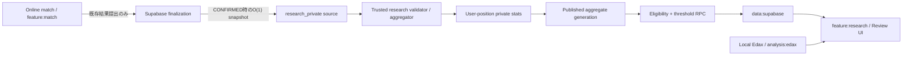
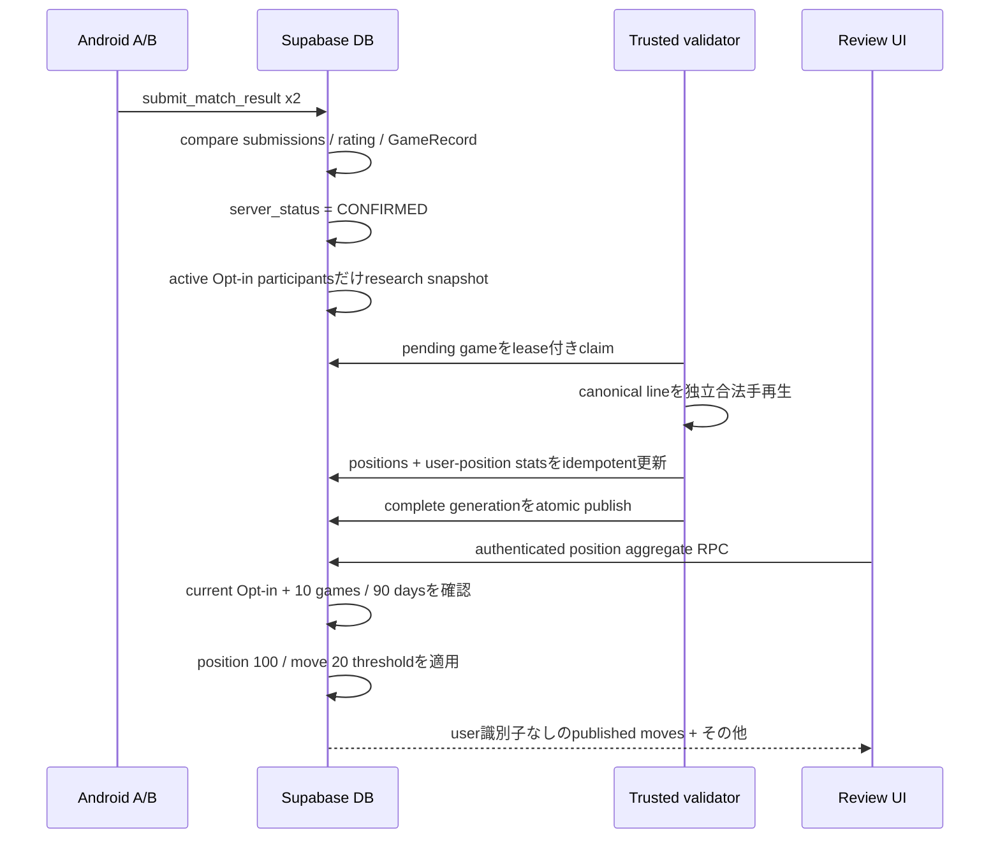

# ちゃんりば 研究データ機能 大枠設計

- Status: Proposed design（未実装）
- Repository baseline: `260c1381663fe76c405f33e02be2ac0cc6c831f0`
- Reviewed at: 2026-08-11
- Scope: 対局後に「人間がその局面で何を選び、その後どうなったか」を集約公開する機能

この文書は、実装前の設計判断を記録する。以下では、現行コード・migrationから確認できる事実を「現行の事実」、今後採用する案を「推奨設計」、プロダクト判断が残るものを「未確定」と明記する。

## 0. 結論

推奨するのは、次のハイブリッド方式である。

1. 個人向け `game_records` とは別に、研究専用のコンパクトな確定棋譜ソースを長期保持する。
2. 研究ソースには、サーバーで取得した確定時刻、結果、finish reason、各参加者の対局前rating、Opt-in期間を保存する。
3. Androidから研究用rawデータを投稿させない。`CONFIRMED` 遷移をDBで検出し、研究用snapshotを作る。
4. 信頼済みbackendがcanonical movesを独立に合法手再生し、受理した棋譜だけを集計する。
5. 集計の中間層では、局面ごとに「ユーザー別の選択回数」を保持する。公開層ではユーザーIDを完全に除いたaggregate snapshotだけを保持する。
6. Androidは、Opt-in設定・自分のeligibility・threshold通過済みaggregateだけをRPCから取得する。raw tableをSELECTしない。
7. `1ユーザー = 総weight 1` はイベント数ではなく、局面ごとのユーザー内選択比率を先に計算してからユーザー間平均することで保証する。

この方式は後述の案Dに相当する。個人GameRecordの最新50件制限と研究データの長期育成を分離しつつ、Opt-out・account deletion・rating bucket変更・期間変更時の再集計可能性を残す。

## 1. 現行実装の調査結果

### 1.1 ArchitectureとAndroid境界

現行の事実:

- `:core:game` はPure Kotlinで、盤面、合法手、着手、pass、終局、canonical move、position hashを所有する。
- `:feature:match` はlive matchを所有し、Edax/analysisへ依存しない。boundary checkでも禁止されている。
- `:feature:records` はimmutableな `GameRecord` と取得portを所有する。
- `:feature:review` は `GameRecord` から任意ply・variationの `GameState` を再構築し、`:analysis:api` のみを利用する。
- `:analysis:edax` はAndroidローカルのJNI実装であり、Supabaseやlive matchへ到達しない。
- Supabase SDK型は `:data:supabase` 内に閉じられ、appへはアプリ独自portだけが公開される。

根拠:

- [`ARCHITECTURE.md`](../ARCHITECTURE.md)
- [`scripts/check-boundaries.ps1`](../scripts/check-boundaries.ps1)
- [`GameRecord.kt`](../feature/records/src/main/kotlin/com/example/othello/records/GameRecord.kt)
- [`ReviewSession.kt`](../feature/review/src/main/kotlin/com/example/othello/review/ReviewSession.kt)
- [`SupabaseContracts.kt`](../data/supabase/src/main/kotlin/com/example/othello/data/supabase/SupabaseContracts.kt)

研究機能でもこの方向を維持する。live matchは研究機能を知らず、ReviewだけがEdax結果と研究aggregateを画面上で合流させる。

### 1.2 現行DB tableと研究機能への関係

| Table | 現行の事実 | 研究機能での扱い |
| --- | --- | --- |
| `profiles` | Auth作成時にtriggerで作成。表示名を持つ。account deletion後も匿名tombstoneとして残る | contributorの内部FK先には利用可能。ただし公開研究APIへID・表示名を出さない |
| `ratings` | 現在rating・peakを保持。Androidは更新不能 | 研究では現在値を使わず、対局確定時のrating beforeをsnapshotする |
| `rating_history` | 1 user / matchでunique。確定時に2行追加。ユーザーごと最新100件へprune | 長期研究の再集計元にはできない。確定時に `rating - delta` を研究側へcopyする |
| `matches` | server statusは `CREATED/PENDING_RESULT/CONFIRMED/DISPUTED/ABANDONED`。participantのみSELECT | `CONFIRMED` 遷移だけを研究captureの起点とする |
| `match_submissions` | 両participantのcanonical moves/result/hash/finish reason一致を確認。確定後に削除 | 研究側から直接参照し続けない |
| `game_records` | 1 match 1行。canonical moves、result、final hash、players、時刻、time control、finish reasonを保持 | capture時の信頼済みsource。研究長期保存は別tableへcopyし、以後FK依存しない |
| `user_game_records` | userとGameRecordの参照。各userの最新50参照を保持 | 研究retentionと分離する。研究tableから参照しない |
| `account_deletion_requests` | Androidは要求のみ。trusted Workerがprivate data削除・Auth削除・完了処理 | 研究contributionのretraction/anonymizationを既存削除workflowへ追加する必要がある |
| `match_signaling` / notification / ACK / active reservation | online session用 | 研究機能から参照しない |
| credential / verification tables | private evidence管理 | 研究機能から参照しない |

根拠となるmigrationは [`supabase/migrations`](../supabase/migrations) の001〜017、特に002、009、010、011、014、016、017である。

### 1.3 GameRecordの作成・保持

現行の事実:

1. 両participantが同じcanonical moves、result、final hash、finish reasonを提出した場合だけ `CONFIRMED` になる。
2. `CONFIRMED` transaction内でGameRecordを1件作り、ratingを1回だけ更新する。
3. GameRecordは `match_id` がPKで、clientにはINSERT/UPDATE/DELETE権限がない。
4. `user_game_records` は各userにつきfinished_at降順で最新50参照を残す。
5. どの `user_game_records` からも参照されないGameRecordは削除でき、その後confirmed matchも短期retention後に削除できる。
6. Kotlinの `recent()` も最大50件へ制限する。

注意点として、GameRecordのRLSは `players` 配列でparticipantを判定し、`user_game_records` の存在自体を可視性条件にしていない。そのため、片方の参照がprune済みでも相手側参照によってrowが残っている間は、DB上のrow寿命は厳密な「各user 50件」と一致しない場合がある。研究設計はこの寿命へ依存しない。

### 1.4 Resultとcanonical movesの信頼度

現行の事実:

- DBはparticipant、P2P start ACK、payload形式、サイズ、列挙値、両者一致、重複submit、rating二重更新を検証する。
- `NORMAL` は空棋譜不可で、`RESIGNATION/TIMEOUT/DISCONNECT` は0手を許容する。
- 現行DBはcanonical movesをReversiルールで一手ずつ再生していない。両clientが同じ不正な合法性payloadを提出した場合まで独立検証する仕組みではない。

したがって研究集合知へ取り込む前に、信頼済みbackendで独立した合法手再生が必要である。これは現在のonline/rating経路を作り直す指示ではなく、研究データ汚染を防ぐ追加境界である。

### 1.5 RLS・RPC・公開profile

現行の事実:

- Authoritative writeは狭い `SECURITY DEFINER` RPCを通す。
- Androidへservice-role keyを置かない。
- authenticated roleには必要最小限のtable権限だけを付与し、RLSを併用する。
- internal cleanup/prune RPCはauthenticated/PUBLICから実行不能である。
- `public_profiles` は表示名、rating、検証済み段級位等を返す個人単位の公開projectionである。

研究APIは `public_profiles` とjoinしてはならない。研究responseには `user_id`、表示名、opponent、match ID、個別棋譜へのlinkを含めない。

### 1.6 Account deletion

現行の事実:

- Androidは `request_account_deletion()` のみ実行できる。
- trusted Cloudflare Workerがverification Storageを削除し、service-role-only RPCでDBをprepareし、Auth Admin APIでidentityを削除してからcompleteする。
- private rating、rating history、credential、verification、本人のrecord参照は削除される。
- opponentのshared immutable GameRecordを壊さないため、profile UUIDは匿名tombstoneとして残り得る。

研究機能を追加すると、account deletion完了前に研究contributionを処理する段階が必要になる。削除ポリシーは第9章の未確定事項である。

### 1.7 再利用できる部分と変更が必要な部分

再利用する:

- `CONFIRMED` を唯一の研究capture起点とする。
- canonical move形式、result、finish reason、final hash、time control、confirmed時刻。
- `rating_history.rating - rating_history.delta` による対局前rating。
- current account deletion Workerとretryable deletion request。
- RLS、deny-by-default privilege、service-role-only administrationの思想。
- `:core:game` の座標系と合法手fixtureをvalidatorのcross-testへ利用する。

追加が必要:

- 明示的Opt-inと参加期間。
- GameRecordとは独立した研究source retention。
- server-side legal replay/validation。
- 1 user weightを保証するprivate aggregation中間層。
- threshold適用済みの公開RPC。
- Give-to-Get eligibility。
- Opt-out/account deletion時の研究data処理。
- `:feature:research` と `:data:supabase` の新しいport実装。
- research table/RPCを含むboundary/pgTAP/security contract。

## 2. 推奨アーキテクチャ

### Android

- 新規 `:feature:research` が、参加状態、eligibility、研究position summaryのアプリ独自interfaceとUI stateを所有する。
- `:data:supabase` がRPC DTOとSupabase SDK実装を所有する。
- `:feature:review` は研究interfaceだけを利用し、Edax結果と合法手座標でmergeする。
- `:feature:match`、`:feature:matchmaking`、`:core:network`、`:transport:webrtc` はresearchへ依存しない。
- variation局面は閲覧問い合わせに利用できるが、variationそのものを研究contributionへ保存しない。
- research responseはmemory-only cacheを基本とする。Opt-out/sign-out時に即clearし、過去に取得した集合データをOFF後もdiskから閲覧できる設計にしない。

### Supabase/Postgres

- raw/private研究tableは非exposed schema `research_private` に置く。
- `anon` / `authenticated` / `PUBLIC` へschema usage・table権限を与えない。
- client-facing RPCだけ `public` に置き、`SECURITY DEFINER SET search_path = ''`、schema-qualified query、明示GRANTを使う。
- `CONFIRMED` transitionでは研究snapshotをO(1)で作るだけにし、棋譜再生・集計は行わない。
- capture対象はOpt-in中のparticipantだけ。相手がOFFでも、ONユーザー自身の選択だけをcontributionとして数える案を推奨する。

### Trusted validator / aggregator

- Androidとは別のtrusted backendで動かす。既存Cloudflare Workerの拡張または専用workerを候補とする。
- service-role secretはworker secretとしてのみ保持する。
- pending research gameをlease付きでclaimし、canonical lineを独立再生する。
- validation、position extraction、user-position再計算、aggregate generation作成を担当する。
- provider固有typeをAndroidへ公開しない。

### Edaxとの関係

- Edaxは従来どおりAndroidローカルのReview専用。
- server-side Edax、cloud analysis、Edax値の研究DB保存はv1では行わない。
- Review UIが同じ合法手座標に対して、Edaxの `EXACT/HEURISTIC/BOOK` と研究のchoice/outcomeを並べる。

## 3. 推奨データモデル

以下は論理モデルであり、今回migrationは作成しない。名前は実装時の推奨名である。

### 3.1 `research_private.policy_versions`

| 項目 | 設計 |
| --- | --- |
| 目的 | eligibility、公開threshold、normalization、collection状態をversion管理 |
| PK | `policy_version bigint` |
| 重要column | `effective_at`, `eligibility_min_games=10`, `eligibility_window_days=90`, `position_min_users=100`, `move_min_users=20`, `min_decisions_per_qualifying_game=1`, `ruleset_version`, `normalization_version`, `collection_enabled`, `is_active` |
| FK | なし |
| UNIQUE | active rowが1つだけになるpartial unique |
| Index | `is_active`, `effective_at desc` |
| Retention | 永続。過去versionを削除しない |

値をcode constantだけにせず、変更履歴を残す。Androidがthresholdを決定してはならない。

### 3.2 `research_private.participation_periods`

| 項目 | 設計 |
| --- | --- |
| 目的 | 明示Opt-inの期間と再Opt-in世代を保持 |
| PK | `participation_id uuid` |
| 重要column | `user_id`, `started_at`, `ended_at`, `policy_version`, `consent_document_version`, `created_at` |
| FK | `user_id -> profiles.id`; `policy_version -> policy_versions` |
| UNIQUE | `ended_at is null` のactive期間はuserごとに最大1件 |
| Index | `(user_id, started_at desc)`, active partial index |
| Retention | account deletion policyに従う。それ以外はconsent auditとして長期 |

再Opt-inでは過去rowを再openせず、新しいrowを作る。これがeligibility resetの境界になる。

### 3.3 `research_private.games`

| 項目 | 設計 |
| --- | --- |
| 目的 | 個人GameRecordから独立した、再集計可能なcompact research source |
| PK | `research_game_id bigint generated identity` |
| 重要column | `source_match_key bytea`, `canonical_moves`, `result`, `finish_reason`, `final_position_hash`, `time_control`, `confirmed_at`, `ruleset_version`, `validation_status`, `validator_version`, `attempt_count`, `lease_expires_at`, `processed_at`, `rejection_code` |
| FK | `source_match_id`や`game_records`へのFKは張らない |
| UNIQUE | `source_match_key`。match UUIDのserver-side digest等を使い、二重captureを防止 |
| Index | `(validation_status, lease_expires_at, confirmed_at)`, `confirmed_at` |
| Retention | ACCEPTEDはcontributorが1人以上いる間長期。REJECTEDは診断期間後（推奨30日）削除。contributor 0件なら削除可能 |

直接のmatch FKを持たないため、個人GameRecord pruningやterminal match cleanup後も残る。canonical lineはprivateであり一般clientへ返さない。

### 3.4 `research_private.game_contributors`

| 項目 | 設計 |
| --- | --- |
| 目的 | どのOpt-in userの選択を1 contributionとして扱うかを保持 |
| PK | `(research_game_id, user_id)` |
| 重要column | `participation_id`, `disc`, `rating_before`, `rating_algorithm_version`, `outcome_from_user_perspective`, `confirmed_at`, `decision_count`, `contribution_status`, `accepted_at` |
| FK | `research_game_id -> games on delete cascade`; `(participation_id,user_id) -> participation_periods` composite FK; `user_id -> profiles.id` |
| UNIQUE | user/matchは1行だけ。source matchとの組合せで二重寄与不能 |
| Index | `(participation_id, confirmed_at desc)`、`(user_id, contribution_status)` |
| Retention | Opt-out/account deletion policyに従う |

`rating_before` はclient入力ではなく、確定transactionの `rating_history.rating - delta` からcopyする。現在ratingで後付け分類しない。

### 3.5 `research_private.positions`

| 項目 | 設計 |
| --- | --- |
| 目的 | 集計対象positionのlossless dictionary |
| PK | `position_id bigint generated identity` |
| 重要column | `ruleset_version`, `normalization_version`, `black_bits bit(64)`, `white_bits bit(64)`, `side_to_move`, `legal_move_mask bit(64)` |
| FK | なし |
| UNIQUE | `(ruleset_version, normalization_version, black_bits, white_bits, side_to_move)` |
| Index | unique indexでlookup。必要ならposition public token hash |
| Retention | sourceまたはaggregateから参照される間長期 |

v1のposition identityは盤面の黒bitboard、白bitboard、side-to-moveである。`ply`、wall-clock、user、match、consecutive pass数をkeyに含めない。選択可能な局面だけを記録し、forced passやterminal positionはchoice positionとして数えない。

既存 `GameState.stateHash()` はFNV hashにcurrent player、pass数、plyを連結するため、研究DBのlossless keyとしては使わない。公開tokenは例として `r8v1:<black-hex>:<white-hex>:B|W` のようにversion付き・可逆・衝突なしとする。

v1では回転・鏡映・色反転による同一視を行わない。将来D4対称正規化を導入する場合は `normalization_version` を上げ、raw research sourceから別generationを再構築する。

### 3.6 `research_private.aggregation_generations`

| 項目 | 設計 |
| --- | --- |
| 目的 | 部分更新中の値を公開せず、完全なaggregateをatomic publish |
| PK | `generation_id bigint` |
| 重要column | `policy_version`, `normalization_version`, `status=BUILDING/READY/PUBLISHED/FAILED`, `source_watermark`, `started_at`, `completed_at`, `published_at` |
| UNIQUE | PUBLISHED active generationはpolicy/normalization単位で1つ |
| Index | `(status, started_at)`, `published_at desc` |
| Retention | current + 直前1generationを推奨。古いものは削除可能 |

### 3.7 `research_private.aggregation_segments`

| 項目 | 設計 |
| --- | --- |
| 目的 | ALL、将来のrating帯・期間など、server定義の有限segmentを表す |
| PK | `(generation_id, segment_key)` |
| 重要column | `segment_type`, `rating_min_inclusive`, `rating_max_exclusive`, `period_start`, `period_end`, `definition_version` |
| FK | `generation_id -> aggregation_generations` |
| UNIQUE | generation内の`segment_key` |
| Index | `segment_key` |
| Retention | generationと同じ |

Androidから任意のmin/max ratingや任意期間を渡させない。固定segmentだけを選択可能にし、differencing attackを抑える。v1は `ALL` のみでよい。

### 3.8 `research_private.user_position_totals`

| 項目 | 設計 |
| --- | --- |
| 目的 | 1 user weightの分母 `N(u,p)` を保持するprivate/rebuildable中間表 |
| PK | `(generation_id, segment_key, position_id, user_id)` |
| 重要column | `occurrence_count` |
| FK | generation、segment、position、profile |
| UNIQUE | PKそのもの |
| Index | `(generation_id,segment_key,position_id)`, `(user_id,generation_id)` |
| Retention | rebuildable cache。active/previous generationのみ |

### 3.9 `research_private.user_position_moves`

| 項目 | 設計 |
| --- | --- |
| 目的 | userごとのmove選択回数と結果内訳を保持 |
| PK | `(generation_id, segment_key, position_id, user_id, move_index)` |
| 重要column | `choice_count`, `win_count`, `draw_count`, `loss_count` |
| FK | 対応するuser_position_total、position、generation |
| UNIQUE | PKそのもの |
| Index | `(generation_id,segment_key,position_id,move_index)`、`(user_id,generation_id)` |
| Retention | rebuildable cache。active/previous generationのみ |

### 3.10 `research_private.position_aggregates`

| 項目 | 設計 |
| --- | --- |
| 目的 | position全体の公開判定用aggregate |
| PK | `(generation_id, segment_key, position_id)` |
| 重要column | `unique_users`, `generated_at` |
| FK | generation、segment、position |
| UNIQUE | PKそのもの |
| Index | `(generation_id,segment_key,position_id)` |
| Retention | generationと同じ |

### 3.11 `research_private.move_aggregates`

| 項目 | 設計 |
| --- | --- |
| 目的 | moveの公開判定、選択率、結果率を返す |
| PK | `(generation_id, segment_key, position_id, move_index)` |
| 重要column | `unique_users`, `choice_weight_sum numeric`, `win_weight_sum numeric`, `draw_weight_sum numeric`, `loss_weight_sum numeric`, `child_position_id` |
| FK | generation、segment、position、child position |
| UNIQUE | PKそのもの |
| Index | `(generation_id,segment_key,position_id)` |
| Retention | generationと同じ |

### 3.12 Retraction/rebuild work

account deletionで大量のpositionを再計算する可能性があるため、`research_private.retraction_jobs` のような明示的work tableを置く。`user_id`、reason、status、cursor、attempt、requested/completed時刻を持ち、同一userのactive jobをuniqueにする。汎用job frameworkへ広げず、用途をresearch retractionへ限定する。

## 4. GameRecordと研究データの分離方針

### 比較

| 案 | 長所 | 短所 | 評価 |
| --- | --- | --- | --- |
| A. `game_records` を長期化 | 最小実装。既存canonical lineを直接使える | 最新50件のbounded storageを破壊。個人閲覧retentionと研究retentionが結合。account deletion・privacy境界が曖昧 | 非推奨 |
| B. 研究用raw棋譜を別保存 | compactで再集計しやすい。rating/期間/opening定義変更に強い | raw lineとuser linkをprivateに長期保持する。集計時に毎回棋譜再生が必要 | 単独では不足 |
| C. 局面decisionだけ長期保存 | GameRecordから完全分離。削除・局面queryが明快 | 1 game約60行で容量とindex負荷が大きい。opening再分類やnormalization変更に弱くなりやすい | Free運用では主sourceにしない |
| D. 研究raw source + user-position中間 + 公開snapshot | compactな再集計source、正確なweight、速い公開query、削除再計算を両立 | pipelineとgeneration管理が必要 | 推奨 |

推奨Dでは、長期のsource of truthは `research_private.games` と `game_contributors` である。user-position tablesと公開aggregateは再構築可能な派生データとする。個人GameRecordを削除しても研究sourceは残り、逆に研究contributionを削除しても本人の最新50GameRecordには影響しない。

## 5. データフロー

詳細:

1. 既存online finalizationが `CONFIRMED` 以外なら何もしない。
2. `CONFIRMED` への初回遷移時に、active Opt-in期間を持つparticipantだけをcaptureする。
3. captureはcanonical sourceとserver-side rating snapshotを数行INSERTするだけ。棋譜再生はしない。
4. workerは `FOR UPDATE SKIP LOCKED` 相当とleaseでgameを一度だけclaimする。
5. 初期盤面から全tokenを再生し、合法手、pass、final hash、NORMAL終局結果を検証する。
6. 実際に選択肢が存在した局面だけを抽出する。forced passは選択として数えない。
7. Opt-in contributorがその局面で打ったmoveだけをそのuserの統計へ加える。OFFのopponentのmoveを、そのopponentの寄与として数えない。
8. 同一user/positionの全履歴から分母とmove比率を再計算する。global aggregateへ対局1件をそのまま加算しない。
9. 完成したgenerationだけをpublishする。
10. RPCはeligibilityとthresholdを毎回server-sideで再確認して返す。

### Validation rule

- `server_status = CONFIRMED` のみ。
- legacyで `final_position_hash is null` のGameRecordは研究対象外。
- canonical token列が初期盤面から合法に再生できること。
- `--` はそのsideに合法手がない場合だけ。
- `NORMAL` は終局局面かつ盤面結果とofficial resultが一致すること。
- `RESIGNATION/TIMEOUT/DISCONNECT` は途中局面を許容し、official confirmed resultを保存する。
- final hashは再生結果と一致すること。
- validation failureはrating/GameRecordを変更せず、研究側だけREJECTEDにする。

## 6. `1ユーザー = 総weight 1` の正確な集計

position `p`、server-defined segment `s`、user `u`、move `m` を考える。

- `N(u,p,s)`: user `u` がposition `p` で何らかのmoveを選んだ回数
- `N(u,p,m,s)`: そのうちmove `m` を選んだ回数
- `W(u,p,m,s) = N(u,p,m,s) / N(u,p,s)`

userごとに必ず次が成立する。

`Σm W(u,p,m,s) = 1`

positionのunique user数を `U(p,s)` とすると、move選択率は次である。

`choice_rate(p,m,s) = Σu W(u,p,m,s) / U(p,s)`

例: あるuserがC4を8回、D3を2回なら、そのuserの寄与はC4=0.8、D3=0.2である。別のuserが1局だけC4ならC4=1.0であり、100局対1局でもuser総weightは同じ1である。

結果率も同じ重みを使う。`Win(u,p,m,s)` をそのuserがmove `m` を選んだ対局の勝数とすると、move `m` の勝率は次である。

`win_rate(p,m,s) = Σu [Win(u,p,m,s) / N(u,p,s)] / Σu W(u,p,m,s)`

draw/lossも同様である。これにより、同じmoveを大量に指したuserが勝率でも過大weightを持たない。分母を `N(u,p,m,s)` にしてuserごとのmove勝率を単純平均する方式は、たまに選んだmoveと常用moveを同じ重みにするため採用しない。

rating segmentごとに集計する場合、各対局の `rating_before` がそのsegmentに属するsampleだけを先にfilterし、そのsegment内で上記を再計算する。複数segmentの値を足してALLを作ってはならない。同じuserが複数rating帯に現れるためである。

## 7. 100 unique / 20 unique / その他

### Position

- `U(p,s) = count(distinct user_id)`。
- `U(p,s) >= active_policy.position_min_users` のときだけpositionを公開可能。
- 99以下では `INSUFFICIENT_SAMPLE` のみ返し、実数99を返さない。
- start position、任意ply、final前、variationのいずれも同じ判定を使う。

### Move

- `U(p,m,s) = count(distinct user_id where N(u,p,m,s) > 0)`。
- 20以上のmoveだけcoordinate、choice rate、result rate、move unique countを個別表示する。
- 19以下のmoveはcoordinate別統計を返さない。

### その他

- suppressed move集合の `choice_weight_sum`、win/draw/loss weightを合算して1つの `OTHER` を返す。
- `OTHER` のunique usersは、suppressed moveのunique数の単純和ではなく、suppressed moveのどれかを選んだ `distinct user_id` のunionで計算する。
- `OTHER` unionが20未満ならexact unique countは返さず、nullまたは「20未満」とする。
- `OTHER` は複数moveの集合なのでchild drill-downを提供しない。

### Child position

- 公開moveのchildであっても、child position自身について `U(child,s) >= 100` を再確認する。
- parentの100条件やmoveの20条件をchildへ引き継がない。
- childが未達なら `canExplore=false` だけを返し、child aggregateは返さない。
- forced passが発生する場合、move適用後にforced passを解決した「次に選択可能なside-to-move」のpositionをchildとする。

Thresholdはquery時にactive policyから読む。20を変更した場合、move aggregateの基礎値はそのまま使い、個別/OTHERの分類だけを変えられる。

## 8. Give-to-Get eligibility

### Rule

current participation periodについて、次をすべて満たす場合だけeligibleとする。

1. active Opt-in期間が存在する。
2. `contribution_status = ACCEPTED`。
3. `decision_count >= min_decisions_per_qualifying_game`。推奨初期値は1。
4. `confirmed_at >= server_now - 90 days`。
5. distinct research game数が10以上。

90日境界はserverの`timestamptz`で `[now - interval, now]`、下限inclusiveとする。Android時刻を使わない。

### RPC behavior

- `set_research_participation(true)`: active期間がなければ新しいperiodを作る。idempotent。
- `set_research_participation(false)`: active期間をserver時刻でclose。idempotent。以後のaggregate RPCは即拒否。
- `get_research_participation_status()`: ON/OFF、current periodのqualifying count、required count、window days、eligibleを返す。自分の情報だけ。
- `get_research_position(...)`: 毎回current periodと件数をDBで検証する。clientの `eligible=true` を信用しない。

再Opt-inでは新しいperiodを作り、件数は0から始める。過去periodの10局をcurrent eligibilityへ流用しない。90日経過で10未満へ落ちた場合も、次のRPCで自動失効する。Cronだけに依存しない。

## 9. Opt-in / Opt-out / account deletion

### 9.1 Opt-in時点

推奨:

- match開始時ではなく、`CONFIRMED` が成立した時点でactive Opt-inかを判定する。
- OFFのまま終了した過去対局を、後からONにしただけでretroactive captureしない。
- feature launch以前のGameRecordは、当時の研究同意がないためbackfillしない。

### 9.2 片方だけOpt-inした対局

推奨案:

- 片方だけONでも、そのuser自身が選んだmoveだけを寄与として受理する。
- OFF userはcontributor rowを持たず、その選択はweightへ入れない。
- full canonical lineは合法再生の文脈としてprivate research sourceへ保持され得るが、OFF userのIDをresearch contributorとして保存・公開しない。

影響:

- 長所: 参加率が低い初期でも10局/100usersへ到達しやすい。個人単位Opt-inという仕様に自然。
- 短所: private canonical lineにはOFF opponentの着手文脈も含まれる。consent/privacy説明にこの点を明記する必要がある。

代替案:

- 両participantがONのmatchだけを研究対象にする。privacy説明は単純になるが、初期のdata成長とGive-to-Get達成が大幅に遅くなる。

これは実装前に確定が必要なプロダクト判断である。本設計の推奨は片側Opt-in対応。

### 9.3 Opt-out後の過去contribution

推奨案: 過去に同意のうえACCEPTEDになったcontributionは残す。

- OFF以後の新規captureを止める。
- 集合データ閲覧資格は即時失効。
- 再ONは新periodで再資格化。
- 公開aggregateには「寄与時点でOpt-inだったuser」の過去データが残る。

影響:

- Privacy: 同意文に「OFFは将来提供と閲覧を停止し、既に集約へ反映された過去寄与は残る」を明記する必要がある。
- 統計品質: thresholdや率がOFF操作で大きく揺れない。長期集合知と相性がよい。
- 実装コスト: 低い。eligibility closeだけでよい。

代替案: OFFで過去contributionもretractする。

- Privacy: 撤回の意味が最も強い。
- 統計品質: 100/20境界が逆戻りし、公開position/moveが消える。selection rateも変動する。
- 実装コスト: userが関与した全positionの再計算と新generation publishが必要。
- UX: OFF直後の閲覧拒否は即時にできるが、aggregateからの削除完了まで別SLAが必要。

### 9.4 Account deletion

推奨案: userに紐づく研究contributorとuser-position統計を削除し、影響positionを再集計してからaccount deletionをCOMPLETEDにする。

- userが唯一のcontributorだったresearch gameは削除する。
- opponentもcontributorであるshared research gameは残し、削除userのcontributor linkとweightだけを除く。
- aggregate generationの切替完了前にAuth deletion workflowを完了扱いにしない。
- participation periodsもuser linkを含むため削除する。

影響:

- Privacy: 個人に紐づく研究寄与とweightを消せる。shared canonical lineはopponentの寄与sourceとして残り得るため、完全な棋譜消去ではない。
- 統計品質: 多少変動するが、account deletion頻度に限定される。
- 実装コスト: retraction job、affected position rebuild、retryが必要。

代替案A: userが関与したshared research gameごと削除する。

- 最も強い削除。削除userの着手文脈も残らない。
- opponentが正当に提供した寄与まで失われる。
- current shared GameRecord保持方針より厳しい。

代替案B: contributor IDを不可逆なsubject tokenへ切り替え、aggregateを残す。

- 統計品質とコストは最良。
- 「削除後も過去行動が内部で同一subjectとして残る」ため、privacy expectationが弱い。
- stable tokenを破棄して再Opt-in userを別人扱いすると、1人が複数weightを持ち得る。採用しない。

Opt-outとaccount deletionの過去寄与ポリシーは、consent文面・privacy policy・削除UXへ直結するため、実装前にユーザー判断が必要である。

## 10. RLS / RPC / API境界

### Client-facing RPC

| RPC | Role | 内容 |
| --- | --- | --- |
| `set_research_participation(boolean)` | authenticated | caller自身のOpt-in periodだけを開始/終了 |
| `get_research_participation_status()` | authenticated | caller自身のON/OFF、進捗、eligibility、active policy値 |
| `get_research_position(position_token, segment_key)` | authenticated | eligibilityと100/20 threshold適用済みaggregateだけを返す |

`get_research_position` responseの推奨shape:

- `available`: boolean
- `reason`: `AVAILABLE / NOT_ELIGIBLE / INSUFFICIENT_SAMPLE / UNKNOWN_POSITION`
- `generation_id`, `segment_key`, `published_at`
- positionの `unique_users`（公開可能時のみ）
- 公開moveごとのcoordinate、choice rate、実戦win/draw/loss rate、unique users、`can_explore`
- `OTHER` aggregate
- active threshold値とmetric説明

返してはいけないもの:

- user ID、subject ID、display name
- match ID、GameRecord ID、canonical line
- opponent条件
- 特定user filter
- 100未満positionの実数
- 20未満moveの個別count/rate/coordinate別統計
- 任意rating範囲・任意日付範囲

### Service-only RPC

- pending research game claim/lease/retry
- validation完了・reject
- aggregation generation build/publish
- account deletion retraction
- maintenance cleanup

すべて `PUBLIC/anon/authenticated` からexecute不可、service_roleだけに明示grantする。raw/private tableはData APIへ直接公開しない。

### Viewを使わない理由

Supabase/Postgresの通常viewはcreator権限で動作する場合があり、現行の `public_profiles` のような明示公開projectionには使えるが、研究ではcaller eligibilityとdynamic thresholdが必要である。client-facing surfaceはtable/view SELECTではなく、narrow RPCへ限定する。

## 11. Abuse / privacy threat model

| Threat | 対策 |
| --- | --- |
| Androidがraw研究行を偽造 | client INSERT/UPDATEなし。CONFIRMED triggerからのみcapture |
| 両clientが同じ不正棋譜を提出 | trusted validatorが初期盤面から合法再生。研究側でreject |
| 同一match二重寄与 | source match key unique + `(game,user)` PK + idempotent worker |
| 1 userの大量対局で操作 | position内でuser total weightを1へ正規化 |
| 大量account/Sybil | weight正規化では防げない。Auth abuse監視、account age/verification等は将来policy。thresholdだけをSybil耐性と誤認しない |
| Rating偽装 | rating beforeはserver rating_historyからsnapshot。client parameterなし |
| 小集団の個人推測 | position 100、move 20、OTHER、server-defined segment、raw非公開 |
| Rating/期間の差分攻撃 | 任意filter禁止。有限のversioned segmentだけ。各segmentで100/20を独立判定 |
| 時系列差分攻撃 | aggregate snapshotを一定間隔でpublishし、raw realtime countを返さない。必要ならunique数をbucket表示する |
| 特定player scouting | user/opponent/player filter、個人履歴API、match linkを設けない |
| OFF後の端末cache閲覧 | research cacheはmemory-only。OFF/sign-outでclear。RPCは毎回server eligibility確認 |
| Ingest worker二重実行 | lease、`SKIP LOCKED`、attempt、idempotent unique constraint |
| IngestとOpt-out/account deletion race | user単位lock。capture、period close、retractionを直列化。deletion request中userは新規capture不可 |
| 部分的aggregate公開 | immutable generationを完成後にatomic pointer switch |
| service-role漏洩 | Android/repositoryへ置かず、trusted runtime secretのみ。logへtoken/raw JWTを出さない |

100/20 thresholdは実用的な集約公開境界であり、数学的な匿名性保証やDifferential Privacyではない。v1でnoise付加は行わないが、細かいsegmentを無制限に増やさない。

## 12. Supabase Freeを考えたcost評価

2026-08-11時点のSupabase公式表示では、FreeはDB 500 MB、RAM 500 MB、egress 5 GB、Storage 1 GBであり、DBが500 MBを超えるとread-onlyになる。数値は変更され得るため、実装時・公開時に公式pricingを再確認する。

- <https://supabase.com/pricing>
- <https://supabase.com/docs/guides/platform/billing-on-supabase>
- <https://supabase.com/docs/guides/platform/database-size>

### Storage

- compact canonical lineは最大240文字で、research game + contributorは概ね小さい。
- 容量支配要因はuser-position中間表とそのindexである。
- 60 decisions/game、派生rowとindexを合計150〜300 bytes/decisionと仮定すると、概算9〜18 KB/gameになる。これは設計用の粗い推定であり、実migration後に `pg_column_size` と `pg_total_relation_size` で測定する。
- 既存tableと安全余裕を考えると、Free 500 MBは数万局規模のpilotには使えても、無期限の本番研究基盤としては保証できない。

推奨運用:

- DB使用量350 MBをwarning、425 MBをcollection pause検討の目安にする。
- 容量不足時は `collection_enabled=false` にして新規研究captureだけ止める。online、GameRecord、Edaxを止めない。
- source of truthを黙ってpruneして「長期・再集計可能」という仕様を破らない。上限到達時はupgradeまたは別のcold archiveを明示判断する。
- 中間generationはcurrent + previousだけ残す。
- rejected source、失敗log、古いwork itemには短期retentionを設定する。

### Computation

- finalization hot pathは数行snapshotだけ。
- validation/aggregationはworkerまたはCronのbatchで行う。
- 1 gameごとにpublic aggregateを全面再構築しない。user/positionのaffected keyだけincremental更新し、定期full rebuildで監査する。
- 大きなpolicy/rating bucket変更は新generationをoff-pathでbuildして切り替える。
- Supabase CronはSQL/function/HTTP jobを実行できるが、公式推奨どおり長時間・高並列jobを避ける。worker batchは小さく再開可能にする。

参考: <https://supabase.com/docs/guides/cron>

### Query / egress

- 1 positionの合法手数は小さく、公開responseは小さい。
- Androidへraw decisionsを送らないためegressとprivacyの両方を抑えられる。
- position/generation単位のserver cacheは可能だが、caller eligibility check自体は省略しない。

## 13. Migration計画

実装時は次の順序を推奨する。既存dataのretroactive backfillは行わない。

1. `research_private` schema、policy versions、participation periods、deny-by-default privilegeを追加する。collectionはOFF。
2. Opt-in/status RPCとpgTAPを追加する。既存online機能へ影響させない。
3. research games/contributors/positionsとcapture triggerを追加する。triggerはcollection OFFならno-op。
4. trusted validatorを実装し、Coreと共有したfixtureでboard/side/pass/final hashをcross-testする。
5. private user-position tables、generation、segment、aggregate tableを追加する。
6. 100/20/OTHER/child thresholdとGive-to-Getを行うpublic RPCを追加する。
7. Opt-out/account deletion方針を確定し、既存Workerの削除順序へresearch retractionを組み込む。
8. `:feature:research`、`:data:supabase` adapter、SettingsのOpt-in、Review表示を追加する。live match moduleへ依存を加えない。
9. Hosted setup、maintenance、capacity alert、privacy/consent文書を更新する。
10. 全testとload/capacity計測後に `collection_enabled=true`。feature launch前GameRecordは取り込まない。

各migrationはadditiveにし、公開RPCをgrantする前にtable/RLS/privilege testを通す。重いbackfillやaggregate buildをmigration transaction内で行わない。

## 14. Test strategy

### pgTAP / DB contract

- 99 unique usersではposition非公開、100人目のACCEPTED contribution後に公開。
- move 19 uniqueでは個別非公開、20人目で個別公開。
- 複数suppressed moveが `OTHER` に合算され、unique userがunionである。
- 1 userが同じpositionを100回、別userが1回でも各user総weightが1。
- C4 8回/D3 2回のuserが0.8/0.2になる。
- result rateもuser正規化後に計算される。
- rating bucketはlower inclusive / upper exclusive。境界値を両側で確認。
- 90日ちょうどはeligible、90日+最小単位は除外。
- current period 9局では不可、10局目ACCEPTED後に可。
- 0 decision gameはqualifying countへ入らない。
- Opt-out transaction直後にaggregate RPCが拒否される。
- 再Opt-inは新periodで0局から始まり、旧periodを数えない。
- account deletion policyどおりcontributorとaggregateが処理される。
- duplicate match capture、duplicate worker completionでも1 contributionだけ。
- concurrent worker claimで同じgameを2 workerが処理しない。
- concurrent Opt-out/finalizationの結果が直列化され、同意境界が曖昧にならない。
- GameRecord/user_game_records/matchをprune後もresearch sourceとaggregateが残る。
- parent公開でもchild 99ならdrill-down不可、child 100で可。
- DISPUTED/PENDING_RESULT/ABANDONEDはcaptureされない。
- raw/private tableをanon/authenticated/PUBLICがSELECT/INSERT/UPDATE/DELETEできない。
- service-only RPCをauthenticatedがexecuteできない。
- responseにuser ID、match ID、canonical lineが存在しない。
- policy threshold変更でquery分類が変わり、source dataを失わない。

### Validator unit/property tests

- initial board、board conversion、side conversion、coordinate mapping。
- legal normal game、forced pass、double pass、0-ply non-normal finish。
- illegal move、unnecessary pass、missing pass、extra token、invalid side、hash mismatch。
- NORMAL resultとterminal disc count不一致。
- Kotlin Game Coreとvalidatorが同じfixtureで全decision position/legal move setを返す。
- symmetryをv1で適用しないこと。
- contributor color以外のmoveをそのuserへ加算しないこと。

### Android unit/UI tests

- OFF/ON/progress/eligible state。
- OFFでもonline、records、Edax、variationが利用可能。
- Edax unavailableでもresearch表示は独立。research unavailableでもEdaxは独立。
- ply/variation移動時のstale research resultを破棄。
- Opt-out/sign-outでmemory cache clear。
- 20未満moveは個別表示せず `その他`。
- child unavailableをtapしてもraw queryへ迂回しない。
- `feature:match` と `feature:matchmaking` にresearch依存がないboundary test。

### Load/capacity tests

- 1万/5万game相当fixtureでrelation/index sizeを計測。
- hot position、unique midgame tailの双方でaggregation時間を計測。
- generation rebuild中も旧generationだけが返る。
- worker crash、lease expiry、retry、poison game隔離。
- account deletionが多数positionへ影響してもbatch再開できる。

## 15. 不変条件

以下が破れたら設計バグである。

1. `CONFIRMED` 以外のmatchが研究aggregateへ入らない。
2. Opt-inでないuserの選択を、そのuserのcontributionとして数えない。
3. 同一 `(source match, user)` が2回寄与しない。
4. server-side legal replayに失敗したgameがeligibilityやaggregateへ入らない。
5. rating bucketはclient値や現在ratingではなく、server snapshotのrating beforeを使う。
6. 任意のposition/segment/userについてmove weight合計が1である。
7. userの対局数を増やしても、そのpositionでの総weightは1を超えない。
8. position unique 100未満のaggregateをclientへ返さない。
9. move unique 20未満の個別統計をclientへ返さない。
10. childはparentと独立して100 unique条件を満たす。
11. Opt-out直後から集合研究データを閲覧できない。
12. 再Opt-in時に旧periodの提供局数で即eligibleにならない。
13. raw research source、user-position中間、contributor IDを一般clientが取得できない。
14. 公開responseにuser、opponent、match、GameRecordを追跡できる識別子を含めない。
15. GameRecord pruningが研究sourceをcascade deleteしない。
16. 研究retentionが個人の最新50GameRecord保持数を増やさない。
17. aggregate build途中のgenerationを公開しない。
18. account deletionをCOMPLETEDにする時点で、採用した研究削除ポリシーが完了している。
19. service-role secretをAndroid、APK/AAB、repository、client logへ置かない。
20. live match、rating、WebRTC、clock、finish protocolが研究validator/aggregationの完了を待たない。
21. Edax評価と人間実戦統計を同じmetricとして混同しない。

## 16. 次のPRへ切り出す推奨タスク

### PR 2A: Research foundation / consent

- private schema、policy version、participation periods。
- Opt-in/status RPC。
- RLS/ACL/pgTAP。
- Settings UIのOpt-inとconsent version。
- まだcollection/閲覧はOFF。

### PR 2B: Confirmed capture / validator

- O(1) confirmed capture。
- trusted worker claim/lease/retry。
- independent Reversi replay。
- Game Coreとのfixture cross-test。
- source match dedupe。

### PR 2C: Aggregation / privacy API

- position dictionary、user weight中間表、generation/segment。
- 1 user weight algorithm。
- 100/20/OTHER/child。
- Give-to-Get RPC。
- concurrency/load tests。

### PR 2D: Android Review integration

- `:feature:research` port/UI state。
- `:data:supabase` adapter。
- ReviewでEdaxと研究値を座標merge。
- stale result/cache/Opt-out clear。
- live match dependency boundary。

### PR 2E: Retraction / account deletion

- 確定したOpt-out/account deletion policy。
- retraction job、affected-position rebuild。
- existing Cloudflare Workerの削除順序更新。
- deletion race/retry/pgTAP。

### PR 2F: Operations / launch

- aggregate schedule、generation monitoring、capacity alert。
- Hosted setup、privacy/consent、DEVICE_TEST更新。
- Free容量実測。
- collection feature flagを最後にON。

## 17. 未確定事項の分類

### 決めないと実装不能

| 論点 | 推奨 | 代替 |
| --- | --- | --- |
| Opt-out時に過去寄与を残すか | 残す。将来captureと閲覧だけ停止 | 全retract。privacy強、再集計cost大 |
| Account deletion時の寄与 | user linkとweightを削除し再集計 | anonymized維持、またはshared game全削除 |
| 片側Opt-inを許すか | 許す。ON user自身のmoveだけ寄与 | 両者ON matchのみ |
| qualifying game | ACCEPTEDかつ本人decision 1以上 | finish reasonや最低plyをさらに制限 |
| consent文面/version | 過去寄与retentionとshared line文脈を明示 | policyに合わせて変更 |

### 実装中でも決められる

- trusted validatorを既存Cloudflare Workerへ入れるか、専用workerへ分けるか。
- worker batch size、lease時間、retry回数。
- REJECTED sourceの診断retention（推奨30日）。
- public unique usersをexact表示するか `100+ / 500+` のbucket表示にするか。
- generation publish頻度。v1推奨は数時間〜日次で、Realtimeにはしない。
- user-position中間表の物理圧縮・partition・index詳細。

### 後から変更可能

- 10局、90日、100 users、20 usersの数値。
- rating bucket定義とversion。
- fixed期間segment。
- opening分類/version。
- D4 symmetry normalizationの新version。
- Edaxとの表示比較方法。
- 自分自身の傾向比較。ただし個人データは本人専用RPCとして別設計にする。

## 18. 次のSol高実装フェーズへ渡すための確定仕様

- 基準はmerge commit `260c1381663fe76c405f33e02be2ac0cc6c831f0`。
- 研究提供は明示Opt-in。OFFでもonline、GameRecord、Edax、local/variation機能は制限しない。
- 閲覧資格はactive Opt-inかつcurrent participation periodで直近90日10 qualifying games。OFFで即失効、再ONは新periodで0から。
- 研究対象はserver `CONFIRMED`、final hashあり、trusted validatorで合法再生できたonline gameだけ。PENDING/DISPUTED/ABANDONEDは除外。
- 個人GameRecordと研究retentionを分離する。研究sourceはGameRecord/matchへFKを張らず、pruning後も再集計可能にする。
- 推奨保存方式は、private compact research game + contributor snapshot + rebuildable user-position stats + immutable published aggregate generation。
- position keyは8x8 black/white bitboard + side-to-move + ruleset/normalization version。v1はsymmetry統合なし。forced passはchoiceとして数えない。
- 1 user weightは、position内でuserのmove頻度を先に1へ正規化し、その後user間平均する。global event count平均は禁止。
- positionは100 unique users以上で公開。moveは20 unique users以上のみ個別公開。未満はOTHERへ統合。childは独立して100条件を再判定。
- rating帯はserverのrating before snapshotを使う。現在rating/client ratingを使わない。
- Androidへraw研究データ、user ID、match ID、opponent filterを渡さない。client-facing surfaceはeligibility/threshold適用済みRPCだけ。
- live match moduleからresearchへ依存させない。Edaxは従来どおりlocal Review専用で、Review UIだけが座標上で研究値と比較する。
- heavy validation/aggregationはfinalization hot pathで行わず、trusted workerのlease付きidempotent batchで行う。
- account deletion完了前に、採用した研究削除ポリシーをretry可能に完了させる。
- 実装開始前に決める残件は、Opt-out過去寄与、account deletion過去寄与、片側Opt-in、qualifying game、consent文面の5点。本文の推奨値をdefault案とする。
